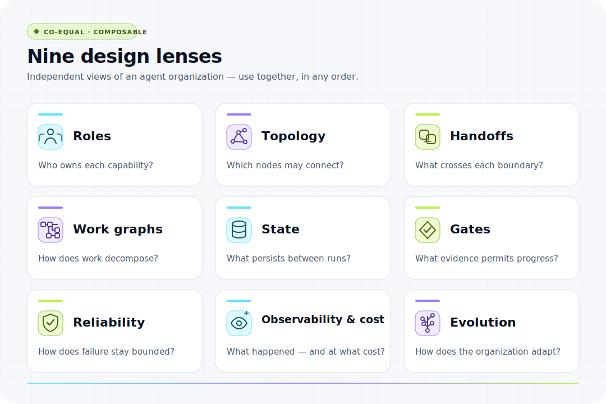

<p align="center">
  <a href="https://chaoyue0307.github.io/awesome-graph-engineering/">
    
  </a>
</p>

<h1 align="center">Awesome Graph Engineering</h1>

<p align="center">
  <strong>Engineer the organization, not just the agent.</strong><br>
  A field guide, open dataset, and interactive atlas for programmable AI-agent organizations.
</p>

<p align="center">
  <a href="https://awesome.re"></a>
  <a href="#resource-directory"></a>
  <a href="https://github.com/ChaoYue0307/awesome-graph-engineering/actions/workflows/quality.yml"></a>
  <a href="https://huggingface.co/datasets/cy0307/awesome-graph-engineering"></a>
  <a href="LICENSE"></a>
  <a href="https://github.com/ChaoYue0307/awesome-graph-engineering"></a>
</p>

<p align="center">
  🌐 <a href="https://chaoyue0307.github.io/awesome-graph-engineering/"><strong>Explore the Atlas</strong></a> ·
  🤗 <a href="https://huggingface.co/datasets/cy0307/awesome-graph-engineering"><strong>Use the Dataset</strong></a> ·
  ⭐ <a href="https://github.com/ChaoYue0307/awesome-graph-engineering"><strong>Star the Repository</strong></a>
</p>

<p align="center">
  <a href="https://chaoyue0307.github.io/awesome-graph-engineering/">
    
  </a>
</p>

<p align="center">
  🧭 <a href="#working-definition"><strong>Definition</strong></a> ·
  🧱 <a href="TAXONOMY.md"><strong>Taxonomy</strong></a> ·
  ⚖️ <a href="COMPARISON.md"><strong>Boundaries</strong></a> ·
  📚 <a href="#resource-directory"><strong>Resources</strong></a> ·
  🧾 <a href="#citation"><strong>Cite</strong></a> ·
  📜 <a href="#license"><strong>License</strong></a>
</p>

<p align="center">
  🌍 <strong>Languages:</strong>
  <strong>English</strong> ·
  <a href="i18n/zh-Hans/README.md">简体中文</a> ·
  <a href="i18n/es/README.md">Español</a> ·
  <a href="i18n/fr/README.md">Français</a> ·
  <a href="i18n/de/README.md">Deutsch</a> ·
  <a href="i18n/ja/README.md">日本語</a> ·
  <a href="i18n/ko/README.md">한국어</a> ·
  <a href="i18n/pt-BR/README.md">Português (Brasil)</a> ·
  <a href="i18n/README.md">Help translate</a>
</p>

> [!IMPORTANT]
> Here, **graph engineering** means engineering graph-structured **AI-agent systems**. Graph databases, knowledge graphs, graph ETL, GraphRAG, and graph neural networks are outside this scope unless they directly support an agent graph. See the [boundary guide](COMPARISON.md#not-graph-data-engineering-the-name-collision).

## 🧭 Working definition

**Graph engineering is the practice of specifying, executing, observing, and evolving a graph-structured agent system—its roles and runtime instances, the contracts that connect them, the state and artifacts they share, and the evidence by which their collective behavior is judged—so that the system can be controlled, tested, and improved as an engineered whole.**

The graph must be load-bearing rather than decorative: its declared topology, realized run graph, or graph-generating policy materially constrains execution and remains inspectable enough to version, trace, evaluate, or deliberately change.

Connected improvement loops can monitor, constrain, or veto one another, while external measurements, fixed rules, and human decisions provide grounding. [Carlos E. Perez’s 2026 “graph of loops” essay](https://x.com/IntuitMachine/status/2078419526354378975) articulates this control perspective. Applied to AI-agent organizations, agent roles and runtime instances are the primary adaptive nodes; deterministic tests, audit cycles, human decisions, and real-world observations may act as control nodes or gates.

*Graph engineering* is used here as an **emerging, non-standard term**. Its scope synthesizes established work in [agent-oriented programming](https://doi.org/10.1016/0004-3702(93)90034-9), [multi-agent systems](https://doi.org/10.1017/S0269888900008122), [blackboard architectures](https://doi.org/10.1609/aimag.v7i2.537), distributed systems, workflow orchestration, and graph-based language-agent research such as [GPTSwarm](https://arxiv.org/abs/2402.16823). The [evidence map](DEFINITION.md#evidence-map-for-the-synthesis) separates source-backed claims from analytical inferences. Steinberger’s and Perez’s July 2026 posts document recent practitioner usage; they do not establish coinage or consensus.

### The minimum test

A system is in scope when all three conditions are load-bearing:

1. **Multiple independently scoped agent nodes** — distinct roles or runtime instances own context, authority, or objectives.
2. **Explicit coordination semantics** — edges say what may move, when control transfers, and how results are accepted or rejected.
3. **An inspectable graph artifact** — topology, run graph, or graph-generating policy can be versioned, traced, evaluated, or changed deliberately.

A single agent with many tools is still one node. A deterministic DAG of ordinary functions is workflow engineering. A “swarm” of personas without contracts, state boundaries, or evidence gates is branding, not graph engineering.

## 🧩 Core primitives

| Primitive | Engineering question | Typical artifact |
| --- | --- | --- |
| **Agent node** | Who owns this context, objective, capability, and permission boundary? | Role spec, runtime identity, tool allowlist |
| **Typed edge** | What crosses this relationship, under which preconditions and schema? | Handoff contract, protocol message, artifact reference |
| **Org graph** | Which reusable roles may coordinate, delegate, verify, or escalate? | Versioned roles-and-permissions topology |
| **Run/work graph** | What execution structure does this particular job require? | Run-scoped DAG, event graph, trace, lineage |
| **Gate** | What evidence allows work to advance? | Test, evaluator, quorum rule, human approval |
| **State boundary** | What is shared, isolated, checkpointed, or authoritative? | Blackboard, artifact store, snapshot, worktree |
| **Graph policy** | Who may create, rewrite, cancel, or route nodes and edges? | Scheduler, budget policy, topology generator |

### Org graph ≠ run graph

| | Org graph | Run/work graph |
| --- | --- | --- |
| **Describes** | Stable roles, capabilities, authority, and allowed relationships | The tasks, dependencies, branches, and evidence produced in one run |
| **Changes** | Deliberately, through architecture or policy updates | Dynamically, as planning and execution reveal new work |
| **Primary question** | “Who may do and verify what?” | “What must happen next for this outcome?” |
| **Safety boundary** | A planner may select permitted relationships | A planner must not silently expand its own permissions |

Org graph and run/work graph are analytical views, not standardized object types. An implementation may represent both in one runtime graph if standing authority remains distinguishable from run-specific execution.

## ✅ Do you need a graph?

Start with the smallest architecture that closes the quality loop. One well-instrumented agent loop is usually enough until work needs at least one of these:

- **Specialization:** independent roles need different context, tools, models, or permissions.
- **Parallelism:** separable work should fan out, then reconcile under an explicit contract.
- **Independent verification:** a producer should not be the only judge of its own output.
- **Fault or trust isolation:** failure, untrusted input, or privileged actions must be contained.

If none applies, invest in the loop first: context, stopping conditions, tests, retries, and observability. [Loop engineering](https://addyosmani.com/blog/loop-engineering/) is primarily temporal—how one agent progresses through repeated work. Graph engineering is primarily relational—how multiple scoped actors and control surfaces compose. The two concerns are complementary; neither is a maturity stage.

## 🗺️ Choose your path

| If you are… | Start with | Then inspect |
| --- | --- | --- |
| 🛠️ **Building your first multi-agent flow** | Two roles, one typed handoff, one evidence gate | [Start Here](#start-here) → [Frameworks & SDKs](#frameworks--sdks) |
| 🏗️ **Designing an agent organization** | Org/run separation, topology, authority, state ownership | [Taxonomy](TAXONOMY.md) → [Protocols & Handoffs](#protocols--handoffs) |
| 🚦 **Operating a production graph** | Durable execution, traces, budgets, replay, escalation | [Reliability](#reliability--durable-execution) → [Observability & Cost](#observability--cost) |
| 🔬 **Researching adaptive systems** | Foundations, benchmarks, topology optimization, limits | [Research Foundations](#research-foundations) → [Critiques & Limits](#critiques--limits) |

## 🧱 The nine engineering layers

<picture>
  <source media="(prefers-color-scheme: dark)" srcset="assets/layers-map-dark.svg">
  
</picture>

| # | Layer | The design question |
| ---: | --- | --- |
| 01 | **Roles** | Who exists, and what does each node own? |
| 02 | **Topology** | How are the roles arranged, and why this shape? |
| 03 | **Handoffs** | What may cross each edge, in what schema? |
| 04 | **Work graphs** | What execution structure does this run need now? |
| 05 | **State** | What is shared, isolated, durable, or authoritative? |
| 06 | **Gates** | What evidence advances, rejects, or escalates work? |
| 07 | **Reliability** | How does the graph fail, recover, replay, and stop? |
| 08 | **Observability & cost** | Can operators explain the path, latency, and spend? |
| 09 | **Evolution** | When and how may topology or policy redesign itself? |

The layers are concerns, not compulsory stages. A two-role pipeline with a typed handoff and a test gate can be a complete graph. Read the full [taxonomy](TAXONOMY.md), [comparison guide](COMPARISON.md), and [anti-patterns](ANTI-PATTERNS.md).

## 📚 Resource directory

The resource directory prioritizes primary research, official documentation, maintained projects, standards, reproducible benchmarks, and production reports. **Evidence labels identify source type; they do not score quality.** Each entry contains an original summary, a distinct engineering rationale, and one primary layer.

**Corpus snapshot — 20 July 2026:** 80 curated resources, including 34 peer-reviewed studies and 6 benchmarks; 44 were published or materially updated in 2026.

Use the [interactive Resource Atlas](https://chaoyue0307.github.io/awesome-graph-engineering/#atlas) to search and filter the same records by section, source type, evidence label, and layer.

<!-- RESOURCE_TABLES_START -->

## Start Here

| Resource | Source | What it contributes | Evidence |
| --- | --- | --- | --- |
| 📝 **[A practical guide to building agents](https://openai.com/business/guides-and-resources/a-practical-guide-to-building-ai-agents/)**<br><sub>Blog · Architecture guide</sub> | **OpenAI Guides & Resources**<br><sub>OpenAI · 2025</sub> | Explains when agents are appropriate, how to define their tools and instructions, and how to move from one agent to manager and handoff-based multi-agent patterns.<br><sub><strong>Why:</strong> A useful first check on whether distinct roles justify the coordination cost of a graph.</sub> | **Practitioner analysis**<br><sub>Roles</sub> |
| 📝 **[Building effective agents](https://www.anthropic.com/engineering/building-effective-agents)**<br><sub>Blog · Architecture guide</sub> | **Anthropic Engineering**<br><sub>Erik Schluntz; Barry Zhang · 2024</sub> | Distinguishes workflows from autonomous agents and presents routing, parallelization, orchestrator-worker, and evaluator-optimizer patterns.<br><sub><strong>Why:</strong> Provides a compact topology vocabulary and a strong case for adding coordination only when the task demands it.</sub> | **Practitioner analysis**<br><sub>Topology</sub> |
| 📝 **[From Loop Engineering to Graph Engineering?](https://x.com/IntuitMachine/status/2078419526354378975)**<br><sub>Blog · Contemporary framing</sub> | **X Articles**<br><sub>Carlos E. Perez · 2026</sub> | Frames the shift as loop architecture: networks of improvement cycles that monitor, feed, constrain, and correct one another, with reliability located in their edges.<br><sub><strong>Why:</strong> Adds the grounding requirement missing from topology-only accounts: independent counter-metrics, frozen tests or rules, external anchors, and human ownership of root objectives.</sub> | **Practitioner analysis**<br><sub>Gates</sub> |
| 📄 **[The Five Ws of Multi-Agent Communication: Who Talks to Whom, When, What, and Why – A Survey from MARL to Emergent Language and LLMs](https://openreview.net/pdf?id=LGsed0QQVq)**<br><sub>Paper · Communication survey</sub> | **Transactions on Machine Learning Research**<br><sub>Jingdi Chen; Hanqing Yang; Zongjun Liu; Carlee Joe-Wong · 2026</sub> | Synthesizes multi-agent communication across reinforcement learning, emergent language, and LLM systems through sender, recipient, timing, content, and purpose decisions.<br><sub><strong>Why:</strong> Provides a design-oriented map for engineering edge selection, message timing, payloads, grounding, scalability, and interpretability.</sub> | **Peer-reviewed research**<br><sub>Handoffs</sub> |

## Research Foundations

| Resource | Source | What it contributes | Evidence |
| --- | --- | --- | --- |
| 📄 **[Agent-Oriented Programming](https://doi.org/10.1016/0004-3702(93)90034-9)**<br><sub>Paper · Agent foundations</sub> | **Artificial Intelligence**<br><sub>Yoav Shoham · 1993</sub> | Defines a programming paradigm in which agents are first-class components described through mental state and governed by explicit interaction rules.<br><sub><strong>Why:</strong> Establishes the intellectual lineage for treating an agent role as a programmable organizational unit.</sub> | **Peer-reviewed research**<br><sub>Roles</sub> |
| 📄 **[Intelligent Agents: Theory and Practice](https://doi.org/10.1017/S0269888900008122)**<br><sub>Paper · Agent foundations</sub> | **The Knowledge Engineering Review**<br><sub>Michael Wooldridge; Nicholas R. Jennings · 1995</sub> | Surveys the properties, architectures, and engineering approaches that distinguish autonomous agents from ordinary software modules.<br><sub><strong>Why:</strong> Grounds the agency-at-the-nodes boundary that separates an agent graph from a deterministic workflow.</sub> | **Peer-reviewed research**<br><sub>Roles</sub> |
| 📄 **[The Blackboard Model of Problem Solving and the Evolution of Blackboard Architectures](https://doi.org/10.1609/aimag.v7i2.537)**<br><sub>Paper · Shared-state architectures</sub> | **AI Magazine**<br><sub>H. Penny Nii · 1986</sub> | Describes systems in which independent specialists coordinate opportunistically through a shared problem state and a control component.<br><sub><strong>Why:</strong> Supplies a durable model for shared state without requiring every node to exchange its full context directly.</sub> | **Peer-reviewed research**<br><sub>State</sub> |
| 📄 **[Learning to Communicate with Deep Multi-Agent Reinforcement Learning](https://proceedings.neurips.cc/paper_files/paper/2016/hash/c7635bfd99248a2cdef8249ef7bfbef4-Abstract.html)**<br><sub>Paper · Learned communication</sub> | **NeurIPS**<br><sub>Jakob Foerster et al. · 2016</sub> | Introduces reinforcement-learning methods that let agents learn communication protocols alongside their task policies, including discrete messages for execution.<br><sub><strong>Why:</strong> Shows that edge content and communication policy can be engineered or learned rather than treated as free-form chat.</sub> | **Peer-reviewed research**<br><sub>Handoffs</sub> |
| 📄 **[TarMAC: Targeted Multi-Agent Communication](https://proceedings.mlr.press/v97/das19a.html)**<br><sub>Paper · Learned communication</sub> | **ICML**<br><sub>Abhishek Das et al. · 2019</sub> | Uses attention to let agents address different messages to selected recipients instead of broadcasting the same information to the whole team.<br><sub><strong>Why:</strong> Motivates selective, recipient-aware handoffs when all-to-all communication is wasteful or distracting.</sub> | **Peer-reviewed research**<br><sub>Handoffs</sub> |
| 📄 **[AutoGen: Enabling Next-Gen LLM Applications via Multi-Agent Conversation](https://arxiv.org/abs/2308.08155)**<br><sub>Paper · LLM multi-agent systems</sub> | **COLM**<br><sub>Qingyun Wu et al. · 2024</sub> | Presents a framework for composing customizable conversational agents that can combine language models, tools, code execution, and human input.<br><sub><strong>Why:</strong> An early, influential demonstration that agent roles and conversation links can be expressed as an executable topology.</sub> | **Peer-reviewed research**<br><sub>Topology</sub> |
| 📄 **[GPTSwarm: Language Agents as Optimizable Graphs](https://proceedings.mlr.press/v235/zhuge24a.html)**<br><sub>Paper · Topology optimization</sub> | **ICML**<br><sub>Mingchen Zhuge et al. · 2024</sub> | Represents language-agent systems as computational graphs and optimizes graph components from task feedback.<br><sub><strong>Why:</strong> Makes the graph itself an optimization target rather than a fixed orchestration diagram.</sub> | **Peer-reviewed research**<br><sub>Evolution</sub> |
| 📄 **[A Dynamic LLM-Powered Agent Network for Task-Oriented Agent Collaboration](https://openreview.net/forum?id=XII0Wp1XA9)**<br><sub>Paper · Dynamic topology</sub> | **COLM**<br><sub>Zijun Liu et al. · 2024</sub> | Constructs task-specific collaboration networks that can vary which agents participate and how they communicate instead of relying on one fixed team.<br><sub><strong>Why:</strong> Provides evidence for adapting the work graph to the task while keeping the available agent roles reusable.</sub> | **Peer-reviewed research**<br><sub>Evolution</sub> |
| 📄 **[Cut the Crap: An Economical Communication Pipeline for LLM-based Multi-Agent Systems](https://proceedings.iclr.cc/paper_files/paper/2025/hash/bbc461518c59a2a8d64e70e2c38c4a0e-Abstract-Conference.html)**<br><sub>Paper · Communication efficiency</sub> | **ICLR**<br><sub>Guibin Zhang et al. · 2025</sub> | Studies an economical communication pipeline that reduces redundant information exchanged among language-model agents.<br><sub><strong>Why:</strong> Treats edge traffic as a measurable cost and tests whether less communication can preserve useful collaboration.</sub> | **Peer-reviewed research**<br><sub>Observability & cost</sub> |
| 📄 **[G-Designer: Architecting Multi-agent Communication Topologies via Graph Neural Networks](https://proceedings.mlr.press/v267/zhang25cu.html)**<br><sub>Paper · Topology optimization</sub> | **ICML**<br><sub>Guibin Zhang et al. · 2025</sub> | Uses graph neural networks to design communication structures for multi-agent systems instead of assuming a complete or manually chosen graph.<br><sub><strong>Why:</strong> Connects task performance to explicit topology search and exposes communication structure as an engineering variable.</sub> | **Peer-reviewed research**<br><sub>Evolution</sub> |
| 📄 **[Automated Design of Agentic Systems](https://proceedings.iclr.cc/paper_files/paper/2025/hash/36b7acf6f6010652b3f2a433774a66fe-Abstract-Conference.html)**<br><sub>Paper · System search</sub> | **ICLR**<br><sub>Shengran Hu; Cong Lu; Jeff Clune · 2025</sub> | Uses a meta-agent to propose, evaluate, and iteratively improve code-defined agentic systems across tasks.<br><sub><strong>Why:</strong> Demonstrates automated search over coordination logic while retaining executable artifacts that engineers can inspect.</sub> | **Peer-reviewed research**<br><sub>Evolution</sub> |
| 📄 **[AFlow: Automating Agentic Workflow Generation](https://openreview.net/forum?id=z5uVAKwmjf)**<br><sub>Paper · Workflow search</sub> | **ICLR**<br><sub>Jiayi Zhang et al. · 2025</sub> | Searches over reusable workflow operators to generate task-specific agentic workflows and improve them from evaluation results.<br><sub><strong>Why:</strong> Offers a concrete method for evolving work graphs against measurable objectives rather than intuition alone.</sub> | **Peer-reviewed research**<br><sub>Evolution</sub> |
| 📄 **[Multi-Agent Design: Optimizing Agents with Better Prompts and Topologies](https://openreview.net/forum?id=I05H9RUzHB)**<br><sub>Paper · Joint optimization</sub> | **ICLR**<br><sub>Han Zhou et al. · 2026</sub> | Studies joint optimization of agent prompts and communication topology instead of tuning either component in isolation.<br><sub><strong>Why:</strong> Shows that node behavior and graph structure interact and may need to evolve together.</sub> | **Peer-reviewed research**<br><sub>Evolution</sub> |
| 📄 **[Improving Factuality and Reasoning in Language Models through Multiagent Debate](https://proceedings.mlr.press/v235/du24e.html)**<br><sub>Paper · Debate and councils</sub> | **ICML**<br><sub>Yilun Du et al. · 2024</sub> | Tests rounds of proposal and critique among multiple language-model instances as a way to improve factual and reasoning answers.<br><sub><strong>Why:</strong> Supplies an empirical basis for debate-style gates while leaving room to examine correlated errors and added cost.</sub> | **Peer-reviewed research**<br><sub>Gates</sub> |
| 📄 **[Improving Multi-Agent Debate with Sparse Communication Topology](https://aclanthology.org/2024.findings-emnlp.427/)**<br><sub>Paper · Debate and councils</sub> | **Findings of EMNLP**<br><sub>Yunxuan Li et al. · 2024</sub> | Examines multi-agent debate under sparse communication structures rather than defaulting to full information exchange among every participant.<br><sub><strong>Why:</strong> Isolates topology as a factor in debate quality and communication efficiency.</sub> | **Peer-reviewed research**<br><sub>Topology</sub> |
| 📄 **[Reflexion: Language Agents with Verbal Reinforcement Learning](https://proceedings.neurips.cc/paper_files/paper/2023/hash/1b44b878bb782e6954cd888628510e90-Abstract-Conference.html)**<br><sub>Paper · Feedback and memory</sub> | **NeurIPS**<br><sub>Noah Shinn et al. · 2023</sub> | Lets an agent convert feedback into textual reflections stored in episodic memory and reused on later attempts.<br><sub><strong>Why:</strong> Clarifies how a node loop can persist learning across retries without changing model weights.</sub> | **Peer-reviewed research**<br><sub>State</sub> |
| 📄 **[CRITIC: Large Language Models Can Self-Correct with Tool-Interactive Critiquing](https://proceedings.iclr.cc/paper_files/paper/2024/hash/fef126561bbf9d4467dbb8d27334b8fe-Abstract-Conference.html)**<br><sub>Paper · Tool-grounded verification</sub> | **ICLR**<br><sub>Zhibin Gou et al. · 2024</sub> | Uses external tools to obtain feedback that a language model can apply when critiquing and revising its outputs.<br><sub><strong>Why:</strong> Supports verification gates grounded in observable evidence instead of another ungrounded model opinion.</sub> | **Peer-reviewed research**<br><sub>Gates</sub> |
| 📄 **[A Multi-Level Organization for Problem Solving Using Many, Diverse, Cooperating Sources of Knowledge](https://www.ijcai.org/Proceedings/75/Papers/072.pdf)**<br><sub>Paper · Blackboard coordination</sub> | **IJCAI**<br><sub>Lee D. Erman; Victor R. Lesser · 1975</sub> | Presents the Hearsay-II multi-level blackboard, where independent knowledge sources react to shared hypotheses, create explicit structural dependencies, and verify or revise one another's contributions.<br><sub><strong>Why:</strong> Provides an early architecture for loosely coupled specialist nodes coordinating through inspectable shared state instead of direct all-to-all calls.</sub> | **Peer-reviewed research**<br><sub>State</sub> |
| 📄 **[The Contract Net Protocol: High-Level Communication and Control in a Distributed Problem Solver](https://doi.org/10.1109/TC.1980.1675516)**<br><sub>Paper · Negotiated delegation</sub> | **IEEE Transactions on Computers**<br><sub>Reid G. Smith · 1980</sub> | Defines a negotiation protocol in which managers announce tasks, potential contractors bid, and awards establish temporary problem-solving relationships.<br><sub><strong>Why:</strong> Supplies the classic contract for capability-aware delegation and auditable assignment edges between autonomous nodes.</sub> | **Peer-reviewed research**<br><sub>Handoffs</sub> |
| 📄 **[Scaling Large Language Model-based Multi-Agent Collaboration](https://arxiv.org/abs/2406.07155)**<br><sub>Paper · Collaboration scaling</sub> | **ICLR**<br><sub>Chen Qian et al. · 2025</sub> | Introduces MacNet, a DAG-based collaboration architecture executed in topological order, and studies communication structure while scaling experiments beyond 1,000 agents.<br><sub><strong>Why:</strong> Makes topology a causal scaling variable rather than assuming that larger teams or denser communication automatically help.</sub> | **Peer-reviewed research**<br><sub>Topology</sub> |
| 📄 **[MAS-Orchestra: Understanding and Improving Multi-Agent Reasoning Through Holistic Orchestration and Controlled Benchmarks](https://openreview.net/forum?id=3fGXBm4c3S)**<br><sub>Paper · Holistic orchestration</sub> | **ICML**<br><sub>Zixuan Ke et al. · 2026</sub> | Formulates orchestration as reinforcement-learned generation of a complete multi-agent program and evaluates it across controlled dimensions including depth, horizon, breadth, parallelism, and robustness.<br><sub><strong>Why:</strong> Tests when whole-system graph structure helps instead of attributing gains to coordination without controlled task evidence.</sub> | **Peer-reviewed research**<br><sub>Work graphs</sub> |
| 📄 **[CARD: Towards Conditional Design of Multi-agent Topological Structures](https://openreview.net/forum?id=JgvJdICc6P)**<br><sub>Paper · Conditional topology</sub> | **ICLR**<br><sub>Tongtong Wu et al. · 2026</sub> | Generates communication graphs conditioned on agent roles, models, tools, and data sources, and adapts topology as task resources change.<br><sub><strong>Why:</strong> Treats the available capabilities and directed edges as a versionable organizational artifact rather than a fixed team template.</sub> | **Peer-reviewed research**<br><sub>Evolution</sub> |
| 📄 **[EvoMAS: Evolutionary Generation of Multi-Agent Systems](https://openreview.net/forum?id=ic0AGRIkmY)**<br><sub>Paper · System evolution</sub> | **ICML**<br><sub>Yuntong Hu et al. · 2026</sub> | Evolves structured multi-agent configurations through trace-guided mutation, crossover, selection, and an experience memory across reasoning, coding, and tool-use tasks.<br><sub><strong>Why:</strong> Shows how an inspectable team specification can evolve from execution evidence while retaining executability and runtime robustness.</sub> | **Peer-reviewed research**<br><sub>Evolution</sub> |

## Production Case Studies

| Resource | Source | What it contributes | Evidence |
| --- | --- | --- | --- |
| 📄 **[Magentic-One: A Generalist Multi-Agent System for Solving Complex Tasks](https://www.microsoft.com/en-us/research/publication/magentic-one-a-generalist-multi-agent-system-for-solving-complex-tasks/)**<br><sub>Paper · Generalist agent team</sub> | **Microsoft Research MSR-TR-2024-47**<br><sub>Adam Fourney et al. · 2024</sub> | Documents an orchestrator-led team of specialized agents for web, file, coding, and terminal tasks, with progress tracking and replanning.<br><sub><strong>Why:</strong> Provides a concrete generalist topology whose role boundaries and recovery behavior can be examined as a system.</sub> | **Research preprint**<br><sub>Roles</sub> |
| 📝 **[How we built our multi-agent research system](https://www.anthropic.com/engineering/multi-agent-research-system)**<br><sub>Blog · Parallel research</sub> | **Anthropic Engineering**<br><sub>Jeremy Hadfield et al. · 2025</sub> | Describes a lead research agent that creates parallel subagents, delegates searches, and synthesizes their findings, including operational lessons from production.<br><sub><strong>Why:</strong> A detailed case study of dynamic fan-out and fan-in, context separation, evaluation, and the token cost of an adaptive work graph.</sub> | **Practitioner analysis**<br><sub>Work graphs</sub> |
| 📝 **[Creating AI agent solutions for warehouse data access and security](https://engineering.fb.com/2025/08/13/data-infrastructure/agentic-solution-for-warehouse-data-access/)**<br><sub>Blog · Secure delegated access</sub> | **Engineering at Meta**<br><sub>Can Lin; Uday Ramesh Savagaonkar; Iuliu Rus; Komal Mangtani · 2025</sub> | Describes collaborating data-user and data-owner agents, specialized subagents, triage, permission negotiation, human oversight, access budgets, analytical risk rules, output guardrails, traces, and daily regression evaluation.<br><sub><strong>Why:</strong> Shows plural bounded agency governed by independent rule-based gates rather than relying on model judgment for security decisions.</sub> | **Practitioner analysis**<br><sub>Gates</sub> |
| 📝 **[How Meta Used AI to Map Tribal Knowledge in Large-Scale Data Pipelines](https://engineering.fb.com/2026/04/06/developer-tools/how-meta-used-ai-to-map-tribal-knowledge-in-large-scale-data-pipelines/)**<br><sub>Blog · Staged agent swarm</sub> | **Engineering at Meta**<br><sub>Krishna Ganeriwal; Plawan Rath; Ashwini Verma · 2026</sub> | Reports a staged swarm of more than 50 explorer, analyst, writer, critic, fixer, upgrader, tester, and gap-filling tasks, with repeated review rounds and recurring automated refresh runs.<br><sub><strong>Why:</strong> Provides a concrete fan-out, critique, repair, integration, and recurrence graph with explicit artifacts and quality gates; efficiency figures are company-reported and preliminary.</sub> | **Practitioner analysis**<br><sub>Work graphs</sub> |
| 📝 **[Solving the Identity Crisis for AI Agents](https://www.uber.com/by/en/blog/solving-the-agent-identity-crisis/)**<br><sub>Blog · Multi-hop identity and provenance</sub> | **Uber Engineering**<br><sub>Matt Mathew; Prasad Borole; Meng Huang; Sergey Burykin; Gaurav Goel; Bayard Walsh · 2026</sub> | Describes an internal agent mesh with registered identities, SPIRE-backed workload attestation, short-lived audience-scoped tokens for every hop, actor-chain provenance, MCP gateway enforcement, and a standardized A2A client.<br><sub><strong>Why:</strong> Treats identity, delegated authority, and provenance as mandatory edge state across a multi-agent graph; adoption and latency metrics are company-reported.</sub> | **Practitioner analysis**<br><sub>Handoffs</sub> |

## Frameworks & SDKs

| Resource | Source | What it contributes | Evidence |
| --- | --- | --- | --- |
| 📚 **[CrewAI Crews](https://docs.crewai.com/en/concepts/crews)**<br><sub>Docs · Role-based teams</sub> | **CrewAI Documentation**<br><sub>CrewAI · 2026</sub> | Documents role-based agent crews, assigned tasks, delegation, and sequential or hierarchical execution processes.<br><sub><strong>Why:</strong> Offers accessible primitives for testing explicit ownership and manager-worker coordination.</sub> | **Official documentation**<br><sub>Roles</sub> |
| 📚 **[OpenAI Agents SDK: Agent orchestration](https://openai.github.io/openai-agents-python/multi_agent/)**<br><sub>Docs · Agent orchestration</sub> | **OpenAI Agents SDK Documentation**<br><sub>OpenAI · 2026</sub> | Explains manager-style orchestration with agents exposed as tools and decentralized orchestration through handoffs.<br><sub><strong>Why:</strong> Makes the centralized-versus-decentralized topology choice explicit in a production SDK.</sub> | **Official documentation**<br><sub>Topology</sub> |
| 📚 **[Strands Agents: Multi-Agent Patterns](https://strandsagents.com/docs/user-guide/concepts/multi-agent/multi-agent-patterns/)**<br><sub>Docs · Pattern catalog</sub> | **Strands Agents Documentation**<br><sub>Strands Agents; AWS · 2026</sub> | Documents several coordination shapes for composing agents, including supervisor, swarm, workflow, and graph-oriented patterns.<br><sub><strong>Why:</strong> Lets builders compare topology choices within one SDK instead of treating one pattern as universal.</sub> | **Official documentation**<br><sub>Topology</sub> |
| 📚 **[Pydantic AI: Multi-Agent Applications](https://pydantic.dev/docs/ai/guides/multi-agent-applications/)**<br><sub>Docs · Typed agents</sub> | **Pydantic AI Documentation**<br><sub>Pydantic · 2026</sub> | Shows delegation, programmatic control flow, and graph-based state machines for composing typed Python agents.<br><sub><strong>Why:</strong> Useful for expressing node inputs, outputs, dependencies, and orchestration boundaries in ordinary application code.</sub> | **Official documentation**<br><sub>Topology</sub> |
| 📚 **[LlamaIndex: Multi-Agent Patterns](https://developers.llamaindex.ai/python/framework/understanding/agent/multi_agent/)**<br><sub>Docs · Multi-agent orchestration</sub> | **LlamaIndex Documentation**<br><sub>LlamaIndex · 2026</sub> | Covers agent workflow, orchestrator, and planner-oriented approaches for coordinating specialized agents.<br><sub><strong>Why:</strong> Provides implementation patterns for choosing who owns delegation and how results return to the coordinating node.</sub> | **Official documentation**<br><sub>Handoffs</sub> |
| 📚 **[Google ADK: Graph-based Agent Workflows](https://adk.dev/graphs/)**<br><sub>Docs · Graph workflows</sub> | **Google ADK Documentation**<br><sub>Google · 2026</sub> | Documents declarative workflows whose nodes combine agents, tools, functions, and human input through explicit edges, typed data passing, routing, branching, state, fan-out and join, loops, escalation, and nesting.<br><sub><strong>Why:</strong> Makes the graph load-bearing and inspectable while separating deterministic process control from model reasoning.</sub> | **Official documentation**<br><sub>Work graphs</sub> |
| 📚 **[Microsoft Agent Framework: Workflows](https://learn.microsoft.com/en-us/agent-framework/workflows/)**<br><sub>Docs · Graph workflows</sub> | **Microsoft Learn**<br><sub>Microsoft · 2026</sub> | Describes workflows built from executors and explicit edges, with support for branching, aggregation, state, and checkpointing.<br><sub><strong>Why:</strong> Exposes the work graph as an inspectable program rather than hiding coordination inside prompts.</sub> | **Official documentation**<br><sub>Work graphs</sub> |
| 📚 **[LangGraph overview](https://docs.langchain.com/oss/python/langgraph/overview)**<br><sub>Docs · Graph runtime</sub> | **LangGraph Documentation**<br><sub>LangChain · 2025</sub> | Introduces a low-level runtime for stateful agent graphs with durable execution, streaming, memory, and human intervention.<br><sub><strong>Why:</strong> A widely used substrate for implementing explicit nodes, edges, state transitions, and resumable work graphs.</sub> | **Official documentation**<br><sub>Work graphs</sub> |
| 📄 **[MASFactory: A Graph-centric Framework for Orchestrating LLM-Based Multi-Agent Systems with Vibe Graphing](https://aclanthology.org/2026.acl-demo.35/)**<br><sub>Paper · Graph-centric orchestration</sub> | **ACL System Demonstrations**<br><sub>Yang Liu et al. · 2026</sub> | Compiles natural-language intent into an editable workflow specification and executable directed graph, with reusable components, topology preview, runtime tracing, multimodal messages, and human interaction.<br><sub><strong>Why:</strong> Provides a direct implementation path from an inspectable organizational graph to execution and evaluates it on seven public benchmarks.</sub> | **Peer-reviewed research**<br><sub>Work graphs</sub> |
| 📚 **[AutoGen GraphFlow (Workflows)](https://microsoft.github.io/autogen/dev/user-guide/agentchat-user-guide/graph-flow.html)**<br><sub>Docs · Directed agent graphs</sub> | **Microsoft AutoGen Documentation**<br><sub>Microsoft · 2026</sub> | Implements directed multi-agent execution graphs with sequential, parallel, conditional, fan-in, and cyclic paths, edge conditions, activation groups, safe loop exits, and separately configurable message filtering. The feature is explicitly experimental.<br><sub><strong>Why:</strong> Distinguishes the execution graph from the message graph, exposing both who acts next and what context each agent receives.</sub> | **Official documentation**<br><sub>Work graphs</sub> |

## Protocols & Handoffs

| Resource | Source | What it contributes | Evidence |
| --- | --- | --- | --- |
| 📚 **[OpenAI Agents SDK: Handoffs](https://openai.github.io/openai-agents-python/handoffs/)**<br><sub>Docs · In-process transfer</sub> | **OpenAI Agents SDK Documentation**<br><sub>OpenAI · 2026</sub> | Documents transfers from one agent to another, including tool-shaped handoff schemas, input filters, and callbacks.<br><sub><strong>Why:</strong> Turns an edge into an explicit contract controlling when ownership moves and what context crosses with it.</sub> | **Official documentation**<br><sub>Handoffs</sub> |
| 📐 **[Model Context Protocol Specification](https://modelcontextprotocol.io/specification/latest)**<br><sub>Standard · Tool and context protocol</sub> | **MCP Specification**<br><sub>Model Context Protocol project; Agentic AI Foundation · 2025</sub> | Specifies a client-server protocol through which AI applications discover and use tools, resources, prompts, and contextual data.<br><sub><strong>Why:</strong> Standardizes capability and context edges, while remaining distinct from a protocol for delegating work between autonomous agents.</sub> | **Industry standard**<br><sub>Handoffs</sub> |
| 📐 **[Agent2Agent Protocol Specification](https://a2a-protocol.org/latest/specification/)**<br><sub>Standard · Agent interoperability</sub> | **A2A Specification**<br><sub>A2A Working Group; Linux Foundation · 2025</sub> | Defines interoperable agent discovery, task lifecycle, messages, artifacts, streaming, and asynchronous updates across service boundaries.<br><sub><strong>Why:</strong> Provides a concrete wire contract for cross-system handoffs where agents cannot share an in-process runtime.</sub> | **Industry standard**<br><sub>Handoffs</sub> |
| 📐 **[Model Context Protocol: Tasks](https://modelcontextprotocol.io/specification/2025-11-25/basic/utilities/tasks)**<br><sub>Standard · Durable remote tasks</sub> | **MCP Specification 2025-11-25**<br><sub>Model Context Protocol project; Agentic AI Foundation · 2025</sub> | Specifies experimental durable asynchronous request state machines with capability negotiation, polling, deferred results, progress, input-required states, cancellation, TTLs, and task-message correlation.<br><sub><strong>Why:</strong> Turns a remote tool or context edge into a recoverable task contract that can outlive one synchronous request.</sub> | **Official documentation**<br><sub>Reliability</sub> |
| 📚 **[Secure Low-Latency Interactive Messaging (SLIM)](https://datatracker.ietf.org/doc/draft-mpsb-agntcy-slim/)**<br><sub>Docs · Secure agent messaging</sub> | **IETF Datatracker; individual Internet-Draft**<br><sub>Luca Muscariello; Michele Papalini; Mauro Sardara; Sam Betts · 2026</sub> | Proposes a transport layer for A2A and MCP using gRPC over HTTP/2 and HTTP/3 with stream multiplexing, flow control, group communication, native RPC semantics, and MLS end-to-end encryption. It is an individual informational Internet-Draft with no formal IETF standing.<br><sub><strong>Why:</strong> Adds a concrete secure transport substrate for high-volume graph edges that must cross process and organizational boundaries.</sub> | **Official documentation**<br><sub>Handoffs</sub> |
| 📚 **[Accelerating the Adoption of Software and Artificial Intelligence Agent Identity and Authorization](https://csrc.nist.gov/pubs/other/2026/02/05/accelerating-the-adoption-of-software-and-ai-agent/ipd)**<br><sub>Docs · Agent identity and authorization</sub> | **NIST NCCoE Initial Public Draft**<br><sub>Harold Booth; William Fisher; Ryan Galluzzo; Joshua Roberts · 2026</sub> | Outlines considerations and open questions for standards-based identity, authorization, auditing, and non-repudiation when software and AI agents access enterprise systems and take actions. The concept paper remains an initial public draft under review.<br><sub><strong>Why:</strong> Grounds graph roles and permissions in identity practice so delegation does not silently transfer more authority than an edge contract allows.</sub> | **Official documentation**<br><sub>Roles</sub> |

## State, Memory & Artifacts

| Resource | Source | What it contributes | Evidence |
| --- | --- | --- | --- |
| 📚 **[LangGraph Persistence](https://docs.langchain.com/oss/python/langgraph/persistence)**<br><sub>Docs · Checkpointing</sub> | **LangGraph Documentation**<br><sub>LangChain · 2025</sub> | Documents thread-scoped checkpoints, saved state, replay, state inspection, and memory storage for LangGraph runs.<br><sub><strong>Why:</strong> Shows how graph state can become the recoverable system of record instead of living only in model context.</sub> | **Official documentation**<br><sub>State</sub> |
| 📚 **[OpenAI Agents SDK: Sessions](https://openai.github.io/openai-agents-python/sessions/)**<br><sub>Docs · Conversation state</sub> | **OpenAI Agents SDK Documentation**<br><sub>OpenAI · 2026</sub> | Documents persistent conversation history that can be loaded and updated across repeated agent runs.<br><sub><strong>Why:</strong> Provides a bounded mechanism for carrying state across nodes and turns without manually rebuilding every prompt.</sub> | **Official documentation**<br><sub>State</sub> |
| 📚 **[Google ADK: Artifacts](https://adk.dev/artifacts/)**<br><sub>Docs · Versioned work products</sub> | **Google ADK Documentation**<br><sub>Google · 2026</sub> | Defines named, automatically versioned binary work products that agents and tools can save, load, list, and exchange within session-scoped or persistent user-scoped namespaces.<br><sub><strong>Why:</strong> Provides explicit, inspectable edge artifacts instead of forcing large or structured outputs through conversational context.</sub> | **Official documentation**<br><sub>State</sub> |
| 📄 **[LEGOMem: Modular Procedural Memory for Multi-agent LLM Systems for Workflow Automation](https://www.microsoft.com/en-us/research/publication/legomem-modular-procedural-memory-for-multi-agent-llm-systems-for-workflow-automation/)**<br><sub>Paper · Procedural memory</sub> | **AAMAS**<br><sub>Dongge Han; Camille Couturier; Daniel Madrigal; Xuchao Zhang; Victor Ruehle; Saravan Rajmohan · 2026</sub> | Decomposes execution trajectories into reusable procedural memories and allocates them to an orchestrator and specialist agents for workflow automation.<br><sub><strong>Why:</strong> Shows how durable experience can improve decomposition and delegation without collapsing every node's memory into one undifferentiated store.</sub> | **Peer-reviewed research**<br><sub>State</sub> |

## Verification & Evals

| Resource | Source | What it contributes | Evidence |
| --- | --- | --- | --- |
| 📚 **[Evaluate agent workflows](https://developers.openai.com/api/docs/guides/agent-evals)**<br><sub>Docs · Workflow evaluation</sub> | **OpenAI API Documentation**<br><sub>OpenAI · 2026</sub> | Explains how to build datasets, graders, trace-based evaluations, and reproducible checks for agent workflows.<br><sub><strong>Why:</strong> Makes gates testable at both the final outcome and the intermediate handoff level.</sub> | **Official documentation**<br><sub>Gates</sub> |
| 📝 **[Demystifying evals for AI agents](https://www.anthropic.com/engineering/demystifying-evals-for-ai-agents)**<br><sub>Blog · Evaluation practice</sub> | **Anthropic Engineering**<br><sub>Mikaela Grace et al. · 2026</sub> | Presents practical guidance for defining tasks, outcomes, graders, and evaluation suites for agents with non-deterministic trajectories.<br><sub><strong>Why:</strong> Helps turn vague reviewer judgments into evidence gates that can guide graph changes.</sub> | **Practitioner analysis**<br><sub>Gates</sub> |
| 🧰 **[Inspect AI](https://inspect.aisi.org.uk/)**<br><sub>Tool · Evaluation framework</sub> | **Inspect AI Documentation**<br><sub>UK AI Security Institute · 2024</sub> | Provides an open-source evaluation framework with tasks, solvers, scorers, sandboxed tools, and structured logs.<br><sub><strong>Why:</strong> Supports reproducible gate nodes and traceable evidence for both individual agents and composed systems.</sub> | **Maintained OSS project**<br><sub>Gates</sub> |
| 📄 **[When Agents Go Rogue: Activation-Based Detection of Malicious Behaviors in Multi-Agent Systems](https://openreview.net/forum?id=BnduUW8izq)**<br><sub>Paper · Adversarial agent detection</sub> | **ICML**<br><sub>Haowen Xu et al. · 2026</sub> | Evaluates activation-space detection and restorative steering of compromised agents across five attack scenarios, multiple models, and synchronous and asynchronous multi-agent interactions.<br><sub><strong>Why:</strong> Tests a topology-agnostic gate for locating and repairing a malicious node when its messages appear superficially benign.</sub> | **Peer-reviewed research**<br><sub>Reliability</sub> |

## Reliability & Durable Execution

| Resource | Source | What it contributes | Evidence |
| --- | --- | --- | --- |
| 📚 **[Dapr Agents introduction](https://docs.dapr.io/developing-ai/dapr-agents/dapr-agents-introduction/)**<br><sub>Docs · Durable actors and workflows</sub> | **Dapr Documentation**<br><sub>Dapr; CNCF · 2026</sub> | Introduces an agent framework built on durable actors and workflows, with state, messaging, and recovery supplied by the Dapr runtime.<br><sub><strong>Why:</strong> Shows how graph nodes can inherit distributed-systems durability instead of implementing recovery only in prompts.</sub> | **Official documentation**<br><sub>Reliability</sub> |
| 🧰 **[Temporal integration for OpenAI Agents SDK](https://github.com/temporalio/sdk-python/tree/main/temporalio/contrib/openai_agents)**<br><sub>Tool · Durable execution integration</sub> | **Temporal Python SDK**<br><sub>Temporal · 2025</sub> | Integrates OpenAI agent runs, model calls, and tools with Temporal workflows and activities for durable execution.<br><sub><strong>Why:</strong> Provides replay, retry, timeout, and recovery semantics beneath an agent graph without asking the model to manage them.</sub> | **Maintained OSS project**<br><sub>Reliability</sub> |
| 📚 **[DBOS AI Quickstart](https://docs.dbos.dev/ai/ai-quickstart)**<br><sub>Docs · Database-backed workflows</sub> | **DBOS Documentation**<br><sub>DBOS · 2026</sub> | Shows how to place AI application steps inside durable workflows whose progress is recorded and recoverable after interruption.<br><sub><strong>Why:</strong> Offers a compact path from an agent prototype to resumable execution with explicit step boundaries.</sub> | **Official documentation**<br><sub>Reliability</sub> |
| 📚 **[Restate Durable Agents](https://docs.restate.dev/ai/patterns/durable-agents)**<br><sub>Docs · Durable agent patterns</sub> | **Restate Documentation**<br><sub>Restate · 2026</sub> | Documents durable agent patterns using persisted execution, reliable calls, retries, timers, and stateful services.<br><sub><strong>Why:</strong> Maps common mid-graph failures to runtime guarantees rather than fragile application-level retry code.</sub> | **Official documentation**<br><sub>Reliability</sub> |
| 📄 **[ResMAS: Resilience Optimization in LLM-based Multi-agent Systems](https://ojs.aaai.org/index.php/AAAI/article/view/40824)**<br><sub>Paper · Resilient topology</sub> | **AAAI**<br><sub>Zhilun Zhou et al. · 2026</sub> | Learns task-specific resilient communication topologies and topology-aware prompts after measuring how graph structure and node instructions affect performance under agent failures and other perturbations.<br><sub><strong>Why:</strong> Moves resilience from reactive recovery into the design of the graph itself and evaluates transfer to new tasks and models.</sub> | **Peer-reviewed research**<br><sub>Reliability</sub> |
| 📄 **[DoVer: Intervention-Driven Auto Debugging for LLM Multi-Agent Systems](https://iclr.cc/virtual/2026/poster/10007537)**<br><sub>Paper · Intervention-driven debugging</sub> | **ICLR**<br><sub>Ming Ma et al. · 2026</sub> | Tests failure hypotheses by editing messages or plans and measuring whether each intervention repairs the outcome or advances execution in branching multi-agent traces.<br><sub><strong>Why:</strong> Turns graph debugging into causal repair experiments instead of relying on plausible but unverified post-hoc explanations.</sub> | **Peer-reviewed research**<br><sub>Reliability</sub> |
| 📚 **[Microsoft Agent Framework: Durable Extension](https://learn.microsoft.com/en-us/agent-framework/integrations/durable-extension)**<br><sub>Docs · Durable graph workflows</sub> | **Microsoft Learn**<br><sub>Microsoft · 2026</sub> | Adds persisted sessions, checkpointed progress, failure recovery, external-event waits, and distributed hosting to agents, multi-agent orchestrations, and graph workflows. The documented packages remain prerelease.<br><sub><strong>Why:</strong> Shows how an agent graph can resume without losing context or repeating completed work after interruption.</sub> | **Official documentation**<br><sub>Reliability</sub> |

## Observability & Cost

| Resource | Source | What it contributes | Evidence |
| --- | --- | --- | --- |
| 📚 **[OpenAI Agents SDK: Tracing](https://openai.github.io/openai-agents-python/tracing/)**<br><sub>Docs · Tracing</sub> | **OpenAI Agents SDK Documentation**<br><sub>OpenAI · 2026</sub> | Documents traces and spans for agent runs, model generations, tool calls, handoffs, and guardrails.<br><sub><strong>Why:</strong> Makes node and edge behavior inspectable so latency, failures, and expensive paths can be attributed correctly.</sub> | **Official documentation**<br><sub>Observability & cost</sub> |
| 📐 **[OpenTelemetry GenAI Semantic Conventions](https://github.com/open-telemetry/semantic-conventions-genai)**<br><sub>Standard · Telemetry standard</sub> | **OpenTelemetry GenAI repository**<br><sub>OpenTelemetry GenAI SIG · 2026</sub> | Develops shared telemetry names and attributes for generative-AI model, tool, and agent operations in traces, metrics, and events.<br><sub><strong>Why:</strong> Helps graph telemetry remain portable across runtimes and observability vendors.</sub> | **Maintained OSS project**<br><sub>Observability & cost</sub> |
| 📚 **[Arize Phoenix: Cost Tracking](https://arize.com/docs/phoenix/tracing/how-to-tracing/cost-tracking)**<br><sub>Docs · Cost attribution</sub> | **Arize Phoenix Documentation**<br><sub>Arize AI · 2026</sub> | Explains how Phoenix derives and displays token usage and model cost from traced generative-AI calls.<br><sub><strong>Why:</strong> Supports per-node and per-path cost accounting instead of treating a multi-agent run as one opaque bill.</sub> | **Official documentation**<br><sub>Observability & cost</sub> |
| 📚 **[LangSmith Observability](https://docs.langchain.com/langsmith/observability)**<br><sub>Docs · Observability platform</sub> | **LangSmith Documentation**<br><sub>LangChain · 2026</sub> | Documents tracing, dashboards, alerts, feedback, and evaluation views for language-model and agent applications.<br><sub><strong>Why:</strong> Provides operational views for following execution across nodes and locating failures on the critical path.</sub> | **Official documentation**<br><sub>Observability & cost</sub> |
| 📄 **[BAMAS: Structuring Budget-Aware Multi-Agent Systems](https://ojs.aaai.org/index.php/AAAI/article/view/40226)**<br><sub>Paper · Budget-aware topology</sub> | **AAAI**<br><sub>Liming Yang; Junyu Luo; Xuanzhe Liu; Yiling Lou; Zhenpeng Chen · 2026</sub> | Selects an LLM team with integer programming and then learns its collaboration topology under an explicit budget, reporting comparable performance with cost reductions of up to 86% on three tasks.<br><sub><strong>Why:</strong> Jointly engineers node selection, edge structure, and spend instead of optimizing quality while treating inference cost as an afterthought.</sub> | **Peer-reviewed research**<br><sub>Observability & cost</sub> |
| 📄 **[AgentXRay: White-Boxing Agentic Systems via Workflow Reconstruction](https://arxiv.org/abs/2602.05353)**<br><sub>Paper · Workflow reconstruction</sub> | **ICML**<br><sub>Ruijie Shi et al. · 2026</sub> | Reconstructs an editable explicit stand-in workflow for a black-box agentic system from input-output behavior using iterative search and evaluation.<br><sub><strong>Why:</strong> Offers a path to inspect, compare, and modify systems whose load-bearing workflow is hidden behind an API.</sub> | **Peer-reviewed research**<br><sub>Observability & cost</sub> |

## Benchmarks & Datasets

| Resource | Source | What it contributes | Evidence |
| --- | --- | --- | --- |
| 🧪 **[MultiAgentBench: Evaluating Collaboration and Competition of LLM Agents](https://aclanthology.org/2025.acl-long.421/)**<br><sub>Benchmark · Collaboration benchmark</sub> | **ACL**<br><sub>Kunlun Zhu et al. · 2025</sub> | Benchmarks language-model agents in collaborative and competitive settings while examining coordination processes as well as task outcomes.<br><sub><strong>Why:</strong> Measures properties of the team interaction that single-agent benchmarks cannot expose.</sub> | **Benchmark/dataset**<br><sub>Observability & cost</sub> |
| 🧪 **[Why Do Multi-Agent LLM Systems Fail?](https://nips.cc/virtual/2025/poster/121528)**<br><sub>Benchmark · Failure diagnosis</sub> | **NeurIPS Datasets & Benchmarks**<br><sub>Mert Cemri et al. · 2025</sub> | Provides a structured taxonomy and evaluation approach for diagnosing coordination failures in multi-agent language-model systems.<br><sub><strong>Why:</strong> Turns reliability incidents into recurring, attributable failure classes that can guide graph redesign.</sub> | **Benchmark/dataset**<br><sub>Reliability</sub> |
| 🧪 **[SILO-BENCH: A Scalable Environment for Evaluating Distributed Coordination in Multi-Agent LLM Systems](https://aclanthology.org/2026.acl-long.1354/)**<br><sub>Benchmark · Distributed coordination</sub> | **ACL**<br><sub>Yuzhe Zhang et al. · 2026</sub> | Benchmarks free-form coordination under information silos across 30 exact-answer tasks, three communication protocols, six agent scales, and three models while recording success, tokens, and communication density.<br><sub><strong>Why:</strong> Tests whether more nodes and denser edges overcome distributed information constraints under explicit coordination and cost measures.</sub> | **Benchmark/dataset**<br><sub>Topology</sub> |
| 🧪 **[Gaia2: Benchmarking LLM Agents on Dynamic and Asynchronous Environments](https://openreview.net/forum?id=9gw03JpKK4)**<br><sub>Benchmark · Dynamic asynchronous evaluation</sub> | **ICLR**<br><sub>Romain Froger et al. · 2026</sub> | Evaluates agents in asynchronous simulated environments across execution, search, ambiguity, adaptation, temporal reasoning, noise, and agent-to-agent collaboration, with action-level verifiers and structured traces.<br><sub><strong>Why:</strong> Makes delays, environmental change, peer communication, and externally checked writes first-class work-graph conditions.</sub> | **Benchmark/dataset**<br><sub>Work graphs</sub> |
| 🧪 **[TAMAS: Benchmarking Adversarial Risks in Multi-Agent LLM Systems](https://aclanthology.org/2026.acl-long.1442/)**<br><sub>Benchmark · Adversarial multi-agent safety</sub> | **ACL**<br><sub>Ishan Kavathekar; Hemang Jain; Ameya Rathod; Ponnurangam Kumaraguru; Tanuja Ganu · 2026</sub> | Provides five scenarios with 300 adversarial instances, six attack types, 211 tools, 100 harmless tasks, and multiple AutoGen and CrewAI interaction configurations, plus an Effective Robustness Score.<br><sub><strong>Why:</strong> Evaluates whether safety controls preserve useful work while attacks exploit the distinctive trust and communication surfaces of a multi-agent graph.</sub> | **Benchmark/dataset**<br><sub>Reliability</sub> |
| 🧪 **[Seeing the Whole Elephant: A Benchmark for Failure Attribution in LLM-based Multi-Agent Systems](https://aclanthology.org/2026.acl-long.912/)**<br><sub>Benchmark · Failure attribution</sub> | **ACL**<br><sub>Mengzhuo Chen et al. · 2026</sub> | Introduces TraceElephant with full execution traces and reproducible environments for attributing failures to responsible agents and decisive steps.<br><sub><strong>Why:</strong> Measures causal diagnosis over nodes, messages, plans, and dependencies instead of evaluating only the final team output.</sub> | **Benchmark/dataset**<br><sub>Observability & cost</sub> |

## Critiques & Limits

| Resource | Source | What it contributes | Evidence |
| --- | --- | --- | --- |
| 📄 **[Large Language Models Cannot Self-Correct Reasoning Yet](https://proceedings.iclr.cc/paper_files/paper/2024/hash/8b4add8b0aa8749d80a34ca5d941c355-Abstract-Conference.html)**<br><sub>Paper · Self-correction limits</sub> | **ICLR**<br><sub>Jie Huang et al. · 2024</sub> | Finds that intrinsic self-correction without reliable external feedback often fails to improve reasoning and can reduce accuracy.<br><sub><strong>Why:</strong> Warns against using an ungrounded critic node as evidence simply because it is separate from the producing node.</sub> | **Peer-reviewed research**<br><sub>Gates</sub> |
| 📄 **[Towards a Science of Scaling Agent Systems](https://arxiv.org/abs/2512.08296)**<br><sub>Paper · Scaling evidence</sub> | **arXiv; Google Research**<br><sub>Yubin Kim et al. · 2025</sub> | Studies how agent-system performance changes across tasks, models, coordination structures, and scaling choices under controlled experiments.<br><sub><strong>Why:</strong> Tests the assumption that adding agents reliably helps and frames scaling as an empirical topology decision.</sub> | **Research preprint**<br><sub>Topology</sub> |
| 📄 **[Single-Agent LLMs Outperform Multi-Agent Systems on Multi-Hop Reasoning Under Equal Thinking Token Budgets](https://arxiv.org/abs/2604.02460)**<br><sub>Paper · Token-budget comparison</sub> | **arXiv**<br><sub>Dat Tran; Douwe Kiela · 2026</sub> | Compares single-agent and multi-agent approaches to multi-hop reasoning while holding the total thinking-token budget constant.<br><sub><strong>Why:</strong> Provides the cost-controlled baseline needed before claiming that coordination, rather than extra inference, caused an improvement.</sub> | **Research preprint**<br><sub>Topology</sub> |
| 📄 **[Understanding the Information Propagation Effects of Communication Topologies in LLM-based Multi-Agent Systems](https://aclanthology.org/2025.emnlp-main.623/)**<br><sub>Paper · Error propagation</sub> | **EMNLP**<br><sub>Xu Shen et al. · 2025</sub> | Causally studies correct and erroneous information propagation across communication densities and finds that moderately sparse structures can preserve useful diffusion while suppressing errors.<br><sub><strong>Why:</strong> Provides evidence against defaulting to dense graphs and links topology decisions to measured error amplification.</sub> | **Peer-reviewed research**<br><sub>Topology</sub> |
| 📄 **[Breaking and Fixing Defenses Against Control Flow Hijacking in Multi-Agent Systems](https://openreview.net/forum?id=PNU9Rj5RDQ)**<br><sub>Paper · Control-flow security</sub> | **ICLR**<br><sub>Rishi Dev Jha; Harold Triedman; Justin Wagle; Vitaly Shmatikov · 2026</sub> | Demonstrates attacks against alignment-check defenses and introduces ControlValve, which generates permitted control-flow graphs and enforces least privilege for each agent invocation.<br><sub><strong>Why:</strong> Makes invocation authority and contextual permissions explicit on every edge instead of trusting a separate checker that can also be hijacked.</sub> | **Peer-reviewed research**<br><sub>Reliability</sub> |

<!-- RESOURCE_TABLES_END -->

## 🗃️ Open data

The directory is generated from one canonical file:

- [`data/resources.jsonl`](data/resources.jsonl) — newline-delimited records for streaming and diffs.
- [`data/resources.csv`](data/resources.csv) — spreadsheet- and analysis-friendly export.
- [`data/README.md`](data/README.md) — field definitions, controlled vocabularies, and loading examples.
- [Hugging Face Dataset](https://huggingface.co/datasets/cy0307/awesome-graph-engineering) — synchronized Dataset Viewer mirror and direct `datasets` loading.

```python
import pandas as pd

resources = pd.read_csv(
    "https://raw.githubusercontent.com/ChaoYue0307/awesome-graph-engineering/main/data/resources.csv"
)
print(resources.groupby("layer").size().sort_values(ascending=False))
```

`python3 scripts/sync.py` regenerates the CSV, README resource tables, and website atlas. `python3 scripts/sync.py --check` verifies parity without writing changes. `bash scripts/publish_huggingface.sh` validates and publishes the JSONL, CSV, and dataset card in one Hub commit.

## 🔎 Curation method

The collection is selective rather than exhaustive. Inclusion requires direct relevance, a canonical and stable URL, an identifiable source type, and a concrete contribution to at least one engineering layer. Source-type labels distinguish peer-reviewed research, preprints, official documentation, maintained open-source projects, standards, benchmarks, and practitioner analysis without implying quality.

Current sources document graph-structured agent orchestration; earlier sources document its antecedents. Neither establishes universal agreement on the label. [METHODOLOGY.md](METHODOLOGY.md) records the search strategy, selection rules, date handling, and limitations.

## 🤝 Contributing

A resource contribution should identify **the engineering decision it informs**. Before opening a pull request:

1. Read [CONTRIBUTING.md](CONTRIBUTING.md) and search the existing JSONL for duplicates.
2. Add one canonical record with a concrete summary, `why`, evidence label, and primary layer.
3. Run `python3 scripts/sync.py` and `python3 scripts/validate.py`.
4. Keep vendor claims descriptive; do not present source type as proof of effectiveness.

Use [GitHub Discussions](https://github.com/ChaoYue0307/awesome-graph-engineering/discussions) for ideas, corrections, and scope questions. Report security issues privately as described in [SECURITY.md](SECURITY.md). To introduce the project in another community or language, use the ready-to-adapt copy in [📣 Launch and sharing kit](LAUNCH-KIT.md).

## 🧾 Citation

Preferred citation: **He Chaoyue (2026), *Awesome Graph Engineering*.**

```bibtex
@misc{he2026awesomegraphengineering,
  author       = {He, Chaoyue},
  title        = {Awesome Graph Engineering: A Field Guide, Dataset, and Interactive Atlas for Programmable AI-Agent Organizations},
  year         = {2026},
  publisher    = {GitHub},
  howpublished = {\url{https://github.com/ChaoYue0307/awesome-graph-engineering}},
  url          = {https://github.com/ChaoYue0307/awesome-graph-engineering}
}
```

Machine-readable citation metadata is available in [CITATION.cff](CITATION.cff).

## 📜 License

Except where otherwise noted, the original metadata, schema, summaries, documentation, code, and visual assets in this repository are dedicated to the public domain under [CC0 1.0 Universal](LICENSE). They may be copied, modified, distributed, and used for any purpose, including commercial use, without permission, to the extent permitted by law.

Linked papers, documentation, software, names, logos, and other third-party materials are not covered by this dedication and remain subject to their respective rights and licenses. CC0 does not waive trademark or patent rights and provides the work without warranties. Citation is appreciated for scholarly traceability but is not required by CC0.

<p align="center">
  <strong>One agent can execute a loop. An engineered graph can coordinate an organization.</strong>
</p>
