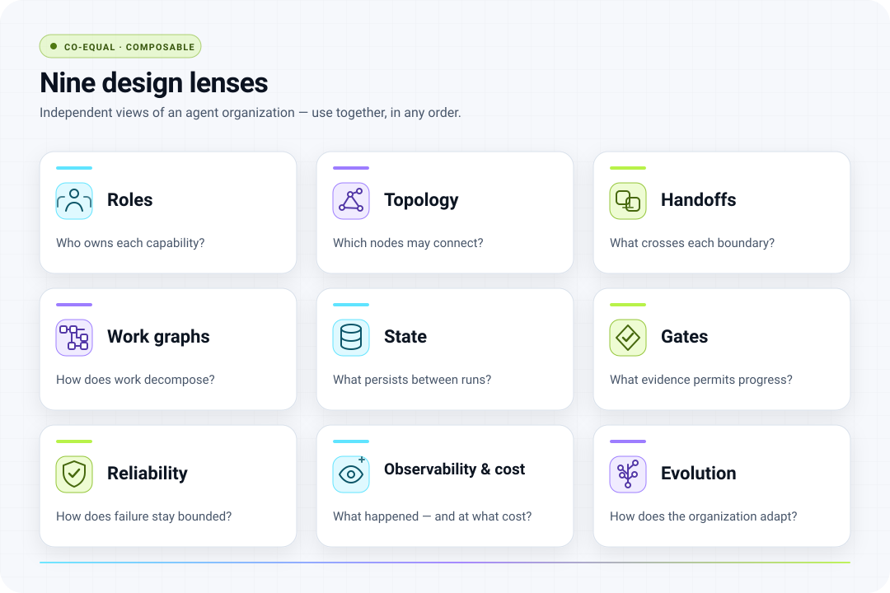

<p align="center">
  <a href="https://chaoyue0307.github.io/awesome-graph-engineering/">
    
  </a>
</p>

<h1 align="center">Awesome Graph Engineering</h1>

<p align="center">
  <strong>Engineer the organization, not just the agent.</strong><br>
  A field guide, open dataset, and interactive atlas for graph-structured multi-agent systems—programmable AI-agent organizations.
</p>

<p align="center">
  <a href="#-resource-directory"></a>
  <a href="https://github.com/ChaoYue0307/awesome-graph-engineering/actions/workflows/quality.yml"></a>
  <a href="https://huggingface.co/datasets/cy0307/awesome-graph-engineering"></a>
  <a href="LICENSE"></a>
  <a href="https://github.com/ChaoYue0307/awesome-graph-engineering"></a>
</p>

<p align="center">
  🌐 <a href="https://chaoyue0307.github.io/awesome-graph-engineering/"><strong>Explore the Atlas</strong></a> ·
  🤗 <a href="https://huggingface.co/datasets/cy0307/awesome-graph-engineering"><strong>Use the Dataset</strong></a> ·
  📥 <a href="data/resources.csv"><strong>Download CSV</strong></a> ·
  ➕ <a href="https://github.com/ChaoYue0307/awesome-graph-engineering/issues/new?template=add-resource.yml"><strong>Suggest a Resource</strong></a>
</p>

<p align="center">
  🧭 <a href="#-working-definition"><strong>Definition</strong></a> ·
  🧱 <a href="TAXONOMY.md"><strong>Taxonomy</strong></a> ·
  ⚖️ <a href="COMPARISON.md"><strong>Boundaries</strong></a> ·
  📚 <a href="#-resource-directory"><strong>Resources</strong></a> ·
  📣 <a href="LAUNCH-KIT.md"><strong>Share</strong></a> ·
  🧾 <a href="#-citation"><strong>Cite</strong></a> ·
  📜 <a href="#-license"><strong>License</strong></a>
</p>

<p align="center">
  🌍 <strong>Languages:</strong>
  <strong>English</strong> ·
  <a href="i18n/zh-Hans/README.md">简体中文</a> ·
  <a href="i18n/es/README.md">Español</a> ·
  <a href="i18n/fr/README.md">Français</a> ·
  <a href="i18n/de/README.md">Deutsch</a> ·
  <a href="i18n/ja/README.md">日本語</a> ·
  <a href="i18n/ko/README.md">한국어</a> ·
  <a href="i18n/pt-BR/README.md">Português (Brasil)</a> ·
  <a href="i18n/README.md">Help translate</a>
</p>

Here, **graph engineering** means engineering graph-structured **AI-agent systems**. Graph databases, knowledge graphs, graph ETL, GraphRAG, and graph neural networks are outside this scope unless they directly support an agent graph. See the [boundary guide](COMPARISON.md#not-graph-data-engineering-the-name-collision).

<!-- CORPUS_STATS_START -->

<div align="center">

<table>
  <tr>
    <td align="center"><strong>565</strong><br><sub>curated resources</sub></td>
    <td align="center"><strong>11</strong><br><sub>directory sections</sub></td>
    <td align="center"><strong>9</strong><br><sub>design layers</sub></td>
    <td align="center"><strong>241</strong><br><sub>distinct sources</sub></td>
  </tr>
  <tr>
    <td align="center"><strong>255</strong><br><sub>papers &amp; preprints</sub></td>
    <td align="center"><strong>144</strong><br><sub>tools, docs &amp; standards</sub></td>
    <td align="center"><strong>37</strong><br><sub>benchmarks &amp; datasets</sub></td>
    <td align="center"><strong>296</strong><br><sub>published in 2026</sub></td>
  </tr>
</table>

</div>

<!-- CORPUS_STATS_END -->

Every number above is generated from [`data/resources.jsonl`](data/resources.jsonl) and checked in CI, so it cannot drift from the catalog. Full breakdowns by section, layer, type, and evidence label are in the [resource directory](#-resource-directory) and the [interactive atlas](https://chaoyue0307.github.io/awesome-graph-engineering/#atlas).

## 🧭 Working definition

**Graph engineering is the practice of specifying, executing, observing, and evolving a graph-structured agent system—its roles and runtime instances, the contracts that connect them, the state and artifacts they share, and the evidence by which their collective behavior is judged—so that the system can be controlled, tested, and improved as an engineered whole.**

The graph must be load-bearing rather than decorative: its declared topology, realized run graph, or graph-generating policy materially constrains execution and remains inspectable enough to version, trace, evaluate, or deliberately change.

Connected improvement loops can monitor, constrain, or veto one another, while external measurements, fixed rules, and human decisions provide grounding. [Carlos E. Perez’s 2026 “graph of loops” essay](https://x.com/IntuitMachine/status/2078419526354378975) articulates this control perspective. Applied to AI-agent organizations, agent roles and runtime instances are the primary adaptive nodes; deterministic tests, audit cycles, human decisions, and real-world observations may act as control nodes or gates.

*Graph engineering* is used here as an **emerging, non-standard term**. Its scope synthesizes established work in [agent-oriented programming](https://doi.org/10.1016/0004-3702(93)90034-9), [multi-agent systems](https://doi.org/10.1017/S0269888900008122), [blackboard architectures](https://doi.org/10.1609/aimag.v7i2.537), distributed systems, workflow orchestration, and graph-based language-agent research such as [GPTSwarm](https://arxiv.org/abs/2402.16823). The [evidence map](DEFINITION.md#evidence-map-for-the-synthesis) separates source-backed claims from analytical inferences. Steinberger’s and Perez’s July 2026 posts document recent practitioner usage; they do not establish coinage or consensus.

### The minimum test

A system is in scope when all three conditions are load-bearing:

1. **Plural bounded agency** — at least two separately accountable agentic runtime instances each make bounded execution decisions; they may share a role or model.
2. **Explicit coordination semantics** — edges say what may move, when control transfers, and how results are accepted or rejected.
3. **An inspectable graph artifact** — topology, run graph, or graph-generating policy can be versioned, traced, evaluated, or changed deliberately.

A single agent with many tools is still one node. A deterministic DAG of ordinary functions is workflow engineering. A “swarm” of personas without contracts, state boundaries, or evidence gates is branding, not graph engineering.

<p align="center">
  <a href="https://chaoyue0307.github.io/awesome-graph-engineering/">
    
  </a>
</p>

## 🧩 Core primitives

| Primitive | Engineering question | Typical artifact |
| --- | --- | --- |
| **Agent node** | Who owns this context, objective, capability, and permission boundary? | Role spec, runtime identity, tool allowlist |
| **Typed edge** | What crosses this relationship, under which preconditions and schema? | Handoff contract, protocol message, artifact reference |
| **Org graph** | Which reusable roles may coordinate, delegate, verify, or escalate? | Versioned roles-and-permissions topology |
| **Run/work graph** | What execution structure does this particular job require? | Run-scoped DAG, event graph, trace, lineage |
| **Gate** | What evidence allows work to advance? | Test, evaluator, quorum rule, human approval |
| **State boundary** | What is shared, isolated, checkpointed, or authoritative? | Blackboard, artifact store, snapshot, worktree |
| **Graph policy** | Who may create, rewrite, cancel, or route nodes and edges? | Scheduler, budget policy, topology generator |

### Org graph ≠ run graph

| | Org graph | Run/work graph |
| --- | --- | --- |
| **Describes** | Stable roles, capabilities, authority, and allowed relationships | The tasks, dependencies, branches, and evidence produced in one run |
| **Changes** | Deliberately, through architecture or policy updates | Dynamically, as planning and execution reveal new work |
| **Primary question** | “Who may do and verify what?” | “What must happen next for this outcome?” |
| **Safety boundary** | A planner may select permitted relationships | A planner must not silently expand its own permissions |

Org graph and run/work graph are analytical views, not standardized object types. An implementation may represent both in one runtime graph if standing authority remains distinguishable from run-specific execution.

## ✅ Do you need a graph?

Start with the smallest architecture that closes the quality loop. One well-instrumented agent loop is usually enough until work needs at least one of these:

- **Specialization:** independent roles need different context, tools, models, or permissions.
- **Parallelism:** separable work should fan out, then reconcile under an explicit contract.
- **Independent verification:** a producer should not be the only judge of its own output.
- **Fault or trust isolation:** failure, untrusted input, or privileged actions must be contained.

If none applies, invest in the loop first: context, stopping conditions, tests, retries, and observability. [Loop engineering](https://addyosmani.com/blog/loop-engineering/) is primarily temporal—how one agent progresses through repeated work. Graph engineering is primarily relational—how multiple scoped actors and control surfaces compose. The two concerns are complementary; neither is a maturity stage.

## 🗺️ Choose your path

| If you are… | Start with | Then inspect |
| --- | --- | --- |
| 🛠️ **Building your first multi-agent flow** | Two roles, one typed handoff, one evidence gate | [Start Here](#start-here) → [Frameworks & SDKs](#frameworks--sdks) |
| 🏗️ **Designing an agent organization** | Org/run separation, topology, authority, state ownership | [Taxonomy](TAXONOMY.md) → [Protocols & Handoffs](#protocols--handoffs) |
| 🚦 **Operating a production graph** | Durable execution, traces, budgets, replay, escalation | [Reliability](#reliability--durable-execution) → [Observability & Cost](#observability--cost) |
| 🔬 **Researching adaptive systems** | Foundations, benchmarks, topology optimization, limits | [Research Foundations](#research-foundations) → [Critiques & Limits](#critiques--limits) |

## 🧱 The nine engineering layers

<picture>
  <source media="(prefers-color-scheme: dark)" srcset="assets/layers-map-dark.svg">
  
</picture>

| # | Layer | The design question |
| ---: | --- | --- |
| 01 | **Roles** | Who exists, and what does each node own? |
| 02 | **Topology** | How are the roles arranged, and why this shape? |
| 03 | **Handoffs** | What may cross each edge, in what schema? |
| 04 | **Work graphs** | What execution structure does this run need now? |
| 05 | **State** | What is shared, isolated, durable, or authoritative? |
| 06 | **Gates** | What evidence advances, rejects, or escalates work? |
| 07 | **Reliability** | How does the graph fail, recover, replay, and stop? |
| 08 | **Observability & cost** | Can operators explain the path, latency, and spend? |
| 09 | **Evolution** | When and how may topology or policy redesign itself? |

The layers are concerns, not compulsory stages. A two-role pipeline with a typed handoff and a test gate can be a complete graph. Read the full [taxonomy](TAXONOMY.md), [comparison guide](COMPARISON.md), and [anti-patterns](ANTI-PATTERNS.md).

## 📚 Resource directory

The resource directory prioritizes primary research, official documentation, maintained projects, standards, reproducible benchmarks, and production reports. **Evidence labels identify source type; they do not score quality.** Each entry contains an original summary, a distinct engineering rationale, and one primary layer.

<!-- CORPUS_BREAKDOWN_START -->

**Corpus composition:** 565 resources drawn from 241 distinct sources. By evidence label: 143 peer-reviewed research, 105 practitioner analysis, 112 research preprints, 69 official documentation, 62 maintained OSS projects, 37 benchmarks or datasets, 13 industry standards, 13 community resources, 11 books or courses. 296 entries were published or materially updated in 2026.

<!-- CORPUS_BREAKDOWN_END -->

Use the [interactive Resource Atlas](https://chaoyue0307.github.io/awesome-graph-engineering/#atlas) to search and filter the same records by section, source type, evidence label, and layer.

<!-- RESOURCE_TABLES_START -->

### Contents

- [Start Here](#start-here) — 51 resources
- [Research Foundations](#research-foundations) — 150 resources
- [Frameworks &amp; SDKs](#frameworks--sdks) — 57 resources
- [Protocols &amp; Handoffs](#protocols--handoffs) — 37 resources
- [State, Memory &amp; Artifacts](#state-memory--artifacts) — 31 resources
- [Verification &amp; Evals](#verification--evals) — 35 resources
- [Reliability &amp; Durable Execution](#reliability--durable-execution) — 37 resources
- [Observability &amp; Cost](#observability--cost) — 35 resources
- [Benchmarks &amp; Datasets](#benchmarks--datasets) — 45 resources
- [Production Case Studies](#production-case-studies) — 39 resources
- [Critiques &amp; Limits](#critiques--limits) — 48 resources

### Start Here

| Resource | Source | What it contributes | Evidence |
| --- | --- | --- | --- |
| 📝 **[A practical guide to building agents](https://openai.com/business/guides-and-resources/a-practical-guide-to-building-ai-agents/)**<br><sub>Blog · Architecture guide</sub> | **OpenAI Guides &amp; Resources**<br><sub>OpenAI · 2025</sub> | Explains when agents are appropriate, how to define their tools and instructions, and how to move from one agent to manager and handoff-based multi-agent patterns.<br><sub><strong>Why:</strong> A useful first check on whether distinct roles justify the coordination cost of a graph.</sub> | **Practitioner analysis**<br><sub>Roles</sub> |
| 📝 **[Building effective agents](https://www.anthropic.com/engineering/building-effective-agents)**<br><sub>Blog · Architecture guide</sub> | **Anthropic Engineering**<br><sub>Erik Schluntz, Barry Zhang (Anthropic) · 2024</sub> | The pattern vocabulary most work-graph designs are built from: prompt chaining, routing, parallelization (sectioning and voting), orchestrator-workers, and evaluator-optimizer, plus the workflow-vs-agent distinction (predefined code paths vs model-directed control). The orchestrator-workers pattern — subtasks determined by the orchestrator at runtime, not predefined — is the minimal dynamic work graph.<br><sub><strong>Why:</strong> The pattern vocabulary most work-graph designs are assembled from, and the reference practitioners actually cite.</sub> | **Practitioner analysis**<br><sub>Topology</sub> |
| 📝 **[From Loop Engineering to Graph Engineering?](https://x.com/IntuitMachine/status/2078419526354378975)**<br><sub>Blog · Contemporary framing</sub> | **X Articles**<br><sub>Carlos E. Perez · 2026</sub> | Frames the shift as loop architecture: networks of improvement cycles that monitor, feed, constrain, and correct one another, with reliability located in their edges.<br><sub><strong>Why:</strong> Adds the grounding requirement missing from topology-only accounts: independent counter-metrics, frozen tests or rules, external anchors, and human ownership of root objectives.</sub> | **Practitioner analysis**<br><sub>Gates</sub> |
| 📄 **[The Five Ws of Multi-Agent Communication: Who Talks to Whom, When, What, and Why – A Survey from MARL to Emergent Language and LLMs](https://openreview.net/forum?id=LGsed0QQVq)**<br><sub>Paper · Communication survey</sub> | **Transactions on Machine Learning Research**<br><sub>Jingdi Chen; Hanqing Yang; Zongjun Liu; Carlee Joe-Wong · 2026</sub> | Synthesizes multi-agent communication across reinforcement learning, emergent language, and LLM systems through sender, recipient, timing, content, and purpose decisions.<br><sub><strong>Why:</strong> Provides a design-oriented map for engineering edge selection, message timing, payloads, grounding, scalability, and interpretability.</sub> | **Peer-reviewed research**<br><sub>Handoffs</sub> |
| 📚 **[Multi-Agent Reference Architecture](https://github.com/microsoft/multi-agent-reference-architecture)**<br><sub>Docs · Production reference architecture</sub> | **Microsoft**<br><sub>Microsoft · 2026</sub> | Maps agent registries, communication, memory, observability, evaluation, security, governance, and deployment into an end-to-end reference architecture for multi-agent systems.<br><sub><strong>Why:</strong> Provides a broad engineering checklist grounded in customer implementations; it is evolving guidance in an official repository, not a versioned standard.</sub> | **Official documentation**<br><sub>Topology</sub> |
| 🎬 **[Steve Yegge on AI Agents and the Future of Software Engineering](https://newsletter.pragmaticengineer.com/p/steve-yegge-on-ai-agents-and-the)**<br><sub>Video · Agent-organization pre-history</sub> | **The Pragmatic Engineer**<br><sub>Gergely Orosz, Steve Yegge · 2026</sub> | February 10, 2026 podcast (with written companion) where Yegge lays out his eight-level agent adoption spectrum, culminating at level 8: building your own orchestrator to coordinate many agents. Captures the "you fire up another agent, then another... you can't leave" coordination pain that made programmable agent organizations feel inevitable.<br><sub><strong>Why:</strong> Lays out an adoption progression for agent organizations that gives teams a vocabulary for where they currently are.</sub> | **Practitioner analysis**<br><sub>Roles</sub> |
| 📝 **[Welcome to Gas Town](https://steve-yegge.medium.com/welcome-to-gas-town-4f25ee16dd04)**<br><sub>Blog · Agent-organization pre-history</sub> | **Medium**<br><sub>Steve Yegge · 2026</sub> | The January 1, 2026 essay introducing the first widely-adopted agent organization: 20-30 parallel Claude Code instances under a role hierarchy — Mayor (chief-of-staff), long-lived Crew, ephemeral swarming polecats feeding a merge queue — at a reported ~$100/hour token burn. The clearest pre-discourse instance of a stable org graph plus ephemeral work units, cited throughout the July 2026 debate.<br><sub><strong>Why:</strong> The essay that popularized running dozens of parallel coding agents under a coordinator, and the concrete origin of much later practice.</sub> | **Practitioner analysis**<br><sub>Topology</sub> |
| 🧰 **[loop-engineering: Practical Patterns, Starters &amp; CLI Tools](https://github.com/cobusgreyling/loop-engineering)**<br><sub>Tool · Discourse-to-tooling</sub> | **GitHub**<br><sub>Cobus Greyling · 2026</sub> | Open-source repo that converted the Osmani/Cherny discourse into runnable artifacts: production loop patterns, loop-audit, loop-init, and loop-cost CLI tools that scaffold and score agent loops. Evidence of how fast the founding discourse turned into tooling — the same trajectory graph engineering began following in July 2026.<br><sub><strong>Why:</strong> Turns the loop discourse into runnable patterns and starters, which is the fastest way to get a node worth coordinating.</sub> | **Maintained OSS project**<br><sub>Work graphs</sub> |
| 📝 **[Context vs Prompt vs Loop vs Harness Engineering: The 2026 Stack](https://explainx.ai/blog/context-prompt-loop-harness-engineering-stack-2026)**<br><sub>Blog · Engineering-stack framing</sub> | **explainx.ai**<br><sub>explainx.ai · 2026</sub> | The layered-stack taxonomy the graph engineering discourse extends: prompt (how do I word this message), context (what the model sees per call), loop (what autonomous workflow repeats until a goal), harness (what code runs it reliably). Graph engineering was pitched on July 18 as the fifth layer on exactly this ladder, so this is the reference frame most reactions assume.<br><sub><strong>Why:</strong> Distinguishes the neighboring dimensions cleanly, useful when a team is arguing across layers without noticing.</sub> | **Practitioner analysis**<br><sub>Topology</sub> |
| 📝 **[Agentic Loops: From ReAct to Loop Engineering (2026 Guide)](https://datasciencedojo.com/blog/agentic-loops-explained-from-react-to-loop-engineering-2026-guide/)**<br><sub>Blog · Loop-engineering pre-history</sub> | **Data Science Dojo**<br><sub>Data Science Dojo · 2026</sub> | Traces the full lineage from the 2022 ReAct paper through 2024-25 agent harnesses to the June 2026 loop-engineering moment, giving the discourse its research pedigree. Handy for readers who want the deep history of the loop layer that graph engineering composes over.<br><sub><strong>Why:</strong> Traces the lineage from early reasoning-and-acting agents to current practice, giving newcomers the arc rather than a snapshot.</sub> | **Practitioner analysis**<br><sub>Work graphs</sub> |
| 📝 **[Anthropic's Coding Chief Doesn't Write Prompts Anymore. He Writes Loops.](https://medium.com/@kanishks772/anthropics-coding-chief-doesn-t-write-prompts-anymore-he-writes-loops-86db2e05bb02)**<br><sub>Blog · Loop-engineering pre-history</sub> | **Medium**<br><sub>The Latency Gambler (Kanishk S.) · 2026</sub> | One of the widest-read June 2026 amplifications of the Cherny quote, reconstructing what his loop setup actually consists of and why "the loop is the easy part" while context and stop conditions are the work. Representative of the wave of secondary coverage that carried the loops framing to a general engineering audience just before the graphs turn.<br><sub><strong>Why:</strong> Reconstructs what a working practitioner loop setup actually contains, beyond the quotable claim.</sub> | **Practitioner analysis**<br><sub>Work graphs</sub> |
| 🎬 **[Boris Cherny: "I don't prompt Claude anymore. I have loops prompting Claude" (clip)](https://x.com/PawelHuryn/status/2069363303952818474)**<br><sub>Video · Loop-engineering pre-history</sub> | **X**<br><sub>Boris Cherny (clip), shared by Paweł Huryn · 2026</sub> | Widely-shared June 2026 clip of Claude Code's creator saying he no longer prompts Claude directly but runs loops that prompt it and figure out what to do next — the insider confirmation that pushed loop engineering from meme to practice. Cherny called it "the transition we're going to see for the rest of the year"; the multi-loop, multi-agent implications set up the graphs turn a month later.<br><sub><strong>Why:</strong> First-hand statement from the author of a widely used coding harness on why he stopped prompting directly.</sub> | **Practitioner analysis**<br><sub>Work graphs</sub> |
| 📝 **[Demystifying Loop Engineering: Get More From AI Agents, Avoid Loopmaxxing](https://bdtechtalks.com/2026/06/22/ai-loop-engineering/)**<br><sub>Blog · Loop-engineering pre-history</sub> | **TechTalks**<br><sub>TechTalks (bdtechtalks.com) · 2026</sub> | June 22, 2026 explainer that added the discourse's main cautionary term, "loopmaxxing" — over-automating loops past the point of verification. Its warnings about unverified autonomous cycles carry directly into graph engineering, where the failure mode compounds across every node in the organization.<br><sub><strong>Why:</strong> Introduces a useful cautionary term for over-automating work that did not need it, a failure mode that scales badly into graphs.</sub> | **Practitioner analysis**<br><sub>Reliability</sub> |
| 📝 **[Introducing Loop Engineering](https://valentinaalto.medium.com/introducing-loop-engineering-ac7a6098bb10)**<br><sub>Blog · Loop-engineering pre-history</sub> | **Medium**<br><sub>Valentina Alto · 2026</sub> | July 2026 essay framing loop engineering as the emerging human-agents interaction model rather than a coding trick — one of the last substantial loops-era pieces published in the days before the graphs pivot, useful for seeing exactly what the discourse looked like at the moment it shifted.<br><sub><strong>Why:</strong> Frames the shift as an interaction model between humans and agents rather than a coding trick, which is the right altitude for org design.</sub> | **Practitioner analysis**<br><sub>Roles</sub> |
| 📝 **[Loop Engineering: Designing Loops That Prompt Coding Agents](https://addyosmani.com/blog/loop-engineering/)**<br><sub>Blog · Loop-engineering pre-history</sub> | **addyosmani.com**<br><sub>Addy Osmani · 2026</sub> | The June 7, 2026 essay (republished by O'Reilly Radar on June 22) that named and structured loop engineering: five components — automations, worktrees, skills, plugins/MCP connectors, and subagents — plus external state so progress survives between runs. The subagents-and-external-state sections are where the essay already reaches toward multi-agent graph structure, making it the immediate intellectual substrate of graph engineering.<br><sub><strong>Why:</strong> The essay that structured the loop layer into named components, and the substrate every graph node sits on.</sub> | **Practitioner analysis**<br><sub>Work graphs</sub> |
| 📝 **[Peter Steinberger: "You should be designing loops that prompt your agents"](https://x.com/steipete/status/2063697162748260627)**<br><sub>Blog · Loop-engineering pre-history</sub> | **X**<br><sub>Peter Steinberger (@steipete) · 2026</sub> | The June 2026 post (~6.5M views) that made loop engineering a mass movement: "you shouldn't be prompting coding agents anymore, you should be designing loops that prompt your agents." The direct ancestor of the July graphs post — graph engineering is explicitly framed as the layer above this idea.<br><sub><strong>Why:</strong> The post that moved the field from prompting to designing systems that prompt, and the direct ancestor of the coordination discourse.</sub> | **Practitioner analysis**<br><sub>Work graphs</sub> |
| 📝 **[Prompt Engineering Is Dead. Long Live Loop Engineering](https://hackernoon.com/prompt-engineering-is-dead-long-live-loop-engineering-or-fractera-blog)**<br><sub>Blog · Loop-engineering pre-history</sub> | **HackerNoon**<br><sub>Fractera · 2026</sub> | The succession-framing piece whose title became shorthand for how each layer of the engineering stack dethrones the last — the same rhetorical template the graph engineering discourse reused three weeks later ("loop engineering is dead, long live graph engineering" jokes in the July 18 replies trace here).<br><sub><strong>Why:</strong> Useful as a record of how each layer of the stack reframes the one below, including the hype that comes with it.</sub> | **Practitioner analysis**<br><sub>Topology</sub> |
| 📝 **[Stop Prompting AI and Start Building Loops](https://www.productmarketfit.tech/p/stop-prompting-ai-and-start-building)**<br><sub>Blog · Loop-engineering pre-history</sub> | **Product Market Fit**<br><sub>Product Market Fit (Substack) · 2026</sub> | Newsletter breakdown of Boris Cherny's loops-not-prompts shift, unpacking the 16-minute source interview into the working parts: the context, the stop condition, the budget cap, and the verifiable target. Useful as the most careful secondary account of what Cherny actually described versus what the viral quote implied.<br><sub><strong>Why:</strong> Unpacks a viral claim into its working parts: context, stop condition, budget cap, and verifiable target.</sub> | **Practitioner analysis**<br><sub>Reliability</sub> |
| 🧭 **[AgenticOrgChart.com: AI Agent Org Chart Patterns](https://agenticorgchart.com/)**<br><sub>List · Topology patterns</sub> | **agenticorgchart.com**<br><sub>agenticorgchart.com · 2026</sub> | Vendor-neutral reference documenting seven canonical multi-agent topologies — single agent, supervisor, hierarchical, human-in-the-loop, and others — each with cited public production examples. The closest thing the young field has to a pattern catalog for org graphs, published before the term existed.<br><sub><strong>Why:</strong> A vendor-neutral catalog of canonical topologies, handy for naming the shape you are already building.</sub> | **Community resource**<br><sub>Topology</sub> |
| 📝 **[Shubham Saboo: SKILL graphs for a six-agent team](https://x.com/Saboo_Shubham_/status/2024328073680998710)**<br><sub>Blog · Two-graph precursor</sub> | **X**<br><sub>Shubham Saboo (@Saboo_Shubham_) · 2026</sub> | Early-2026 precursor to Saboo's two-graph framing quoted in the founding discourse: he describes running a team of six agents, each with a SOUL file, memory files, and a traversable graph of skill docs, coordinating through shared files. Concrete example of graph-shaped shared knowledge serving a standing agent organization rather than a retrieval pipeline.<br><sub><strong>Why:</strong> A concrete early example of graph-shaped shared knowledge serving a standing agent team rather than a retrieval pipeline.</sub> | **Practitioner analysis**<br><sub>State</sub> |
| 📝 **[The Shift from Models to Compound AI Systems](https://bair.berkeley.edu/blog/2024/02/18/compound-ai-systems/)**<br><sub>Blog · Compound-systems economics</sub> | **Berkeley AI Research blog**<br><sub>Matei Zaharia, Omar Khattab, Lingjiao Chen et al. · 2024</sub> | The essay that reframed AI engineering as system design over budgets: tripling model training spend might buy 30%→35% on coding, while a sample-test-filter system reaches 80% with existing models, so builders must allocate latency, cost, and compute budgets across components. The economic argument underneath the whole engineering stack that graph engineering now sits atop.<br><sub><strong>Why:</strong> Reframes AI engineering as system design over budgets, which is the premise the whole coordination layer rests on.</sub> | **Practitioner analysis**<br><sub>Topology</sub> |
| 📝 **[Are we still talking loops or did we shift to graphs yet?](https://x.com/steipete/status/2078277297791189132)**<br><sub>Blog · Founding discourse</sub> | **X**<br><sub>Peter Steinberger · 2026</sub> | The July 2026 post that pushed the discourse from loop engineering to graph engineering: one line asking whether single-agent loops are already obsolete as the unit of design. Its virality reframed planning and decomposition as the question of what work graph your agents should form per task.<br><sub><strong>Why:</strong> The post that named the shift from loops to graphs, and the entry point to the whole coordination discourse.</sub> | **Practitioner analysis**<br><sub>Topology</sub> |
| 📝 **[Graph Engineering: Designing Multi-Agent Organizations](https://explainx.ai/blog/graph-engineering-ai-agents-multi-agent-organizations-2026)**<br><sub>Blog · Work graph vs org graph</sub> | **explainx.ai**<br><sub>Yash Thakker · 2026</sub> | Canonical framing article (July 18, 2026) separating the stable org graph of long-lived agents from the ephemeral work graph whose task nodes split, merge, reorder, or disappear as evidence arrives. Argues graphs force you to declare every node, edge, and failure mode that loops let you defer.<br><sub><strong>Why:</strong> The framing article that separates the standing org graph from the per-run work graph, which is the field's most useful distinction.</sub> | **Practitioner analysis**<br><sub>Topology</sub> |
| 🧭 **[Awesome Harness Engineering](https://github.com/ai-boost/awesome-harness-engineering)**<br><sub>List · Adjacent curated lists</sub> | **GitHub**<br><sub>ai-boost · 2026</sub> | Curated resources for the harness layer directly beneath agent organizations: agent loops, context management, tool design, MCP and skills, permissions, memory, verification, observability, sandboxing, and reference implementations, at roughly 3.3k stars.<br><sub><strong>Why:</strong> The neighbouring layer's catalog, useful when a graph problem turns out to be a single node's harness problem.</sub> | **Community resource**<br><sub>Reliability</sub> |
| 🧭 **[Awesome Loop Engineering](https://github.com/ChaoYue0307/awesome-loop-engineering)**<br><sub>List · Adjacent curated lists</sub> | **GitHub**<br><sub>Chaoyue He · 2026</sub> | Sibling list covering the loop layer: 874 resources, 22 operational patterns, 22 loop contracts, and 8 runtime starters for recurring agent systems, plus an interactive atlas and a structured dataset. 46 stars, last pushed 2 Aug 2026; complements graph engineering by covering the time axis (re-triggering, supervision) where this list covers the org axis.<br><sub><strong>Why:</strong> The sibling catalog for the loop layer beneath this one, where a single node's behavior cycle is designed.</sub> | **Community resource**<br><sub>Work graphs</sub> |
| 🧭 **[Awesome Agentic Engineering](https://github.com/jordimas/awesome-agentic-engineering)**<br><sub>List · Adjacent curated lists</sub> | **GitHub**<br><sub>Jordi Mas · 2026</sub> | Practitioner-oriented list of agentic engineering resources, weighted toward coding agents, MCP, AGENTS.md, and team workflow patterns rather than research papers. 97 stars, last pushed 27 Jun 2026.<br><sub><strong>Why:</strong> A practitioner-oriented catalog of agentic engineering resources adjacent to this list's scope.</sub> | **Community resource**<br><sub>Topology</sub> |
| 🧭 **[Awesome AI Agents (e2b)](https://github.com/e2b-dev/awesome-ai-agents)**<br><sub>List · Adjacent curated lists</sub> | **GitHub**<br><sub>e2b · 2026</sub> | The largest general inventory of autonomous agent products and projects, with use-case filters and per-project metadata. 29,223 stars, last pushed 9 Jul 2026. Mostly single-agent products — use it for ecosystem coverage, not for coordination semantics.<br><sub><strong>Why:</strong> One of the broadest agent catalogs, useful for finding tools this list deliberately does not carry.</sub> | **Community resource**<br><sub>Topology</sub> |
| 🧭 **[Awesome AI Agent Papers](https://github.com/VoltAgent/awesome-ai-agent-papers)**<br><sub>List · Adjacent curated lists</sub> | **GitHub**<br><sub>VoltAgent · 2026</sub> | Weekly-refreshed arXiv digest restricted to papers published from January 2026 onward, bucketed into multi-agent coordination, memory/RAG, tooling, evaluation/observability, and security. 1,646 stars, last pushed 3 Jul 2026. The coordination bucket is the directly relevant slice.<br><sub><strong>Why:</strong> A running collection of agent research papers, useful as a feed for what to evaluate next.</sub> | **Community resource**<br><sub>Topology</sub> |
| 🧭 **[Awesome LLM-Powered Agent](https://github.com/hyp1231/awesome-llm-powered-agent)**<br><sub>List · Adjacent curated lists</sub> | **GitHub**<br><sub>Yupeng Hou · 2025</sub> | Long-running academic reading list on LLM-powered agents with a dedicated multi-agent-collaboration section. 2,255 stars, but effectively dormant — last push 30 Apr 2025, so it misses the entire 2025-2026 orchestration wave. Useful for pre-2025 lineage only.<br><sub><strong>Why:</strong> An academic reading list on LLM-powered agents, complementing the engineering emphasis here.</sub> | **Community resource**<br><sub>Topology</sub> |
| 🧭 **[Awesome Graphs Meet Agents](https://github.com/YuanchenBei/Awesome-Graphs-Meet-Agents)**<br><sub>List · Disambiguation</sub> | **GitHub**<br><sub>Yuanchen Bei et al. · 2026</sub> | Companion list to the survey "Graphs Meet AI Agents," covering graph-empowered agents (planning, memory, coordination over graph data) and agent-assisted graph learning. 169 stars, last pushed 28 Jul 2026. Included as the key disambiguation reference: this is graph-DATA-meets-agents, not multi-agent org topology.<br><sub><strong>Why:</strong> The graph-data-meets-agents list, and the clearest reference for the boundary this project draws around its own name.</sub> | **Community resource**<br><sub>State</sub> |
| 🧭 **[Awesome MCP Servers](https://github.com/punkpeye/awesome-mcp-servers)**<br><sub>List · Adjacent curated lists</sub> | **GitHub**<br><sub>Frank Fiegel · 2026</sub> | The de facto directory of Model Context Protocol servers, at roughly 91.7k stars and 13.8k forks. Relevant as the tool-edge inventory: MCP servers are what nodes in an agent graph reach for, distinct from the agent-to-agent edges themselves.<br><sub><strong>Why:</strong> The registry practitioners actually use to find tool-edge servers, which is where most handoff surface now lives.</sub> | **Community resource**<br><sub>Handoffs</sub> |
| 🎓 **[Hugging Face Agents Course](https://huggingface.co/learn/agents-course)**<br><sub>Course · Courses and MOOCs</sub> | **Hugging Face**<br><sub>Hugging Face · 2026</sub> | Free five-unit course covering agent fundamentals, then smolagents, LangGraph, and LlamaIndex, with a unit on multi-agent collaboration and a leaderboard-graded final assignment. Two certificate tiers; the companion repo has 30,592 stars and was last pushed 30 Jun 2026.<br><sub><strong>Why:</strong> A free hands-on course that gets someone to a working agent before they attempt an organization of them.</sub> | **Book/course**<br><sub>Roles</sub> |
| 🎓 **[Berkeley Agentic AI MOOC (CS294/194-196)](https://agenticai-learning.org/f25)**<br><sub>Course · Courses and MOOCs</sub> | **UC Berkeley RDI**<br><sub>Dawn Song, Xinyun Chen · 2025</sub> | Free lecture series with a 32K+ learner community (about 40K counting the earlier Advanced LLM Agents run), with dedicated sessions on multi-agent AI systems, post-training verification, agent evaluation, and safety. Slides and recordings stay public; the Fall 2025 page is the current edition and no Spring/Fall 2026 edition is linked as of Aug 2026.<br><sub><strong>Why:</strong> University-level lectures covering agent systems, with material on coordination rather than only single-agent tricks.</sub> | **Book/course**<br><sub>Topology</sub> |
| 🎓 **[Multi AI Agent Systems with crewAI](https://www.deeplearning.ai/courses/multi-ai-agent-systems-with-crewai)**<br><sub>Course · Courses and MOOCs</sub> | **DeepLearning.AI**<br><sub>João Moura, DeepLearning.AI · 2026</sub> | Three-hour, 18-lesson beginner course on assigning specialized roles to agents and coordinating them in series, parallel, and hierarchical structures, with error handling and loop prevention. Applied to six business processes; free during the DeepLearning.AI platform beta.<br><sub><strong>Why:</strong> A short course on role-based crews, the fastest path to a first working multi-agent design.</sub> | **Book/course**<br><sub>Roles</sub> |
| 🎓 **[Introduction to LangGraph (LangChain Academy)](https://academy.langchain.com/courses/intro-to-langgraph)**<br><sub>Course · Courses and MOOCs</sub> | **LangChain Academy**<br><sub>LangChain · 2026</sub> | Free six-module, 55-lesson (~6 hour) course on LangGraph as an explicit graph of nodes and edges: state, memory, human-in-the-loop interrupts, long-term memory, and deployment. The closest thing to a canonical hands-on course on programmable agent topology.<br><sub><strong>Why:</strong> The vendor course for graph-native orchestration, covering state and control flow rather than prompt tricks.</sub> | **Book/course**<br><sub>Work graphs</sub> |
| 🎓 **[AI Evals for Engineers &amp; PMs](https://maven.com/parlance-labs/evals)**<br><sub>Course · Courses and MOOCs</sub> | **Maven**<br><sub>Hamel Husain, Shreya Shankar · 2026</sub> | Paid cohort course that has trained 2,000+ engineers and PMs, including teams at OpenAI and Anthropic; material fully refreshed for the September 2026 cohort. Covers error analysis on agentic traces (tool calls, retrieval) and validating LLM-as-judge against expert labels — the measurement half of running a multi-agent org.<br><sub><strong>Why:</strong> Evaluation practice aimed at engineers, which is the skill an agent-organization gate depends on.</sub> | **Book/course**<br><sub>Gates</sub> |
| 📚 **[AAMAS 2027 — 26th International Conference on Autonomous Agents and Multiagent Systems](https://warwick.ac.uk/fac/sci/dcs/aamas2027/)**<br><sub>Docs · Conferences and workshops</sub> | **IFAAMAS**<br><sub>IFAAMAS; general chairs William Yeoh and Neil Yorke-Smith · 2027</sub> | The field's primary academic venue, 3-7 May 2027 in Hanoi, Vietnam, with a call explicitly naming generative and agentic AI alongside established agent topics. The preceding AAMAS 2026 (Paphos, Cyprus, 25-29 May 2026) drew 1,455 main-track full-paper submissions, roughly 50% above any prior year.<br><sub><strong>Why:</strong> The long-running academic venue for autonomous agents and multi-agent systems, where much of this theory is still developed.</sub> | **Official documentation**<br><sub>Topology</sub> |
| 📚 **[AI Engineer World's Fair 2026](https://www.ai.engineer/worldsfair/2026)**<br><sub>Docs · Conferences and workshops</sub> | **AI Engineer**<br><sub>swyx and the AI Engineer team · 2026</sub> | Largest practitioner conference for AI engineers: 29 June - 2 July 2026 at Moscone Center, San Francisco, with 6,000+ attendees, 300+ speakers, and 10 parallel tracks including agent orchestration, evaluation, sandbox/platform engineering, memory and continual learning, and context engineering. Talks are posted publicly to YouTube after the event.<br><sub><strong>Why:</strong> The practitioner conference where agent-engineering patterns are presented before they reach papers.</sub> | **Official documentation**<br><sub>Topology</sub> |
| 📚 **[Interrupt 2026 — The Agent Conference by LangChain](https://interrupt.langchain.com/)**<br><sub>Docs · Conferences and workshops</sub> | **LangChain**<br><sub>LangChain · 2026</sub> | Vendor-run but production-focused agent conference: two days in San Francisco (13-14 May 2026), plus NYC on 24 September and London on 13 October 2026. Heavy on real-team case studies of agents in production; LangChain used the 2026 SF edition to ship LangSmith Engine, Managed Deep Agents, SmithDB, and Context Hub.<br><sub><strong>Why:</strong> A conference dedicated to agent engineering, run by a framework author, useful for tracking where tooling is heading.</sub> | **Official documentation**<br><sub>Topology</sub> |
| 📚 **[Agentic AI Summit 2026 (Berkeley RDI)](https://rdi.berkeley.edu/events/agentic-ai-summit-2026)**<br><sub>Docs · Conferences and workshops</sub> | **UC Berkeley RDI**<br><sub>Berkeley Center for Responsible, Decentralized Intelligence · 2026</sub> | Academic-industry summit at UC Berkeley on 1-2 August 2026, expecting 5,000+ in-person attendees plus a global livestream, spanning foundation models, agent frameworks, evaluation, infrastructure, and deployment. Speakers include Sergey Levine, Ion Stoica, Dawn Song, Andrej Karpathy, Wojciech Zaremba, Ali Ghodsi, and Andrew Ng.<br><sub><strong>Why:</strong> An academic-industry summit on agentic AI, with material on coordination and safety.</sub> | **Official documentation**<br><sub>Topology</sub> |
| 📚 **[Who Verifies the Agents? — NeurIPS 2026 Workshop](https://verify-agents-workshop.github.io/)**<br><sub>Docs · Conferences and workshops</sub> | **NeurIPS 2026, Sydney**<br><sub>Organizers from UC Berkeley, MIT-IBM Watson AI Lab, Stanford, Meta · 2026</sub> | Workshop on verification as the bottleneck for reliable agent systems, 11-12 December 2026 in Sydney; submissions of 4-9 pages due 29 August 2026 on OpenReview. Explicit tracks on meta-agents, self-improving systems, and scalable oversight of long-horizon behavior — i.e. the verification edges in an agent graph.<br><sub><strong>Why:</strong> A workshop specifically about verifying agents, which is the unsolved half of agent-organization design.</sub> | **Official documentation**<br><sub>Gates</sub> |
| 📚 **[LaMAS 2026 — LLM-based Multi-Agent Systems workshop at AAAI-26](https://sites.google.com/view/lamas2026)**<br><sub>Docs · Conferences and workshops</sub> | **AAAI-26, Singapore**<br><sub>LaMAS organizing committee · 2026</sub> | Held 27 January 2026 at Singapore EXPO, subtitled "Towards Responsible, Reliable, and Scalable Agentic Systems." The call names organization and coordination of multiple LLM agents as a first-class topic alongside emergent-behavior evaluation and safety — the closest venue match to graph engineering's core question. Accepted papers remain linked from the site.<br><sub><strong>Why:</strong> A workshop dedicated to LLM-based multi-agent systems, the closest academic venue to this list's subject.</sub> | **Official documentation**<br><sub>Topology</sub> |
| 📚 **[Agents in the Wild: Safety, Security, and Beyond (2nd workshop, ICML 2026)](https://agentwild-workshop.github.io/icml2026/)**<br><sub>Docs · Conferences and workshops</sub> | **ICML 2026, Seoul**<br><sub>Agents in the Wild organizers · 2026</sub> | Held 11 July 2026 in Hall B2, Seoul, on agents reasoning and acting safely in open-ended environments; multi-agent coordination and long-horizon safety is an explicitly welcomed topic. Submission deadline was 8 May 2026, so the current value is the accepted-paper list.<br><sub><strong>Why:</strong> A workshop on agent safety and security in deployment, where failures across edges get examined.</sub> | **Official documentation**<br><sub>Reliability</sub> |
| 📚 **[Model Context Protocol — Contributor Communication and Working Groups](https://modelcontextprotocol.io/community/communication)**<br><sub>Docs · Communities and forums</sub> | **Model Context Protocol / Agentic AI Foundation**<br><sub>MCP core maintainers · 2026</sub> | Official map of where MCP work actually happens: contributor Discord for working/interest groups, live calls at meet.modelcontextprotocol.io, GitHub Discussions for proposals, and SEPs submitted as PRs to the seps/ directory. Any Discord discussion leading to a decision must be moved to a GitHub Discussion or Issue for a searchable record.<br><sub><strong>Why:</strong> How the tool-edge protocol is actually governed, useful before betting an architecture on its roadmap.</sub> | **Official documentation**<br><sub>Handoffs</sub> |
| 📐 **[Agentic AI Foundation (AAIF), Linux Foundation](https://www.linuxfoundation.org/press/linux-foundation-announces-the-formation-of-the-agentic-ai-foundation)**<br><sub>Standard · Communities and forums</sub> | **Linux Foundation**<br><sub>Linux Foundation · 2025</sub> | Neutral governance body formed December 2025, anchored by the Model Context Protocol (donated by Anthropic), goose (Block), and AGENTS.md. Launched with 150+ member organizations, described as the fastest-growing foundation in Linux Foundation history; A2A, donated by Google in June 2025, sits alongside it.<br><sub><strong>Why:</strong> Neutral governance for agent infrastructure, which determines whether protocol choices stay portable.</sub> | **Industry standard**<br><sub>Handoffs</sub> |
| 📐 **[AGNTCY — the Internet of Agents collective](https://agntcy.org/)**<br><sub>Standard · Communities and forums</sub> | **Linux Foundation / AGNTCY**<br><sub>Cisco, LangChain, Galileo and contributors · 2026</sub> | Open-source collective, now part of the Linux Foundation, building the cross-vendor plumbing for agent collaboration: a federated agent-discovery registry, a network-level agent messaging protocol, an identity/verification layer, and multi-agent observability collectors. Supporting orgs include LlamaIndex, Glean, AG2, Traceloop, MongoDB, and Weaviate.<br><sub><strong>Why:</strong> A cross-vendor collective for agent interoperability, worth tracking if your nodes span organizations.</sub> | **Industry standard**<br><sub>Handoffs</sub> |
| 📝 **[Agentic AI Weekly (Berkeley RDI)](https://berkeleyrdi.substack.com/)**<br><sub>Blog · Newsletters, blogs and podcasts</sub> | **Substack**<br><sub>Berkeley Center for Responsible, Decentralized Intelligence · 2026</sub> | Weekly research-leaning roundup from the group behind the Berkeley Agentic AI MOOC and the AgentX-AgentBeats competition (1,300+ teams across 100+ countries, $1M+ in prizes, Phase 2 launched 23 February 2026). Consistent academic coverage of coordination and evaluation that practitioner newsletters skip.<br><sub><strong>Why:</strong> A weekly digest from an academic center, a lower-noise way to track the field than social feeds.</sub> | **Practitioner analysis**<br><sub>Topology</sub> |
| 📝 **[Latent Space: The AI Engineer Podcast and Newsletter](https://www.latent.space/podcast)**<br><sub>Blog · Newsletters, blogs and podcasts</sub> | **Substack**<br><sub>swyx, Alessio Fanelli · 2026</sub> | 194,000+ subscribers and 217 episodes as of late July 2026, with recurring deep dives on multi-agent orchestration — including a 7 April 2026 episode on Symphony, OpenAI's internal Elixir-based layer for spinning up, supervising, and coordinating large fleets of coding agents across tickets and repos.<br><sub><strong>Why:</strong> The podcast and newsletter where practitioners describe agent architectures before they are written up.</sub> | **Practitioner analysis**<br><sub>Topology</sub> |
| 📝 **[Anthropic Engineering blog](https://www.anthropic.com/engineering)**<br><sub>Blog · Newsletters, blogs and podcasts</sub> | **Anthropic**<br><sub>Anthropic engineering teams · 2026</sub> | First-party writeups of production agent architecture, including "How we built our multi-agent research system" (13 Jun 2025, orchestrator-worker with parallel subagents), "Building a C compiler with a team of parallel Claudes" (5 Feb 2026), "Harness design for long-running application development" (24 Mar 2026), and "Scaling Managed Agents: Decoupling the brain from the hands" (8 Apr 2026).<br><sub><strong>Why:</strong> The first-party engineering blog behind several of the production accounts in this catalog.</sub> | **Practitioner analysis**<br><sub>Roles</sub> |
| 📝 **[3 Years of Graph Engineering with LangGraph](https://www.langchain.com/blog/3-years-of-graph-engineering-with-langgraph)**<br><sub>Blog · Framework retrospective</sub> | **LangChain**<br><sub>Sydney Runkle, Harrison Chase · 2026</sub> | A July 22, 2026 retrospective from the team behind the reference graph-native framework, arguing production agents need cycles rather than DAGs, that a loop is a simplified graph rather than an alternative to one, and that nodes have grown from single model calls into full agent runs. Reports 65M+ monthly downloads.<br><sub><strong>Why:</strong> The framework author's own account of what three years of building agent graphs taught them, including where the DAG mental model breaks.</sub> | **Practitioner analysis**<br><sub>Topology</sub> |
| 📄 **[From Static Templates to Dynamic Runtime Graphs: A Survey of Workflow Optimization for LLM Agents](https://arxiv.org/abs/2603.22386)**<br><sub>Paper · Field survey</sub> | **arXiv**<br><sub>Ling Yue, Kushal Raj Bhandari, Ching-Yun Ko, Dhaval Patel, Shuxin Lin, Nianjun Zhou, Jianxi Gao, Pin-Yu Chen, Shaowu Pan · 2026</sub> | Surveys how agent systems build and optimize executable workflows, treating them as agentic computation graphs and separating reusable templates from the run-specific graph and its execution trace. Organizes the literature by when structure is fixed, what is optimized, and which signals guide it, and argues for structure-aware evaluation alongside task scores.<br><sub><strong>Why:</strong> The closest thing to a field survey of this catalog's subject, and its template-versus-runtime-graph split matches the org and run graph distinction used throughout.</sub> | **Research preprint**<br><sub>Topology</sub> |

### Research Foundations

| Resource | Source | What it contributes | Evidence |
| --- | --- | --- | --- |
| 📄 **[Agent-Oriented Programming](https://doi.org/10.1016/0004-3702%2893%2990034-9)**<br><sub>Paper · Agent foundations</sub> | **Artificial Intelligence**<br><sub>Yoav Shoham · 1993</sub> | Defines a programming paradigm in which agents are first-class components described through mental state and governed by explicit interaction rules.<br><sub><strong>Why:</strong> Establishes the intellectual lineage for treating an agent role as a programmable organizational unit.</sub> | **Peer-reviewed research**<br><sub>Roles</sub> |
| 📄 **[Intelligent Agents: Theory and Practice](https://doi.org/10.1017/S0269888900008122)**<br><sub>Paper · Agent foundations</sub> | **The Knowledge Engineering Review**<br><sub>Michael Wooldridge; Nicholas R. Jennings · 1995</sub> | Surveys the properties, architectures, and engineering approaches that distinguish autonomous agents from ordinary software modules.<br><sub><strong>Why:</strong> Grounds the agency-at-the-nodes boundary that separates an agent graph from a deterministic workflow.</sub> | **Peer-reviewed research**<br><sub>Roles</sub> |
| 📄 **[The Blackboard Model of Problem Solving and the Evolution of Blackboard Architectures](https://doi.org/10.1609/aimag.v7i2.537)**<br><sub>Paper · Shared-state architectures</sub> | **AI Magazine**<br><sub>H. Penny Nii · 1986</sub> | Describes systems in which independent specialists coordinate opportunistically through a shared problem state and a control component.<br><sub><strong>Why:</strong> Supplies a durable model for shared state without requiring every node to exchange its full context directly.</sub> | **Peer-reviewed research**<br><sub>State</sub> |
| 📄 **[Learning to Communicate with Deep Multi-Agent Reinforcement Learning](https://proceedings.neurips.cc/paper_files/paper/2016/hash/c7635bfd99248a2cdef8249ef7bfbef4-Abstract.html)**<br><sub>Paper · Learned communication</sub> | **NeurIPS**<br><sub>Jakob Foerster; Ioannis Alexandros Assael; Nando de Freitas; Shimon Whiteson · 2016</sub> | Introduces reinforcement-learning methods that let agents learn communication protocols alongside their task policies, including discrete messages for execution.<br><sub><strong>Why:</strong> Shows that edge content and communication policy can be engineered or learned rather than treated as free-form chat.</sub> | **Peer-reviewed research**<br><sub>Handoffs</sub> |
| 📄 **[TarMAC: Targeted Multi-Agent Communication](https://proceedings.mlr.press/v97/das19a.html)**<br><sub>Paper · Learned communication</sub> | **ICML**<br><sub>Abhishek Das et al. · 2019</sub> | Uses attention to let agents address different messages to selected recipients instead of broadcasting the same information to the whole team.<br><sub><strong>Why:</strong> Motivates selective, recipient-aware handoffs when all-to-all communication is wasteful or distracting.</sub> | **Peer-reviewed research**<br><sub>Handoffs</sub> |
| 📄 **[AutoGen: Enabling Next-Gen LLM Applications via Multi-Agent Conversations](https://openreview.net/forum?id=BAakY1hNKS)**<br><sub>Paper · LLM multi-agent systems</sub> | **COLM**<br><sub>Qingyun Wu; Gagan Bansal; Jieyu Zhang; Yiran Wu; Beibin Li; Erkang Zhu; Li Jiang; Xiaoyun Zhang; Shaokun Zhang; Jiale Liu; Ahmed Hassan Awadallah; Ryen W. White; Doug Burger; Chi Wang · 2024</sub> | Presents a framework for composing customizable conversational agents that can combine language models, tools, code execution, and human input.<br><sub><strong>Why:</strong> An early, influential demonstration that agent roles and conversation links can be expressed as an executable topology.</sub> | **Peer-reviewed research**<br><sub>Topology</sub> |
| 📄 **[GPTSwarm: Language Agents as Optimizable Graphs](https://proceedings.mlr.press/v235/zhuge24a.html)**<br><sub>Paper · Topology optimization</sub> | **ICML**<br><sub>Mingchen Zhuge et al. · 2024</sub> | Represents language-agent systems as computational graphs and optimizes graph components from task feedback.<br><sub><strong>Why:</strong> Makes the graph itself an optimization target rather than a fixed orchestration diagram.</sub> | **Peer-reviewed research**<br><sub>Evolution</sub> |
| 📄 **[A Dynamic LLM-Powered Agent Network for Task-Oriented Agent Collaboration](https://openreview.net/forum?id=XII0Wp1XA9)**<br><sub>Paper · Dynamic topology</sub> | **COLM**<br><sub>Zijun Liu et al. · 2024</sub> | Constructs task-specific collaboration networks that can vary which agents participate and how they communicate instead of relying on one fixed team.<br><sub><strong>Why:</strong> Provides evidence for adapting the work graph to the task while keeping the available agent roles reusable.</sub> | **Peer-reviewed research**<br><sub>Evolution</sub> |
| 📄 **[Cut the Crap: An Economical Communication Pipeline for LLM-based Multi-Agent Systems](https://openreview.net/forum?id=LkzuPorQ5L)**<br><sub>Paper · Communication efficiency</sub> | **ICLR**<br><sub>Guibin Zhang, Yanwei Yue, et al. · 2025</sub> | First paper to formally define communication redundancy in LLM multi-agent pipelines, then one-shot prunes the spatial-temporal message-passing graph. Matches state-of-the-art topologies at $5.6 vs $43.7 cost, cuts 28-73% of tokens as a drop-in for existing frameworks, and incidentally defends against message-injection attacks — the canonical 'sparser edges are often free' result.<br><sub><strong>Why:</strong> Defines communication redundancy formally, then removes it, which is the rare optimization that helps quality and cost together.</sub> | **Peer-reviewed research**<br><sub>Observability &amp; cost</sub> |
| 📄 **[G-Designer: Architecting Multi-agent Communication Topologies via Graph Neural Networks](https://proceedings.mlr.press/v267/zhang25cu.html)**<br><sub>Paper · Topology optimization</sub> | **ICML**<br><sub>Guibin Zhang et al. · 2025</sub> | Uses graph neural networks to design communication structures for multi-agent systems instead of assuming a complete or manually chosen graph.<br><sub><strong>Why:</strong> Connects task performance to explicit topology search and exposes communication structure as an engineering variable.</sub> | **Peer-reviewed research**<br><sub>Evolution</sub> |
| 📄 **[Automated Design of Agentic Systems](https://openreview.net/forum?id=t9U3LW7JVX)**<br><sub>Paper · Automated agentic system design</sub> | **ICLR**<br><sub>Shengran Hu; Cong Lu; Jeff Clune · 2025</sub> | Formulates the automated invention of entire agentic systems (prompts, control flow, multi-agent structure) as search in code space: a Meta Agent Search loop programs new agent designs conditioned on an archive of prior discoveries. Discovered designs beat hand-crafted state-of-the-art agents and transfer across domains and models, establishing 'design the designer' as a research agenda.<br><sub><strong>Why:</strong> Demonstrates automated search over coordination logic while retaining executable artifacts that engineers can inspect.</sub> | **Peer-reviewed research**<br><sub>Evolution</sub> |
| 📄 **[AFlow: Automating Agentic Workflow Generation](https://openreview.net/forum?id=z5uVAKwmjf)**<br><sub>Paper · Workflow search</sub> | **ICLR**<br><sub>Jiayi Zhang et al. · 2025</sub> | Searches over reusable workflow operators to generate task-specific agentic workflows and improve them from evaluation results.<br><sub><strong>Why:</strong> Offers a concrete method for evolving work graphs against measurable objectives rather than intuition alone.</sub> | **Peer-reviewed research**<br><sub>Evolution</sub> |
| 📄 **[Multi-Agent Design: Optimizing Agents with Better Prompts and Topologies](https://openreview.net/forum?id=I05H9RUzHB)**<br><sub>Paper · Joint prompt-topology optimization</sub> | **ICLR**<br><sub>Han Zhou, Xingchen Wan, Ruoxi Sun, Hamid Palangi, Shariq Iqbal, Ivan Vulić, Anna Korhonen, Sercan Ö. Arık (Google / Cambridge) · 2026</sub> | Google's three-stage Multi-Agent System Search: block-level prompt optimization, then topology optimization over a pruned configurable space, then workflow-level prompt optimization. Its headline empirical finding — most topology configurations hurt, and prompt quality dominates topology choice unless both are optimized together — is a core calibration result for anyone designing agent org graphs.<br><sub><strong>Why:</strong> Optimizing prompts and topology in sequence, with evidence that the order and the interaction between them matter.</sub> | **Peer-reviewed research**<br><sub>Evolution</sub> |
| 📄 **[Improving Factuality and Reasoning in Language Models through Multiagent Debate](https://proceedings.mlr.press/v235/du24e.html)**<br><sub>Paper · Debate and councils</sub> | **ICML**<br><sub>Yilun Du et al. · 2024</sub> | Tests rounds of proposal and critique among multiple language-model instances as a way to improve factual and reasoning answers.<br><sub><strong>Why:</strong> Supplies an empirical basis for debate-style gates while leaving room to examine correlated errors and added cost.</sub> | **Peer-reviewed research**<br><sub>Gates</sub> |
| 📄 **[Improving Multi-Agent Debate with Sparse Communication Topology](https://aclanthology.org/2024.findings-emnlp.427/)**<br><sub>Paper · Debate and councils</sub> | **Findings of EMNLP**<br><sub>Yunxuan Li et al. · 2024</sub> | Examines multi-agent debate under sparse communication structures rather than defaulting to full information exchange among every participant.<br><sub><strong>Why:</strong> Isolates topology as a factor in debate quality and communication efficiency.</sub> | **Peer-reviewed research**<br><sub>Topology</sub> |
| 📄 **[Reflexion: Language Agents with Verbal Reinforcement Learning](https://openreview.net/forum?id=vAElhFcKW6)**<br><sub>Paper · Feedback and memory</sub> | **NeurIPS**<br><sub>Noah Shinn et al. · 2023</sub> | Lets an agent convert feedback into textual reflections stored in episodic memory and reused on later attempts.<br><sub><strong>Why:</strong> Clarifies how a node loop can persist learning across retries without changing model weights.</sub> | **Peer-reviewed research**<br><sub>State</sub> |
| 📄 **[CRITIC: Large Language Models Can Self-Correct with Tool-Interactive Critiquing](https://openreview.net/forum?id=Sx038qxjek)**<br><sub>Paper · Tool-grounded verification</sub> | **ICLR**<br><sub>Zhibin Gou et al. · 2024</sub> | Uses external tools to obtain feedback that a language model can apply when critiquing and revising its outputs.<br><sub><strong>Why:</strong> Supports verification gates grounded in observable evidence instead of another ungrounded model opinion.</sub> | **Peer-reviewed research**<br><sub>Gates</sub> |
| 📄 **[A Multi-Level Organization for Problem Solving Using Many, Diverse, Cooperating Sources of Knowledge](https://www.ijcai.org/Proceedings/75/Papers/072.pdf)**<br><sub>Paper · Blackboard coordination</sub> | **IJCAI**<br><sub>Lee D. Erman; Victor R. Lesser · 1975</sub> | Presents the Hearsay-II multi-level blackboard, where independent knowledge sources react to shared hypotheses, create explicit structural dependencies, and verify or revise one another's contributions.<br><sub><strong>Why:</strong> Provides an early architecture for loosely coupled specialist nodes coordinating through inspectable shared state instead of direct all-to-all calls.</sub> | **Peer-reviewed research**<br><sub>State</sub> |
| 📄 **[The Contract Net Protocol: High-Level Communication and Control in a Distributed Problem Solver](https://doi.org/10.1109/TC.1980.1675516)**<br><sub>Paper · Negotiated delegation</sub> | **IEEE Transactions on Computers**<br><sub>Reid G. Smith · 1980</sub> | Defines a negotiation protocol in which managers announce tasks, potential contractors bid, and awards establish temporary problem-solving relationships.<br><sub><strong>Why:</strong> Supplies the classic contract for capability-aware delegation and auditable assignment edges between autonomous nodes.</sub> | **Peer-reviewed research**<br><sub>Handoffs</sub> |
| 📄 **[Scaling Large Language Model-based Multi-Agent Collaboration](https://openreview.net/forum?id=K3n5jPkrU6)**<br><sub>Paper · Collaboration scaling</sub> | **ICLR**<br><sub>Chen Qian; Zihao Xie; YiFei Wang; Wei Liu; Kunlun Zhu; Hanchen Xia; Yufan Dang; Zhuoyun Du; Weize Chen; Cheng Yang; Zhiyuan Liu; Maosong Sun · 2025</sub> | Organizes agents on directed acyclic graphs and scales collaboration past 1,000 agents, comparing chain, tree, star, mesh, and random topologies. Two durable findings: irregular topologies beat regular ones, and performance follows a logistic 'collaborative scaling law' whose emergence point arrives earlier than neural-scaling emergence.<br><sub><strong>Why:</strong> Makes topology a causal scaling variable rather than assuming that larger teams or denser communication automatically help.</sub> | **Peer-reviewed research**<br><sub>Topology</sub> |
| 📄 **[MAS-Orchestra: Understanding and Improving Multi-Agent Reasoning Through Holistic Orchestration and Controlled Benchmarks](https://openreview.net/forum?id=3fGXBm4c3S)**<br><sub>Paper · Holistic orchestration</sub> | **ICML**<br><sub>Zixuan Ke et al. · 2026</sub> | Formulates orchestration as reinforcement-learned generation of a complete multi-agent program and evaluates it across controlled dimensions including depth, horizon, breadth, parallelism, and robustness.<br><sub><strong>Why:</strong> Tests when whole-system graph structure helps instead of attributing gains to coordination without controlled task evidence.</sub> | **Peer-reviewed research**<br><sub>Work graphs</sub> |
| 📄 **[CARD: Towards Conditional Design of Multi-agent Topological Structures](https://openreview.net/forum?id=JgvJdICc6P)**<br><sub>Paper · Conditional topology</sub> | **ICLR**<br><sub>Tongtong Wu et al. · 2026</sub> | Generates communication graphs conditioned on agent roles, models, tools, and data sources, and adapts topology as task resources change.<br><sub><strong>Why:</strong> Treats the available capabilities and directed edges as a versionable organizational artifact rather than a fixed team template.</sub> | **Peer-reviewed research**<br><sub>Evolution</sub> |
| 📄 **[EvoMAS: Evolutionary Generation of Multi-Agent Systems](https://openreview.net/forum?id=ic0AGRIkmY)**<br><sub>Paper · System evolution</sub> | **ICML**<br><sub>Yuntong Hu et al. · 2026</sub> | Evolves structured multi-agent configurations through trace-guided mutation, crossover, selection, and an experience memory across reasoning, coding, and tool-use tasks.<br><sub><strong>Why:</strong> Shows how an inspectable team specification can evolve from execution evidence while retaining executability and runtime robustness.</sub> | **Peer-reviewed research**<br><sub>Evolution</sub> |
| 📄 **[Dynamic Generation of Multi LLM Agents Communication Topologies with Graph Diffusion Models](https://aclanthology.org/2026.acl-long.1764/)**<br><sub>Paper · Task-adaptive topology synthesis</sub> | **ACL**<br><sub>Eric Hanchen Jiang et al. · 2026</sub> | Introduces Guided Topology Diffusion, which iteratively synthesizes sparse, task-adaptive communication graphs using a proxy model for objectives such as accuracy, utility, and cost.<br><sub><strong>Why:</strong> Treats topology as a multi-objective, per-task design artifact rather than a static collaboration template.</sub> | **Peer-reviewed research**<br><sub>Evolution</sub> |
| 📄 **[AgentDropout: Dynamic Agent Elimination for Token-Efficient and High-Performance LLM-Based Multi-Agent Collaboration](https://aclanthology.org/2025.acl-long.1170/)**<br><sub>Paper · Dynamic node and edge elimination</sub> | **ACL**<br><sub>Zhexuan Wang; Yutong Wang; Xuebo Liu; Liang Ding; Miao Zhang; Jie Liu; Min Zhang · 2025</sub> | Ports dropout from neural nets to agent orgs: optimizes trainable adjacency matrices per communication round, then drops low-contribution agent nodes and redundant edges round-by-round rather than fixing one team for the whole task. Cuts prompt tokens ~21.6% and completion tokens ~18.4% while slightly improving task performance.<br><sub><strong>Why:</strong> Makes node participation and edge density explicit cost-quality decisions instead of assuming every role should run on every task.</sub> | **Peer-reviewed research**<br><sub>Evolution</sub> |
| 📄 **[Multi-agent Architecture Search via Agentic Supernet](https://proceedings.mlr.press/v267/zhang25bi.html)**<br><sub>Paper · Query-dependent architecture search</sub> | **ICML**<br><sub>Guibin Zhang; Luyang Niu; Junfeng Fang; Kun Wang; Lei Bai; Xiang Wang · 2025</sub> | Instead of searching for one best static system, learns an 'agentic supernet' — a continuous distribution over architectures — and samples a query-dependent multi-agent system per task, allocating LLM calls and tool budget to query difficulty. Uses 6-45% of the inference cost of prior handcrafted or automated systems while beating them by 0.54-11.82%; ICML 2025 oral.<br><sub><strong>Why:</strong> Replaces a one-size-fits-all graph with per-query architecture and resource allocation while keeping the design space explicit.</sub> | **Peer-reviewed research**<br><sub>Evolution</sub> |
| 📄 **[AMAS: Adaptively Determining Communication Topology for LLM-based Multi-agent System](https://aclanthology.org/2025.emnlp-industry.144/)**<br><sub>Paper · Task-adaptive graph routing</sub> | **EMNLP Industry Track**<br><sub>Hui Yi Leong; Yuheng Li; Yuqing Wu; Wenwen Ouyang; Wei Zhu; Jiechao Gao; Wei Han · 2025</sub> | Introduces a dynamic graph selector that uses lightweight LLM adaptation to choose task-specific communication structures and route each query through a matching agent pathway.<br><sub><strong>Why:</strong> Operationalizes topology as an input-conditioned decision rather than a fixed template; evidence is currently concentrated in question answering, mathematics, and code generation.</sub> | **Peer-reviewed research**<br><sub>Evolution</sub> |
| 📄 **[MasRouter: Learning to Route LLMs for Multi-Agent Systems](https://aclanthology.org/2025.acl-long.757/)**<br><sub>Paper · Collaboration-mode, role, and model routing</sub> | **ACL**<br><sub>Yanwei Yue; Guibin Zhang; Boyang Liu; Guancheng Wan; Kun Wang; Dawei Cheng; Yiyan Qi · 2025</sub> | Defines multi-agent system routing as a joint decision over collaboration mode, role allocation, and language-model selection, implemented with a cascaded controller that progressively constructs a task-specific system.<br><sub><strong>Why:</strong> Makes node roles, model assignment, and whether collaboration is needed explicit routing decisions with measurable cost-quality trade-offs.</sub> | **Peer-reviewed research**<br><sub>Evolution</sub> |
| 📄 **[MOC: Multi-Order Communication in LLM-based Multi-Agent Systems](https://openreview.net/forum?id=wyynWicO5s)**<br><sub>Paper · Multi-hop evidence propagation</sub> | **ICML**<br><sub>Yao Guan; Lin Wang; Zhihui Lu; Ziyi Wang; Wenzhu Yan; Qiang Duan · 2026</sub> | Constructs structured multi-order evidence streams so agents can receive relevant information from multiple upstream hops, then applies semantic-topological merging under token constraints.<br><sub><strong>Why:</strong> Shows that graph engineering includes what evidence survives across paths, not only which nodes and edges exist; it improves communication over a supplied topology rather than selecting that topology.</sub> | **Peer-reviewed research**<br><sub>Handoffs</sub> |
| 📄 **[HieraMAS: Optimizing Intra-Node LLM Mixtures and Inter-Node Topology for Multi-Agent Systems](https://openreview.net/forum?id=p7p5foAXaB)**<br><sub>Paper · Hierarchical node and topology optimization</sub> | **ICML**<br><sub>Tianjun Yao; Zhaoyi Li; Zhiqiang Shen · 2026</sub> | Models each functional role as a supernode containing heterogeneous language models in a propose-synthesis structure, then uses multi-level reward attribution and graph classification to select the inter-supernode topology.<br><sub><strong>Why:</strong> Jointly engineers node composition, role capability, credit assignment, and communication edges instead of optimizing each dimension independently.</sub> | **Peer-reviewed research**<br><sub>Evolution</sub> |
| 📄 **[AIPOM: Agent-aware Interactive Planning for Multi-Agent Systems](https://aclanthology.org/2025.emnlp-demos.7/)**<br><sub>Paper · Human-in-the-loop work-graph planning</sub> | **EMNLP System Demonstrations**<br><sub>Hannah Kim; Kushan Mitra; Chen Shen; Dan Zhang; Estevam Hruschka · 2025</sub> | Presents conversational and graph-based interfaces for inspecting, editing, and collaboratively guiding plans in orchestrated multi-agent systems.<br><sub><strong>Why:</strong> Treats the work graph as a human-legible control surface; its non-autonomous agents execute assigned tasks, so it is a planning substrate rather than a complete agent organization.</sub> | **Peer-reviewed research**<br><sub>Work graphs</sub> |
| 📄 **[AgentNet: Decentralized Evolutionary Coordination for LLM-based Multi-Agent Systems](https://proceedings.neurips.cc/paper_files/paper/2025/hash/9a379c1b05793d1c42dc832269834515-Abstract-Conference.html)**<br><sub>Paper · Decentralized adaptive coordination</sub> | **NeurIPS**<br><sub>Yingxuan Yang; Huacan Chai; Shuai Shao; Yuanyi Song; Siyuan Qi; Renting Rui; Weinan Zhang · 2025</sub> | Organizes specialized agents in a decentralized DAG, uses retrieval-backed local experience for capability refinement, and adapts routing without a single central orchestrator.<br><sub><strong>Why:</strong> Offers a contrasting topology for settings where central coordination is a bottleneck or trust boundary; its reported evidence is concentrated in reasoning and coding tasks.</sub> | **Peer-reviewed research**<br><sub>Topology</sub> |
| 📄 **[Grammar Search for Multi-Agent Systems](https://aclanthology.org/2026.acl-long.75/)**<br><sub>Paper · Grammar-based system search</sub> | **ACL**<br><sub>Mayank Singh; Vikas Yadav; Shiva Krishna Reddy Malay; Shravan Nayak; Sai Rajeswar; Sathwik Tejaswi Madhusudhan; Eduardo Blanco · 2026</sub> | Searches a fixed grammar of composable multi-agent components to construct modular, interpretable organizations at lower search cost than unconstrained code generation.<br><sub><strong>Why:</strong> Makes the agent-system design space explicit and auditable while retaining automated search over roles, operators, and coordination structure.</sub> | **Peer-reviewed research**<br><sub>Evolution</sub> |
| 📄 **[Graph-GRPO: Stabilizing Multi-Agent Topology Learning via Group Relative Policy Optimization](https://aclanthology.org/2026.findings-acl.1010/)**<br><sub>Paper · Topology policy optimization</sub> | **Findings of ACL**<br><sub>Yueyang Cang; Xiaoteng Zhang; Erlu Zhao; Zehua Ji; Yuhang Liu; Yuchen He; Zhiyuan Ning; Chen Yijun; Wenge Que; Li Shi · 2026</sub> | Samples groups of query-specific communication graphs and uses relative rewards to assign edge-level credit while training a topology-generating policy.<br><sub><strong>Why:</strong> Addresses unstable topology learning with explicit graph samples and localized credit rather than treating orchestration as an opaque prompt update.</sub> | **Peer-reviewed research**<br><sub>Evolution</sub> |
| 📄 **[TopoDIM: One-shot Topology Generation of Diverse Interaction Modes for Multi-Agent Systems](https://aclanthology.org/2026.findings-acl.207/)**<br><sub>Paper · One-shot topology generation</sub> | **Findings of ACL**<br><sub>Rui Sun; Jie Ding; Chenghua Gong; Tianjun Gu; Yihang Jiang; Juyuan Zhang; Liming Pan; Linyuan Lü · 2026</sub> | Generates heterogeneous decentralized communication topologies in one pass, replacing repeated coordination rounds with a task-conditioned interaction structure.<br><sub><strong>Why:</strong> Expands topology design beyond homogeneous or fully connected teams while directly evaluating the quality and token cost of the generated graph.</sub> | **Peer-reviewed research**<br><sub>Topology</sub> |
| 📄 **[EvoHyper: Evolving Hypergraph Topologies for Unified Collaboration in Multi-Agent Communication](https://aclanthology.org/2026.findings-acl.1258/)**<br><sub>Paper · Evolving hypergraph collaboration</sub> | **Findings of ACL**<br><sub>Heng Zhang; Yihao Zhong; Lubin Gan; Zhihe Chen; Jiajun Wu; Yuling Shi; Xiaodong Gu; Hao Zhang; Haochen You; Jin Huang · 2026</sub> | Uses evolving hyperedges to bind groups of agents to shared memory while a controller creates, updates, and merges collaboration units during execution.<br><sub><strong>Why:</strong> Models group communication as a first-class structure and joins topology evolution with explicit shared-state ownership instead of reducing every exchange to pairwise chat.</sub> | **Peer-reviewed research**<br><sub>Evolution</sub> |
| 📄 **[RouterHGC: Optimized Router for LLM-based Multi-Agent Systems via Heterogeneous Graph Contrastive Learning](https://aclanthology.org/2026.findings-acl.1589/)**<br><sub>Paper · Heterogeneous graph routing</sub> | **Findings of ACL**<br><sub>Yitao Xiao; Shaoyong Guo; Guoming Yang; Qingnan Wang; Yinlin Ren; Xuesong Qiu; Qi Feng · 2026</sub> | Represents queries, collaboration modes, roles, and language models as heterogeneous nodes and learns cost-performance routing relationships with graph contrastive learning.<br><sub><strong>Why:</strong> Treats the agent organization itself as the graph under optimization and exposes model, role, mode, and budget choices within one routing decision.</sub> | **Peer-reviewed research**<br><sub>Evolution</sub> |
| 📄 **[LLM-as-Scheduler: Agentic Workflow Dynamic Scheduling](https://aclanthology.org/2026.acl-long.581/)**<br><sub>Paper · Dynamic workflow scheduling</sub> | **ACL**<br><sub>Dawei Xiang; Kexin Chu; Wenyan Xu; Wenhui Zhang; Wei Zhang · 2026</sub> | Dynamically selects query-specific paths through a workflow DAG, including early exit, verification, repair, and rerouting decisions made during execution.<br><sub><strong>Why:</strong> Separates the reusable work graph from the runtime path and supplies concrete control points for budgets, validation, and local recovery.</sub> | **Peer-reviewed research**<br><sub>Work graphs</sub> |
| 📄 **[Learning Optimal Message Representations for Agentic Communication](https://aclanthology.org/2026.findings-acl.1441/)**<br><sub>Paper · Adaptive message representation</sub> | **Findings of ACL**<br><sub>Shashwat Gupta; Anson Bastos; Mayukh Das; Supriyo Ghosh; Nagarajan Natarajan; Chetan Bansal; Saravan Rajmohan · 2026</sub> | Models the choice of inter-agent message representation as an expanding Markov decision process that can select natural-language or structured protocols at each exchange.<br><sub><strong>Why:</strong> Makes payload format an adaptive edge policy rather than a global convention, clarifying when structure, compression, or expressiveness should dominate.</sub> | **Peer-reviewed research**<br><sub>Handoffs</sub> |
| 📄 **[Graph-of-Agents: A Graph-based Framework for Multi-Agent LLM Collaboration](https://openreview.net/forum?id=34cANdsHKV)**<br><sub>Paper · Relevance-ordered message passing</sub> | **ICLR**<br><sub>Sukwon Yun; Jie Peng; Pingzhi Li; Wendong Fan; Jie Chen; James Y. Zou; Guohao Li; Tianlong Chen · 2026</sub> | Selects relevant agents from model cards, constructs directed edges from response relevance, performs forward and reverse message passing, and pools the revised answers.<br><sub><strong>Why:</strong> Offers an end-to-end graph construction and aggregation method in which node selection, edge order, and communication direction are explicit design choices.</sub> | **Peer-reviewed research**<br><sub>Topology</sub> |
| 📄 **[Stochastic Self-Organization in Multi-Agent Systems](https://openreview.net/forum?id=rS3Jb9AAej)**<br><sub>Paper · Response-conditioned self-organization</sub> | **ICLR**<br><sub>Nurbek Tastan; Samuel Horváth; Karthik Nandakumar · 2026</sub> | Builds a response-conditioned directed acyclic graph from approximate peer-contribution scores and updates the communication structure across collaboration rounds.<br><sub><strong>Why:</strong> Adapts topology from observed agent behavior without a separate judge, pretrained generator, or fixed graph, while retaining stable acyclic message flow.</sub> | **Peer-reviewed research**<br><sub>Evolution</sub> |
| 📄 **[GraphPlanner: Graph Memory-Augmented Agentic Routing for Multi-Agent LLMs](https://openreview.net/forum?id=ZdGB7MNQDT)**<br><sub>Paper · Memory-augmented agent routing</sub> | **ICLR**<br><sub>Tao Feng; Haozhen Zhang; Zijie Lei; Peixuan Han; Jiaxuan You · 2026</sub> | Generates query-specific workflows by selecting both language-model backbones and agent roles while consulting a heterogeneous graph of query-agent-response history.<br><sub><strong>Why:</strong> Combines work-graph routing with reusable interaction memory and evaluates unseen-task and unseen-model generalization rather than only in-distribution quality.</sub> | **Peer-reviewed research**<br><sub>Evolution</sub> |
| 📄 **[MPAS: Breaking Sequential Constraints of Multi-Agent Communication Topologies via Individual-Epistemic Message Propagation](https://ojs.aaai.org/index.php/AAAI/article/view/40231)**<br><sub>Paper · Parallel message propagation</sub> | **AAAI**<br><sub>Jingxuan Yu; Ju Jia; Simeng Qin; Xiaojun Jia; Siqi Ma; Yihao Huang; Yali Yuan; Guang Cheng · 2026</sub> | Reworks sequential multi-agent communication into parallel graph message propagation with optimized connections and aggregation while preserving agent-specific epistemic state.<br><sub><strong>Why:</strong> Targets latency introduced by dependency-ordered exchanges and makes the tradeoff between parallel execution, aggregation, and resilience measurable.</sub> | **Peer-reviewed research**<br><sub>Topology</sub> |
| 📄 **[HyperAgent: Leveraging Hypergraphs for Topology Optimization in Multi-Agent Communication](https://arxiv.org/abs/2510.10611)**<br><sub>Paper · Hypergraph topology optimization</sub> | **AAMAS**<br><sub>Heng Zhang; Yuling Shi; Xiaodong Gu; Zijian Zhang; Haochen You; Lubin Gan; Yilei Yuan; Jin Huang · 2026</sub> | Represents collaboration groups as hyperedges and uses a variational hypergraph autoencoder with sparsity regularization to generate task-adaptive communication topology. An earlier arXiv version was withdrawn by the authors in December 2025 citing a fundamental methodology error, and revised in February 2026; cite the current version.<br><sub><strong>Why:</strong> Adds group-level topology learning beyond pairwise edges and differs from evolving-hypergraph work by focusing on generated sparse structures for each task.</sub> | **Peer-reviewed research**<br><sub>Evolution</sub> |
| 📄 **[D³MAS: Decompose, Deduce, and Distribute for Enhanced Knowledge Sharing in Multi-Agent Systems](https://arxiv.org/abs/2510.10585)**<br><sub>Paper · Three-layer knowledge sharing</sub> | **AAMAS**<br><sub>Heng Zhang; Yuling Shi; Xiaodong Gu; Haochen You; Zijian Zhang; Lubin Gan; Yilei Yuan; Jin Huang · 2026</sub> | Connects task decomposition, collaborative reasoning, and distributed memory as coordinated layers in a heterogeneous graph designed to reduce duplicated retrieval, inference, and assignment. An earlier arXiv version was withdrawn by the authors in December 2025 citing a fundamental methodology error, and revised in February 2026; cite the current version.<br><sub><strong>Why:</strong> Unifies work, reasoning, and state dependencies in one inspectable organization rather than optimizing those coordination surfaces separately.</sub> | **Peer-reviewed research**<br><sub>Work graphs</sub> |
| 📄 **[Multi-Agent Collaboration via Evolving Orchestration](https://papers.nips.cc/paper_files/paper/2025/hash/f1320d2e2842169c6fc89dcbd80e94d0-Abstract-Conference.html)**<br><sub>Paper · Reinforced evolving orchestration</sub> | **NeurIPS**<br><sub>Yufan Dang; Chen Qian; Xueheng Luo; Jingru Fan; Zihao Xie; Ruijie Shi; Weize Chen; Cheng Yang; Xiaoyin Che; Ye Tian; Xuantang Xiong; Lei Han; Zhiyuan Liu; Maosong Sun · 2025</sub> | Trains a centralized orchestrator with reinforcement learning to select and sequence agents from evolving task state, producing dynamic inference graphs and compact cyclic reasoning paths.<br><sub><strong>Why:</strong> Learns runtime activation and ordering rather than fixing a workflow in advance, providing a centralized contrast to decentralized evolutionary coordination.</sub> | **Peer-reviewed research**<br><sub>Evolution</sub> |
| 📄 **[Stop Hand-Holding Your Coding Agent: Engineering the Loops that Replace Step-by-Step Prompting](https://arxiv.org/abs/2607.00038)**<br><sub>Paper · Bridging research</sub> | **arXiv**<br><sub>Sandeco Macedo · 2026</sub> | First academic treatment of the loop-engineering discourse itself (June 28, 2026): formalizes the loop specification as a bounded reusable artifact — trigger, goal, verification, stopping rule, memory — with a taxonomy drawn from fifty real-world implementations. Defines the node-level unit that graph engineering composes into organizations.<br><sub><strong>Why:</strong> Formalizes the loop as a bounded, reusable artifact, which is the unit a graph node encapsulates.</sub> | **Research preprint**<br><sub>Work graphs</sub> |
| 📐 **[FIPA Agent Communication Language Specifications](https://www.fipa.org/repository/aclspecs.html)**<br><sub>Standard · Classic MAS lineage</sub> | **fipa.org**<br><sub>Foundation for Intelligent Physical Agents (IEEE) · 2002</sub> | The classic lineage of every modern handoff protocol: speech-act-theoretic messages with 22 performatives (inform, request, propose, ...), each with feasibility preconditions and rational effects, plus interaction protocols like Contract Net for task delegation by bidding. Standardized 2002, inherited by IEEE in 2005 — the 20-year-old prior art for agent cards, task delegation, and typed message contracts.<br><sub><strong>Why:</strong> The speech-act lineage behind every modern handoff protocol, worth reading before reinventing its performatives.</sub> | **Industry standard**<br><sub>Handoffs</sub> |
| 🧰 **[CAMEL](https://github.com/camel-ai/camel)**<br><sub>Tool · Agent societies</sub> | **GitHub**<br><sub>CAMEL-AI.org (Guohao Li et al.) · 2026</sub> | The earliest role-playing multi-agent LLM framework (2023 paper), now an active open-source ecosystem explicitly chasing 'the scaling laws of agents' — how behavior changes as agent societies grow. Provides role-playing and workforce modules for building agent societies, and underpins downstream projects like OWL and OASIS million-agent simulations.<br><sub><strong>Why:</strong> The origin of role-playing agent societies, and the paper most later role designs implicitly inherit from.</sub> | **Maintained OSS project**<br><sub>Roles</sub> |
| 📄 **[Measuring and Mitigating Identity Bias in Multi-Agent Debate via Anonymization](https://arxiv.org/abs/2510.07517)**<br><sub>Paper · Anti-groupthink gates</sub> | **arXiv**<br><sub>(see arXiv listing) · 2025</sub> | Shows debate agents weight WHO said something over WHAT was said — with conformity (sycophancy) generally exceeding obstinacy — causing premature consensus that reinforces wrong answers, and demonstrates response anonymization as a concrete fix. Direct design guidance for council nodes: strip author identity from edges before deliberation.<br><sub><strong>Why:</strong> Debate agents weighting who spoke over what was said is a direct threat to any verification built on discussion.</sub> | **Research preprint**<br><sub>Gates</sub> |
| 📄 **[Too Polite to Disagree: Understanding Sycophancy Propagation in Multi-Agent Systems](https://arxiv.org/abs/2604.02668)**<br><sub>Paper · Anti-groupthink gates</sub> | **arXiv**<br><sub>(see arXiv listing) · 2026</sub> | Documents how sycophancy propagates through agent organizations: instead of correcting each other, agents amplify each other's agreement patterns into collective conformity that entrenches errors. A 2026 empirical warning that stacking agreeable agents in a council produces confident consensus, not error correction — and why deliberation topologies need dissent mechanisms.<br><sub><strong>Why:</strong> Documents sycophancy propagating through an organization, which is why agreement between nodes is weak evidence.</sub> | **Research preprint**<br><sub>Gates</sub> |
| 🧰 **[llm-council: A Council of LLMs with a Chairman](https://github.com/karpathy/llm-council)**<br><sub>Tool · Council/committee design</sub> | **GitHub**<br><sub>Andrej Karpathy · 2025</sub> | Karpathy's minimal working council: a query fans out to a fixed panel of frontier models (GPT-5.1, Gemini 3 Pro, Claude Sonnet 4.5, Grok 4 via OpenRouter), members review and rank each other's anonymized answers to prevent favoritism, and a Chairman synthesizes the final response. A weekend hack that became the reference implementation of committee-of-rivals topology with a built-in anti-bias gate.<br><sub><strong>Why:</strong> A minimal working council with a chairman, useful as the smallest honest implementation of panel verification.</sub> | **Maintained OSS project**<br><sub>Gates</sub> |
| 📄 **[MegaAgent: Autonomous Large-Scale LLM Agent Systems Without Predefined SOPs](https://arxiv.org/abs/2408.09955)**<br><sub>Paper · Dynamic org generation</sub> | **arXiv / ACL 2025 Findings**<br><sub>Qian Wang et al. · 2024</sub> | Where MetaGPT hand-writes the org chart, MegaAgent generates it: agents recursively spawn subordinate groups sized to task complexity, with hierarchical coordination, parallel execution, and system-level monitoring but no predefined SOPs. Scaled to 590 agents in a national-policy simulation and built a working Gobang game in ~800 seconds — an early concrete instance of the org graph rewriting itself on evidence.<br><sub><strong>Why:</strong> Generating the org chart rather than writing it is the frontier claim, and this is a concrete attempt at it.</sub> | **Peer-reviewed research**<br><sub>Evolution</sub> |
| 📝 **[Reverse Conway's Law and Agents](https://jedi.be/blog/2025/reverse-conways-law-and-agents/)**<br><sub>Blog · Org theory / Conway's law</sub> | **jedi.be**<br><sub>Patrick Debois · 2025</sub> | Debois (co-originator of DevOps) inverts Conway for the agent era: instead of asking how org structure shapes agent systems, he asks how embedding capable agents reshapes the human organization itself — with an accompanying AI Engineer conference talk. Short, but the sharpest statement of the bidirectional Conway question for agent orgs.<br><sub><strong>Why:</strong> Inverting a well-known law for the agent era reframes org design as a choice rather than an inheritance.</sub> | **Practitioner analysis**<br><sub>Roles</sub> |
| 📄 **[The Coasean Singularity? Demand, Supply, and Market Design with AI Agents](https://www.nber.org/system/files/chapters/c15309/c15309.pdf)**<br><sub>Paper · Org theory / agent economics</sub> | **NBER**<br><sub>NBER (The Economics of Transformative AI volume) · 2025</sub> | NBER chapter examining what happens to markets and organizational boundaries as agents drive transaction costs toward zero — instant preference elicitation, automated contracting — while creating new costs around trust and verification. The rigorous economics counterpart to practitioner essays on whether to organize agents as a 'firm' (org graph) or a market.<br><sub><strong>Why:</strong> Asks what happens to organizational boundaries when transaction costs collapse, which is the economics behind agent staffing.</sub> | **Research preprint**<br><sub>Roles</sub> |
| 📄 **[From Coase to AI Agents: Why the Economics of the Firm Still Matters in the Age of Automation](https://cmr.berkeley.edu/2025/04/from-coase-to-ai-agents-why-the-economics-of-the-firm-still-matters-in-the-age-of-automation/)**<br><sub>Paper · Org theory / firm boundaries</sub> | **California Management Review**<br><sub>California Management Review · 2025</sub> | Applies Coase's 1937 transaction-cost theory of the firm to agents: if AI slashes the costs of search, negotiation, and monitoring, the efficient boundary between doing work inside an agent organization versus buying it from outside shifts — and may shrink firms. The clearest bridge from classical org economics to the question of where an agent org's edges should stop.<br><sub><strong>Why:</strong> Applies transaction-cost theory to agents, giving a principled answer to which work belongs inside one organization.</sub> | **Research preprint**<br><sub>Roles</sub> |
| 📝 **[The Future of Team Topologies: When AI Agents Dominate](https://teamtopologies.com/news-blogs-newsletters/2025/1/14/the-future-of-team-topologies-when-ai-agents-dominate)**<br><sub>Blog · Org theory / team design</sub> | **teamtopologies.com**<br><sub>Andy Spamer (Team Topologies) · 2025</sub> | The Team Topologies organization asks how its own framework survives teams that are 50-90% agents: Dunbar's-number limits on team size dissolve, communication has no social cost, and Conway's law must be re-read when the 'communicators' are programmable. First-party org-theory engagement with agent teams from the people who wrote the standard book on human team design.<br><sub><strong>Why:</strong> A widely used team-design framework confronting mostly-agent teams, useful for anyone mapping human structures onto graphs.</sub> | **Practitioner analysis**<br><sub>Roles</sub> |
| 📄 **[Examining Identity Drift in Conversations of LLM Agents](https://arxiv.org/abs/2412.00804)**<br><sub>Paper · Role drift</sub> | **arXiv**<br><sub>Junhyuk Choi et al. · 2024</sub> | Empirical study of role drift across nine LLMs: agent interaction styles and identities shift over multi-turn conversations, larger models drift MORE, and assigning a persona does not reliably anchor identity. The core evidence base for why stable org-graph roles need active maintenance (persona re-injection, memory refresh) rather than a one-time system prompt.<br><sub><strong>Why:</strong> Identity drift over long interactions is why a role needs enforcement, not just a good initial description.</sub> | **Research preprint**<br><sub>Roles</sub> |
| 📝 **[Subagents — Agentic Engineering Patterns](https://simonwillison.net/guides/agentic-engineering-patterns/subagents/)**<br><sub>Blog · Role specialization practice</sub> | **simonwillison.net**<br><sub>Simon Willison · 2026</sub> | Chapter of Willison's 'Agentic Engineering Patterns' guide on dispatching fresh specialist instances — code reviewers, debuggers, explorers — so the parent agent's token budget and context stay clean. A concise, vendor-neutral treatment of why specialist roles with isolated context beat one generalist loop, with parallel-subagent performance notes.<br><sub><strong>Why:</strong> Dispatching fresh specialists with clean context is the most reusable pattern for keeping node context clean.</sub> | **Practitioner analysis**<br><sub>Roles</sub> |
| 📝 **[The Fable 5 Orchestrator Playbook: One Smart Model Managing Cheap Workers](https://www.developersdigest.tech/blog/fable-5-orchestrator-model-playbook)**<br><sub>Blog · Staffing economics (model tiers)</sub> | **developersdigest.tech**<br><sub>Developers Digest · 2026</sub> | Worked cost math for staffing org-graph nodes by model tier: frontier model for planning/dispatch/synthesis where errors compound, Sonnet-class for implementation, Haiku-class for read-only scouting. A 12-worker codebase audit runs $3.70 with cheap workers vs $14.50 all-frontier (74% savings), with the key asymmetry stated plainly — downgrading workers saves far more than downgrading the orchestrator. Includes honest counter-cases (shallow fan-outs, latency-sensitive flows).<br><sub><strong>Why:</strong> Worked cost arithmetic for mixed-tier staffing, which turns a staffing intuition into a number you can check.</sub> | **Practitioner analysis**<br><sub>Observability &amp; cost</sub> |
| 📄 **[The Hearsay-II Speech-Understanding System: Integrating Knowledge to Resolve Uncertainty](https://dl.acm.org/doi/10.1145/356810.356816)**<br><sub>Paper · Blackboard classics</sub> | **ACM Computing Surveys**<br><sub>Lee Erman, Frederick Hayes-Roth, Victor Lesser, Raj Reddy · 1980</sub> | The original blackboard system (CMU, 1971-76): independent knowledge sources cooperate solely by reading and writing a shared hierarchical blackboard, with opportunistic scheduling deciding who acts next. Every modern shared-scratchpad multi-agent design descends from this paper; free PDF at mas.cs.umass.edu/Documents/Erman_Hearsay80.pdf.<br><sub><strong>Why:</strong> The original shared-state architecture, where cooperation happens entirely through reads and writes to a common structure.</sub> | **Peer-reviewed research**<br><sub>State</sub> |
| 📄 **[Exploring Advanced LLM Multi-Agent Systems Based on Blackboard Architecture](https://arxiv.org/abs/2507.01701)**<br><sub>Paper · Blackboard revival</sub> | **arXiv**<br><sub>Bochen Han, Songmao Zhang · 2025</sub> | First implementation of a full blackboard architecture for LLM agents: all roles share one public blackboard, a control unit selects which agent acts based on blackboard content, and rounds repeat until consensus. Matches state-of-the-art master-slave systems on reasoning and math benchmarks while spending fewer tokens — evidence that shared state can beat message passing on cost.<br><sub><strong>Why:</strong> A full shared-state architecture for language agents, testing whether the classical idea survives modern nodes.</sub> | **Research preprint**<br><sub>State</sub> |
| 📄 **[LLM-based Multi-Agent Blackboard System for Information Discovery in Data Science](https://arxiv.org/abs/2510.01285)**<br><sub>Paper · Blackboard revival</sub> | **arXiv**<br><sub>Aoxue Li et al. · 2025</sub> | Replaces the master-slave orchestration paradigm with a blackboard: a central agent posts requests to a shared board and subordinate agents volunteer answers, so the orchestrator never needs to know which agent holds what. 13-57% relative improvement in end-to-end task success over direct-communication baselines on data-discovery tasks.<br><sub><strong>Why:</strong> Replacing central orchestration with a shared board changes who decides what happens next, which is a topology claim.</sub> | **Research preprint**<br><sub>State</sub> |
| 📄 **[SagaLLM: Context Management, Validation, and Transaction Guarantees for Multi-Agent LLM Planning](https://arxiv.org/abs/2503.11951)**<br><sub>Paper · Consistency &amp; transactions</sub> | **arXiv**<br><sub>Edward Y. Chang, Longling Geng (Stanford) · 2025</sub> | Imports the Saga transaction pattern from distributed databases into agent graphs: persistent cross-agent memory, independent validation agents, checkpointing, and compensating actions so a partially-failed multi-agent plan rolls back consistently instead of leaving corrupted shared state. The most direct treatment of the two-agents-one-resource consistency problem in the literature.<br><sub><strong>Why:</strong> Brings transaction guarantees to agent state, addressing the partial-write problem that breaks shared memory in practice.</sub> | **Research preprint**<br><sub>Reliability</sub> |
| 📄 **[MemGPT: Towards LLMs as Operating Systems](https://arxiv.org/abs/2310.08560)**<br><sub>Paper · Memory systems</sub> | **arXiv**<br><sub>Charles Packer, Sarah Wooders, et al. (UC Berkeley) · 2023</sub> | The paper that started OS-inspired agent memory: virtual context management pages data between the fixed context window (main memory) and external storage, with the agent editing its own memory via tools. Direct ancestor of Letta and of the memory-block abstraction now used for multi-agent shared state.<br><sub><strong>Why:</strong> The paper that started operating-system framing for agent memory, and the ancestor of most current designs.</sub> | **Research preprint**<br><sub>State</sub> |
| 📄 **[Multi-Agent Systems: From Classical Paradigms to Large Foundation Model-Enabled Futures](https://arxiv.org/abs/2604.18133)**<br><sub>Paper · Classical MAS bridge</sub> | **arXiv / IEEE-CAA Journal of Automatica Sinica**<br><sub>Zixiang Wang, Mengjia Gong, Qiyu Sun, et al. · 2026</sub> | April 2026 survey bridging classical MAS theory (consensus, formation control, distributed decision-making) and LLM-era agent systems, contrasting them across architecture, operating mechanism, and adaptability. Useful precisely because graph engineering keeps reinventing 30 years of MAS coordination results under new names — this connects the two literatures.<br><sub><strong>Why:</strong> Bridges classical coordination theory and current practice, which is the shortest route to not reinventing solved problems.</sub> | **Peer-reviewed research**<br><sub>Topology</sub> |
| 📄 **[Exchange-of-Thought: Enhancing LLM Capabilities through Cross-Model Communication](https://arxiv.org/abs/2312.01823)**<br><sub>Paper · Communication paradigms</sub> | **arXiv / EMNLP 2023**<br><sub>Zhangyue Yin, Qiushi Sun, et al. · 2023</sub> | Explicitly imports network topology into LLM communication design with four paradigms — Memory (bus), Report (star), Relay (ring), Debate (tree) — plus a confidence mechanism to dampen wrong reasoning propagation. An early, still-cited demonstration that communication shape, not just agent count, determines collective reasoning quality.<br><sub><strong>Why:</strong> Imports explicit network topologies into agent communication, making the shape of discussion a design variable.</sub> | **Peer-reviewed research**<br><sub>Topology</sub> |
| 📄 **[ChatEval: Towards Better LLM-based Evaluators through Multi-Agent Debate](https://arxiv.org/abs/2308.07201)**<br><sub>Paper · Debate for evaluation</sub> | **arXiv / ICLR 2024**<br><sub>Chi-Min Chan, Weize Chen, et al. · 2023</sub> | Applies debate topology to evaluation: a referee team of persona-diverse agents with distinct communication strategies (one-by-one, simultaneous, summarizer variants) converges on judgments better aligned with humans than single-judge LLMs. The standard reference for judge-panel org design in agent systems.<br><sub><strong>Why:</strong> Applies debate structure to evaluation itself, with persona-diverse referees rather than a single judge.</sub> | **Peer-reviewed research**<br><sub>Gates</sub> |
| 📄 **[Dynamic LLM-Agent Network (DyLAN)](https://arxiv.org/abs/2310.02170)**<br><sub>Paper · Dynamic agent networks</sub> | **arXiv / COLM 2024**<br><sub>Zijun Liu, Yanzhe Zhang, Peng Li, Yang Liu, Diyi Yang · 2023</sub> | Models collaboration as a temporal feed-forward network over agents, with an LLM ranker deactivating low performers mid-task and an unsupervised Agent Importance Score selecting the team before solving. One of the earliest demonstrations that the work graph should be rewritten on evidence during execution, not fixed up front; +13% on MATH and HumanEval over single GPT-3.5 execution.<br><sub><strong>Why:</strong> Deactivating low-contribution agents mid-run makes the working topology a function of observed performance.</sub> | **Peer-reviewed research**<br><sub>Evolution</sub> |
| 📄 **[AgentVerse: Facilitating Multi-Agent Collaboration and Exploring Emergent Behaviors](https://arxiv.org/abs/2308.10848)**<br><sub>Paper · Dynamic team composition</sub> | **arXiv / ICLR 2024**<br><sub>Weize Chen, Yusheng Su, et al. (Tsinghua) · 2023</sub> | Framework and study of dynamically re-composed agent teams via an expert-recruitment → collaborative-decision → action → evaluation loop, with documented emergent social behaviors (volunteering, conformity, destructive behaviors) as team structure changes. Early evidence for the org-graph/work-graph distinction: the team roster itself is an optimizable, per-task variable.<br><sub><strong>Why:</strong> Dynamic team re-composition per round is an early, readable version of evidence-driven staffing.</sub> | **Peer-reviewed research**<br><sub>Evolution</sub> |
| 📄 **[AgentConductor: Topology Evolution for Multi-Agent Competition-Level Code Generation](https://arxiv.org/abs/2602.17100)**<br><sub>Paper · Dynamic topology</sub> | **arXiv**<br><sub>(February 2026 preprint) · 2026</sub> | An RL-optimized orchestrator agent that dynamically generates density-aware, layered DAG topologies per task from end-to-end execution feedback, evolving the org graph during multi-round code generation. Up to +14.6 points pass@1 over the strongest baseline with 68% token-cost reduction on competition-level coding — a concrete 2026 instance of a work graph that rewrites itself on evidence.<br><sub><strong>Why:</strong> A reinforcement-trained orchestrator generating layered task graphs, aimed at competition-level difficulty.</sub> | **Research preprint**<br><sub>Evolution</sub> |
| 📄 **[More Agents Is All You Need (Agent Forest)](https://arxiv.org/abs/2402.05120)**<br><sub>Paper · Ensemble scaling baseline</sub> | **arXiv / TMLR**<br><sub>Junyou Li, Qin Zhang, Yangbin Yu, Qiang Fu, Deheng Ye (Tencent) · 2024</sub> | Shows that plain sampling-and-voting scales LLM performance with agent count, with gains correlated to task difficulty — no communication topology at all. Essential null-hypothesis reading: any nontrivial org graph must beat this embarrassingly parallel baseline to justify its coordination cost.<br><sub><strong>Why:</strong> The plain sampling-and-voting baseline that many elaborate topologies fail to beat, and therefore must be compared against.</sub> | **Peer-reviewed research**<br><sub>Topology</sub> |
| 📄 **[Why Do Multi-Agent LLM Systems Fail? (MAST)](https://arxiv.org/abs/2503.13657)**<br><sub>Paper · Failure diagnosis</sub> | **arXiv / ICLR 2026**<br><sub>Mert Cemri, Melissa Z. Pan, Shuyi Yang, et al. (UC Berkeley) · 2025</sub> | First empirically grounded failure taxonomy for multi-agent systems: 14 failure modes in 3 classes (specification issues, inter-agent misalignment, task verification) derived from 1,600+ annotated traces across 7 frameworks with kappa 0.88. The debugging vocabulary for agent organizations — most documented failures are org-design failures, not model failures.<br><sub><strong>Why:</strong> Turns reliability incidents into recurring, attributable failure classes that can guide graph redesign.</sub> | **Peer-reviewed research**<br><sub>Reliability</sub> |
| 📄 **[MAS-GPT: Training LLMs to Build LLM-based Multi-Agent Systems](https://arxiv.org/abs/2503.03686)**<br><sub>Paper · Generative MAS construction</sub> | **arXiv / ICML 2025**<br><sub>Rui Ye, et al. (SJTU / Shanghai AI Lab) · 2025</sub> | Trains an LLM that emits a complete executable multi-agent system (roles, topology, prompts) as ordinary Python in one forward pass per query, turning MAS construction into a generative language task. Outperforms 10+ adaptive baselines across 9 benchmarks while being drastically cheaper at design time than search-based methods like ADAS or AFlow.<br><sub><strong>Why:</strong> Emitting an entire executable multi-agent system as ordinary output turns architecture into a generation task.</sub> | **Peer-reviewed research**<br><sub>Evolution</sub> |
| 📄 **[Heterogeneous Swarms: Jointly Optimizing Model Roles and Weights for Multi-LLM Systems](https://arxiv.org/abs/2502.04510)**<br><sub>Paper · Joint role-weight optimization</sub> | **arXiv / NeurIPS 2025**<br><sub>Shangbin Feng, et al. (UW / Google) · 2025</sub> | Represents a multi-LLM system as a DAG and jointly optimizes the graph (which model feeds which) via particle swarm optimization over continuous adjacency matrices, and the models' weights themselves. Beats 15 role- or weight-only baselines by 18.5% across 12 tasks — evidence that org topology and member capability should be co-optimized, not chosen sequentially.<br><sub><strong>Why:</strong> Jointly optimizing which model feeds which and the weights themselves, the most integrated version of staffing plus structure.</sub> | **Peer-reviewed research**<br><sub>Evolution</sub> |
| 📄 **[Mixture-of-Agents Enhances Large Language Model Capabilities](https://arxiv.org/abs/2406.04692)**<br><sub>Paper · Layered aggregation</sub> | **arXiv / ICLR 2025**<br><sub>Junlin Wang, Jue Wang, Ben Athiwaratkun, Ce Zhang, James Zou (Together AI) · 2024</sub> | The layered-topology result: stack agents in layers where each agent takes all previous-layer outputs as auxiliary context. Using only open-source models, MoA topped GPT-4o on AlpacaEval 2.0, making it the most-deployed 'topology as ensembling' pattern and a standard baseline in every subsequent topology-search paper.<br><sub><strong>Why:</strong> Layered aggregation of many agents' outputs is a simple topology with unusually strong reported results.</sub> | **Peer-reviewed research**<br><sub>Topology</sub> |
| 📄 **[GoAgent: Group-of-Agents Communication Topology Generation for LLM-based Multi-Agent Systems](https://arxiv.org/abs/2603.19677)**<br><sub>Paper · Learned topology generation</sub> | **arXiv**<br><sub>(March 2026 preprint) · 2026</sub> | Treats collaborative groups — not individual agents — as the atomic unit of topology construction: an LLM enumerates task-relevant candidate groups, then autoregressively connects them, with a conditional information bottleneck compressing inter-group messages. 93.84% average accuracy across six benchmarks with ~17% token reduction; state of the topology-generation art as of mid-2026.<br><sub><strong>Why:</strong> Treating groups rather than individuals as the atomic unit is a genuinely different way to construct topology.</sub> | **Research preprint**<br><sub>Topology</sub> |
| 📄 **[Rethinking Multi-Agent Intelligence Through the Lens of Small-World Networks](https://arxiv.org/abs/2512.18094)**<br><sub>Paper · Network-science priors</sub> | **arXiv**<br><sub>Boxuan Wang, Zhuoyun Li, Xiaowei Huang, Yi Dong · 2025</sub> | Imports Watts-Strogatz small-world theory into agent org design: topologies balancing local clustering with a few long-range shortcuts match fully-connected debate accuracy at similar token cost while substantially stabilizing consensus dynamics. A rare paper connecting agent topology to decades of complex-networks and neuroscience results.<br><sub><strong>Why:</strong> Small-world structure balances local clustering against global reach, giving topology design a principled starting shape.</sub> | **Research preprint**<br><sub>Topology</sub> |
| 📄 **[FlowReasoner: Reinforcing Query-Level Meta-Agents](https://arxiv.org/abs/2504.15257)**<br><sub>Paper · Query-adaptive MAS generation</sub> | **arXiv**<br><sub>Hongcheng Gao, Yue Liu, et al. (NUS / Kling) · 2025</sub> | A reasoning meta-agent (distilled from DeepSeek-R1, then RL-trained on execution feedback with a multi-purpose reward for performance, complexity, and efficiency) that designs a bespoke multi-agent system for each user query. Beats o1-mini by 10.52% on code benchmarks; representative of the shift from task-level to query-level org design.<br><sub><strong>Why:</strong> A meta-agent that reasons about workflow structure per query, trained on execution feedback rather than heuristics.</sub> | **Research preprint**<br><sub>Evolution</sub> |
| 📄 **[CAMEL: Communicative Agents for "Mind" Exploration of Large Language Model Society](https://arxiv.org/abs/2303.17760)**<br><sub>Paper · Role-playing foundations</sub> | **arXiv / NeurIPS 2023**<br><sub>Guohao Li, Hasan Hammoud, Hani Itani, Dmitrii Khizbullin, Bernard Ghanem · 2023</sub> | The March-2023 origin of LLM role-playing societies: two inception-prompted agents (user + assistant) cooperate on tasks with minimal human intervention, establishing the dyad as the atomic edge of agent organizations. Seeded the CAMEL-AI ecosystem (later OWL and Workforce) and is the most-cited ancestor of the whole field.<br><sub><strong>Why:</strong> The origin of paired role-playing agents, and the source of the inception-prompt pattern still used to hold roles stable.</sub> | **Peer-reviewed research**<br><sub>Roles</sub> |
| 📄 **[ChatDev: Communicative Agents for Software Development](https://arxiv.org/abs/2307.07924)**<br><sub>Paper · SOP-structured orgs</sub> | **arXiv / ACL 2024**<br><sub>Chen Qian, Wei Liu, et al. (Tsinghua) · 2023</sub> | Runs a virtual software company on a 'chat chain' — a linear graph of phase-scoped dyadic conversations — plus communicative dehallucination where agents request detail before answering. With its successor MacNet, it forms the clearest research arc from fixed pipeline org to generalized graph-organized collaboration.<br><sub><strong>Why:</strong> A linear chain of phase-scoped conversations, the clearest early demonstration that process shape drives output quality.</sub> | **Peer-reviewed research**<br><sub>Topology</sub> |
| 📄 **[MetaGPT: Meta Programming for a Multi-Agent Collaborative Framework](https://arxiv.org/abs/2308.00352)**<br><sub>Paper · SOP-structured orgs</sub> | **arXiv / ICLR 2024**<br><sub>Sirui Hong, Mingchen Zhuge, et al. · 2023</sub> | Encodes human Standardized Operating Procedures into an assembly-line agent org: role-specialized agents (PM, architect, engineer, QA) pass structured artifacts rather than free chat, an early instance of typed edges in an org graph. The paper side of the 45k+-star framework whose team later produced AFlow and the FoundationAgents stack.<br><sub><strong>Why:</strong> Standard operating procedures as topology, and the most-copied blueprint for assembly-line agent organizations.</sub> | **Peer-reviewed research**<br><sub>Roles</sub> |
| 📄 **[Large Language Model based Multi-Agents: A Survey of Progress and Challenges](https://arxiv.org/abs/2402.01680)**<br><sub>Paper · Survey</sub> | **arXiv / IJCAI 2024**<br><sub>Taicheng Guo, Xiuying Chen, et al. · 2024</sub> | The standard early survey of LLM multi-agent systems, organizing the field by agent-environment interface, profiling, communication structure (layered, decentralized, centralized, shared message pool), and capability acquisition. Still the fastest map of the 2023-24 foundations under the 2026 graph-engineering layer.<br><sub><strong>Why:</strong> The standard early survey, useful for placing any newer proposal against what was already tried.</sub> | **Peer-reviewed research**<br><sub>Topology</sub> |
| 📄 **[Multi-Agent Collaboration Mechanisms: A Survey of LLMs](https://arxiv.org/abs/2501.06322)**<br><sub>Paper · Survey</sub> | **arXiv**<br><sub>Khanh-Tung Tran, Dung Dao, Minh-Duong Nguyen, Quoc-Viet Pham, Barry O'Sullivan, Hoang D. Nguyen · 2025</sub> | Characterizes collaboration along five dimensions — actors, types (cooperation/competition/coopetition), structures (peer-to-peer, centralized, distributed), strategies, and coordination protocols — with an extensible framework for composing them. The closest thing to a design-space catalog for choosing org-graph edge semantics, not just edge existence.<br><sub><strong>Why:</strong> Characterizes collaboration along five dimensions, which gives a vocabulary for comparing designs that look superficially alike.</sub> | **Research preprint**<br><sub>Topology</sub> |
| 📄 **[LLM-Based Multi-Agent Orchestration: A Survey of Frameworks, Communication Protocols, and Emerging Patterns](https://doi.org/10.3390/fi18060326)**<br><sub>Paper · Topology taxonomy survey</sub> | **Future Internet**<br><sub>(Future Internet 18(6), 326) · 2026</sub> | June 2026 survey (literature cutoff March 2026) proposing a three-topology taxonomy — centralized, decentralized, hierarchical — plus an orthogonal dynamic-adaptivity axis, with a practical decision framework keyed to task structure, agent count, fault tolerance, and cost budget. Also compares LangGraph, CrewAI, AutoGen/Microsoft Agent Framework, OpenAI Agents SDK, MetaGPT, and DSPy, and maps the MCP/A2A/ANP protocol stack onto coordination layers.<br><sub><strong>Why:</strong> A recent survey with a clean centralized, decentralized, and hybrid taxonomy, current enough to be useful for decisions.</sub> | **Peer-reviewed research**<br><sub>Topology</sub> |
| 📄 **[Training Verifiers to Solve Math Word Problems (GSM8K)](https://arxiv.org/abs/2110.14168)**<br><sub>Paper · Verifier models as gates</sub> | **arXiv**<br><sub>Karl Cobbe, Vineet Kosaraju, et al. (OpenAI) · 2021</sub> | The 2021 origin of generate-then-verify: training a separate verifier model to rank sampled solutions beats simply scaling the generator. Introduced GSM8K and the architectural insight — a dedicated verifier node downstream of the generator — that graph engineering inherits.<br><sub><strong>Why:</strong> The origin of generate-then-verify, and the reason a separate verifier is a standard component rather than an add-on.</sub> | **Research preprint**<br><sub>Gates</sub> |
| 🧭 **[12-Factor Agents](https://github.com/humanlayer/12-factor-agents)**<br><sub>List · Control-flow ownership</sub> | **GitHub**<br><sub>Dex Horthy (HumanLayer) · 2025</sub> | Production principles for LLM software whose Factor 8, 'Own your control flow,' is the core argument for deterministic-code orchestration: the model chooses actions, but application code owns the loop, stop conditions, retries, and approval gates. Widely cited (HN front page, 10k+ stars) as the counterweight to letting the model drive the whole graph.<br><sub><strong>Why:</strong> Owning your control flow is the principle that decides how much of a work graph belongs in code rather than in a prompt.</sub> | **Community resource**<br><sub>Work graphs</sub> |
| 📄 **[GAP: Graph-Based Agent Planning with Parallel Tool Use and Reinforcement Learning](https://arxiv.org/abs/2510.25320)**<br><sub>Paper · Dependency inference</sub> | **arXiv**<br><sub>GAP authors · 2025</sub> | Trains an agent to explicitly infer sub-task dependencies as a DAG — absent edges mean parallel execution is safe — combining supervised fine-tuning on graph-structured plans with reinforcement learning for adaptive serial/parallel tool scheduling. Representative of the newest wave: dependency inference as a learned capability rather than a prompt trick.<br><sub><strong>Why:</strong> Inferring subtask dependencies as an explicit graph is what makes safe parallelism a derived property rather than a guess.</sub> | **Research preprint**<br><sub>Work graphs</sub> |
| 📄 **[TDAG: A Multi-Agent Framework based on Dynamic Task Decomposition and Agent Generation](https://arxiv.org/abs/2402.10178)**<br><sub>Paper · Dynamic agent spawning</sub> | **arXiv**<br><sub>Yaoxiang Wang, Zhiyong Wu, et al. · 2024</sub> | Dynamically decomposes a complex task into subtasks and generates a purpose-built subagent for each — node spawning driven by the evolving decomposition rather than a fixed roster. Later published in Neural Networks (2025); ships ItineraryBench for fine-grained evaluation of interconnected progressive tasks.<br><sub><strong>Why:</strong> Generating a purpose-built subagent per subtask ties role creation directly to decomposition.</sub> | **Peer-reviewed research**<br><sub>Work graphs</sub> |
| 📄 **[From Agent Loops to Deterministic Graphs: Execution Lineage for Reproducible AI-Native Work](https://arxiv.org/abs/2605.06365)**<br><sub>Paper · Loops vs graphs</sub> | **arXiv**<br><sub>Josh Rosen, Seth Rosen · 2026</sub> | May 2026 preprint arguing that representing agent work as explicit DAGs with stable intermediate artifacts and identity-based replay beats conversational loops for maintaining work products over time. Experiments on document-revision tasks show DAG replay achieves zero churn and zero unrelated-branch contamination versus loop baselines.<br><sub><strong>Why:</strong> Argues explicit graphs with stable intermediate artifacts make agent work reproducible, which is the reliability case for structure.</sub> | **Research preprint**<br><sub>Work graphs</sub> |
| 📄 **[From Agent Loops to Structured Graphs: A Scheduler-Theoretic Framework for LLM Agent Execution](https://arxiv.org/abs/2604.11378)**<br><sub>Paper · Loops vs graphs</sub> | **arXiv**<br><sub>Hu Wei · 2026</sub> | April 2026 position paper applying classical scheduling theory to agent execution, diagnosing the agent loop's implicit step dependencies, unbounded recovery cycles, and mutable histories. Proposes a Structured Graph Harness with static DAG control flow, immutable plans, separated planning/recovery layers, and formal escalation, grounded in an analysis of 70 systems.<br><sub><strong>Why:</strong> Applies scheduling theory to agent execution, diagnosing implicit dependencies and unbounded recovery precisely.</sub> | **Research preprint**<br><sub>Work graphs</sub> |
| 📄 **[Plan-and-Solve Prompting: Improving Zero-Shot Chain-of-Thought Reasoning](https://arxiv.org/abs/2305.04091)**<br><sub>Paper · Orchestrator prompting</sub> | **arXiv**<br><sub>Lei Wang et al. · 2023</sub> | ACL 2023 paper showing that prompting a model to first devise a subtask plan and then execute it fixes the missing-step errors of zero-shot chain-of-thought. The minimal ancestor of every plan-then-execute orchestrator prompt.<br><sub><strong>Why:</strong> The minimal decompose-then-execute result, and the baseline any elaborate planner should be measured against.</sub> | **Peer-reviewed research**<br><sub>Work graphs</sub> |
| 📄 **[An LLM Compiler for Parallel Function Calling (LLMCompiler)](https://arxiv.org/abs/2312.04511)**<br><sub>Paper · Parallel DAG planning</sub> | **arXiv**<br><sub>Sehoon Kim et al. (SqueezeAILab, UC Berkeley) · 2024</sub> | ICML 2024 paper that treats the LLM as a compiler: a Planner emits a DAG of function-call tasks with placeholder variables, a Task Fetching Unit dispatches ready nodes in parallel, and an Executor runs them, unblocking dependents as results arrive. Reports up to 3.7x latency speedup, 6.7x cost savings, and ~9% higher accuracy than ReAct; the archetype of work-graph generation for tool calls (code: github.com/SqueezeAILab/LLMCompiler).<br><sub><strong>Why:</strong> Compiling a plan into a dependency graph of calls is the cleanest formulation of automatic parallelization.</sub> | **Peer-reviewed research**<br><sub>Work graphs</sub> |
| 📄 **[ReWOO: Decoupling Reasoning from Observations for Efficient Augmented Language Models](https://arxiv.org/abs/2305.18323)**<br><sub>Paper · Plan-ahead execution</sub> | **arXiv**<br><sub>Binfeng Xu et al. · 2023</sub> | Introduced plan-with-placeholders: the planner writes the full tool-use plan up front with variable substitution (#E1, #E2) instead of interleaving reasoning with observations, cutting token consumption roughly 5x on some benchmarks. The variable-passing idea underlies most modern DAG planners including LLMCompiler.<br><sub><strong>Why:</strong> Planning with placeholders separates reasoning from observation, which cuts token cost and makes plans inspectable.</sub> | **Research preprint**<br><sub>Work graphs</sub> |
| 📝 **[Plan-and-Execute Agents](https://www.langchain.com/blog/planning-agents)**<br><sub>Blog · Plan-and-execute patterns</sub> | **langchain.com**<br><sub>LangChain · 2024</sub> | Practitioner walkthrough of three planning architectures — plan-and-execute with a replanning step, ReWOO's variable-passing plans, and an LLMCompiler-style streaming DAG executor — with runnable LangGraph implementations. The standard bridge from the planning papers to working code, including why replanning beats one-shot plans and when small models can execute a big model's plan.<br><sub><strong>Why:</strong> Walks through planning architectures including replanning, which is the part most implementations omit.</sub> | **Practitioner analysis**<br><sub>Work graphs</sub> |
| 📄 **[Plan-and-Act: Improving Planning of Agents for Long-Horizon Tasks](https://arxiv.org/abs/2503.09572)**<br><sub>Paper · Planner/executor separation</sub> | **arXiv**<br><sub>Lutfi Eren Erdogan et al. (SqueezeAILab, UC Berkeley) · 2025</sub> | ICML 2025 work separating a Planner model (structured high-level plans, dynamically updated after each step) from an Executor model, trained on synthetic plan annotations of ground-truth trajectories. Reached 57.58% on WebArena-Lite and 81.36% text-only on WebVoyager, evidence that explicit plan/execute separation scales to long horizons.<br><sub><strong>Why:</strong> Separating a planner from an executor with dynamic plan updates is the practical shape of long-horizon work.</sub> | **Peer-reviewed research**<br><sub>Work graphs</sub> |
| 📄 **[Understanding the Planning of LLM Agents: A Survey](https://arxiv.org/abs/2402.02716)**<br><sub>Paper · Planning survey</sub> | **arXiv**<br><sub>Xu Huang et al. (USTC / Huawei) · 2024</sub> | First systematic survey of LLM-agent planning, organized into task decomposition, plan selection, external planning modules, reflection, and memory. Useful index into the pre-2024 decomposition and replanning literature that work-graph planners build on.<br><sub><strong>Why:</strong> The systematic survey of agent planning, organized so you can locate the specific decomposition problem you face.</sub> | **Research preprint**<br><sub>Work graphs</sub> |
| 📄 **[Demystifying Chains, Trees, and Graphs of Thoughts](https://arxiv.org/abs/2401.14295)**<br><sub>Paper · Reasoning-topology taxonomy</sub> | **arXiv**<br><sub>Maciej Besta et al. (ETH Zurich) · 2024</sub> | Taxonomy unifying chain-, tree-, and graph-structured reasoning under a common notation of topology, schedule, and transformation operators, surveying dozens of X-of-Thoughts variants. The reference map for choosing a work-graph shape for a reasoning task.<br><sub><strong>Why:</strong> Unifies chain, tree, and graph reasoning under one notation, clarifying what structure buys at the reasoning level.</sub> | **Research preprint**<br><sub>Work graphs</sub> |
| 📄 **[ADaPT: As-Needed Decomposition and Planning with Language Models](https://arxiv.org/abs/2311.05772)**<br><sub>Paper · Recursive decomposition</sub> | **arXiv**<br><sub>Archiki Prasad et al. (UNC / AI2) · 2024</sub> | Findings of NAACL 2024 paper on recursive, lazy decomposition: only when the executor fails a subtask does the planner decompose it further, so the work graph's depth adapts to both task complexity and executor capability. Improves success rates by up to 28.3% on ALFWorld and 27% on WebShop over fixed plan-and-execute.<br><sub><strong>Why:</strong> Decomposing only when execution fails avoids paying planning cost on tasks that never needed it.</sub> | **Peer-reviewed research**<br><sub>Work graphs</sub> |
| 📄 **[AdaPlanner: Adaptive Planning from Feedback with Language Models](https://arxiv.org/abs/2305.16653)**<br><sub>Paper · Replanning on failure</sub> | **arXiv**<br><sub>Haotian Sun et al. (Georgia Tech) · 2023</sub> | NeurIPS 2023 closed-loop planner that refines its own plan on environmental feedback, distinguishing in-plan refinement (observation matches prediction) from out-of-plan replanning (deviation triggers plan rewrite), with code-style plan prompts to curb hallucination. A core reference for replanning-on-failure policies.<br><sub><strong>Why:</strong> Closed-loop plan refinement on feedback, distinguishing recoverable failures from ones that need a new plan.</sub> | **Peer-reviewed research**<br><sub>Work graphs</sub> |
| 📄 **[Flow: Modularized Agentic Workflow Automation](https://arxiv.org/abs/2501.07834)**<br><sub>Paper · Runtime graph refinement</sub> | **arXiv**<br><sub>Boye Niu et al. · 2025</sub> | ICLR 2025 paper representing multi-agent workflows as activity-on-vertex (AOV) graphs that agents refine during execution, reallocating subtasks based on historical performance and maximizing parallelism while minimizing dependency complexity. One of the clearest formalizations of runtime work-graph rewriting for error tolerance.<br><sub><strong>Why:</strong> Representing workflows as graphs that agents revise at runtime sits exactly at the boundary between planning and evolution.</sub> | **Peer-reviewed research**<br><sub>Work graphs</sub> |
| 📄 **[Graph of Thoughts: Solving Elaborate Problems with Large Language Models](https://arxiv.org/abs/2308.09687)**<br><sub>Paper · Search-shaped work graphs</sub> | **arXiv**<br><sub>Maciej Besta et al. (ETH Zurich) · 2024</sub> | AAAI 2024 generalization of ToT to arbitrary graphs: thoughts are vertices, dependencies are edges, and branches can merge, aggregate, and feed back — exactly the split/merge operations of a dynamic work graph. Improves sorting quality 62% over ToT while cutting cost by over 31%.<br><sub><strong>Why:</strong> Generalizing reasoning to arbitrary graphs, including aggregation, which anticipates work-graph shapes at the node level.</sub> | **Peer-reviewed research**<br><sub>Work graphs</sub> |
| 📄 **[Tree of Thoughts: Deliberate Problem Solving with Large Language Models](https://arxiv.org/abs/2305.10601)**<br><sub>Paper · Search-shaped work graphs</sub> | **arXiv**<br><sub>Shunyu Yao et al. (Princeton / Google DeepMind) · 2023</sub> | NeurIPS 2023 framework that turns inference into search over a tree of intermediate 'thoughts' with generation, self-evaluation, lookahead, and backtracking. The tree is the simplest nontrivial work-graph shape, and ToT's generate/evaluate/prune cycle is the template for branch management in larger graphs (code: github.com/princeton-nlp/tree-of-thought-llm).<br><sub><strong>Why:</strong> Search over intermediate steps with explicit evaluation, the origin of treating deliberation as structure.</sub> | **Peer-reviewed research**<br><sub>Work graphs</sub> |
| 📄 **[HuggingGPT: Solving AI Tasks with ChatGPT and its Friends in Hugging Face](https://arxiv.org/abs/2303.17580)**<br><sub>Paper · Task-graph planning</sub> | **arXiv**<br><sub>Yongliang Shen et al. (Zhejiang University / Microsoft) · 2023</sub> | NeurIPS 2023 paper that established the four-stage task-graph pipeline — task planning, model selection, execution, response generation — with an LLM controller decomposing requests into subtasks linked by a resource-dependency mechanism. The earliest widely known example of an LLM generating a work graph over other models.<br><sub><strong>Why:</strong> The four-stage task-graph pipeline that established planning, selection, execution, and response as separable stages.</sub> | **Peer-reviewed research**<br><sub>Work graphs</sub> |
| 📄 **[Can Small Agents Collaborate to Beat a Single Large Language Model?](https://arxiv.org/abs/2601.11327)**<br><sub>Paper · Model-tier staffing</sub> | **arXiv**<br><sub>Agata Żywot, Xinyi Chen, Yifei Yuan, Anders Søgaard, Maarten de Rijke · 2026</sub> | Across factual retrieval, multi-hop reasoning, scientific QA, and math, teams of small models beat substantially larger single agents that had direct tool access; gains tracked orchestrator capacity, while enabling reasoning in sub-agents gave limited or negative benefit.<br><sub><strong>Why:</strong> Direct evidence for spending model budget on the orchestrator rather than uniformly across worker nodes.</sub> | **Research preprint**<br><sub>Roles</sub> |
| 📄 **[Generative Agents: Interactive Simulacra of Human Behavior](https://arxiv.org/abs/2304.03442)**<br><sub>Paper · Generative agent societies</sub> | **UIST 2023**<br><sub>Joon Sung Park, Joseph C. O'Brien, Carrie J. Cai, Meredith Ringel Morris, Percy Liang, Michael S. Bernstein · 2023</sub> | Twenty-five LLM-driven characters in the Smallville sandbox plan days, spread news, form relationships, and self-organize a Valentine's Day party from a single seeded intention. The memory-stream / retrieval / reflection / planning architecture became the default template for agent societies, and the ablations show believability collapses when any one of those components is removed.<br><sub><strong>Why:</strong> The template most agent societies still inherit, with ablations showing which cognitive components believability actually depends on.</sub> | **Peer-reviewed research**<br><sub>Roles</sub> |
| 📄 **[LLM Agents Grounded in Self-Reports Enable General-Purpose Simulation of Individuals](https://arxiv.org/abs/2411.10109)**<br><sub>Paper · Generative agent societies</sub> | **arXiv**<br><sub>Joon Sung Park, Carolyn Q. Zou, Jonne Kamphorst, Niles Egan, Aaron Shaw, Benjamin Mako Hill, Carrie Cai, Meredith Ringel Morris, Percy Liang, Robb Willer, Michael S. Bernstein · 2024</sub> | Agents built from two-hour qualitative interviews with 1,052 Americans reproduce their subjects' General Social Survey answers at 83% accuracy (86% combining interview and survey data) versus 74% for demographics-only agents, and narrow accuracy gaps across racial and ideological groups. Originally circulated as "Generative Agent Simulations of 1,000 People" and retitled in later revisions — cite the current title.<br><sub><strong>Why:</strong> Evidence on how faithfully a persona can stand in for a real individual, which bounds what role descriptions can deliver.</sub> | **Research preprint**<br><sub>Roles</sub> |
| 📄 **[Generative agent-based modeling with actions grounded in physical, social, or digital space using Concordia](https://arxiv.org/abs/2312.03664)**<br><sub>Paper · Simulation platforms</sub> | **arXiv**<br><sub>Alexander Sasha Vezhnevets, John P. Agapiou, Avia Aharon, Ron Ziv, Jayd Matyas, Edgar A. Duéñez-Guzmán, Joel Z. Leibo et al. · 2023</sub> | Introduces the Game Master pattern borrowed from tabletop RPGs: agents state intended actions in natural language and a separate GM entity adjudicates what actually happens in the world. That split makes the coordination and grounding rules an explicit, swappable component rather than something buried in each agent's prompt.<br><sub><strong>Why:</strong> The Game Master pattern makes adjudication an explicit, swappable component instead of rules buried in each agent's prompt.</sub> | **Research preprint**<br><sub>Topology</sub> |
| 📄 **[Project Sid: Many-agent simulations toward AI civilization](https://arxiv.org/abs/2411.00114)**<br><sub>Paper · Large-scale civilizations</sub> | **arXiv**<br><sub>Altera.AL · 2024</sub> | Runs 50–1,000+ agents in Minecraft using PIANO (Parallel Information Aggregation via Neural Orchestration), which lets multiple cognitive modules run concurrently while a bottleneck enforces coherence across output streams. Reported emergent outcomes include spontaneous role specialization, a functioning merchant economy, collective rule-making and amendment, and religious/cultural transmission between societies.<br><sub><strong>Why:</strong> Concurrent cognitive modules behind a coherence bottleneck, with role specialization and rule-making emerging rather than assigned.</sub> | **Research preprint**<br><sub>Topology</sub> |
| 📄 **[Voyager: An Open-Ended Embodied Agent with Large Language Models](https://arxiv.org/abs/2305.16291)**<br><sub>Paper · Large-scale civilizations</sub> | **arXiv**<br><sub>Guanzhi Wang, Yuqi Xie, Yunfan Jiang, Ajay Mandlekar, Chaowei Xiao, Yuke Zhu, Linxi Fan, Anima Anandkumar · 2023</sub> | A single Minecraft agent that keeps an ever-growing library of executable-code skills, indexed and retrieved for reuse, driven by an automatic curriculum and self-verification loop. The skill library is the load-bearing idea for agent organizations: capability accumulates as an inspectable, composable artifact outside the model rather than inside a context window.<br><sub><strong>Why:</strong> The skill library is the transferable idea: capability accumulates as an inspectable artifact outside any context window.</sub> | **Research preprint**<br><sub>State</sub> |
| 📄 **[AgentSociety: Large-Scale Simulation of LLM-Driven Generative Agents Advances Understanding of Human Behaviors and Society](https://arxiv.org/abs/2502.08691)**<br><sub>Paper · Large-scale civilizations</sub> | **arXiv**<br><sub>Jinghua Piao, Yuwei Yan, Jun Zhang, Nian Li, Junbo Yan, Xiaochong Lan, Zhihong Lu, Yong Li et al. · 2025</sub> | Simulates over 10,000 agents producing roughly 5 million interactions inside a modeled city, with agents given sociologically motivated needs, emotions, and motivations, and applies it to polarization, misinformation spread, and policy scenarios. The accompanying open-source platform (tsinghua-fib-lab/AgentSociety) is one of the few society simulators built for distributed execution at that scale.<br><sub><strong>Why:</strong> One of the few society simulators built for distributed execution, useful as a reference for coordinating agents at city scale.</sub> | **Research preprint**<br><sub>Topology</sub> |
| 📄 **[OASIS: Open Agent Social Interaction Simulations with One Million Agents](https://arxiv.org/abs/2411.11581)**<br><sub>Paper · Large-scale civilizations</sub> | **arXiv**<br><sub>Ziyi Yang, Zaibin Zhang, Zirui Zheng, Yuxian Jiang, Ziyue Gan, Zhiyu Wang, Jing Shao et al. · 2024</sub> | Scales X/Reddit-style social simulation to one million LLM agents with 23 available actions (follow, repost, comment, like…), and reproduces information spread, group polarization, and herd effects. Notably finds that some phenomena only appear past certain population sizes, which is direct evidence that small-N agent experiments can mislead about large-N behavior.<br><sub><strong>Why:</strong> Finds phenomena that only appear past certain population sizes, direct evidence that small-N agent experiments can mislead.</sub> | **Research preprint**<br><sub>Topology</sub> |
| 📄 **[Emergent social conventions and collective bias in LLM populations](https://www.science.org/doi/10.1126/sciadv.adu9368)**<br><sub>Paper · Norms and conventions</sub> | **Science Advances 11, eadu9368**<br><sub>Ariel Flint Ashery, Luca Maria Aiello, Andrea Baronchelli · 2025</sub> | Decentralized populations of LLM agents playing a naming game converge on universally adopted conventions with no central coordination, and develop strong collective biases toward particular options that are absent when the same agents are tested individually. A committed minority of adversarial agents can then flip the whole population's convention — a tipping-point result with direct implications for how a few misaligned agents can reshape norms in a running agent org.<br><sub><strong>Why:</strong> Shows conventions and collective bias emerging from agents that are individually unbiased, and a committed minority overturning them.</sub> | **Peer-reviewed research**<br><sub>Evolution</sub> |
| 📄 **[Emergent Coordination in Multi-Agent Language Models](https://arxiv.org/abs/2510.05174)**<br><sub>Paper · Norms and conventions</sub> | **ICLR 2026**<br><sub>Christoph Riedl · 2025</sub> | Applies partial information decomposition of time-delayed mutual information to test whether an agent group is genuinely more than the sum of its members, separating spurious temporal coupling from performance-relevant cross-agent synergy. In a guessing game with no direct communication, control-condition groups show strong temporal synergy but little real cross-agent coordination — a usable statistical test for whether an org graph is actually doing work.<br><sub><strong>Why:</strong> Measures whether coordination genuinely emerges between language-model agents rather than being imposed by the prompt.</sub> | **Peer-reviewed research**<br><sub>Topology</sub> |
| 📄 **[Evaluating Cooperation in LLM Social Groups through Elected Leadership](https://arxiv.org/abs/2604.11721)**<br><sub>Paper · Org structure evidence</sub> | **arXiv**<br><sub>Ryan Faulkner, Anushka Deshpande, David Guzman Piedrahita, Joel Z. Leibo, Zhijing Jin · 2026</sub> | Adds elected personas and candidate-driven agendas to LLM groups managing a shared resource, raising social welfare 55.4% and survival time 128.6% across several strong models. The authors build agent relationship networks to measure leader influence, making this a direct experiment on whether adding an authority edge to the org graph pays for itself.<br><sub><strong>Why:</strong> Tests whether electing a leader changes cooperation, which is the closest analogue to choosing an orchestrator by policy.</sub> | **Research preprint**<br><sub>Roles</sub> |
| 📄 **[Corrupted by Reasoning: Reasoning Language Models Become Free-Riders in Public Goods Games](https://arxiv.org/abs/2506.23276)**<br><sub>Paper · Norms and conventions</sub> | **COLM 2025**<br><sub>David Guzman Piedrahita, Yongjin Yang, Mrinmaya Sachan, Giorgia Ramponi, Bernhard Schölkopf, Zhijing Jin · 2025</sub> | In public goods games with costly punishment, reasoning models such as the o1 series cooperate substantially worse than some non-reasoning models, converging on free-riding. A negative result worth designing around: putting your strongest reasoner in a shared-resource role can degrade collective outcomes rather than improve them.<br><sub><strong>Why:</strong> Finds stronger reasoning models free-riding more in shared-resource settings, a caution against assuming better nodes cooperate better.</sub> | **Peer-reviewed research**<br><sub>Roles</sub> |
| 📄 **[The Role of Social Learning and Collective Norm Formation in Fostering Cooperation in LLM Multi-Agent Systems](https://arxiv.org/abs/2510.14401)**<br><sub>Paper · Norms and conventions</sub> | **AAMAS 2026**<br><sub>Prateek Gupta, Qiankun Zhong, Hiromu Yakura, Thomas Eisenmann, Iyad Rahwan · 2025</sub> | A common-pool-resource testbed that strips out explicit reward signals and instead gives agents social learning from successful peers plus norm-based punishment, following Ostrom's institutional design principles. Norms emerge endogenously, and the paper reports systematic differences between models in whether cooperation is sustained under resource scarcity versus abundance.<br><sub><strong>Why:</strong> Norms forming through social learning is the mechanism behind conventions an agent organization never explicitly configured.</sub> | **Peer-reviewed research**<br><sub>Evolution</sub> |
| 📄 **[Institutional AI: Governing LLM Collusion in Multi-Agent Cournot Markets via Public Governance Graphs](https://arxiv.org/abs/2601.11369)**<br><sub>Paper · Org structure evidence</sub> | **arXiv**<br><sub>Marcantonio Bracale Syrnikov, Federico Pierucci, Marcello Galisai, Matteo Prandi, Piercosma Bisconti, Francesco Giarrusso et al. · 2026</sub> | Reframes alignment as mechanism design in institution-space: a public, immutable governance graph declares legal states, transitions, sanctions, and restorative paths, and an Oracle/Controller runtime enforces it while writing a cryptographically keyed append-only governance log. Tested on repeated Cournot markets against ungoverned and prompt-only "constitutional" baselines, it is the clearest published case of the coordination policy itself being the inspectable artifact.<br><sub><strong>Why:</strong> Treats collusion between agents as a governance problem with institutional remedies, which is what a gate has to enforce.</sub> | **Research preprint**<br><sub>Gates</sub> |
| 📄 **[Drop the Hierarchy and Roles: How Self-Organizing LLM Agents Outperform Designed Structures](https://arxiv.org/abs/2603.28990)**<br><sub>Paper · Org structure evidence</sub> | **arXiv**<br><sub>Victoria Dochkina · 2026</sub> | Varies coordination protocols from centralized to fully self-organized across 25,000 tasks, 8 models, and 4–256 agents; the autonomous Sequential protocol beats centralized coordination by 14% (p&lt;0.001), and 8 agents generate 5,006 distinct self-assigned roles. The capability-dependent split is the practical takeaway — strong models self-organize, weaker ones need imposed structure — though it is a single-author preprint whose scale claims deserve independent replication.<br><sub><strong>Why:</strong> Reports self-organizing agents beating centralized coordination by 14%, with rigid structure helping only weaker models.</sub> | **Research preprint**<br><sub>Roles</sub> |
| 📄 **[Can LLM Agents Sustain Long-Horizon Organizational Dynamics?](https://arxiv.org/abs/2606.01199)**<br><sub>Paper · Org structure evidence</sub> | **arXiv**<br><sub>Xuancheng Zhu, Yang Yue, Shuaibing Wan, Zihan Dou, Xiaohan Zhang, Yongrui Liu, Guoshun Nan · 2026</sub> | TaskWeave runs a year-long simulated IT company using a Formulate-Partition-Diagnose-Align cycle plus dependency-tracking memory that grounds each step in the actual task sequence and accumulated artifacts. The conclusion — that structured simulation memory, not agent cleverness, is what keeps an organization coherent over long horizons — is essentially an argument for the run graph as durable infrastructure.<br><sub><strong>Why:</strong> Asks whether an agent organization holds together over long horizons, which is the question production fleets actually face.</sub> | **Research preprint**<br><sub>Reliability</sub> |
| 📄 **[The Silicon Society Cookbook: Design Space of LLM-based Social Simulations](https://arxiv.org/abs/2605.00197)**<br><sub>Paper · Critiques and validity</sub> | **arXiv**<br><sub>Aurélien Bück-Kaeffer, Sneheel Sarangi, Maximilian Puelma Touzel, Reihaneh Rabbany, Zachary Yang, Jean-François Godbout · 2026</sub> | Sweeps design choices — base model, network topology, persona construction, interaction protocol — across simulated social networks and finds the effects are non-linear and interacting, with the choice of base LLM dominating everything else including topology. Directly relevant to graph engineering: your carefully designed structure may matter less than which model sits in the nodes.<br><sub><strong>Why:</strong> Maps the design space of society simulations, which doubles as a catalog of coordination choices and their consequences.</sub> | **Research preprint**<br><sub>Topology</sub> |
| 📄 **[A Universal Modular ACTOR Formalism for Artificial Intelligence](https://www.ijcai.org/Proceedings/73/Papers/027B.pdf)**<br><sub>Paper · Actor model and supervision</sub> | **IJCAI 1973**<br><sub>Carl Hewitt, Peter Bishop, Richard Steiger · 1973</sub> | Introduces the actor model: everything is an actor, an independent entity that has an address, receives messages, and decides locally what to do next, including creating new actors. This is the original argument that concurrent computation can be built entirely out of addressable, message-passing units rather than shared state and function calls.<br><sub><strong>Why:</strong> The origin of independent entities communicating only by message, and the ancestor of every agent-as-node design.</sub> | **Peer-reviewed research**<br><sub>Topology</sub> |
| 📄 **[Making Reliable Distributed Systems in the Presence of Software Errors](https://erlang.org/download/armstrong_thesis_2003.pdf)**<br><sub>Paper · Actor model and supervision</sub> | **PhD thesis, Royal Institute of Technology, Stockholm**<br><sub>Joe Armstrong · 2003</sub> | Armstrong's doctoral thesis behind Erlang/OTP, arguing that reliability comes from isolated processes that fail fast and separate supervisors that restart them, rather than from defensive error handling inside each process. Formalizes supervision trees and the worker/supervisor split that later gets borrowed for agent failure containment.<br><sub><strong>Why:</strong> The thesis behind let-it-crash and supervision trees, the most battle-tested answer to what happens when a node dies.</sub> | **Peer-reviewed research**<br><sub>Reliability</sub> |
| 📚 **[Erlang/OTP Supervisor Behaviour (Design Principles)](https://www.erlang.org/doc/system/sup_princ.html)**<br><sub>Docs · Actor model and supervision</sub> | **Erlang/OTP System Documentation**<br><sub>Ericsson / Erlang/OTP team · 2026</sub> | The operational spec for supervision trees: child specifications, the four restart strategies (one_for_one, one_for_all, rest_for_one, simple_one_for_one), and restart intensity limits (max restarts per time period) that stop a crash loop from cascading. Concrete prior art for how a parent node in an agent graph should react when a child dies.<br><sub><strong>Why:</strong> Supervision strategies specified concretely, including restart policy, which is what an agent orchestrator eventually reimplements.</sub> | **Official documentation**<br><sub>Reliability</sub> |
| 📐 **[FIPA Contract Net Interaction Protocol Specification (SC00029H)](http://www.fipa.org/specs/fipa00029/SC00029H.html)**<br><sub>Standard · Delegation and task allocation protocols</sub> | **Foundation for Intelligent Physical Agents**<br><sub>FIPA · 2002</sub> | Standardizes Smith's contract net as a message sequence with explicit deadlines and cancellation: cfp, propose or refuse, accept-proposal or reject-proposal, then inform-done, inform-result, or failure. A wire-level, machine-checkable definition of a delegation edge, including how it is allowed to fail.<br><sub><strong>Why:</strong> The classic task-allocation protocol: announce, bid, award. Modern delegation edges rediscover it repeatedly.</sub> | **Industry standard**<br><sub>Handoffs</sub> |
| 📄 **[BDI Agents: From Theory to Practice](https://cdn.aaai.org/ICMAS/1995/ICMAS95-042.pdf)**<br><sub>Paper · Agent architectures</sub> | **ICMAS 1995**<br><sub>Anand S. Rao, Michael P. Georgeff · 1995</sub> | Connects belief-desire-intention logic to a working interpreter, showing how an agent commits to intentions, when it drops or reconsiders them, and how commitment strategies trade responsiveness against thrashing. The reference statement of what a single bounded agent's decision loop consists of, drawn from PRS and dMARS deployments.<br><sub><strong>Why:</strong> The belief-desire-intention model that gave agents an internal structure worth reasoning about rather than a prompt.</sub> | **Peer-reviewed research**<br><sub>Roles</sub> |
| 📄 **[The Gaia Methodology for Agent-Oriented Analysis and Design](https://doi.org/10.1023/A:1010071910869)**<br><sub>Paper · Agent-oriented software engineering</sub> | **Autonomous Agents and Multi-Agent Systems 3, 285-312**<br><sub>Michael Wooldridge, Nicholas R. Jennings, David Kinny · 2000</sub> | Treats a multi-agent system as an organization to be designed, with an analysis phase producing roles (responsibilities, permissions, activities, protocols) and a design phase producing an agent model, services model, and acquaintance model. The acquaintance model is literally the communication graph, made an explicit deliverable rather than an emergent property.<br><sub><strong>Why:</strong> An early methodology treating agent systems as organizations with roles and interactions, decades before the current label.</sub> | **Peer-reviewed research**<br><sub>Roles</sub> |
| 📄 **[Developing Organised Multi-Agent Systems Using the MOISE+ Model](https://doi.org/10.1504/IJAOSE.2007.016266)**<br><sub>Paper · Organization models for multi-agent systems</sub> | **International Journal of Agent-Oriented Software Engineering 1, 370-395**<br><sub>Jomi F. Hübner, Jaime S. Sichman, Olivier Boissier · 2007</sub> | Specifies an agent organization as a first-class, machine-readable artifact in three separable parts: structural (roles, groups, inheritance, intra- and inter-group links), functional (global goals decomposed into missions and schemes), and deontic (which role is permitted or obliged to take which mission). The closest pre-LLM precedent for a declared, inspectable org graph decoupled from the agents that fill it.<br><sub><strong>Why:</strong> Separates the organization specification from the agents filling it, which is exactly the org-graph-versus-instance distinction.</sub> | **Peer-reviewed research**<br><sub>Roles</sub> |
| 📄 **[Trends in Cooperative Distributed Problem Solving](https://doi.org/10.1109/69.43404)**<br><sub>Paper · Blackboard and distributed problem solving</sub> | **IEEE Transactions on Knowledge and Data Engineering 1, 63-83**<br><sub>Edmund H. Durfee, Victor R. Lesser, Daniel D. Corkill · 1989</sub> | Surveys how nodes that each hold partial, inconsistent information can still solve a problem jointly, covering task decomposition, result synthesis, organizational structuring, and partial global planning. Names the failure modes (distraction, redundant work, conflicting local views) that reappear whenever agents are given overlapping scope.<br><sub><strong>Why:</strong> Surveys how distributed problem solvers divide work and share results, the questions topology research still asks.</sub> | **Peer-reviewed research**<br><sub>Topology</sub> |
| 📄 **[The Interdisciplinary Study of Coordination](https://doi.org/10.1145/174666.174668)**<br><sub>Paper · Coordination theory</sub> | **ACM Computing Surveys 26, 87-119**<br><sub>Thomas W. Malone, Kevin Crowston · 1994</sub> | Defines coordination as managing dependencies between activities, then enumerates dependency types (shared resource, producer/consumer, simultaneity, task/subtask) and the coordination mechanisms available for each. Gives a vocabulary for saying precisely what an edge in an org or run graph is carrying, drawn from computer science, economics, and organization theory at once.<br><sub><strong>Why:</strong> Defines coordination as managing dependencies between activities, a definition that makes edges the unit of design.</sub> | **Peer-reviewed research**<br><sub>Topology</sub> |
| 📄 **[End-to-End Arguments in System Design](https://doi.org/10.1145/357401.357402)**<br><sub>Paper · Distributed systems principles</sub> | **ACM Transactions on Computer Systems 2, 277-288**<br><sub>J. H. Saltzer, D. P. Reed, D. D. Clark · 1984</sub> | Argues that a function can usually only be implemented correctly at the endpoints that know the application semantics, so lower layers should not try to guarantee it; low-level versions are justified only as performance optimizations. Directly bears on where verification and correctness checks belong in an agent pipeline: the orchestrator cannot check what only the endpoint understands.<br><sub><strong>Why:</strong> The argument for placing correctness checks at the endpoints, which decides whether a gate belongs at the edge or in the middle.</sub> | **Peer-reviewed research**<br><sub>Handoffs</sub> |
| 📄 **[A Note on Distributed Computing](https://scholar.harvard.edu/files/waldo/files/waldo-94.pdf)**<br><sub>Paper · Distributed systems principles</sub> | **Sun Microsystems Laboratories Technical Report TR-94-29**<br><sub>Jim Waldo, Geoff Wyant, Ann Wollrath, Sam Kendall · 1994</sub> | Shows that hiding the local/remote distinction behind a uniform call interface fails, because remote interaction differs irreducibly in latency, memory access, concurrency, and above all partial failure. The standing argument against pretending a delegation to another agent is just a function call.<br><sub><strong>Why:</strong> Explains why pretending remote calls are local fails, the mistake every agent handoff abstraction is tempted to make.</sub> | **Research preprint**<br><sub>Handoffs</sub> |
| 📄 **[The Byzantine Generals Problem](https://doi.org/10.1145/357172.357176)**<br><sub>Paper · Distributed systems principles</sub> | **ACM Transactions on Programming Languages and Systems 4, 382-401**<br><sub>Leslie Lamport, Robert Shostak, Marshall Pease · 1982</sub> | Proves that with unsigned messages, agreement among n participants is impossible unless more than two-thirds are loyal, and that signatures change the bound. The formal ceiling on what voting, cross-checking, or majority-of-agents schemes can deliver when some participants produce arbitrarily wrong output.<br><sub><strong>Why:</strong> The canonical result on agreeing in the presence of faulty participants, the theory behind quorum gates.</sub> | **Peer-reviewed research**<br><sub>Gates</sub> |
| 📄 **[Time, Clocks, and the Ordering of Events in a Distributed System](https://doi.org/10.1145/359545.359563)**<br><sub>Paper · Distributed systems principles</sub> | **Communications of the ACM 21, 558-565**<br><sub>Leslie Lamport · 1978</sub> | Defines the happened-before partial order and logical clocks, showing that causality, not wall-clock time, is what a distributed system can actually observe. The formal basis for run-graph lineage: which agent's output could possibly have influenced which other, when there is no global clock.<br><sub><strong>Why:</strong> Ordering events without a global clock is the problem shared state across parallel agents actually has.</sub> | **Peer-reviewed research**<br><sub>State</sub> |
| 📄 **[Sagas](https://doi.org/10.1145/38713.38742)**<br><sub>Paper · Distributed systems principles</sub> | **ACM SIGMOD 1987**<br><sub>Hector Garcia-Molina, Kenneth Salem · 1987</sub> | Introduces the saga: a long-running unit of work split into a sequence of committed sub-transactions, each with a compensating action that semantically undoes it if a later step fails. The pattern behind rollback and repair in long agent workflows where holding a lock across the whole run is not an option.<br><sub><strong>Why:</strong> The compensating-transaction pattern that gives a long-running graph a defined way to undo partial work.</sub> | **Peer-reviewed research**<br><sub>Reliability</sub> |
| 📄 **[Life beyond Distributed Transactions: an Apostate's Opinion](https://www.cidrdb.org/cidr2007/papers/cidr07p15.pdf)**<br><sub>Paper · Distributed systems principles</sub> | **CIDR 2007; revised in ACM Queue 14, 2016**<br><sub>Pat Helland · 2007</sub> | Argues that at scale you give up distributed transactions and instead structure the world as entities (atomically updatable alone) plus activities that coordinate them through messages, which forces every message to be made idempotent and every partner relationship to carry state. A blueprint for scoping agent state and making retries safe.<br><sub><strong>Why:</strong> Argues for designing around the absence of distributed transactions, which is the situation agent state is already in.</sub> | **Peer-reviewed research**<br><sub>State</sub> |
| 📝 **[Fallacies of Distributed Computing Explained](https://arnon.me/wp-content/uploads/Files/fallacies.pdf)**<br><sub>Blog · Distributed systems principles</sub> | **Self-published whitepaper**<br><sub>Arnon Rotem-Gal-Oz · 2006</sub> | Works through the eight fallacies attributed to L. Peter Deutsch and James Gosling at Sun (the network is reliable, latency is zero, bandwidth is infinite, the network is secure, topology doesn't change, there is one administrator, transport cost is zero, the network is homogeneous) with the consequences of each. The compact checklist of assumptions that quietly break once agents run on separate machines under separate owners.<br><sub><strong>Why:</strong> The assumptions that break distributed systems, restated clearly, and every one of them applies to an agent fleet.</sub> | **Practitioner analysis**<br><sub>Reliability</sub> |
| 📄 **[The Nature of the Firm](https://doi.org/10.1111/j.1468-0335.1937.tb00002.x)**<br><sub>Paper · Organization theory</sub> | **Economica 4, 386-405**<br><sub>Ronald H. Coase · 1937</sub> | Asks why firms exist rather than everything being contracted on the open market, and answers with transaction costs: a firm grows until the cost of organizing one more task internally equals the cost of buying it outside. The framework for deciding when to add a standing agent role versus spawning a one-off task.<br><sub><strong>Why:</strong> Transaction costs decide what belongs inside one organization, which is the economics behind adding or cutting a node.</sub> | **Peer-reviewed research**<br><sub>Roles</sub> |
| 📄 **[Organization Design: An Information Processing View](https://doi.org/10.1287/inte.4.3.28)**<br><sub>Paper · Organization theory</sub> | **Interfaces 4, 28-36**<br><sub>Jay R. Galbraith · 1974</sub> | Treats task uncertainty as the driver of structure: the more uncertain the work, the more information must be processed during execution, and organizations respond either by reducing the need (slack resources, self-contained units) or by increasing capacity (vertical information systems, lateral links). A direct design lever for choosing between hierarchical routing and peer-to-peer agent links.<br><sub><strong>Why:</strong> Treats organization structure as a response to information-processing load, a direct analogue for topology under uncertainty.</sub> | **Peer-reviewed research**<br><sub>Topology</sub> |
| 📕 **[The Structuring of Organizations: A Synthesis of the Research](https://mintzberg.org/books/structuring-organizations-synthesis-research)**<br><sub>Book · Organization theory</sub> | **mintzberg.org**<br><sub>Henry Mintzberg · 1979</sub> | Reduces all organizational coordination to five mechanisms (mutual adjustment, direct supervision, standardization of work processes, of outputs, and of skills) and builds five structural configurations from them. Gives a finite, checkable taxonomy for what an edge between two agents actually enforces: a supervisor, a shared spec, or an informal channel.<br><sub><strong>Why:</strong> A structural vocabulary for organizations that maps onto agent topologies more precisely than ad hoc diagrams.</sub> | **Book/course**<br><sub>Topology</sub> |
| 📄 **[Exploration and Exploitation in Organizational Learning](https://doi.org/10.1287/orsc.2.1.71)**<br><sub>Paper · Organization theory</sub> | **Organization Science 2, 71-87**<br><sub>James G. March · 1991</sub> | Models the tension between exploring new possibilities and exploiting known ones, showing with a simulation that fast learners converging on shared code can lower long-run collective performance because they stop generating variety. The reason a fleet of agents that all adopt the same successful strategy gets worse, not better.<br><sub><strong>Why:</strong> The exploration-exploitation tension in organizations, which is what a self-modifying graph is really trading off.</sub> | **Peer-reviewed research**<br><sub>Evolution</sub> |
| 📕 **[The Mythical Man-Month: Essays on Software Engineering, Anniversary Edition](https://www.informit.com/store/mythical-man-month-essays-on-software-engineering-anniversary-9780201835953)**<br><sub>Book · Organization theory</sub> | **Addison-Wesley Professional**<br><sub>Frederick P. Brooks Jr. · 1995</sub> | Brooks's law (adding people to a late project makes it later) rests on communication paths growing as n(n-1)/2, and the surgical team chapter proposes an asymmetric structure where one person does the work and the rest are specialized support. The 1995 edition adds a twenty-year retrospective and reprints No Silver Bullet.<br><sub><strong>Why:</strong> Communication overhead growing faster than headcount is why adding agent nodes stops helping.</sub> | **Book/course**<br><sub>Topology</sub> |
| 📄 **[How Do Committees Invent?](https://www.melconway.com/Home/Committees_Paper.html)**<br><sub>Paper · Organization theory</sub> | **Datamation, April 1968**<br><sub>Melvin E. Conway · 1968</sub> | The original article behind Conway's law, whose thesis appears three paragraphs from the end: organizations that design systems are constrained to produce designs that copy their own communication structures. Full text on the author's site, with his later note on why the argument is laid out that way.<br><sub><strong>Why:</strong> The original statement of the law linking communication structure to system design, applicable to agents as literally as to teams.</sub> | **Research preprint**<br><sub>Topology</sub> |
| 📄 **[The Architecture of Complexity](https://www.jstor.org/stable/985254)**<br><sub>Paper · Organization theory</sub> | **Proceedings of the American Philosophical Society 106, 467-482**<br><sub>Herbert A. Simon · 1962</sub> | Argues that complex systems that survive are hierarchic and nearly decomposable: interactions within a subsystem are strong and frequent, interactions across subsystems are weak and slow, which is why such systems can be assembled and understood at all. The theoretical case for cutting an agent organization at low-traffic boundaries.<br><sub><strong>Why:</strong> Why complex systems are hierarchical and nearly decomposable, an argument for the shape most agent organizations converge on.</sub> | **Peer-reviewed research**<br><sub>Topology</sub> |
| 📕 **[The Society of Mind](https://www.simonandschuster.com/books/Society-Of-Mind/Marvin-Minsky/9780671657130)**<br><sub>Book · Agent architectures</sub> | **Simon &amp; Schuster**<br><sub>Marvin Minsky · 1986</sub> | Builds intelligence out of large numbers of small, individually mindless agents organized into agencies, with chapters on how they are recruited, how conflicts between them are settled, and how censors and suppressors block bad plans. Written as 270 one-page essays; the source of the intuition that capability is an emergent property of an organization of narrow parts.<br><sub><strong>Why:</strong> Intelligence from many simple interacting agents, the intellectual precedent for treating a mind as an organization.</sub> | **Book/course**<br><sub>Roles</sub> |
| 📄 **[A Brief History of Stigmergy](https://doi.org/10.1162/106454699568700)**<br><sub>Paper · Coordination theory</sub> | **Artificial Life 5, 97-116**<br><sub>Guy Theraulaz, Eric Bonabeau · 1999</sub> | Traces Grassé's 1959 concept of stigmergy, where insects coordinate not by talking to each other but by modifying a shared environment that then triggers the next action, and distinguishes quantitative from qualitative variants. The formal account of indirect coordination through shared artifacts, with no messages and no coordinator.<br><sub><strong>Why:</strong> Coordination through traces left in a shared environment, the mechanism behind agents that coordinate via artifacts.</sub> | **Peer-reviewed research**<br><sub>Evolution</sub> |
| 📄 **[The Application of Petri Nets to Workflow Management](https://doi.org/10.1142/S0218126698000043)**<br><sub>Paper · Workflow and dataflow theory</sub> | **Journal of Circuits, Systems and Computers 8, 21-66**<br><sub>Wil M. P. van der Aalst · 1998</sub> | Defines WF-nets, a restricted class of Petri nets for workflows, and gives a decidable soundness criterion: every case can still reach completion, completion leaves no tokens behind, and no transition is dead. Shows what it means to statically verify that a task graph cannot deadlock or strand work before you run it.<br><sub><strong>Why:</strong> Formal workflow semantics developed long before agent DAGs, including the soundness questions those DAGs ignore.</sub> | **Peer-reviewed research**<br><sub>Work graphs</sub> |
| 📕 **[Multiagent Systems: Algorithmic, Game-Theoretic, and Logical Foundations](https://www.masfoundations.org/)**<br><sub>Book · Foundational texts</sub> | **Cambridge University Press**<br><sub>Yoav Shoham, Kevin Leyton-Brown · 2009</sub> | The standard graduate reference on multiagent systems — distributed constraint satisfaction, coalition formation, mechanism design, social choice — with a free uncorrected PDF distributed by the authors under their Cambridge contract. The formal grounding for delegation, verification, and escalation edges predating LLM agents.<br><sub><strong>Why:</strong> The standard textbook for the algorithmic and game-theoretic side of multi-agent systems.</sub> | **Book/course**<br><sub>Topology</sub> |
| 📕 **[An Introduction to MultiAgent Systems (2nd edition)](https://www.cs.ox.ac.uk/people/michael.wooldridge/pubs/imas/)**<br><sub>Book · Foundational texts</sub> | **John Wiley &amp; Sons**<br><sub>Michael Wooldridge · 2009</sub> | The standard undergraduate textbook for classical multi-agent systems; the 2009 second edition adds chapters on ontologies, voting, auctions, bargaining, coalition formation, and argumentation. Author's page carries errata and slide decks.<br><sub><strong>Why:</strong> The standard introductory text on multi-agent systems, and the fastest way to stop reinventing its vocabulary.</sub> | **Book/course**<br><sub>Roles</sub> |
| 📄 **[Topological Structure Learning Should Be A Research Priority for LLM-Based Multi-Agent Systems](https://arxiv.org/abs/2505.22467)**<br><sub>Paper · Topology research agenda</sub> | **arXiv**<br><sub>Jiaxi Yang, Mengqi Zhang, Yiqiao Jin, Hao Chen, Qingsong Wen, Lu Lin, Yi He, Srijan Kumar, Weijie Xu, James Evans, Jindong Wang · 2025</sub> | A position paper arguing that how agents are connected is neglected relative to how they are prompted, and proposing a three-stage agenda of agent selection, structure profiling, and topology synthesis, tied to adaptability, efficiency, robustness, and fairness. Revised October 2025.<br><sub><strong>Why:</strong> States the case that topology is a first-class design variable, and names the stages a team would work through to choose one deliberately.</sub> | **Research preprint**<br><sub>Topology</sub> |

### Frameworks &amp; SDKs

| Resource | Source | What it contributes | Evidence |
| --- | --- | --- | --- |
| 📚 **[CrewAI Crews](https://docs.crewai.com/en/concepts/crews)**<br><sub>Docs · Role-based teams</sub> | **CrewAI Documentation**<br><sub>CrewAI · 2026</sub> | Documents role-based agent crews, assigned tasks, delegation, and sequential or hierarchical execution processes.<br><sub><strong>Why:</strong> Offers accessible primitives for testing explicit ownership and manager-worker coordination.</sub> | **Official documentation**<br><sub>Roles</sub> |
| 📚 **[OpenAI Agents SDK: Agent orchestration](https://openai.github.io/openai-agents-python/multi_agent/)**<br><sub>Docs · Agent orchestration</sub> | **OpenAI Agents SDK Documentation**<br><sub>OpenAI · 2026</sub> | Explains manager-style orchestration with agents exposed as tools and decentralized orchestration through handoffs.<br><sub><strong>Why:</strong> Makes the centralized-versus-decentralized topology choice explicit in a production SDK.</sub> | **Official documentation**<br><sub>Topology</sub> |
| 📚 **[Strands Agents: Multi-Agent Patterns](https://strandsagents.com/docs/user-guide/concepts/multi-agent/multi-agent-patterns/)**<br><sub>Docs · Pattern catalog</sub> | **Strands Agents Documentation**<br><sub>Strands Agents; AWS · 2026</sub> | Documents several coordination shapes for composing agents, including supervisor, swarm, workflow, and graph-oriented patterns.<br><sub><strong>Why:</strong> Lets builders compare topology choices within one SDK instead of treating one pattern as universal.</sub> | **Official documentation**<br><sub>Topology</sub> |
| 📚 **[Pydantic AI: Multi-Agent Applications](https://pydantic.dev/docs/ai/guides/multi-agent-applications/)**<br><sub>Docs · Typed agents</sub> | **Pydantic AI Documentation**<br><sub>Pydantic · 2026</sub> | Shows delegation, programmatic control flow, and graph-based state machines for composing typed Python agents.<br><sub><strong>Why:</strong> Useful for expressing node inputs, outputs, dependencies, and orchestration boundaries in ordinary application code.</sub> | **Official documentation**<br><sub>Topology</sub> |
| 📚 **[LlamaIndex: Multi-Agent Patterns](https://developers.llamaindex.ai/python/framework/understanding/agent/multi_agent/)**<br><sub>Docs · Multi-agent orchestration</sub> | **LlamaIndex Documentation**<br><sub>LlamaIndex · 2026</sub> | Covers agent workflow, orchestrator, and planner-oriented approaches for coordinating specialized agents.<br><sub><strong>Why:</strong> Provides implementation patterns for choosing who owns delegation and how results return to the coordinating node.</sub> | **Official documentation**<br><sub>Handoffs</sub> |
| 📚 **[Google ADK: Graph-based Agent Workflows](https://adk.dev/graphs/)**<br><sub>Docs · Graph workflows</sub> | **Google ADK Documentation**<br><sub>Google · 2026</sub> | Documents declarative workflows whose nodes combine agents, tools, functions, and human input through explicit edges, typed data passing, routing, branching, state, fan-out and join, loops, escalation, and nesting.<br><sub><strong>Why:</strong> Makes the graph load-bearing and inspectable while separating deterministic process control from model reasoning.</sub> | **Official documentation**<br><sub>Work graphs</sub> |
| 📚 **[Microsoft Agent Framework: Workflows](https://learn.microsoft.com/en-us/agent-framework/workflows/)**<br><sub>Docs · Graph workflows</sub> | **Microsoft Learn**<br><sub>Microsoft · 2026</sub> | Describes workflows built from executors and explicit edges, with support for branching, aggregation, state, and checkpointing.<br><sub><strong>Why:</strong> Exposes the work graph as an inspectable program rather than hiding coordination inside prompts.</sub> | **Official documentation**<br><sub>Work graphs</sub> |
| 📚 **[LangGraph overview](https://docs.langchain.com/oss/python/langgraph/overview)**<br><sub>Docs · Graph runtime</sub> | **LangGraph Documentation**<br><sub>LangChain · 2025</sub> | Introduces a low-level runtime for stateful agent graphs with durable execution, streaming, memory, and human intervention.<br><sub><strong>Why:</strong> A widely used substrate for implementing explicit nodes, edges, state transitions, and resumable work graphs.</sub> | **Official documentation**<br><sub>Work graphs</sub> |
| 📄 **[MASFactory: A Graph-centric Framework for Orchestrating LLM-Based Multi-Agent Systems with Vibe Graphing](https://aclanthology.org/2026.acl-demo.35/)**<br><sub>Paper · Graph-centric orchestration</sub> | **ACL System Demonstrations**<br><sub>Yang Liu et al. · 2026</sub> | Compiles natural-language intent into an editable workflow specification and executable directed graph, with reusable components, topology preview, runtime tracing, multimodal messages, and human interaction.<br><sub><strong>Why:</strong> Provides a direct implementation path from an inspectable organizational graph to execution and evaluates it on seven public benchmarks.</sub> | **Peer-reviewed research**<br><sub>Work graphs</sub> |
| 📚 **[AutoGen GraphFlow (Workflows)](https://microsoft.github.io/autogen/dev/user-guide/agentchat-user-guide/graph-flow.html)**<br><sub>Docs · Directed agent graphs</sub> | **Microsoft AutoGen Documentation**<br><sub>Microsoft · 2026</sub> | Implements directed multi-agent execution graphs with sequential, parallel, conditional, fan-in, and cyclic paths, edge conditions, activation groups, safe loop exits, and separately configurable message filtering. The feature is explicitly experimental.<br><sub><strong>Why:</strong> Distinguishes the execution graph from the message graph, exposing both who acts next and what context each agent receives.</sub> | **Official documentation**<br><sub>Work graphs</sub> |
| 📝 **[Build reliable multi-agent applications with ADK Go 2.0](https://developers.googleblog.com/announcing-adk-go-20/)**<br><sub>Blog · Graph workflow runtime</sub> | **Google Developers Blog**<br><sub>Toni Klopfenstein; Sampath Kumar Maddula · 2026</sub> | Documents a graph-based multi-agent workflow engine with typed nodes, conditional edges, fan-out and fan-in, nested graphs, cycles, retries, durable human input, state, and unified telemetry.<br><sub><strong>Why:</strong> Provides a first-party implementation of explicit, resumable work graphs while showing that function and tool nodes remain distinct from agent nodes.</sub> | **Practitioner analysis**<br><sub>Work graphs</sub> |
| 📄 **[MARTI: A Framework for Multi-Agent LLM Systems Reinforced Training and Inference](https://openreview.net/forum?id=E7jZqo0A50)**<br><sub>Paper · Multi-agent reinforced training</sub> | **ICLR**<br><sub>Kaiyan Zhang; Kai Tian; Runze Liu; Sihang Zeng; Xuekai Zhu; Guoli Jia; Yuchen Fan; Xingtai Lv; Yuxin Zuo; Che Jiang; Yuru Wang; Jianyu Wang; Ermo Hua; Xinwei Long; Junqi Gao; Youbang Sun; Zhiyuan Ma; Ganqu Cui; Ning Ding; Biqing Qi; Bowen Zhou · 2026</sub> | Supports centralized multi-agent interaction, distributed policy training, asynchronous rollouts, graph-defined workflows, heterogeneous models, tools, and configurable rewards.<br><sub><strong>Why:</strong> Connects executable organizations to reinforced training infrastructure so graph policies can be optimized and evaluated rather than remaining hand-authored inference code.</sub> | **Peer-reviewed research**<br><sub>Evolution</sub> |
| 📚 **[AutoGen Core](https://microsoft.github.io/autogen/stable/user-guide/core-user-guide/index.html)**<br><sub>Docs · Event-driven agent runtime</sub> | **Microsoft AutoGen Documentation**<br><sub>Microsoft · 2026</sub> | Documents an actor-style agent runtime with asynchronous messages, topics, subscriptions, distributed execution, resilience mechanisms, and telemetry.<br><sub><strong>Why:</strong> Adds the lower-level message and runtime architecture beneath conversational teams, clarifying how agent nodes communicate and scale across processes.</sub> | **Official documentation**<br><sub>Handoffs</sub> |
| 📚 **[Multiagent orchestration](https://platform.claude.com/docs/en/managed-agents/multiagent-orchestration)**<br><sub>Docs · Managed multi-agent orchestration</sub> | **Claude Platform Documentation**<br><sub>Anthropic · 2026</sub> | Documents managed multi-agent orchestration with a lead agent that creates specialized subagents, delegates work, and combines their results under a beta API contract.<br><sub><strong>Why:</strong> Provides a current first-party implementation of dynamic specialization and hierarchical delegation while clearly exposing its managed-runtime boundary and beta status.</sub> | **Official documentation**<br><sub>Topology</sub> |
| 🧰 **[Gas Town (multi-agent workspace manager)](https://github.com/gastownhall/gastown)**<br><sub>Tool · Agent-organization pre-history</sub> | **GitHub**<br><sub>Steve Yegge and contributors · 2026</sub> | The Go-based open-source implementation of Yegge's agent organization: orchestrates dozens of Claude Code instances under the Mayor/Crew/polecat role structure with git-persisted state so work survives crashes. Reading the role definitions is the fastest way to see a hardcoded org graph before frameworks made them programmable.<br><sub><strong>Why:</strong> A working implementation of a coordinated agent fleet, useful as a reference for how such a system is actually wired.</sub> | **Maintained OSS project**<br><sub>Topology</sub> |
| 🧰 **[Dapr Agents](https://github.com/dapr/dapr-agents)**<br><sub>Tool · Cloud-native runtimes</sub> | **GitHub**<br><sub>Dapr project / CNCF (Yaron Schneider et al.) · 2026</sub> | CNCF's cloud-native agent framework, GA 1.0 at KubeCon Europe (March 2026): every agent invocation runs as a durable Dapr workflow on the virtual actor model, giving scale-to-zero with ~3ms activation, thousands of agents per core, and 30+ pluggable state stores. The strongest answer for teams who want agent graphs governed by Kubernetes-native operational discipline.<br><sub><strong>Why:</strong> Every invocation as a durable workflow gives an organization crash-resistance from the platform rather than from prompts.</sub> | **Maintained OSS project**<br><sub>Reliability</sub> |
| 🧰 **[smolagents](https://github.com/huggingface/smolagents)**<br><sub>Tool · Code-acting frameworks</sub> | **GitHub**<br><sub>Hugging Face (Aymeric Roucher et al.) · 2026</sub> | Hugging Face's minimalist library whose CodeAgent writes actions as Python code rather than JSON tool calls, giving composability (loops, conditionals, function nesting) for free. Hierarchical multi-agent systems are built by passing named agents as managed_agents to a manager agent — a lightweight manager-worker graph in a few dozen lines, popular for research and as the basis of the HF Agents Course.<br><sub><strong>Why:</strong> Writing actions as code rather than tool JSON collapses many planning steps into one, which changes what a node needs to be.</sub> | **Maintained OSS project**<br><sub>Work graphs</sub> |
| 🧰 **[AG2](https://github.com/ag2ai/ag2)**<br><sub>Tool · Conversation-based frameworks</sub> | **GitHub**<br><sub>Chi Wang, Qingyun Wu, AG2 community · 2026</sub> | Community continuation of AutoGen led by original paper authors Chi Wang and Qingyun Wu, with independent open governance. Actively developed (v0.12.x as of May 2026, path to 1.0 announced) and conversation-centric: group chats, nested chats, and swarm-style handoffs rather than explicit DAGs. The choice for teams that want AutoGen's model without Azure alignment.<br><sub><strong>Why:</strong> The community continuation of a foundational framework, worth tracking when deciding which lineage to build on.</sub> | **Maintained OSS project**<br><sub>Topology</sub> |
| 🧰 **[AutoGen (maintenance mode)](https://github.com/microsoft/autogen)**<br><sub>Tool · Conversation-based frameworks</sub> | **GitHub**<br><sub>Microsoft Research (Chi Wang, Qingyun Wu et al.) · 2025</sub> | The framework that popularized conversation-as-orchestration — agents coordinate by talking in group chats rather than traversing explicit edges — and seeded a whole research lineage (AutoGen Studio, Magentic-One). Placed in maintenance mode in October 2025: no new features, community-managed, with Microsoft directing new projects to Agent Framework. Still essential reading as the conversational pole of the graph-model design space.<br><sub><strong>Why:</strong> Conversation-as-orchestration shaped the field's early vocabulary, and its maintenance status matters for anyone still on it.</sub> | **Maintained OSS project**<br><sub>Topology</sub> |
| 🧰 **[AgentKit by Inngest](https://agentkit.inngest.com/)**<br><sub>Tool · Durable execution</sub> | **agentkit.inngest.com**<br><sub>Inngest · 2026</sub> | TypeScript library for multi-agent Networks with a distinctive router abstraction: routing between agents ranges from fully code-based (deterministic) to LLM-based (autonomous), decided each cycle against a typed shared State. Runs on Inngest's durable execution runtime, so every agent step is retried and resumable without separate orchestration infrastructure.<br><sub><strong>Why:</strong> Router-first design makes the routing decision an explicit, testable component instead of an emergent behavior.</sub> | **Maintained OSS project**<br><sub>Work graphs</sub> |
| 📚 **[DBOS OpenAI Agents integration](https://docs.dbos.dev/integrations/openai-agents)**<br><sub>Docs · Durable execution</sub> | **docs.dbos.dev**<br><sub>DBOS Inc. · 2026</sub> | Postgres-backed durable execution as a library: DBOSRunner.run is a drop-in replacement for the OpenAI Agents SDK Runner, and @DBOS.workflow/@DBOS.step decorators checkpoint every agent and tool step into a database — about 10 lines to make a multi-agent app crash-proof. Also a first-class durable backend for Pydantic AI.<br><sub><strong>Why:</strong> Durable execution as a library, so a graph gains replay without adopting a separate orchestration service.</sub> | **Official documentation**<br><sub>Reliability</sub> |
| 📝 **[Temporal for AI agents](https://temporal.io/blog/durable-execution-meets-ai-why-temporal-is-the-perfect-foundation-for-ai)**<br><sub>Blog · Durable execution</sub> | **temporal.io**<br><sub>Temporal Technologies (Maxim Fateev, Samar Abbas) · 2026</sub> | The heavyweight durable-execution engine as agent-graph substrate: every step is journaled so multi-agent workflows resume exactly where they crashed, with Nexus (GA) connecting workflows across isolated namespaces — organizational boundaries as first-class infrastructure. The OpenAI Agents SDK integration went GA in March 2026, and Replay 2026 announced serverless workers aimed squarely at agent workloads.<br><sub><strong>Why:</strong> Journaled steps let a multi-agent run survive process death, which is the difference between a demo and a service.</sub> | **Practitioner analysis**<br><sub>Reliability</sub> |
| 🧰 **[OWL (Optimized Workforce Learning)](https://github.com/camel-ai/owl)**<br><sub>Tool · Dynamic workforce frameworks</sub> | **GitHub**<br><sub>CAMEL-AI.org · 2026</sub> | CAMEL-AI's workforce framework for real-world task automation: a coordinator dynamically assembles and routes worker agents (browser, document, multimodal) per task — a working example of an evidence-driven dynamic work graph. Scored 69.09% average on GAIA, ranking #1 among open-source frameworks at release.<br><sub><strong>Why:</strong> A coordinator that assembles and routes a workforce dynamically, useful as a reference for evidence-driven staffing.</sub> | **Maintained OSS project**<br><sub>Roles</sub> |
| 📚 **[LlamaIndex Workflows (llama-agents)](https://developers.llamaindex.ai/python/llamaagents/workflows/)**<br><sub>Docs · Event-driven frameworks</sub> | **developers.llamaindex.ai**<br><sub>LlamaIndex (Jerry Liu et al.) · 2026</sub> | Event-driven, async-first orchestration where steps subscribe to typed events rather than wiring explicit edges — an implicit-graph alternative that makes fan-out, loops, and routing natural. Workflows 1.0 (2025) made it a standalone lightweight framework; AgentWorkflow layers multi-agent handoffs on top, and llama-deploy runs workflows as distributed services in production.<br><sub><strong>Why:</strong> Typed events rather than explicit edges is a genuinely different way to express a work graph, and worth comparing against.</sub> | **Official documentation**<br><sub>Work graphs</sub> |
| 📝 **[AI Agent Frameworks (2026 Update): 8 SDKs Compared](https://www.morphllm.com/ai-agent-framework)**<br><sub>Blog · Framework comparisons</sub> | **morphllm.com**<br><sub>Morph · 2026</sub> | Side-by-side comparison of the eight major agent SDKs current to 2026 — LangGraph, CrewAI, OpenAI Agents SDK, Claude Agent SDK, ADK, and peers — including a primitive-by-primitive Claude Agent SDK reference. Useful as a fast orientation map before committing to a graph model (explicit DAG vs handoff vs conversation).<br><sub><strong>Why:</strong> A current side-by-side of the major SDKs, useful when a framework choice has to be justified to other people.</sub> | **Practitioner analysis**<br><sub>Topology</sub> |
| 📝 **[Two Lineages, One Framework: How AutoGen and Semantic Kernel Became the Microsoft Agent Framework](https://alexbevi.com/blog/2026/06/18/two-lineages-one-framework-how-autogen-and-semantic-kernel-became-the-microsoft-agent-framework/)**<br><sub>Blog · Framework succession analysis</sub> | **alexbevi.com**<br><sub>Alex Bevilacqua · 2026</sub> | Clear-eyed June 2026 account of the AutoGen/Semantic Kernel convergence: why Microsoft abandoned free-form agent conversation for typed graph workflows, what the migration actually costs, and how to decide between AG2 and Agent Framework. The best single explainer for the most consequential framework succession of 2025-26.<br><sub><strong>Why:</strong> Explains why a major vendor abandoned free-form agent conversation for explicit structure, which is an argument about topology.</sub> | **Practitioner analysis**<br><sub>Topology</sub> |
| 📚 **[LangGraph: Workflows and Agents](https://docs.langchain.com/oss/python/langgraph/workflows-agents)**<br><sub>Docs · Graph patterns</sub> | **docs.langchain.com**<br><sub>LangChain · 2026</sub> | The doc page that codifies the workflow-vs-agent spectrum — prompt chaining, parallelization, routing, orchestrator-worker, evaluator-optimizer — as composable graph patterns, directly mirroring Anthropic's 'Building effective agents' taxonomy in runnable LangGraph code. The most-cited single reference for choosing an edge topology before writing any agent code.<br><sub><strong>Why:</strong> Codifies the workflow-to-agent spectrum, giving a team language for how much autonomy each node actually needs.</sub> | **Official documentation**<br><sub>Topology</sub> |
| 🧰 **[AWS Strands Agents](https://strandsagents.com/)**<br><sub>Tool · Graph-native frameworks</sub> | **strandsagents.com**<br><sub>AWS · 2026</sub> | AWS's open-source SDK (1.0 July 2025, ~16.7M downloads/month by June 2026) with three composable multi-agent primitives that map directly onto graph engineering vocabulary: Graph (explicit deterministic DAG), Swarm (agents autonomously hand off within a pool), and Workflow — and they nest, so graphs can orchestrate swarms and vice versa. Python and TypeScript; used internally by Amazon Q Developer.<br><sub><strong>Why:</strong> Three composable multi-agent primitives in one SDK, useful for comparing patterns without switching stacks.</sub> | **Maintained OSS project**<br><sub>Topology</sub> |
| 📚 **[Google Agent Development Kit (ADK)](https://adk.dev/)**<br><sub>Docs · Graph-native frameworks</sub> | **adk.dev**<br><sub>Google · 2026</sub> | Google's open-source agent framework, now at 2.0 with first-class graph workflows alongside its original workflow-agent primitives (SequentialAgent, ParallelAgent, LoopAgent, LLM-driven sub-agent delegation) across Python, TypeScript, Go, Java, and Kotlin. Deploys to Vertex AI Agent Engine, Google Cloud's managed agent runtime, and speaks A2A for cross-vendor agent-to-agent edges; Python repo neared 20K stars by mid-2026.<br><sub><strong>Why:</strong> First-class graph workflows alongside older agent primitives, showing how a major framework converged on explicit structure.</sub> | **Official documentation**<br><sub>Topology</sub> |
| 🧰 **[LangGraph](https://github.com/langchain-ai/langgraph)**<br><sub>Tool · Graph-native frameworks</sub> | **GitHub**<br><sub>LangChain (Harrison Chase et al.) · 2026</sub> | The reference point for graph-native agent orchestration: agents and functions are nodes in a StateGraph, edges (including conditional edges) define control flow, and a checkpointer gives every graph durable, resumable state with human-in-the-loop interrupts. Hit 1.0 in late 2025 and ships prebuilt supervisor and swarm topologies (langgraph-supervisor, langgraph-swarm), making it the cleanest explicit-DAG expression of the org-graph/work-graph idea in production today.<br><sub><strong>Why:</strong> The reference implementation of graph-native orchestration, and the vocabulary most coordination discussions borrow.</sub> | **Maintained OSS project**<br><sub>Topology</sub> |
| 📚 **[OpenAI Agents SDK](https://openai.github.io/openai-agents-python/)**<br><sub>Docs · Handoff-based frameworks</sub> | **openai.github.io**<br><sub>OpenAI · 2026</sub> | Swarm's production successor (March 2025), built on the handoff model: agents transfer control peer-to-peer, carrying context across the transition — a dynamic-routing alternative to explicit DAGs. The April 2026 'Next Evolution' release added a subagent primitive (beta), native sandbox execution, and a long-horizon harness; guardrails, sessions, and built-in tracing round out the production story.<br><sub><strong>Why:</strong> Handoffs as the core primitive make peer-to-peer control transfer the unit of design rather than an afterthought.</sub> | **Official documentation**<br><sub>Handoffs</sub> |
| 🧰 **[Amazon Bedrock AgentCore](https://aws.amazon.com/bedrock/agentcore/)**<br><sub>Tool · Managed agent runtimes</sub> | **aws.amazon.com**<br><sub>AWS · 2026</sub> | AWS's framework-agnostic managed runtime for production agents (GA late 2025): serverless session isolation, centralized Memory for state checkpointing across a multi-agent stack, Gateway for tools, Policy for permission boundaries, and A2A support for supervisor/worker topologies. The successor bet to Bedrock Agents' built-in multi-agent collaboration — run any org graph (Strands, LangGraph, CrewAI nodes) on managed infrastructure.<br><sub><strong>Why:</strong> Managed runtime with session isolation removes a whole class of state and sandboxing work from an organization's operators.</sub> | **Maintained OSS project**<br><sub>Reliability</sub> |
| 📚 **[Anthropic Managed Agents](https://platform.claude.com/docs/en/managed-agents/overview)**<br><sub>Docs · Managed node runtimes</sub> | **Claude Platform Docs**<br><sub>Anthropic · 2026</sub> | Hosted REST counterpart to the Agent SDK: Anthropic runs the agent loop and a managed sandbox per session, your application streams events in and results out, with session state kept in an Anthropic-hosted event log. Turns each agent node into a managed service — relevant when your org graph's nodes should not carry their own infrastructure.<br><sub><strong>Why:</strong> A hosted agent loop with a managed sandbox per session, which changes the build-versus-buy line for node infrastructure.</sub> | **Official documentation**<br><sub>Reliability</sub> |
| 📚 **[Claude Agent SDK](https://code.claude.com/docs/en/agent-sdk/overview)**<br><sub>Docs · Node runtimes / subagents</sub> | **Claude Docs**<br><sub>Anthropic · 2026</sub> | Anthropic's library exposing the Claude Code harness (tools, agent loop, context management) as a Python/TypeScript SDK — the canonical 'agent as node runtime' building block. Defines subagents declaratively (per-agent prompt, tool restrictions, model choice) invoked via the Agent tool, plus hooks, sessions, and MCP; search demand grew ~50,000% year-over-year to April 2026 as it became the default way to wire Claude into long-running workflows.<br><sub><strong>Why:</strong> Exposes a production coding harness as a library, so a node inherits proven tools and context management.</sub> | **Official documentation**<br><sub>Roles</sub> |
| 📝 **[A harness for every task: dynamic workflows in Claude Code](https://claude.com/blog/a-harness-for-every-task-dynamic-workflows-in-claude-code)**<br><sub>Blog · Orchestration-as-code</sub> | **claude.com**<br><sub>Anthropic · 2026</sub> | Anthropic's design rationale for the Workflow tool: instead of the model narrating coordination turn-by-turn, Claude writes a short orchestration script on the fly that spawns and sequences fleets of subagents deterministically — coordination logic runs outside the context window at zero token cost. A key primary source for the shift from loop engineering to programmable work graphs.<br><sub><strong>Why:</strong> The design rationale for deterministic code orchestrating agents, which is the strongest current alternative to model-narrated coordination.</sub> | **Practitioner analysis**<br><sub>Work graphs</sub> |
| 🧰 **[CrewAI](https://github.com/crewAIInc/crewAI)**<br><sub>Tool · Role-based frameworks</sub> | **GitHub**<br><sub>João Moura / CrewAI Inc. · 2026</sub> | Role-based multi-agent framework built on two primitives that map cleanly to org graph vs work graph: Crews (stable teams of role-playing agents with tasks and a process model) and Flows (event-driven, deterministic orchestration with typed state, the recommended production wrapper since 2025). Claims 60% of the US Fortune 500 and ~450M agent executions/month as of early 2026; ~54K GitHub stars.<br><sub><strong>Why:</strong> Two primitives that map cleanly onto standing roles and per-run execution, which is why it reads as an org-graph framework.</sub> | **Maintained OSS project**<br><sub>Roles</sub> |
| 🧰 **[MetaGPT](https://github.com/FoundationAgents/MetaGPT)**<br><sub>Tool · SOP-based org graphs</sub> | **GitHub**<br><sub>DeepWisdom / Foundation Agents (Sirui Hong, Chenglin Wu et al.) · 2026</sub> | The 'AI software company' framework: encodes Standard Operating Procedures into prompt sequences so specialized roles (PM, architect, engineer, QA) pass structured artifacts along a fixed org graph — the clearest early demonstration that organizational structure, not just agent capability, drives output quality (ICLR 2024 oral). Commercialized as MGX (MetaGPT X), which hit $1M ARR within a month of its 2025 launch.<br><sub><strong>Why:</strong> Encodes standard operating procedures into role sequences, the clearest example of process-as-topology.</sub> | **Maintained OSS project**<br><sub>Roles</sub> |
| 🧰 **[Letta](https://www.letta.com/)**<br><sub>Tool · Stateful agent platforms</sub> | **letta.com**<br><sub>Letta (Charles Packer, Sarah Wooders) · 2026</sub> | The MemGPT lineage as an agent platform: agents are persistent server-side entities that self-manage an OS-inspired memory hierarchy (core/recall/archival), which makes them natural long-lived nodes in a larger org graph — shared memory blocks give multiple agents a common substrate. 2026 work pushed further with git-based Context Repositories (February) and RL-trained memory models (June).<br><sub><strong>Why:</strong> Agents as persistent server-side entities make memory ownership an architectural property rather than a prompt convention.</sub> | **Maintained OSS project**<br><sub>State</sub> |
| 🧰 **[Agno](https://www.agno.com/)**<br><sub>Tool · Team-based frameworks</sub> | **agno.com**<br><sub>Agno (Ashpreet Bedi) · 2026</sub> | High-performance Python framework (rebranded from Phidata in January 2025, ~40K stars) organized around Agents, Teams, and Workflows plus AgentOS, an HTTP runtime that owns durable state. Its pitch is scale of the work graph itself: ~2 microsecond agent instantiation at 3.75 KiB each, enabling thousands of concurrent agent sessions on modest hardware.<br><sub><strong>Why:</strong> A performance-oriented framework organized around teams, useful when coordination overhead itself is the constraint.</sub> | **Maintained OSS project**<br><sub>Topology</sub> |
| 🧰 **[Mastra](https://mastra.ai/)**<br><sub>Tool · TypeScript frameworks</sub> | **mastra.ai**<br><sub>Mastra (Sam Bhagwat, Abhi Aiyer, Shane Thomas) · 2026</sub> | The leading TypeScript agent framework (from the Gatsby founders, YC W25, v1.0 January 2026) with a graph-based workflow engine — .then(), .branch(), .parallel() — plus suspend/resume that persists execution state so workflows can pause indefinitely for human input. July 2026 added Goals: durable objectives for long-running agents with LLM-judged evaluations.<br><sub><strong>Why:</strong> The strongest TypeScript option, which matters because node language choice constrains who can operate the graph.</sub> | **Maintained OSS project**<br><sub>Topology</sub> |
| 📚 **[Microsoft Agent Framework](https://learn.microsoft.com/en-us/agent-framework/overview/)**<br><sub>Docs · Typed-graph frameworks</sub> | **Microsoft Learn**<br><sub>Microsoft (AutoGen + Semantic Kernel teams) · 2026</sub> | Microsoft's unified successor to both AutoGen and Semantic Kernel, GA 1.0 on April 3, 2026, replacing AutoGen's free-form conversations with a typed graph-based workflow model (executors and edges, checkpointing, request/response gates) for .NET and Python. This is the framework Microsoft now recommends for all new multi-agent work, with Azure AI Foundry as its managed runtime.<br><sub><strong>Why:</strong> The unified successor to two major frameworks, and the migration target anyone on either lineage now faces.</sub> | **Official documentation**<br><sub>Topology</sub> |
| 📚 **[Pydantic AI + pydantic-graph](https://pydantic.dev/docs/ai/graph/graph/)**<br><sub>Docs · Typed-graph frameworks</sub> | **ai.pydantic.dev**<br><sub>Pydantic team (Samuel Colvin et al.) · 2026</sub> | Pydantic AI (V1 September 2025, ~16K stars) runs every agent on pydantic-graph, an async state-machine library where nodes and edges are defined with type hints — the most type-rigorous way to express an agent graph in Python. First-class durable execution adapters for Temporal, DBOS, and Restate let the same graph survive crashes and long human-in-the-loop waits.<br><sub><strong>Why:</strong> Every agent running on a typed state machine makes execution structure inspectable by construction.</sub> | **Official documentation**<br><sub>Work graphs</sub> |
| 🧰 **[Dify](https://github.com/langgenius/dify)**<br><sub>Tool · Visual graph builders</sub> | **GitHub**<br><sub>LangGenius · 2026</sub> | Open-source LLMOps platform (106K+ stars, the fastest-growing visual builder) combining a drag-and-drop agent workflow canvas with RAG, observability, and deployment in one product. The pragmatic on-ramp for teams that want visual work graphs with production monitoring before graduating to code-first frameworks.<br><sub><strong>Why:</strong> A visual builder with real adoption, useful for teams whose graph operators are not all engineers.</sub> | **Maintained OSS project**<br><sub>Topology</sub> |
| 🧰 **[n8n](https://github.com/n8n-io/n8n)**<br><sub>Tool · Visual graph builders</sub> | **GitHub**<br><sub>n8n GmbH (Jan Oberhauser) · 2026</sub> | The dominant visual workflow canvas (182K+ stars, seven years of development) that grew a first-class AI Agent node plus vector-store, memory, and tool-calling nodes — agents become nodes inside larger ops automations, which is exactly how most enterprises first encounter work graphs. Fair-code licensed and self-hostable; best when AI is one step in a broader automation rather than the whole system.<br><sub><strong>Why:</strong> A mature workflow canvas that grew agent nodes, which is often the pragmatic path for organizations with existing automation.</sub> | **Maintained OSS project**<br><sub>Work graphs</sub> |
| 🧰 **[Sim](https://github.com/simstudioai/sim)**<br><sub>Tool · Visual graph builders</sub> | **GitHub**<br><sub>Sim Studio (Emir Karabeg, Waleed Latif) · 2026</sub> | Open-source agent canvas (~29K stars) whose block system covers genuinely agentic graph logic — Agent, Router, Condition, Parallel, Loop, Evaluator, Guardrails, and nested Workflow blocks — rather than linear automation; you can also describe the desired graph in plain English and have it constructed. Self-hostable with Ollama/vLLM support; reports 100K+ builders and production customers including Rivian.<br><sub><strong>Why:</strong> Block-level agentic logic in a canvas, a useful middle ground between code frameworks and no-code tools.</sub> | **Maintained OSS project**<br><sub>Topology</sub> |
| 📚 **[CrewAI Agents: Role, Goal, Backstory](https://docs.crewai.com/en/concepts/agents)**<br><sub>Docs · Role definition frameworks</sub> | **docs.crewai.com**<br><sub>CrewAI · 2026</sub> | Documentation for the most popular role-first framework: every agent is declared with a required role (function and expertise), goal (decision-making objective), and backstory (context and personality), composed into crews with sequential or hierarchical processes. The de facto standard for expressing an org graph's roles as declarative config, used in production well before the graph-engineering label existed.<br><sub><strong>Why:</strong> The role, goal, and backstory contract shows what a framework considers the minimum specification of a node.</sub> | **Official documentation**<br><sub>Roles</sub> |
| 📚 **[Claude Code: Create Custom Subagents](https://code.claude.com/docs/en/sub-agents)**<br><sub>Docs · Role definition tooling</sub> | **code.claude.com**<br><sub>Anthropic · 2026</sub> | Official docs for defining named agent roles as configuration: each subagent gets its own system prompt, context window, tool allowlist, permission mode, and model choice, and the main agent delegates when a task matches the role's description. The most widely used mechanism in 2026 for encoding an org graph's 'who' — reusable role definitions that persist across projects.<br><sub><strong>Why:</strong> Defining roles as configuration with their own prompts and tools is role design made version-controllable.</sub> | **Official documentation**<br><sub>Roles</sub> |
| 📚 **[Orchestrator and Subagent Multi-Agent Patterns](https://learn.microsoft.com/en-us/agents/architecture/multi-agent-orchestrator-sub-agent)**<br><sub>Docs · Supervisor pattern guidance</sub> | **Microsoft Learn**<br><sub>Microsoft · 2026</sub> | Microsoft's guidance on hierarchical orgs where an orchestrator delegates to child agents or externally-owned 'connected agents' maintained by other teams — an explicit treatment of independent ownership and reuse as org-design criteria. Unusually honest about when NOT to use the pattern: compliance-grade consistency needs, well-defined step sequences, and latency-sensitive flows. Updated February 2026.<br><sub><strong>Why:</strong> Vendor guidance on hierarchical delegation, useful as a baseline for what a supervisor node is expected to do.</sub> | **Official documentation**<br><sub>Roles</sub> |
| 🧰 **[langgraph-supervisor: Hierarchical Multi-Agent Systems](https://github.com/langchain-ai/langgraph-supervisor-py)**<br><sub>Tool · Supervisor pattern implementation</sub> | **GitHub**<br><sub>LangChain · 2025</sub> | LangChain's library for building supervisor orgs on LangGraph: a central supervisor routes tasks to specialist worker agents and multi-level hierarchies are built by making supervisors manage supervisors. Useful both as working code and as a reference implementation of the supervisor pattern; LangChain now recommends the tool-calling variant for finer context control, which the repo documents.<br><sub><strong>Why:</strong> A ready supervisor implementation, which lowers the cost of trying hierarchy before committing to it.</sub> | **Maintained OSS project**<br><sub>Topology</sub> |
| 📚 **[LangGraph Graph API: branching, map-reduce, and the Send API](https://docs.langchain.com/oss/python/langgraph/use-graph-api)**<br><sub>Docs · Dynamic fan-out/fan-in</sub> | **docs.langchain.com**<br><sub>LangChain · 2026</sub> | Reference for building work graphs whose fan-out width is decided at runtime: Send dispatches a dynamic number of parallel branches with per-branch state (map), superstep barriers gather them (reduce), and state reducers merge concurrent writes. The standard mechanism for evidence-dependent node spawning in the most widely deployed graph framework.<br><sub><strong>Why:</strong> Runtime-decided fan-out width is the practical primitive for work graphs whose size is unknown until execution.</sub> | **Official documentation**<br><sub>Work graphs</sub> |
| 📚 **[CrewAI Flows](https://docs.crewai.com/en/guides/flows/first-flow)**<br><sub>Docs · Event-driven orchestration</sub> | **docs.crewai.com**<br><sub>CrewAI · 2026</sub> | Event-driven orchestration layer (@start, @listen, @router decorators) that wraps autonomous agent crews inside precise procedural control flow with typed state and conditional routing. A widely used middle path between fully model-driven crews and hand-written pipelines.<br><sub><strong>Why:</strong> An event-driven layer wrapping autonomous agents, showing how deterministic control and agent judgment can coexist.</sub> | **Official documentation**<br><sub>Work graphs</sub> |
| 🧰 **[deepagents](https://github.com/langchain-ai/deepagents)**<br><sub>Tool · Planning harness</sub> | **GitHub**<br><sub>LangChain · 2025</sub> | Batteries-included agent harness distilling the Claude Code recipe into a library: a write_todos planning tool for explicit task lists, a filesystem for context offloading, and a task tool that spawns ephemeral subagents with fresh context returning a single report. A minimal, hackable implementation of planner-holds-the-list work-graph management on the LangGraph runtime.<br><sub><strong>Why:</strong> Distills a proven harness recipe into a library, including planning and delegation as built-in components.</sub> | **Maintained OSS project**<br><sub>Work graphs</sub> |
| 📝 **[Graph-Based Agent Workflow Orchestration in Production: The 2026 Landscape](https://zylos.ai/research/2026-04-14-graph-based-agent-workflow-orchestration-production/)**<br><sub>Blog · Production DAG orchestration</sub> | **zylos.ai**<br><sub>Zylos Research · 2026</sub> | Survey of production graph orchestration as of April 2026, comparing LangGraph, Temporal, Mastra, Microsoft Agent Framework 1.0, and the OpenAI Agents SDK on typed state, conditional routing, checkpoints, and observability. Argues the graph is the specification of what the system is allowed to do, expressed as code.<br><sub><strong>Why:</strong> Compares production graph orchestrators against each other, which is what a framework decision actually requires.</sub> | **Practitioner analysis**<br><sub>Topology</sub> |
| 📚 **[Claude Code: Orchestrate subagents at scale with dynamic workflows](https://code.claude.com/docs/en/workflows)**<br><sub>Docs · Script-driven orchestration</sub> | **code.claude.com**<br><sub>Anthropic · 2026</sub> | Official docs for the clearest shipping example of deterministic-code orchestration: Claude writes a JavaScript workflow script that holds the plan, fans out up to 1,000 subagents (16 concurrent) via agent() and pipeline(), keeps intermediate results in script variables instead of any context window, and supports resume with cached agent results. The comparison table of who-holds-the-plan across subagents, skills, agent teams, and workflows is a compact statement of the model-driven vs script-driven orchestration tradeoff.<br><sub><strong>Why:</strong> The clearest shipping example of code orchestrating agents deterministically, with fan-out and verification expressed as ordinary control flow.</sub> | **Official documentation**<br><sub>Work graphs</sub> |
| 🧰 **[joonspk-research/generative_agents](https://github.com/joonspk-research/generative_agents)**<br><sub>Tool · Generative agent societies</sub> | **GitHub**<br><sub>Joon Sung Park et al. · 2023</sub> | The released Smallville codebase, including the simulation server, agent cognitive modules, and a replay viewer that lets you step through a recorded run agent-by-agent. It is the most-forked starting point for anyone building their own agent town, and its replay artifact is an early example of treating a run as an inspectable record rather than a transcript. The repository has not been updated since August 2024 and is a frozen research artifact rather than an actively developed project.<br><sub><strong>Why:</strong> A runnable society plus a replay viewer, which makes a multi-agent run an inspectable record rather than a wall of transcript.</sub> | **Maintained OSS project**<br><sub>Roles</sub> |
| 🧰 **[AI Town](https://github.com/a16z-infra/ai-town)**<br><sub>Tool · Generative agent societies</sub> | **GitHub**<br><sub>a16z Infrastructure / AI Stack Devs · 2023</sub> | MIT-licensed JS/TS starter kit for a virtual town of AI characters that walk, converse, and remember, built on Convex so the back end natively supports shared global state, transactions, and a deterministic simulation engine. Defaults to local inference via Ollama, making agent-society experiments cheap to run without API spend.<br><sub><strong>Why:</strong> A cheap local-inference starting point for society experiments, built on a backend that gives shared state real transactions.</sub> | **Maintained OSS project**<br><sub>State</sub> |
| 🧰 **[google-deepmind/concordia](https://github.com/google-deepmind/concordia)**<br><sub>Tool · Simulation platforms</sub> | **GitHub**<br><sub>Google DeepMind · 2023</sub> | Apache-licensed library for generative agent-based models, structured around Entities, composable Components (memory, chain-of-thought, logic), and an Engine that runs the loop. Component-level composition means an agent's reasoning structure is declared as data you can diff and re-run, not hand-written prose.<br><sub><strong>Why:</strong> Component-level composition means an agent's reasoning structure is declared as data you can diff and re-run.</sub> | **Maintained OSS project**<br><sub>Topology</sub> |

### Protocols &amp; Handoffs

| Resource | Source | What it contributes | Evidence |
| --- | --- | --- | --- |
| 📚 **[OpenAI Agents SDK: Handoffs](https://openai.github.io/openai-agents-python/handoffs/)**<br><sub>Docs · In-process transfer</sub> | **OpenAI Agents SDK Documentation**<br><sub>OpenAI · 2026</sub> | Documents transfers from one agent to another, including tool-shaped handoff schemas, input filters, and callbacks.<br><sub><strong>Why:</strong> Turns an edge into an explicit contract controlling when ownership moves and what context crosses with it.</sub> | **Official documentation**<br><sub>Handoffs</sub> |
| 📐 **[Model Context Protocol Specification 2025-11-25](https://modelcontextprotocol.io/specification/2025-11-25)**<br><sub>Standard · Tool and context protocol</sub> | **MCP Specification 2025-11-25**<br><sub>Model Context Protocol project; Agentic AI Foundation · 2025</sub> | Specifies a client-server protocol through which AI applications discover and use tools, resources, prompts, and contextual data.<br><sub><strong>Why:</strong> Standardizes capability and context edges, while remaining distinct from a protocol for delegating work between autonomous agents.</sub> | **Industry standard**<br><sub>Handoffs</sub> |
| 📐 **[Agent2Agent Protocol Specification v1.0.0](https://a2a-protocol.org/v1.0.0/specification/)**<br><sub>Standard · Agent interoperability</sub> | **A2A Specification**<br><sub>A2A Protocol Working Group; Linux Foundation · 2026</sub> | Defines interoperable agent discovery, task lifecycle, messages, artifacts, streaming, asynchronous updates, version negotiation, and multiple protocol bindings across service boundaries.<br><sub><strong>Why:</strong> Provides a version-pinned wire contract for cross-system handoffs where agents cannot share an in-process runtime.</sub> | **Industry standard**<br><sub>Handoffs</sub> |
| 📐 **[Model Context Protocol: Tasks](https://modelcontextprotocol.io/specification/2025-11-25/basic/utilities/tasks)**<br><sub>Standard · Durable remote tasks</sub> | **MCP Specification 2025-11-25**<br><sub>Model Context Protocol project; Agentic AI Foundation · 2025</sub> | Specifies experimental durable asynchronous request state machines with capability negotiation, polling, deferred results, progress, input-required states, cancellation, TTLs, and task-message correlation.<br><sub><strong>Why:</strong> Turns a remote tool or context edge into a recoverable task contract that can outlive one synchronous request.</sub> | **Official documentation**<br><sub>Reliability</sub> |
| 📚 **[Secure Low-Latency Interactive Messaging (SLIM)](https://datatracker.ietf.org/doc/draft-mpsb-agntcy-slim/)**<br><sub>Docs · Secure agent messaging</sub> | **IETF Datatracker; individual Internet-Draft**<br><sub>Luca Muscariello; Michele Papalini; Mauro Sardara; Sam Betts · 2026</sub> | Proposes a transport layer for A2A and MCP using gRPC over HTTP/2 and HTTP/3 with stream multiplexing, flow control, group communication, native RPC semantics, and MLS end-to-end encryption. It is an individual informational Internet-Draft with no formal IETF standing.<br><sub><strong>Why:</strong> Adds a concrete secure transport substrate for high-volume graph edges that must cross process and organizational boundaries.</sub> | **Official documentation**<br><sub>Handoffs</sub> |
| 📚 **[Accelerating the Adoption of Software and Artificial Intelligence Agent Identity and Authorization](https://csrc.nist.gov/pubs/other/2026/02/05/accelerating-the-adoption-of-software-and-ai-agent/ipd)**<br><sub>Docs · Agent identity and authorization</sub> | **NIST NCCoE Initial Public Draft**<br><sub>Harold Booth; William Fisher; Ryan Galluzzo; Joshua Roberts · 2026</sub> | Outlines considerations and open questions for standards-based identity, authorization, auditing, and non-repudiation when software and AI agents access enterprise systems and take actions. The concept paper remains an initial public draft under review.<br><sub><strong>Why:</strong> Grounds graph roles and permissions in identity practice so delegation does not silently transfer more authority than an edge contract allows.</sub> | **Official documentation**<br><sub>Roles</sub> |
| 📚 **[Identity Management for Agentic AI: The new frontier of authorization, authentication, and security for an AI agent world](https://openid.net/wp-content/uploads/2025/10/Identity-Management-for-Agentic-AI.pdf)**<br><sub>Docs · Agent identity and delegated authorization</sub> | **OpenID Foundation**<br><sub>OpenID Foundation Artificial Intelligence Identity Management Community Group · 2025</sub> | Maps identity, authentication, delegated authority, consent, governance, and accountability gaps for autonomous agents against OAuth and OpenID Connect foundations.<br><sub><strong>Why:</strong> Provides a standards-grounded vocabulary for identity-bearing nodes and auditable delegation across agent and tool edges; it is a non-normative landscape whitepaper, not a protocol.</sub> | **Official documentation**<br><sub>Handoffs</sub> |
| 📐 **[Open Agentic Schema Framework (OASF) v1.1.0](https://github.com/agntcy/oasf/releases/tag/v1.1.0)**<br><sub>Standard · Agent capability and discovery schema</sub> | **AGNTCY Project, Linux Foundation**<br><sub>AGNTCY Project · 2026</sub> | Defines versioned schemas and taxonomies for agent identity metadata, capabilities, skills, modules, interactions, and discovery records, including MCP and A2A alignment modules.<br><sub><strong>Why:</strong> Gives graph builders a portable node descriptor for capability-based discovery and routing validation; it describes capabilities but does not execute a graph or authorize an edge.</sub> | **Industry standard**<br><sub>Roles</sub> |
| 🧰 **[AGNTCY Dir](https://github.com/agntcy/dir)**<br><sub>Tool · Distributed agent discovery</sub> | **AGNTCY Project, Linux Foundation**<br><sub>AGNTCY Project · 2026</sub> | Implements a distributed directory for capability-based discovery of agents and multi-agent systems using OASF records and cryptographic identity.<br><sub><strong>Why:</strong> Covers how potential graph participants are registered, discovered, authenticated, and selected before a work or communication edge is created.</sub> | **Maintained OSS project**<br><sub>Handoffs</sub> |
| 📐 **[FIPA ACL Message Structure Specification](https://www.fipa.org/specs/fipa00061/SC00061G.html)**<br><sub>Standard · Agent message envelopes</sub> | **Foundation for Intelligent Physical Agents**<br><sub>FIPA TC Communication; FIPA Architecture Board · 2002</sub> | Defines interoperable agent messages with performatives, sender and receiver, ontology, protocol, conversation identifiers, reply correlation, and deadlines.<br><sub><strong>Why:</strong> Supplies the historical standards basis for message-envelope and conversation concepts that reappear in current agent handoff protocols.</sub> | **Industry standard**<br><sub>Handoffs</sub> |
| 📄 **[µACP: A Formal Calculus for Expressive, Resource-Constrained Agent Communication](https://arxiv.org/abs/2601.00219)**<br><sub>Paper · Resource-bounded communication calculus</sub> | **AAMAS**<br><sub>Arnab Mallick; Indraveni Chebolu · 2026</sub> | Formalizes resource-bounded agent communication with PING, TELL, ASK, and OBSERVE operations, proves finite-state expressiveness and message bounds, and checks properties with TLA+ and Coq.<br><sub><strong>Why:</strong> Provides a precise substrate for reasoning about protocol behavior and communication budgets; it is a general multi-agent calculus rather than an LLM-specific runtime.</sub> | **Peer-reviewed research**<br><sub>Handoffs</sub> |
| 🎓 **[A2A: The Agent2Agent Protocol (DeepLearning.AI course)](https://www.deeplearning.ai/courses/a2a-the-agent2agent-protocol)**<br><sub>Course · A2A</sub> | **DeepLearning.AI**<br><sub>DeepLearning.AI with Google · 2025</sub> | Hands-on short course building A2A-connected agents: publishing Agent Cards, delegating tasks between agents built on different frameworks, and wiring A2A alongside MCP. The fastest structured path from zero to a working cross-framework handoff.<br><sub><strong>Why:</strong> Hands-on practice publishing capability descriptions and delegating across agents, which is the edge contract made concrete.</sub> | **Book/course**<br><sub>Handoffs</sub> |
| 📐 **[Agent2Agent (A2A) Protocol — Specification &amp; SDKs](https://github.com/a2aproject/A2A)**<br><sub>Standard · A2A</sub> | **GitHub**<br><sub>A2A Project (Linux Foundation); originated at Google · 2025</sub> | The open protocol for peer-to-peer communication between opaque agents: JSON-RPC/gRPC/HTTP bindings, Agent Cards for capability discovery, task lifecycle with streaming and push notifications, and multi-language SDKs. Launched by Google in April 2025 with 50+ partners; now the de facto standard edge protocol for cross-vendor agent graphs, backed by 100+ companies.<br><sub><strong>Why:</strong> The specification for peer-to-peer delegation between agents that do not share a codebase or vendor.</sub> | **Industry standard**<br><sub>Handoffs</sub> |
| 📝 **[Linux Foundation Launches the Agent2Agent Protocol Project](https://www.linuxfoundation.org/press/linux-foundation-launches-the-agent2agent-protocol-project-to-enable-secure-intelligent-communication-between-ai-agents)**<br><sub>Blog · A2A</sub> | **linuxfoundation.org**<br><sub>Linux Foundation · 2025</sub> | The canonical record of Google donating A2A to the Linux Foundation (June 23, 2025), with AWS, Cisco, Microsoft, Salesforce, SAP, and ServiceNow as founding members. Matters because it moved the leading inter-agent edge protocol to vendor-neutral governance — the reason competing stacks now interoperate over it.<br><sub><strong>Why:</strong> Records the governance move that made cross-vendor agent delegation a neutral standard rather than one company's protocol.</sub> | **Practitioner analysis**<br><sub>Handoffs</sub> |
| 🧰 **[Waggle: Attributed Artifact References for Agent Handoffs](https://github.com/modiqo/waggle)**<br><sub>Tool · Artifact passing</sub> | **GitHub**<br><sub>Modiqo · 2026</sub> | Rust-based MCP-native reference layer that replaces pasting full context across a handoff with a ~30-byte resolvable token: the consuming agent pulls a projection of the artifact sized to its context, with attribution, versioning, and append-only consumption tracking. v0.5.3 (July 2026) integrates with Claude Code, Codex, and Cursor — the clearest working example of artifact passing over message passing.<br><sub><strong>Why:</strong> Passing attributed references instead of pasted context attacks handoff cost and provenance at the same time.</sub> | **Maintained OSS project**<br><sub>Handoffs</sub> |
| 📐 **[Agent Network Protocol (ANP)](https://github.com/agent-network-protocol/AgentNetworkProtocol)**<br><sub>Standard · Decentralized protocols</sub> | **GitHub**<br><sub>ANP open-source community (Gaowei Chang et al.) · 2025</sub> | Decentralized agent communication stack built on W3C DIDs (did:wba) for cross-platform identity without a central registry, plus a meta-protocol layer where agents negotiate their own wire protocols. The peer-to-peer, open-internet answer to A2A's enterprise model; the design informs the W3C AI Agent Protocol community group's white paper.<br><sub><strong>Why:</strong> Decentralized identity for agents addresses the question every cross-organization graph eventually hits: who is this caller.</sub> | **Maintained OSS project**<br><sub>Handoffs</sub> |
| 📚 **[AGNTCY — Internet of Agents Infrastructure](https://docs.agntcy.org/)**<br><sub>Docs · Discovery &amp; identity</sub> | **agntcy.org**<br><sub>Cisco Outshift, LangChain, Galileo; now Linux Foundation · 2025</sub> | Open infrastructure for cross-vendor agent organizations: OASF schema records for describing agents, a distributed Agent Directory for discovery, cryptographically verifiable agent Identity, and the SLIM low-latency messaging transport (request-response, pub-sub, streaming, quantum-safe). Donated to the Linux Foundation in July 2025 with Dell, Google Cloud, Oracle, and Red Hat as formative members.<br><sub><strong>Why:</strong> Directory, identity, and schema infrastructure for organizations whose nodes span vendors.</sub> | **Official documentation**<br><sub>Handoffs</sub> |
| 📄 **[Defeating Prompt Injections by Design (CaMeL)](https://arxiv.org/abs/2503.18813)**<br><sub>Paper · Edge security</sub> | **arXiv**<br><sub>Edoardo Debenedetti et al. (Google DeepMind, ETH Zurich) · 2025</sub> | CaMeL extracts control flow and data flow from the trusted user query so untrusted data flowing through the system can never alter program flow, and attaches capabilities to values to block unauthorized data flows — solving 77% of AgentDojo tasks with provable security. The blueprint for capability-tracked edges in agent graphs.<br><sub><strong>Why:</strong> Separating control flow from untrusted data is the most principled defense available at an agent edge.</sub> | **Research preprint**<br><sub>Handoffs</sub> |
| 📄 **[Design Patterns for Securing LLM Agents against Prompt Injections](https://arxiv.org/abs/2506.08837)**<br><sub>Paper · Edge security</sub> | **arXiv**<br><sub>Luca Beurer-Kellner et al. (IBM, Invariant Labs, ETH Zurich, Google, Microsoft) · 2025</sub> | Six principled patterns — including context minimization, plan-then-execute, dual LLM, and code-then-execute — sharing one rule: once a node ingests untrusted input, constrain it so that input cannot trigger consequential actions. Ten case studies; the standard vocabulary for designing quarantined edges between trusted and untrusted nodes.<br><sub><strong>Why:</strong> Six named patterns give concrete options for hardening edges instead of hoping the model resists injection.</sub> | **Research preprint**<br><sub>Handoffs</sub> |
| 📚 **[MCP Security Best Practices](https://modelcontextprotocol.io/docs/2025-11-25/tutorials/security/security_best_practices)**<br><sub>Docs · Edge security</sub> | **modelcontextprotocol.io**<br><sub>MCP core maintainers · 2025</sub> | Normative security guidance for MCP edges: confused-deputy attacks on proxy servers, the token-passthrough anti-pattern, SSRF in OAuth discovery, session hijacking, local-server compromise, and scope minimization. Required reading before exposing any node in a graph as an MCP server or client.<br><sub><strong>Why:</strong> Normative guidance on the failure modes specific to tool edges, including confused-deputy and token-passthrough mistakes.</sub> | **Official documentation**<br><sub>Handoffs</sub> |
| 📝 **[MCP Security Notification: Tool Poisoning Attacks](https://invariantlabs.ai/blog/mcp-security-notification-tool-poisoning-attacks)**<br><sub>Blog · Edge security</sub> | **invariantlabs.ai**<br><sub>Invariant Labs · 2025</sub> | The April 2025 disclosure that MCP tool descriptions are an injection surface: a malicious server's docstring can instruct the model to silently exfiltrate SSH keys or WhatsApp history through a benign-looking tool call, and can hijack tools from other connected servers. Spawned mcp-scan, the OWASP MCP Top 10 tool-poisoning category, and the MCPTox benchmark.<br><sub><strong>Why:</strong> Tool descriptions are an injection surface, which means an edge can be compromised by the thing it connects to.</sub> | **Practitioner analysis**<br><sub>Handoffs</sub> |
| 🧭 **[OWASP MCP Top 10](https://owasp.org/www-project-mcp-top-10/)**<br><sub>List · Edge security</sub> | **OWASP**<br><sub>OWASP Foundation · 2025</sub> | Community-maintained top-10 risk taxonomy for MCP deployments: token mismanagement, scope creep, tool poisoning, intent flow subversion, shadow MCP servers, and cross-context over-sharing, each with mitigations. Gives graph operators a shared checklist language for auditing tool edges.<br><sub><strong>Why:</strong> A working risk checklist for tool-edge deployments, useful in review even if you disagree with the ranking.</sub> | **Community resource**<br><sub>Handoffs</sub> |
| 📄 **[Prompt Infection: LLM-to-LLM Prompt Injection within Multi-Agent Systems](https://arxiv.org/abs/2410.07283)**<br><sub>Paper · Edge security</sub> | **arXiv**<br><sub>Donghyun Lee, Mo Tiwari · 2024</sub> | Shows a single injected prompt can self-replicate across agent edges like a worm — hijack, payload, data-collection, and replication components propagate to every downstream agent, succeeding at data theft and scam generation over 80% of the time on GPT-4 pipelines. The founding demonstration that edges are an attack propagation surface; proposes LLM tagging as a partial defense.<br><sub><strong>Why:</strong> Shows an injected prompt self-replicating across agent edges, which is the worst case for an unguarded graph.</sub> | **Peer-reviewed research**<br><sub>Handoffs</sub> |
| 📄 **[Security Threat Modeling for Emerging AI-Agent Protocols: MCP, A2A, Agora, and ANP](https://arxiv.org/abs/2602.11327)**<br><sub>Paper · Edge security</sub> | **arXiv**<br><sub>(February 2026 preprint) · 2026</sub> | Systematic comparative threat model of the four live protocol families, mapping protocol-specific risk surfaces from trust assumptions and lifecycle behavior — e.g., A2A Agent Card tampering where JSON metadata circulates without mandatory end-to-end signing. The current reference for choosing an edge protocol on security grounds.<br><sub><strong>Why:</strong> Compares the live protocol families by risk surface, useful when the protocol choice is also a security decision.</sub> | **Research preprint**<br><sub>Handoffs</sub> |
| 📝 **[The Lethal Trifecta for AI Agents](https://simonwillison.net/2025/Jun/16/the-lethal-trifecta/)**<br><sub>Blog · Edge security</sub> | **simonwillison.net**<br><sub>Simon Willison · 2025</sub> | Names the combination that makes agents exploitable: private data access + exposure to untrusted content + external communication. In a graph the trifecta composes across nodes — an edge can hand one agent's untrusted content to another agent's exfiltration capability — making this the baseline threat model for deciding what may cross which edge.<br><sub><strong>Why:</strong> Names the exact combination that makes an agent exploitable, and gives edge design a simple test to apply.</sub> | **Practitioner analysis**<br><sub>Handoffs</sub> |
| 📝 **[Command: A New Tool for Building Multi-Agent Architectures in LangGraph](https://www.langchain.com/blog/command-a-new-tool-for-multi-agent-architectures-in-langgraph)**<br><sub>Blog · Framework handoff primitives</sub> | **LangChain Blog**<br><sub>LangChain · 2024</sub> | Introduces the Command primitive — a node return value that combines a state update with a dynamic routing decision, replacing static conditional edges. This is the moment 'edges' in agent frameworks became programmable at runtime, a precondition for work graphs that rewrite themselves on evidence.<br><sub><strong>Why:</strong> A primitive that makes a state update and a routing decision atomic, which is what a handoff should be.</sub> | **Practitioner analysis**<br><sub>Handoffs</sub> |
| 📚 **[LangChain / LangGraph — Handoffs](https://docs.langchain.com/oss/python/langchain/multi-agent/handoffs)**<br><sub>Docs · Framework handoff primitives</sub> | **LangChain Docs**<br><sub>LangChain · 2026</sub> | How handoffs work when agents are graph nodes: handoff tools return Command objects that atomically update shared state and route control (Command.PARENT for cross-subgraph jumps), with the gotcha that the AIMessage tool call must be paired with a ToolMessage acknowledgment. The most-deployed handoff implementation in production agent graphs.<br><sub><strong>Why:</strong> Shows how handoffs work when agents are graph nodes, including who owns state at the moment control transfers.</sub> | **Official documentation**<br><sub>Handoffs</sub> |
| 📄 **[Handoff Debt: The Rediscovery Cost When Coding Agents Take Over Interrupted Tasks](https://arxiv.org/abs/2606.02875)**<br><sub>Paper · Handoff contracts</sub> | **arXiv**<br><sub>(June 2026 preprint) · 2026</sub> | Quantifies what a receiving agent must re-discover when it takes over an interrupted task — naming 'handoff debt' as a measurable cost of imperfect context transfer between agents. Gives graph engineers an empirical handle on edge quality beyond anecdote.<br><sub><strong>Why:</strong> Quantifies what a receiving agent must rediscover, which is the hidden cost that makes long chains lossy.</sub> | **Research preprint**<br><sub>Handoffs</sub> |
| 📝 **[The 2026-07-28 MCP Specification Release Candidate](https://blog.modelcontextprotocol.io/posts/2026-07-28-release-candidate/)**<br><sub>Blog · MCP</sub> | **MCP Blog**<br><sub>MCP core maintainers · 2026</sub> | Announces the next MCP revision (final July 28, 2026): a stateless protocol core that scales on plain HTTP, a Tasks extension for long-running work, an Extensions framework, MCP Apps, and hardened OAuth alignment. The stateless core and Tasks are what make MCP viable as an edge substrate for large agent organizations, not just desktop tool plugging.<br><sub><strong>Why:</strong> Where the dominant tool protocol is heading, including a stateless core that changes how edges scale.</sub> | **Practitioner analysis**<br><sub>Handoffs</sub> |
| 📝 **[ACP Joins Forces with A2A Under the Linux Foundation](https://lfaidata.foundation/communityblog/2025/08/29/acp-joins-forces-with-a2a-under-the-linux-foundations-lf-ai-data/)**<br><sub>Blog · Protocol convergence</sub> | **LF AI &amp; Data**<br><sub>IBM Research / BeeAI and A2A teams · 2025</sub> | The official announcement that IBM's Agent Communication Protocol (launched March 2025 for BeeAI) wound down and merged into A2A, with migration guides for ACP users. The key succession event in the 2025 protocol wars — cite this instead of treating ACP as a live standard.<br><sub><strong>Why:</strong> Consolidation record for the protocol landscape, so you do not build against a standard that has been wound down.</sub> | **Practitioner analysis**<br><sub>Handoffs</sub> |
| 📚 **[A2A and MCP: Complementary Protocols](https://a2a-protocol.org/latest/topics/a2a-and-mcp/)**<br><sub>Docs · Protocol layering</sub> | **a2a-protocol.org**<br><sub>A2A Project · 2025</sub> | The official statement of how the two dominant protocols divide the agent graph: MCP standardizes agent-to-tool edges, A2A standardizes agent-to-agent peer edges, and a typical node speaks both. Useful mental model for deciding whether a dependency should be modeled as a tool call or a delegated task to another agent.<br><sub><strong>Why:</strong> The official division of labor between tool edges and agent-to-agent edges, which resolves a common architecture argument.</sub> | **Official documentation**<br><sub>Handoffs</sub> |
| 📄 **[Agora: A Scalable Communication Protocol for Networks of Large Language Models](https://arxiv.org/abs/2410.11905)**<br><sub>Paper · Protocol negotiation</sub> | **arXiv**<br><sub>Samuele Marro, Emanuele La Malfa, Jesse Wright, Guohao Li, Nigel Shadbolt, Michael Wooldridge, Philip Torr (Oxford) · 2024</sub> | Formulates the Agent Communication Trilemma (versatility, efficiency, portability) and resolves it with negotiated Protocol Documents: routines for frequent exchanges, natural language for rare ones, LLM-written code in between. Demonstrated on a 100-agent network with 5x cost reduction — the strongest academic case that edges should negotiate their own contracts.<br><sub><strong>Why:</strong> Names the tradeoff every communication protocol faces and offers a resolution, useful framing even if you pick differently.</sub> | **Research preprint**<br><sub>Handoffs</sub> |
| 📄 **[A Survey of Agent Interoperability Protocols: MCP, ACP, A2A, and ANP](https://arxiv.org/abs/2505.02279)**<br><sub>Paper · Surveys &amp; taxonomies</sub> | **arXiv**<br><sub>Abul Ehtesham, Aditi Singh, Gaurav Kumar Gupta, Saket Kumar · 2025</sub> | The most-cited comparison of the four 2025 protocol contenders, analyzing each by transport, discovery, session semantics, and security, and proposing a phased adoption path (MCP for tools, then A2A for collaboration, ANP for open networks). Read with the caveat that ACP has since merged into A2A.<br><sub><strong>Why:</strong> The most-cited comparison of the protocol contenders, organized by transport, discovery, and security.</sub> | **Research preprint**<br><sub>Handoffs</sub> |
| 📄 **[A Survey of AI Agent Protocols](https://arxiv.org/abs/2504.16736)**<br><sub>Paper · Surveys &amp; taxonomies</sub> | **arXiv**<br><sub>Yingxuan Yang et al. (Shanghai Jiao Tong University) · 2025</sub> | Broad systematic survey of agent protocols with a two-dimensional taxonomy (context-oriented vs inter-agent; general-purpose vs domain-specific) and evaluation across efficiency, scalability, and security. The wider-angle companion to the four-protocol survey, covering dozens of protocols including agents.json, LMOS, and AITP.<br><sub><strong>Why:</strong> A two-dimensional taxonomy that separates context edges from agent edges, which keeps protocol discussions coherent.</sub> | **Research preprint**<br><sub>Handoffs</sub> |
| 📄 **[A Technical Taxonomy of LLM Agent Communication Protocols](https://arxiv.org/abs/2606.19135)**<br><sub>Paper · Surveys &amp; taxonomies</sub> | **arXiv**<br><sub>Linus Sander, Habtom Kahsay Gidey, Alexander Lenz, Alois Knoll · 2026</sub> | June 2026 analysis of nine open-source protocols along five dimensions: counterparty, payload, interaction state, discovery, and schema flexibility. Finds all agent-to-agent protocols use hybrid payloads with persistent sessions, and predicts a federated layered protocol stack rather than one winner — the current best map of where edge protocols are converging.<br><sub><strong>Why:</strong> Compares nine protocols along dimensions that matter in implementation rather than in marketing.</sub> | **Research preprint**<br><sub>Handoffs</sub> |
| 📄 **[Beyond Message Passing: A Semantic View of Agent Communication Protocols](https://arxiv.org/abs/2604.02369)**<br><sub>Paper · Surveys &amp; taxonomies</sub> | **arXiv**<br><sub>Dun Yuan, Fuyuan Lyu, et al. (McGill/MILA) · 2026</sub> | Evaluates 18 protocols across communication, syntactic, and semantic layers and lands the sharpest critique in the space: transport and schema support are maturing, but clarification, context alignment, and verification have no protocol-level support — so semantic coordination gets pushed into prompts. Directly frames why handoff quality, not wire format, is the open problem.<br><sub><strong>Why:</strong> The sharpest critique of current protocols: they standardize transport while leaving meaning to convention.</sub> | **Research preprint**<br><sub>Handoffs</sub> |
| 📐 **[AG-UI: the Agent-User Interaction Protocol](https://github.com/ag-ui-protocol/ag-ui)**<br><sub>Standard · UI protocol layer</sub> | **GitHub**<br><sub>CopilotKit team and framework partners · 2025</sub> | Open event-based protocol for the agent-to-user edge: the frontend POSTs once, then consumes a typed SSE event stream (messages, tool calls, state patches, human-in-the-loop interrupts) from any agent backend. Completes the protocol triad — MCP for tools, A2A for agents, AG-UI for users — and has first-party integrations in Microsoft Agent Framework, AG2, and LangGraph.<br><sub><strong>Why:</strong> The agent-to-user edge deserves a contract too, and this is the protocol that gives it typed events.</sub> | **Maintained OSS project**<br><sub>Handoffs</sub> |

### State, Memory &amp; Artifacts

| Resource | Source | What it contributes | Evidence |
| --- | --- | --- | --- |
| 📚 **[LangGraph Persistence](https://docs.langchain.com/oss/python/langgraph/persistence)**<br><sub>Docs · Durable execution</sub> | **LangGraph Documentation**<br><sub>LangChain · 2025</sub> | Reference documentation for checkpointing agent-graph state: thread-scoped snapshots via Postgres/SQLite/in-memory savers, resuming after failure, and fault-tolerance semantics. The baseline replay/resume layer most production agent graphs start with before graduating to full durable-execution engines.<br><sub><strong>Why:</strong> Reference for the checkpointing that makes a graph resumable instead of restart-from-scratch after any node failure.</sub> | **Official documentation**<br><sub>State</sub> |
| 📚 **[OpenAI Agents SDK: Sessions](https://openai.github.io/openai-agents-python/sessions/)**<br><sub>Docs · Conversation state</sub> | **OpenAI Agents SDK Documentation**<br><sub>OpenAI · 2026</sub> | Documents persistent conversation history that can be loaded and updated across repeated agent runs.<br><sub><strong>Why:</strong> Provides a bounded mechanism for carrying state across nodes and turns without manually rebuilding every prompt.</sub> | **Official documentation**<br><sub>State</sub> |
| 📚 **[Google ADK: Artifacts](https://adk.dev/artifacts/)**<br><sub>Docs · Versioned work products</sub> | **Google ADK Documentation**<br><sub>Google · 2026</sub> | Defines named, automatically versioned binary work products that agents and tools can save, load, list, and exchange within session-scoped or persistent user-scoped namespaces.<br><sub><strong>Why:</strong> Provides explicit, inspectable edge artifacts instead of forcing large or structured outputs through conversational context.</sub> | **Official documentation**<br><sub>State</sub> |
| 📄 **[LEGOMem: Modular Procedural Memory for Multi-agent LLM Systems for Workflow Automation](https://arxiv.org/abs/2510.04851)**<br><sub>Paper · Procedural memory</sub> | **AAMAS 2026 Extended Abstracts**<br><sub>Dongge Han; Camille Couturier; Daniel Madrigal Diaz; Xuchao Zhang; Victor Rühle; Saravan Rajmohan · 2026</sub> | Decomposes execution trajectories into reusable procedural memories and allocates them to an orchestrator and specialist agents for workflow automation.<br><sub><strong>Why:</strong> Shows how durable experience can improve decomposition and delegation without collapsing every node's memory into one undifferentiated store; the selected artifact is a three-page extended abstract.</sub> | **Peer-reviewed research**<br><sub>State</sub> |
| 📄 **[Learning to Share: Selective Memory for Efficient Parallel Agentic Systems](https://openreview.net/forum?id=cCFyY2LmF5)**<br><sub>Paper · Selective shared memory</sub> | **ICML**<br><sub>Joseph Fioresi; Parth Parag Kulkarni; Ashmal Vayani; Song Wang; Mubarak Shah · 2026</sub> | Adds a global memory bank to parallel agent teams and trains an admission controller with stepwise reinforcement learning and usage-aware credit assignment to retain reusable intermediate work.<br><sub><strong>Why:</strong> Treats cross-team memory writes as governed graph operations that can reduce duplicate work while limiting indiscriminate context growth.</sub> | **Peer-reviewed research**<br><sub>State</sub> |
| 📐 **[PROV-DM: The PROV Data Model](https://www.w3.org/TR/prov-dm/)**<br><sub>Standard · Artifact provenance</sub> | **W3C Recommendation**<br><sub>Luc Moreau; Paolo Missier · 2013</sub> | Defines entities, activities, agents, derivation, attribution, responsibility, bundles, and collections for interoperable provenance records.<br><sub><strong>Why:</strong> Maps artifacts, execution steps, and responsible nodes into a portable lineage model; storage, access control, and cryptographic integrity remain implementation concerns.</sub> | **Industry standard**<br><sub>State</sub> |
| 📄 **[in-toto: Providing farm-to-table guarantees for bits and bytes](https://www.usenix.org/conference/usenixsecurity19/presentation/torres-arias)**<br><sub>Paper · Cryptographic artifact provenance</sub> | **USENIX Security**<br><sub>Santiago Torres-Arias; Hammad Afzali; Trishank Karthik Kuppusamy; Reza Curtmola; Justin Cappos · 2019</sub> | Introduces signed material and product links for supply-chain steps and verifies them against an expected layout, supported by analysis of 30 historical compromises and deployed integrations.<br><sub><strong>Why:</strong> Supplies a transferable receipt pattern that binds each artifact transformation to an authorized step and identity; it verifies process integrity, not semantic correctness.</sub> | **Peer-reviewed research**<br><sub>State</sub> |
| 📝 **[AI Agent Memory Architectures for Multi-Agent Systems: Shared, Isolated, Hierarchical](https://zylos.ai/research/2026-03-09-multi-agent-memory-architectures-shared-isolated-hierarchical/)**<br><sub>Blog · Architecture patterns</sub> | **zylos.ai**<br><sub>Zylos Research · 2026</sub> | Systematic comparison of the three memory topologies — fully shared (noise and permission leakage), fully isolated (coordination overhead), hierarchical global/team/private (the industry convergence point) — with framework-by-framework analysis of CrewAI, LangGraph, and AutoGen and a review of conflict-resolution strategies. Cites the MAST finding that most multi-agent failures are coordination, not capability.<br><sub><strong>Why:</strong> Compares shared, isolated, and hybrid memory directly, which is the decision every multi-agent design must make explicitly.</sub> | **Practitioner analysis**<br><sub>State</sub> |
| 📝 **[Context Engineering for Agents (LangChain)](https://www.langchain.com/blog/context-engineering-for-agents)**<br><sub>Blog · Context economics</sub> | **langchain.com**<br><sub>LangChain team (Lance Martin) · 2025</sub> | The write/select/compress/isolate taxonomy that became the standard vocabulary for agent state management: write context out to scratchpads and memories, select it back in, compress via summarization, and isolate by splitting across sub-agents or sandboxed environments. Maps each strategy to concrete LangGraph mechanisms.<br><sub><strong>Why:</strong> The write, select, compress, and isolate vocabulary that made context management something teams can discuss precisely.</sub> | **Practitioner analysis**<br><sub>State</sub> |
| 📝 **[Effective context engineering for AI agents (Anthropic)](https://www.anthropic.com/engineering/effective-context-engineering-for-ai-agents)**<br><sub>Blog · Context economics</sub> | **anthropic.com**<br><sub>Anthropic engineering · 2025</sub> | Treats the context window as a finite resource with diminishing returns and lays out the three long-horizon state strategies — compaction, structured note-taking (agentic memory persisted outside the window), and sub-agent architectures where detailed search context stays isolated in workers while the lead synthesizes condensed summaries. The token-economics framing for shared-vs-isolated state decisions.<br><sub><strong>Why:</strong> Treats the context window as a budgeted resource, which is the discipline that keeps long-running nodes coherent.</sub> | **Practitioner analysis**<br><sub>State</sub> |
| 📝 **[How and when to build multi-agent systems (LangChain)](https://www.langchain.com/blog/how-and-when-to-build-multi-agent-systems)**<br><sub>Blog · Context sharing vs isolation</sub> | **langchain.com**<br><sub>Harrison Chase · 2025</sub> | Reconciles the Cognition and Anthropic positions: read-heavy tasks (research) tolerate isolated parallel contexts, while write-heavy tasks (code) demand shared context because conflicting writes are expensive to merge. A practical decision rule for how much state to share across each edge of a work graph.<br><sub><strong>Why:</strong> Reconciles the two dominant positions on multi-agent design by separating read-heavy from write-heavy work.</sub> | **Practitioner analysis**<br><sub>State</sub> |
| 📝 **[Context Engineering for AI Agents: Lessons from Building Manus](https://manus.im/blog/Context-Engineering-for-AI-Agents-Lessons-from-Building-Manus)**<br><sub>Blog · Filesystem as state</sub> | **manus.im**<br><sub>Yichao 'Peak' Ji · 2025</sub> | Argues the filesystem is 'the ultimate context': unlimited, persistent, directly operable by the agent, letting Manus keep the token window small by paging observations out to files and restoring them on demand. The founding statement of filesystem-as-agent-memory, plus KV-cache economics and recitation (todo.md) as attention management.<br><sub><strong>Why:</strong> Argues the filesystem is the durable context layer, a practical answer to context limits that agents can operate directly.</sub> | **Practitioner analysis**<br><sub>State</sub> |
| 📚 **[Claude Code Agent Teams: Shared Task List, Mailboxes, and File Ownership](https://code.claude.com/docs/en/agent-teams)**<br><sub>Docs · Filesystem isolation</sub> | **code.claude.com**<br><sub>Anthropic · 2026</sub> | The shared-state substrate of a shipping agent org: a shared task list with dependency tracking and file-locked task claiming to prevent races, per-agent JSON mailboxes under ~/.claude/teams/, and the explicit guidance that teammates must own disjoint file sets because two agents editing one file leads to overwrites. Experimental (flag-gated) as of v2.1.x, July 2026.<br><sub><strong>Why:</strong> A shipping implementation of shared task state with ownership rules, which is the concrete form of coordination infrastructure.</sub> | **Official documentation**<br><sub>State</sub> |
| 📚 **[Claude Code: Run Parallel Sessions with Git Worktrees](https://code.claude.com/docs/en/worktrees)**<br><sub>Docs · Filesystem isolation</sub> | **code.claude.com**<br><sub>Anthropic · 2026</sub> | Worktree-per-agent as a state strategy made first-class: claude --worktree gives each session an isolated working directory and branch under .claude/worktrees/, and subagents can declare isolation: worktree in frontmatter so parallel edits physically cannot collide — merging moves to git, where conflict resolution is a solved problem.<br><sub><strong>Why:</strong> Isolation per agent as a first-class feature is what makes parallel writers safe without a merge protocol.</sub> | **Official documentation**<br><sub>State</sub> |
| 📚 **[CrewAI Memory: Unified Scoped Memory for Agent Crews](https://docs.crewai.com/en/concepts/memory)**<br><sub>Docs · Framework state</sub> | **docs.crewai.com**<br><sub>CrewAI · 2026</sub> | CrewAI's 2026 rework replaced separate short-term/long-term/entity stores with one API over hierarchical scope trees (/agent/researcher, /project/alpha): all agents in a crew share crew memory unless given their own, with composite recency-relevance-importance scoring and non-blocking background writes with read barriers. A clean example of hierarchical (global/team/private) memory scoping.<br><sub><strong>Why:</strong> One scoped memory API across a team, showing how a framework resolves whose memory is whose.</sub> | **Official documentation**<br><sub>State</sub> |
| 📚 **[LangGraph Memory: Store, Namespaces, and Cross-Thread Sharing](https://docs.langchain.com/oss/python/concepts/memory)**<br><sub>Docs · Graph state &amp; checkpointing</sub> | **docs.langchain.com**<br><sub>LangChain · 2026</sub> | The other half of LangGraph state: short-term thread-scoped memory via checkpoints vs long-term memory in a Store with hierarchical namespaces, recallable from any thread and any node. Covers semantic/episodic/procedural memory types and profile-vs-collection write patterns — the concrete API for shared memory across an agent organization.<br><sub><strong>Why:</strong> Separates run-scoped from cross-run memory explicitly, which is the distinction most memory bugs come from.</sub> | **Official documentation**<br><sub>State</sub> |
| 📝 **[State of AI Agent Memory 2026 (Mem0)](https://mem0.ai/blog/state-of-ai-agent-memory-2026)**<br><sub>Blog · Landscape</sub> | **mem0.ai**<br><sub>Mem0 · 2026</sub> | Vendor-authored but data-heavy annual snapshot of the memory-layer landscape: benchmark results across memory systems, the convergence on graph-plus-vector hybrids, and MCP emerging as the standard interface for sharing one memory layer across heterogeneous agents. Read alongside independent comparisons; useful for July-2026 currency.<br><sub><strong>Why:</strong> A data-heavy snapshot of the memory-layer landscape, useful for calibration despite being vendor-authored.</sub> | **Practitioner analysis**<br><sub>State</sub> |
| 📄 **[A-MEM: Agentic Memory for LLM Agents](https://arxiv.org/abs/2502.12110)**<br><sub>Paper · Memory systems</sub> | **arXiv**<br><sub>Wujiang Xu, Zujie Liang, Kai Mei, Hang Gao, Juntao Tan, Yongfeng Zhang · 2025</sub> | Zettelkasten-style memory: each stored note gets generated attributes and is dynamically linked to related notes, and new memories can trigger evolution (rewriting) of old ones, so the memory network restructures itself instead of only appending. Evaluated across six foundation models; code on GitHub (agiresearch/A-mem).<br><sub><strong>Why:</strong> Dynamically linked notes give a memory that reorganizes as it grows rather than accumulating flat records.</sub> | **Research preprint**<br><sub>State</sub> |
| 📝 **[How to Design Multi-Agent Memory Systems for Production (Mem0)](https://mem0.ai/blog/multi-agent-memory-systems)**<br><sub>Blog · Memory systems</sub> | **mem0.ai**<br><sub>Mem0 · 2026</sub> | The multi-scope pattern for agent-org memory: every write tagged with user_id / agent_id / run_id / app_id, composed at retrieval time, so private, shared, and session-scoped facts coexist in one store. Framework-agnostic — the same memory layer serves agents built in LangGraph, CrewAI, AutoGen/AG2, and Strands.<br><sub><strong>Why:</strong> Scoping every write by user, agent, and run is the practical pattern that keeps shared memory from becoming noise.</sub> | **Practitioner analysis**<br><sub>State</sub> |
| 📚 **[Letta: Multi-Agent Shared Memory Blocks](https://docs.letta.com/guides/agents/multi-agent-shared-memory)**<br><sub>Docs · Memory systems</sub> | **docs.letta.com**<br><sub>Letta (formerly MemGPT) · 2026</sub> | Attach one memory block to many agents and every writer's update is instantly visible to all readers — coordination through shared in-context state rather than messaging. Notably honest about concurrency: memory_insert is append-only and safe under simultaneous writers, while rethink-style rewrites can clobber each other.<br><sub><strong>Why:</strong> Memory blocks attached to many agents make shared state explicit and immediately visible to all readers.</sub> | **Official documentation**<br><sub>State</sub> |
| 📄 **[Mem0: Building Production-Ready AI Agents with Scalable Long-Term Memory](https://arxiv.org/abs/2504.19413)**<br><sub>Paper · Memory systems</sub> | **arXiv**<br><sub>Prateek Chhikara, Dev Khant, Saket Aryan, Taranjeet Singh, Deshraj Yadav · 2025</sub> | The extract-consolidate-retrieve memory pipeline behind the most-adopted agent memory layer, plus a graph-based variant (Mem0g) for relational facts. On LOCOMO: 26% relative improvement over the OpenAI memory baseline with 91% lower p95 latency and &gt;90% token savings versus full-context replay.<br><sub><strong>Why:</strong> The extract, consolidate, and retrieve pipeline behind a widely adopted memory layer, with published benchmarks.</sub> | **Research preprint**<br><sub>State</sub> |
| 📝 **[Memory Blocks: The Key to Agentic Context Management](https://www.letta.com/blog/memory-blocks/)**<br><sub>Blog · Memory systems</sub> | **letta.com**<br><sub>Letta · 2025</sub> | The design rationale behind memory blocks: structured, labeled, size-limited segments of the context window that agents edit themselves and that can be shared, versioned, and templated across an organization of agents. Explains why block-level structure beats one undifferentiated scratchpad.<br><sub><strong>Why:</strong> Explains why structured, size-limited memory segments beat free-form context accumulation for long-lived roles.</sub> | **Practitioner analysis**<br><sub>State</sub> |
| 📄 **[MemOS: A Memory OS for AI Systems](https://arxiv.org/abs/2507.03724)**<br><sub>Paper · Memory systems</sub> | **arXiv**<br><sub>Zhiyu Li et al. (MemTensor) · 2025</sub> | Treats memory as a schedulable system resource: the MemCube unit unifies plaintext, activation (KV-cache), and parameter-level memories with metadata, enabling composition, migration, and fusion between forms. The most complete 'operating system' blueprint for memory governance across fleets of agents; open-source implementation at github.com/MemTensor/MemOS.<br><sub><strong>Why:</strong> Treating memory as a schedulable resource is the most ambitious current attempt to systematize agent state.</sub> | **Research preprint**<br><sub>State</sub> |
| 📄 **[From Human Memory to AI Memory: A Survey on Memory Mechanisms in the Era of LLMs](https://arxiv.org/abs/2504.15965)**<br><sub>Paper · Surveys</sub> | **arXiv**<br><sub>Yaxiong Wu, Sheng Liang, et al. (Huawei Noah's Ark Lab) · 2025</sub> | The broadest map of the agent-memory literature: organizes the field along three dimensions (object: personal vs system; form: parametric vs non-parametric; time: short vs long term) into eight quadrants, and catalogs open problems including multi-agent shared memory. Useful as the index into everything this section cannot list.<br><sub><strong>Why:</strong> The broadest map of the memory literature, organized so you can find the subproblem you actually have.</sub> | **Research preprint**<br><sub>State</sub> |
| 🧰 **[Cognee: Open-Source AI Memory Platform for Agents](https://github.com/topoteretes/cognee)**<br><sub>Tool · Temporal graph memory</sub> | **GitHub**<br><sub>Topoteretes (Vasilije Markovic et al.) · 2026</sub> | Self-hostable memory engine (28k+ stars) that combines knowledge graph and vector storage behind one ECL (extract-cognify-load) pipeline, with explicit support for cross-agent knowledge sharing, session memory synced to a permanent graph, and per-user isolation. Python, TypeScript, and Rust clients; integrates with Claude Code as a memory backend.<br><sub><strong>Why:</strong> Self-hostable memory infrastructure for teams that need shared recall without sending state to a vendor.</sub> | **Maintained OSS project**<br><sub>State</sub> |
| 🧰 **[Graphiti: Real-Time Knowledge Graphs for AI Agents](https://github.com/getzep/graphiti)**<br><sub>Tool · Temporal graph memory</sub> | **GitHub**<br><sub>Zep (getzep) · 2026</sub> | The open-source temporal graph engine underlying Zep: incrementally ingests episodes from many agents, resolves entities and contradictions on write, and serves hybrid semantic/keyword/graph retrieval without batch recomputation. The main off-the-shelf option for graph-shaped shared memory serving an agent organization; ships an MCP server so any agent can attach.<br><sub><strong>Why:</strong> Temporal shared state across many agents, where facts carry validity intervals rather than being overwritten.</sub> | **Maintained OSS project**<br><sub>State</sub> |
| 📄 **[Zep: A Temporal Knowledge Graph Architecture for Agent Memory](https://arxiv.org/abs/2501.13956)**<br><sub>Paper · Temporal graph memory</sub> | **arXiv**<br><sub>Preston Rasmussen, Pavlo Paliychuk, Travis Beauvais, Jack Ryan, Daniel Chalef · 2025</sub> | Agent memory as a bi-temporal knowledge graph: every edge carries validity intervals for when a fact was true and when it was learned, so contradicted facts are invalidated, not deleted — giving an agent org a queryable, auditable shared world-model over time. Beats MemGPT on Deep Memory Retrieval (94.8% vs 93.4%).<br><sub><strong>Why:</strong> Bi-temporal memory answers when a fact was true and when it was learned, which matters when nodes disagree.</sub> | **Research preprint**<br><sub>State</sub> |
| 🧰 **[Agent Memory Techniques (NirDiamant)](https://github.com/NirDiamant/Agent_Memory_Techniques)**<br><sub>Tool · Tutorials</sub> | **GitHub**<br><sub>Nir Diamant · 2026</sub> | Runnable-notebook catalog of 20+ agent memory patterns, including a dedicated multi-agent shared memory tutorial (technique 22) covering shared stores, scoping, and cross-agent retrieval with Mem0 and friends. From the author of the widely used RAG_Techniques and GenAI_Agents repos; the fastest hands-on path through this section's ideas.<br><sub><strong>Why:</strong> Runnable notebooks for memory patterns, including a shared multi-agent case, which shortens the path from idea to test.</sub> | **Maintained OSS project**<br><sub>State</sub> |
| 🧰 **[Firecracker](https://github.com/firecracker-microvm/firecracker)**<br><sub>Tool · Worker isolation</sub> | **GitHub**<br><sub>Amazon Web Services · 2026</sub> | Apache-2.0 virtual machine monitor built on Linux KVM that runs workloads in minimal microVMs, giving each one its own kernel while keeping the startup cost and density closer to containers than to full virtual machines. Around 35.9k stars and the isolation layer beneath several commercial agent sandboxes.<br><sub><strong>Why:</strong> Hardware-level isolation per worker is what makes it safe to run many agents writing untrusted code side by side.</sub> | **Maintained OSS project**<br><sub>State</sub> |
| 🧰 **[E2B](https://github.com/e2b-dev/E2B)**<br><sub>Tool · Worker isolation</sub> | **GitHub**<br><sub>E2B · 2026</sub> | Apache-2.0 infrastructure for running AI-generated code in isolated cloud sandboxes, with Python and JavaScript SDKs for creating sandboxes, executing commands, and managing filesystem state, plus Terraform-based self-hosting on AWS, GCP, and Azure. Around 13.2k stars and actively developed.<br><sub><strong>Why:</strong> Gives each node a disposable filesystem and shell, which is the practical unit of isolation when workers run in parallel.</sub> | **Maintained OSS project**<br><sub>State</sub> |
| 🧰 **[gVisor](https://github.com/google/gvisor)**<br><sub>Tool · Worker isolation</sub> | **GitHub**<br><sub>Google · 2026</sub> | Apache-2.0 OCI runtime implementing a Linux-compatible kernel in userspace Go, so a sandboxed process's syscalls are serviced by gVisor rather than reaching the host kernel directly. Around 19k stars, and the alternative isolation model to microVMs, trading some compatibility for faster startup.<br><sub><strong>Why:</strong> The other mainstream isolation choice for agent workers, and the tradeoff against microVMs is a real design decision.</sub> | **Maintained OSS project**<br><sub>State</sub> |

### Verification &amp; Evals

| Resource | Source | What it contributes | Evidence |
| --- | --- | --- | --- |
| 📚 **[Evaluate agent workflows](https://developers.openai.com/api/docs/guides/agent-evals)**<br><sub>Docs · Workflow evaluation</sub> | **OpenAI API Documentation**<br><sub>OpenAI · 2026</sub> | Explains how to build datasets, graders, trace-based evaluations, and reproducible checks for agent workflows.<br><sub><strong>Why:</strong> Makes gates testable at both the final outcome and the intermediate handoff level.</sub> | **Official documentation**<br><sub>Gates</sub> |
| 📝 **[Demystifying evals for AI agents](https://www.anthropic.com/engineering/demystifying-evals-for-ai-agents)**<br><sub>Blog · Evaluation practice</sub> | **Anthropic Engineering**<br><sub>Mikaela Grace et al. · 2026</sub> | Presents practical guidance for defining tasks, outcomes, graders, and evaluation suites for agents with non-deterministic trajectories.<br><sub><strong>Why:</strong> Helps turn vague reviewer judgments into evidence gates that can guide graph changes.</sub> | **Practitioner analysis**<br><sub>Gates</sub> |
| 🧰 **[Inspect AI](https://inspect.aisi.org.uk/)**<br><sub>Tool · Evaluation framework</sub> | **Inspect AI Documentation**<br><sub>UK AI Security Institute · 2024</sub> | Provides an open-source evaluation framework with tasks, solvers, scorers, sandboxed tools, and structured logs.<br><sub><strong>Why:</strong> Supports reproducible gate nodes and traceable evidence for both individual agents and composed systems.</sub> | **Maintained OSS project**<br><sub>Gates</sub> |
| 📄 **[When Agents Go Rogue: Activation-Based Detection of Malicious Behaviors in Multi-Agent Systems](https://openreview.net/forum?id=BnduUW8izq)**<br><sub>Paper · Adversarial agent detection</sub> | **ICML**<br><sub>Haowen Xu et al. · 2026</sub> | Evaluates activation-space detection and restorative steering of compromised agents across five attack scenarios, multiple models, and synchronous and asynchronous multi-agent interactions.<br><sub><strong>Why:</strong> Tests a topology-agnostic gate for locating and repairing a malicious node when its messages appear superficially benign.</sub> | **Peer-reviewed research**<br><sub>Reliability</sub> |
| 📄 **[Verification-Aware Planning for Multi-Agent Systems](https://aclanthology.org/2026.eacl-long.353/)**<br><sub>Paper · Verification-aware work graphs</sub> | **EACL**<br><sub>Tianyang Xu; Dan Zhang; Kushan Mitra; Estevam Hruschka · 2026</sub> | Introduces VeriMAP, which decomposes tasks into a dependency graph and attaches planner-defined Python and natural-language verification functions to subtasks before execution.<br><sub><strong>Why:</strong> Makes acceptance criteria part of the work graph so handoff failures can trigger local repair instead of surfacing only in a final answer.</sub> | **Peer-reviewed research**<br><sub>Gates</sub> |
| 📄 **[Identifying Collective Intelligence Factor in LLM Agent Groups for Generalizable Multi-Agent System Design](https://aclanthology.org/2026.findings-acl.624/)**<br><sub>Paper · Collective-intelligence prediction</sub> | **Findings of ACL**<br><sub>Zhilun Zhou; Zihan Liu; Jiahe Liu; Yihan Wang; Qingyu Shao; Fengli Xu; Depeng Jin; Yong Li · 2026</sub> | Studies 108 agent groups varying team size, model composition, and communication topology, then derives a factor intended to predict transferable system designs.<br><sub><strong>Why:</strong> Moves evaluation beyond one benchmark score by testing whether measurable group properties forecast performance across designs and tasks.</sub> | **Peer-reviewed research**<br><sub>Evolution</sub> |
| 🧪 **[AgentRx: Diagnosing AI Agent Failures from Execution Trajectories](https://arxiv.org/abs/2602.02475)**<br><sub>Benchmark · Trajectory failure diagnosis</sub> | **arXiv**<br><sub>Shraddha Barke; Arnav Goyal; Alind Khare; Avaljot Singh; Suman Nath; Chetan Bansal · 2026</sub> | Releases 115 manually annotated failed trajectories and diagnoses critical failure steps by synthesizing guarded executable constraints and evidence-bearing validation logs.<br><sub><strong>Why:</strong> Provides a concrete bridge from heterogeneous agent traces to repeatable failure localization; its evaluation includes Magentic-One but also single-agent workflows.</sub> | **Benchmark/dataset**<br><sub>Gates</sub> |
| 🧪 **[MAESTRO: Multi-Agent Evaluation Suite for Testing, Reliability, and Observability](https://arxiv.org/abs/2601.00481)**<br><sub>Benchmark · Cross-framework system evaluation</sub> | **arXiv**<br><sub>Tie Ma; Yixi Chen; Vaastav Anand; Alessandro Cornacchia; Amândio R. Faustino; Guanheng Liu; Shan Zhang; Hongbin Luo; Suhaib A. Fahmy; Zafar A. Qazi; Marco Canini · 2026</sub> | Standardizes configuration and execution for 12 representative multi-agent systems and exports framework-agnostic traces with latency, cost, reliability, and failure signals.<br><sub><strong>Why:</strong> Enables controlled comparison across architectures and repeated runs while revealing that topology can dominate model or tool changes in resource and reliability profiles.</sub> | **Benchmark/dataset**<br><sub>Observability &amp; cost</sub> |
| 🧰 **[A2A Protocol Technology Compatibility Kit](https://github.com/a2aproject/a2a-tck)**<br><sub>Tool · Protocol conformance</sub> | **Agent2Agent Project, Linux Foundation**<br><sub>Agent2Agent Project · 2026</sub> | Tests Agent2Agent protocol implementations across gRPC, JSON-RPC, and HTTP with JSON and emits machine-readable, HTML, and JUnit conformance reports.<br><sub><strong>Why:</strong> Turns interoperability claims at agent handoff edges into executable gates that can run in development and continuous integration.</sub> | **Maintained OSS project**<br><sub>Gates</sub> |
| 📄 **[Debating with More Persuasive LLMs Leads to More Truthful Answers](https://arxiv.org/abs/2402.06782)**<br><sub>Paper · Adversarial verification / debate</sub> | **arXiv**<br><sub>Akbir Khan, John Hughes, Dan Valentine, et al. · 2024</sub> | ICML 2024 best-paper showing that a weak judge overseeing two strong models arguing opposing sides gets more truthful answers — and that optimizing debaters for persuasiveness improves judge accuracy. The strongest empirical case for adversarial (rather than cooperative) verifier edges in scalable-oversight settings.<br><sub><strong>Why:</strong> A weak judge overseeing strong debaters reaching better answers is the theoretical basis for using cheaper verifiers.</sub> | **Peer-reviewed research**<br><sub>Gates</sub> |
| 📄 **[Peacemaker or Troublemaker: How Sycophancy Shapes Multi-Agent Debate](https://arxiv.org/abs/2509.23055)**<br><sub>Paper · Anti-groupthink</sub> | **arXiv**<br><sub>Binwei Yao, Chao Shang, Wanyu Du, et al. (AWS AI) · 2025</sub> | Identifies sycophancy-driven "disagreement collapse" — panels converging on harmony before reaching the correct answer — in both peer debate and centralized-judge topologies, and proposes design principles to keep disagreement productive. Core reading on why councils fail as verification gates.<br><sub><strong>Why:</strong> Names disagreement collapse, where panels converge on harmony before reaching correctness, and the conditions that cause it.</sub> | **Research preprint**<br><sub>Gates</sub> |
| 📄 **[The Cost of Consensus: Isolated Self-Correction Prevails Over Unguided Homogeneous Multi-Agent Debate](https://arxiv.org/abs/2605.00914)**<br><sub>Paper · Debate skepticism</sub> | **arXiv**<br><sub>Blaž Bertalanič, Carolina Fortuna · 2026</sub> | April 2026 result showing independent self-correction by isolated models beats teams of identical models debating without structure, at a fraction of the compute. Reinforces the design rule that debate edges only pay off with heterogeneous agents and structured protocols.<br><sub><strong>Why:</strong> Finds isolated self-correction beating identical-model teams, which sets a hard baseline for any panel design.</sub> | **Research preprint**<br><sub>Gates</sub> |
| 📝 **[Reflection Agents](https://www.langchain.com/blog/reflection-agents)**<br><sub>Blog · Evaluator loops as topology</sub> | **langchain.com**<br><sub>Ankush Gola (LangChain) · 2024</sub> | Implements three evaluator-loop topologies in LangGraph — basic generator/reflector cycles, Reflexion with evidence-grounded critique, and LATS combining reflection with Monte Carlo tree search. The practical bridge from reflection-as-prompting to reflection-as-graph-structure, with runnable code.<br><sub><strong>Why:</strong> Implements generator and reflector cycles concretely, which is the smallest useful verification structure in a graph.</sub> | **Practitioner analysis**<br><sub>Gates</sub> |
| 📄 **[Proof-or-Stop: Don't Trust the Agent, Trust the Evidence](https://arxiv.org/abs/2607.14890)**<br><sub>Paper · Evidence-gated lifecycle control</sub> | **arXiv**<br><sub>Jek Huang, Jeffery Hsia, Jiayi Sun, Freddie Shi, Wei Huang, Ian H. White · 2026</sub> | Treats every agent claim ("tests passed", "reviewed") as an unverified assertion and only allows lifecycle transitions backed by fresh, traceable, mechanically checkable evidence read by gates. Reports zero false-positive completion claims across 10 scenarios, rejection of 18 evidence-tampering methods, and hidden-failure amplification cut from 1.7% to 0.1%; published July 16, 2026, days before the graph-engineering discourse took off.<br><sub><strong>Why:</strong> Treats every claim as unverified until evidence is produced, the strictest available formulation of an evidence gate.</sub> | **Research preprint**<br><sub>Gates</sub> |
| 🧪 **[JudgeBench: A Benchmark for Evaluating LLM-based Judges](https://arxiv.org/abs/2410.12784)**<br><sub>Benchmark · Judge evaluation</sub> | **arXiv**<br><sub>Sijun Tan, Siyuan Zhuang, Kyle Montgomery, et al. · 2024</sub> | Benchmarks judges on response pairs where factual correctness — not style — determines the right verdict, exposing how badly judges do on hard knowledge, reasoning, math, and coding comparisons. The go-to number for deciding whether a candidate judge model is strong enough to sit on a gating edge. Published at ICLR 2025.<br><sub><strong>Why:</strong> Benchmarks judges on cases where correctness rather than style decides, exposing judges that reward polish.</sub> | **Benchmark/dataset**<br><sub>Gates</sub> |
| 📄 **[Justice or Prejudice? Quantifying Biases in LLM-as-a-Judge (CALM)](https://arxiv.org/abs/2410.02736)**<br><sub>Paper · Judge failure modes</sub> | **arXiv**<br><sub>Jiayi Ye, Yanbo Wang, Yue Huang, et al. · 2024</sub> | The CALM framework automatically injects perturbations to quantify 12 distinct bias types in LLM judges, giving a systematic audit checklist for any judge node before it is trusted as a gate. Complements the anecdotal bias lists in earlier work with automated measurement.<br><sub><strong>Why:</strong> Quantifies twelve distinct judge biases, which turns judge selection into an engineering decision with known failure modes.</sub> | **Research preprint**<br><sub>Gates</sub> |
| 📄 **[Large Language Models are not Fair Evaluators](https://arxiv.org/abs/2305.17926)**<br><sub>Paper · Judge failure modes</sub> | **arXiv**<br><sub>Peiyi Wang, Lei Li, Liang Chen, et al. · 2023</sub> | Shows that judge rankings can be flipped simply by reordering candidate answers in the prompt, letting weaker models "beat" stronger ones. Proposes the standard mitigations — position swapping, multiple evidence generation, human-in-the-loop calibration — that any pairwise judge node should implement.<br><sub><strong>Why:</strong> Reordering candidates can flip a judge's ranking, which means a gate's prompt structure is part of its correctness.</sub> | **Peer-reviewed research**<br><sub>Gates</sub> |
| 📄 **[Self-Preference Bias in LLM-as-a-Judge](https://arxiv.org/abs/2410.21819)**<br><sub>Paper · Judge failure modes</sub> | **arXiv**<br><sub>arXiv · 2024</sub> | Quantifies GPT-4's significant preference for its own outputs and traces the mechanism to perplexity: judges favor text that is familiar to them. Concrete design implication for graphs: never let the same model family both generate and gate its own work without cross-model checks.<br><sub><strong>Why:</strong> Judges prefer their own outputs, a decisive argument against evaluating a node with the same model that produced the work.</sub> | **Research preprint**<br><sub>Gates</sub> |
| 🧰 **[DeepEval](https://github.com/confident-ai/deepeval)**<br><sub>Tool · Judge infrastructure</sub> | **GitHub**<br><sub>Confident AI · 2026</sub> | Pytest-style open-source LLM evaluation framework (16.9k stars, v4.1.0 July 2026) with G-Eval judge metrics, a DAG builder for deterministic decision-tree evaluation, and agentic metrics (task completion, tool correctness, plan adherence). One of the few tools that treats deterministic gates and model judges as composable alternatives in the same graph.<br><sub><strong>Why:</strong> Test-style evaluation makes gates part of the development loop rather than a separate review exercise.</sub> | **Maintained OSS project**<br><sub>Gates</sub> |
| 🧰 **[Verdict: a library for compound LLM-judge systems](https://github.com/haizelabs/verdict)**<br><sub>Tool · Judge infrastructure</sub> | **GitHub**<br><sub>Nimit Kalra, Leonard Tang (Haize Labs) · 2025</sub> | Open-source framework that composes judges from graph primitives (Units, Layers, Blocks) into hierarchical verification, debate, and aggregation pipelines over arbitrary dependency graphs — literally judges as subgraphs. Claims SOTA-competitive evaluation accuracy without fine-tuning by scaling judge-time compute; MIT-licensed.<br><sub><strong>Why:</strong> Composing judges from graph primitives makes a verification stage a designed structure rather than one prompt.</sub> | **Maintained OSS project**<br><sub>Gates</sub> |
| 📝 **[Evaluating the Effectiveness of LLM-Evaluators (aka LLM-as-Judge)](https://eugeneyan.com/writing/llm-evaluators/)**<br><sub>Blog · Judge reliability in practice</sub> | **eugeneyan.com**<br><sub>Eugene Yan · 2024</sub> | Literature-grounded practitioner review of when LLM evaluators work: pairwise comparison is more stable than direct scoring, classification metrics suit objective checks while correlations suit subjective ones, and recall on factual-inconsistency detection can be alarmingly low (30-60%) even with high precision. A calibration reference before trusting a judge as a gate.<br><sub><strong>Why:</strong> A literature-grounded account of when model judges work, including why pairwise comparison beats absolute scoring.</sub> | **Practitioner analysis**<br><sub>Gates</sub> |
| 📄 **[Who Validates the Validators? Aligning LLM-Assisted Evaluation with Human Preferences (EvalGen)](https://arxiv.org/abs/2404.12272)**<br><sub>Paper · Judge validation</sub> | **arXiv**<br><sub>Shreya Shankar, J.D. Zamfirescu-Pereira, Björn Hartmann, Aditya Parameswaran, Ian Arawjo · 2024</sub> | Introduces EvalGen and documents "criteria drift": humans only discover their real evaluation criteria by grading outputs, so judge rubrics can never be fully specified upfront. Explains why gate criteria in agent graphs must be iteratively co-developed with humans, not written once.<br><sub><strong>Why:</strong> Documents criteria drift, where people only discover their real standards by looking at outputs, which reshapes how rubrics get written.</sub> | **Research preprint**<br><sub>Gates</sub> |
| 📄 **[A Survey on LLM-as-a-Judge](https://arxiv.org/abs/2411.15594)**<br><sub>Paper · LLM-as-judge foundations</sub> | **arXiv**<br><sub>Jiawei Gu, Xuhui Jiang, Zhichao Shi, et al. · 2024</sub> | Comprehensive survey of how to build reliable judge systems: consistency strategies, bias mitigation, and adaptation across evaluation scenarios. Useful as the single starting map before choosing a judge-node design for a given edge in the graph.<br><sub><strong>Why:</strong> The comprehensive survey of building reliable judges, covering consistency strategies and bias mitigation together.</sub> | **Research preprint**<br><sub>Gates</sub> |
| 📄 **[Judging LLM-as-a-Judge with MT-Bench and Chatbot Arena](https://arxiv.org/abs/2306.05685)**<br><sub>Paper · LLM-as-judge foundations</sub> | **arXiv**<br><sub>Lianmin Zheng, Wei-Lin Chiang, Ying Sheng, et al. (LMSYS) · 2023</sub> | The paper that legitimized model judges as system components: GPT-4 judges reach over 80% agreement with human preferences, matching human-human agreement. Also the canonical catalog of judge failure modes — position bias, verbosity bias, self-enhancement bias, and limited reasoning — that every judge node in an agent graph must be designed around.<br><sub><strong>Why:</strong> The result that legitimized model judges as system components, with measured agreement against human preference.</sub> | **Peer-reviewed research**<br><sub>Gates</sub> |
| 📄 **[Self-Consistency Improves Chain of Thought Reasoning in Language Models](https://arxiv.org/abs/2203.11171)**<br><sub>Paper · Majority vote as topology</sub> | **arXiv**<br><sub>Xuezhi Wang, Jason Wei, Denny Zhou, et al. (Google) · 2022</sub> | The original sample-many-paths-and-majority-vote result (ICLR 2023): agreement across diverse reasoning paths is a cheap correctness signal. In graph terms, the simplest fan-out/fan-in verification topology, and the baseline every fancier debate or judge structure must beat.<br><sub><strong>Why:</strong> Majority voting over diverse reasoning paths is the cheapest quorum available, and the baseline elaborate panels must beat.</sub> | **Peer-reviewed research**<br><sub>Gates</sub> |
| 📄 **[Let's Verify Step by Step](https://arxiv.org/abs/2305.20050)**<br><sub>Paper · Process reward models</sub> | **arXiv**<br><sub>Hunter Lightman, Vineet Kosaraju, Jan Leike, John Schulman, Ilya Sutskever, Karl Cobbe (OpenAI) · 2023</sub> | Process supervision (rewarding each reasoning step) substantially outperforms outcome supervision for reliability, with the PRM800K dataset of 800K step-level labels. The foundation for using process reward models as fine-grained gates on intermediate agent steps rather than only on final outputs.<br><sub><strong>Why:</strong> Rewarding each step rather than only the outcome is what makes verification usable mid-run instead of after it.</sub> | **Peer-reviewed research**<br><sub>Gates</sub> |
| 📄 **[Minority Sentinel: When to Overturn Majority Voting in Multi-Agent LLM Debates](https://arxiv.org/abs/2606.29270)**<br><sub>Paper · Quorum voting</sub> | **arXiv**<br><sub>Chuan He, Zebin Chen, Zhengyi Yang, et al. · 2026</sub> | Trains a meta-classifier that detects when a debate majority is suppressing a correct minority opinion and decides when to overturn the vote, hitting 81.2% override accuracy across six benchmarks. Turns quorum voting from a fixed aggregation rule into an adaptive gate — directly applicable to voting nodes in agent graphs.<br><sub><strong>Why:</strong> Detecting when a majority is suppressing a correct minority addresses the central weakness of quorum gates.</sub> | **Research preprint**<br><sub>Gates</sub> |
| 📝 **[Creating a LLM-as-a-Judge That Drives Business Results (Critique Shadowing)](https://hamel.dev/blog/posts/llm-judge/)**<br><sub>Blog · Rubric design for judges</sub> | **hamel.dev**<br><sub>Hamel Husain · 2024</sub> | The most-cited practitioner methodology for building trustworthy judges: anchor on one principal domain expert, force binary pass/fail verdicts instead of Likert scores, and bootstrap the judge prompt from expert critiques ("critique shadowing"). Directly transferable to designing gate nodes whose verdicts humans will actually trust.<br><sub><strong>Why:</strong> The most-cited practitioner methodology for judges people actually trust, anchored on a single domain expert.</sub> | **Practitioner analysis**<br><sub>Gates</sub> |
| 📄 **[G-Eval: NLG Evaluation using GPT-4 with Better Human Alignment](https://arxiv.org/abs/2303.16634)**<br><sub>Paper · Rubric design for judges</sub> | **arXiv**<br><sub>Yang Liu, Dan Iter, Yichong Xu, Shuohang Wang, Ruochen Xu, Chenguang Zhu · 2023</sub> | Introduced the chain-of-thought, form-filling rubric pattern that most production judge prompts still follow, and was among the first to flag that LLM evaluators are biased toward LLM-generated text. Directly relevant to writing rubrics for judge nodes rather than asking for bare scores.<br><sub><strong>Why:</strong> The chain-of-thought rubric pattern most production judge prompts still follow, worth reading in the original.</sub> | **Peer-reviewed research**<br><sub>Gates</sub> |
| 📄 **[Large Language Monkeys: Scaling Inference Compute with Repeated Sampling](https://arxiv.org/abs/2407.21787)**<br><sub>Paper · Verification gap</sub> | **arXiv**<br><sub>Bradley Brown, Jordan Juravsky, et al. (Stanford) · 2024</sub> | Coverage grows log-linearly with samples (SWE-bench Lite: 15.9% to 56% at 250 samples) in domains with automatic verifiers, but majority voting and reward models plateau after a few hundred samples where no oracle exists. The cleanest quantification of why the verifier — not the generator — is the binding constraint on graph designs.<br><sub><strong>Why:</strong> Repeated sampling raises coverage sharply where a verifier exists, which is precisely why gates unlock parallelism.</sub> | **Research preprint**<br><sub>Gates</sub> |
| 📝 **[The AI Co-Scientist Is Here. The Bottleneck Is Verification.](https://www.k-dense.ai/blog/ai-co-scientist-verification-bottleneck)**<br><sub>Blog · Verification-bottleneck essays</sub> | **k-dense.ai**<br><sub>K-Dense · 2026</sub> | June 2026 essay on agentic science arguing "discovery is becoming cheap, trust is not," and specifying a concrete verification stack for research agents: source grounding, executable inspectable code, data provenance, preserved intermediate artifacts, and human approval checkpoints. Coins "research laundering" for unverifiable agent output.<br><sub><strong>Why:</strong> Argues discovery is becoming cheap while trust is not, and specifies what verification would have to provide.</sub> | **Practitioner analysis**<br><sub>Gates</sub> |
| 📝 **[Verification Is the New Bottleneck — Not Generation](https://danielkeller.com/tech/verification-not-generation/)**<br><sub>Blog · Verification-bottleneck essays</sub> | **danielkeller.com**<br><sub>Daniel Keller · 2026</sub> | July 3, 2026 essay proposing a Swiss-cheese verification stack for agent pipelines: deterministic checks (static analysis, tests, security scans) first, LLM-as-judge for semantic correctness second, and humans reviewing evidence rather than artifacts last. Recommends spending 30% of effort on generation and 70% on verification infrastructure.<br><sub><strong>Why:</strong> Proposes a layered verification stack for agent pipelines, combining deterministic checks with model judgment.</sub> | **Practitioner analysis**<br><sub>Gates</sub> |
| 📝 **[Verification Is the Next Bottleneck in AI-Assisted Development](https://web.archive.org/web/20260611071957/https://www.opslane.com/blog/verification-bottleneck)**<br><sub>Blog · Verification-bottleneck essays</sub> | **opslane.com via Internet Archive**<br><sub>Abhishek Ray · 2026</sub> | April 2026 essay arguing that automation cost is collapsing while "the cost to verify is biologically bounded": teams shipping 40-50 agent PRs a week drown reviewers. Prescribes a three-layer gate stack — test suites, upstream human acceptance criteria, and adversarial "agents verifying agents" — with humans reserved for critical changes. The original post was removed from opslane.com and now returns 404; this is the Internet Archive capture from June 2026.<br><sub><strong>Why:</strong> Frames verification cost as the binding constraint on automation, which is the economic case for gate design.</sub> | **Practitioner analysis**<br><sub>Gates</sub> |
| 📄 **[Generative Verifiers: Reward Modeling as Next-Token Prediction](https://arxiv.org/abs/2408.15240)**<br><sub>Paper · Verifier models as gates</sub> | **arXiv**<br><sub>Lunjun Zhang, Arian Hosseini, et al. (Google DeepMind) · 2024</sub> | Trains verifiers as generative next-token predictors (GenRM) that can reason before scoring and exploit test-time compute, outperforming discriminative reward models. Blurs the line between judge nodes and reward-model gates — the same node can deliberate and then gate. Published at ICLR 2025.<br><sub><strong>Why:</strong> Verifiers that reason before scoring and can explain themselves are more useful as graph nodes than opaque scorers.</sub> | **Peer-reviewed research**<br><sub>Gates</sub> |
| 📄 **[TraceFix: Repairing Agent Coordination Protocols with TLA+ Counterexamples](https://arxiv.org/abs/2605.07935)**<br><sub>Paper · Protocol verification</sub> | **arXiv**<br><sub>Shuren Xia, Qiwei Li, Taqiya Ehsan, Jorge Ortiz · 2026</sub> | Model-checks agent coordination protocols in TLA+ and repairs them from counterexamples until verification passes: all 48 tasks across 16 scenario families verified, 62.5% on the first attempt and none needing more than four repair cycles. Across 3,456 runs, verified protocols cut deadlock and livelock from 31.1% to 14.1%.<br><sub><strong>Why:</strong> Shows a coordination protocol can be formally checked and repaired before deployment, rather than debugged from production incidents.</sub> | **Research preprint**<br><sub>Handoffs</sub> |

### Reliability &amp; Durable Execution

| Resource | Source | What it contributes | Evidence |
| --- | --- | --- | --- |
| 📚 **[Dapr Agents introduction](https://docs.dapr.io/developing-ai/dapr-agents/dapr-agents-introduction/)**<br><sub>Docs · Durable actors and workflows</sub> | **Dapr Documentation**<br><sub>Dapr; CNCF · 2026</sub> | Introduces an agent framework built on durable actors and workflows, with state, messaging, and recovery supplied by the Dapr runtime.<br><sub><strong>Why:</strong> Shows how graph nodes can inherit distributed-systems durability instead of implementing recovery only in prompts.</sub> | **Official documentation**<br><sub>Reliability</sub> |
| 🧰 **[Temporal integration for OpenAI Agents SDK](https://github.com/temporalio/sdk-python/tree/main/temporalio/contrib/openai_agents)**<br><sub>Tool · Durable execution integration</sub> | **Temporal Python SDK**<br><sub>Temporal · 2025</sub> | Integrates OpenAI agent runs, model calls, and tools with Temporal workflows and activities for durable execution.<br><sub><strong>Why:</strong> Provides replay, retry, timeout, and recovery semantics beneath an agent graph without asking the model to manage them.</sub> | **Maintained OSS project**<br><sub>Reliability</sub> |
| 📚 **[DBOS AI Quickstart](https://docs.dbos.dev/ai/ai-quickstart)**<br><sub>Docs · Database-backed workflows</sub> | **DBOS Documentation**<br><sub>DBOS · 2026</sub> | Shows how to place AI application steps inside durable workflows whose progress is recorded and recoverable after interruption.<br><sub><strong>Why:</strong> Offers a compact path from an agent prototype to resumable execution with explicit step boundaries.</sub> | **Official documentation**<br><sub>Reliability</sub> |
| 📚 **[Restate Durable Agents](https://docs.restate.dev/ai/patterns/durable-agents)**<br><sub>Docs · Durable agent patterns</sub> | **Restate Documentation**<br><sub>Restate · 2026</sub> | Documents durable agent patterns using persisted execution, reliable calls, retries, timers, and stateful services.<br><sub><strong>Why:</strong> Maps common mid-graph failures to runtime guarantees rather than fragile application-level retry code.</sub> | **Official documentation**<br><sub>Reliability</sub> |
| 📄 **[ResMAS: Resilience Optimization in LLM-based Multi-agent Systems](https://ojs.aaai.org/index.php/AAAI/article/view/40824)**<br><sub>Paper · Resilient topology</sub> | **AAAI**<br><sub>Zhilun Zhou et al. · 2026</sub> | Learns task-specific resilient communication topologies and topology-aware prompts after measuring how graph structure and node instructions affect performance under agent failures and other perturbations.<br><sub><strong>Why:</strong> Moves resilience from reactive recovery into the design of the graph itself and evaluates transfer to new tasks and models.</sub> | **Peer-reviewed research**<br><sub>Reliability</sub> |
| 📄 **[DoVer: Intervention-Driven Auto Debugging for LLM Multi-Agent Systems](https://iclr.cc/virtual/2026/poster/10007537)**<br><sub>Paper · Intervention-driven debugging</sub> | **ICLR**<br><sub>Ming Ma et al. · 2026</sub> | Tests failure hypotheses by editing messages or plans and measuring whether each intervention repairs the outcome or advances execution in branching multi-agent traces.<br><sub><strong>Why:</strong> Turns graph debugging into causal repair experiments instead of relying on plausible but unverified post-hoc explanations.</sub> | **Peer-reviewed research**<br><sub>Reliability</sub> |
| 📚 **[Microsoft Agent Framework: Durable Extension](https://learn.microsoft.com/en-us/agent-framework/integrations/durable-extension)**<br><sub>Docs · Durable graph workflows</sub> | **Microsoft Learn**<br><sub>Microsoft · 2026</sub> | Adds persisted sessions, checkpointed progress, failure recovery, external-event waits, and distributed hosting to agents, multi-agent orchestrations, and graph workflows. The documented packages remain prerelease.<br><sub><strong>Why:</strong> Shows how an agent graph can resume without losing context or repeating completed work after interruption.</sub> | **Official documentation**<br><sub>Reliability</sub> |
| 📄 **[Topology Matters: Measuring Memory Leakage in Multi-Agent LLMs](https://aclanthology.org/2026.findings-acl.1980/)**<br><sub>Paper · Topology-conditioned memory leakage</sub> | **Findings of ACL**<br><sub>Jinbo Liu et al. · 2026</sub> | Measures private-information leakage across six communication topologies, agent counts, and attacker-target placements, finding higher leakage with denser connectivity, shorter graph distance, and greater target centrality.<br><sub><strong>Why:</strong> Makes privacy a measurable consequence of edge structure and node placement, motivating topology-aware access controls.</sub> | **Peer-reviewed research**<br><sub>Reliability</sub> |
| 📐 **[OWASP Top 10 for Agentic Applications for 2026](https://genai.owasp.org/resource/owasp-top-10-for-agentic-applications-for-2026/)**<br><sub>Standard · Agentic application security risks</sub> | **OWASP GenAI Security Project**<br><sub>OWASP GenAI Security Project; Agentic Security Initiative · 2025</sub> | Provides a globally peer-reviewed operational framework for critical risks in autonomous and agentic applications, developed with contributions from more than 100 security experts, researchers, and practitioners.<br><sub><strong>Why:</strong> Supplies a practical threat checklist for node authority, tool permissions, memory provenance, inter-agent trust, and cascading failures across an agent graph.</sub> | **Industry standard**<br><sub>Reliability</sub> |
| 📄 **[IPIGuard: A Novel Tool Dependency Graph-Based Defense Against Indirect Prompt Injection in LLM Agents](https://aclanthology.org/2025.emnlp-main.53/)**<br><sub>Paper · Structural prompt-injection defense</sub> | **EMNLP**<br><sub>Hengyu An; Jinghuai Zhang; Tianyu Du; Chunyi Zhou; Qingming Li; Tao Lin; Shouling Ji · 2025</sub> | Models task execution as traversal over a planned Tool Dependency Graph and separates action planning from interaction with untrusted external data.<br><sub><strong>Why:</strong> Shows how structural constraints on allowed tool edges can block unauthorized actions instead of relying only on prompts or classifiers.</sub> | **Peer-reviewed research**<br><sub>Work graphs</sub> |
| 📐 **[Serverless Workflow Specification v1.0.0](https://open-workflow-specification.org/blog/releases/release-100/)**<br><sub>Standard · Portable workflow semantics</sub> | **Open Workflow Specification, Cloud Native Computing Foundation**<br><sub>Open Workflow Specification Project · 2025</sub> | Defines a vendor-neutral workflow language with sequential and concurrent tasks, event correlation, service calls, error handling, retries, and timeouts.<br><sub><strong>Why:</strong> Provides an inspectable execution contract for production work graphs; conformance does not itself supply a durable runtime, an agent protocol, or model-level correctness.</sub> | **Industry standard**<br><sub>Reliability</sub> |
| 📄 **[ETAS: An Effect-Typed Language for Agent Systems](https://arxiv.org/abs/2607.17780)**<br><sub>Paper · Effect-typed agent contracts</sub> | **arXiv**<br><sub>Huiri Tan; Yikun Wang; Puyang Zhang; Shangyu Li; Jiasi Shen · 2026</sub> | Defines a language in which agents, tools, typed memory, approvals, policies, effects, and execution traces are semantic program elements, with static obligations and runtime monitors.<br><sub><strong>Why:</strong> Provides a transferable contract model for authorizing and auditing node actions before and during execution; it is a new preprint and not yet deployment evidence.</sub> | **Research preprint**<br><sub>Reliability</sub> |
| 📄 **[AgentAsk: Multi-Agent Systems Need to Ask](https://aclanthology.org/2026.acl-long.1294/)**<br><sub>Paper · Handoff clarification</sub> | **ACL**<br><sub>Bohan Lin; Kuo Yang; Zelin Tan; Yingchuan Lai; Chen Zhang; Guibin Zhang; Xinlei Yu; Miao Yu; Xu Wang; Yudong Zhang; Yang Wang · 2026</sub> | Defines an edge-level handoff-error taxonomy and adds selective clarification questions at critical exchanges where transferred information is ambiguous or incomplete.<br><sub><strong>Why:</strong> Turns clarification into an explicit recovery action for communication-contract failures instead of letting uncertainty silently propagate downstream.</sub> | **Peer-reviewed research**<br><sub>Handoffs</sub> |
| 📄 **[Towards Self-Improving Error Diagnosis in Multi-Agent Systems](https://aclanthology.org/2026.findings-acl.98/)**<br><sub>Paper · Execution-verified diagnosis</sub> | **Findings of ACL**<br><sub>Jiazheng Li; Emine Yilmaz; Bei Chen; Thu Le · 2026</sub> | Detects local anomalies, traces backward to decisive failures, tests diagnostic hypotheses with tools, and retains only execution-verified diagnostic memories.<br><sub><strong>Why:</strong> Combines trace localization, active validation, and durable learning so a diagnostic node improves from evidence rather than storing unverified explanations.</sub> | **Peer-reviewed research**<br><sub>Observability &amp; cost</sub> |
| 📄 **[CORBA: Contagious Recursive Blocking Attacks on Multi-Agent Systems Based on Large Language Models](https://aclanthology.org/2026.findings-acl.342/)**<br><sub>Paper · Denial-of-collaboration attacks</sub> | **Findings of ACL**<br><sub>Zhenhong Zhou; Zherui Li; Jie Zhang; Yuanhe Zhang; Kun Wang; Yang Liu; Qing Guo · 2026</sub> | Formalizes attacks that deform communication topology into cycles or recursively expanding exchanges, blocking useful collaboration while exhausting system resources.<br><sub><strong>Why:</strong> Shows that edge activation and termination policies are security boundaries, not only scheduling details, and motivates cycle and budget guards.</sub> | **Peer-reviewed research**<br><sub>Reliability</sub> |
| 📄 **[CIA: Inferring the Communication Topology from LLM-based Multi-Agent Systems](https://aclanthology.org/2026.acl-long.815/)**<br><sub>Paper · Topology confidentiality</sub> | **ACL**<br><sub>Yongxuan Wu; Xixun Lin; He Zhang; Nan Sun; Kun Wang; Chuan Zhou; Shirui Pan; Yanan Cao · 2026</sub> | Infers hidden communication topology from black-box multi-agent systems using adversarial queries and semantic correlations among observed responses.<br><sub><strong>Why:</strong> Establishes topology confidentiality as an engineering property and demonstrates that apparently private coordination structure can leak through behavior.</sub> | **Peer-reviewed research**<br><sub>Reliability</sub> |
| 📄 **[BlindGuard: Safeguarding LLM-based Multi-Agent Systems under Unknown Attacks](https://aclanthology.org/2026.acl-long.1819/)**<br><sub>Paper · Unknown-attack detection</sub> | **ACL**<br><sub>Rui Miao; Yixin Liu; Yili Wang; Xu Shen; Yue Tan; Yiwei Dai; Shirui Pan; Xin Wang · 2026</sub> | Learns normal individual, neighborhood, and global interaction behavior without attack labels, then detects malicious agents through corruption-guided contrastive learning.<br><sub><strong>Why:</strong> Adds graph-aware anomaly detection for attacks that were absent from training and distinguishes local behavior from neighborhood and system-wide patterns.</sub> | **Peer-reviewed research**<br><sub>Reliability</sub> |
| 📄 **[Explainable and Fine-Grained Safeguarding of LLM Multi-Agent Systems via Bi-Level Graph Anomaly Detection](https://aclanthology.org/2026.acl-long.1407/)**<br><sub>Paper · Fine-grained graph anomaly detection</sub> | **ACL**<br><sub>Junjun Pan; Yixin Liu; Rui Miao; Kaize Ding; Yu Zheng; Quoc Viet Hung Nguyen; Alan Wee-Chung Liew; Shirui Pan · 2026</sub> | Detects sentence- and token-level anomalies over multi-agent interaction graphs and attributes suspicious tokens to support finer-grained explanations of compromised exchanges.<br><sub><strong>Why:</strong> Connects graph-level protection to actionable message evidence rather than returning only an opaque risk score for an entire agent or run.</sub> | **Peer-reviewed research**<br><sub>Reliability</sub> |
| 📄 **[Agents Under Siege: Breaking Pragmatic Multi-Agent LLM Systems with Optimized Prompt Attacks](https://aclanthology.org/2025.acl-long.476/)**<br><sub>Paper · Topology-aware prompt attacks</sub> | **ACL**<br><sub>Rana Shahroz; Zhen Tan; Sukwon Yun; Charles Fleming; Tianlong Chen · 2025</sub> | Optimizes attack placement across latency- and bandwidth-constrained agent networks using graph-flow formulations to disrupt multi-agent task completion.<br><sub><strong>Why:</strong> Makes topology part of the adversary model and tests how limited attack budgets exploit particular communication paths and bottlenecks.</sub> | **Peer-reviewed research**<br><sub>Reliability</sub> |
| 📝 **[Introducing Agent Executor, Google’s distributed Agent Runtime](https://cloud.google.com/blog/products/ai-machine-learning/agent-executor-googles-distributed-agent-runtime)**<br><sub>Blog · Distributed agent runtime</sub> | **Google Cloud Blog**<br><sub>Jaana Dogan; Ethan Bao · 2026</sub> | Introduces an open-source runtime standard for execution, resumption, isolation, session consistency, reconnection, trajectory branching, and federated agent deployment.<br><sub><strong>Why:</strong> Addresses durable long-running graphs at the runtime layer and makes checkpoints, single-writer state, recovery, and deployment boundaries explicit; the release is in preview.</sub> | **Practitioner analysis**<br><sub>Reliability</sub> |
| 🧰 **[Agent Governance Toolkit](https://github.com/microsoft/agent-governance-toolkit)**<br><sub>Tool · Runtime governance</sub> | **Microsoft**<br><sub>Microsoft · 2026</sub> | Enforces runtime policies on tool calls and inter-agent messages with identity, delegation, audit logs, telemetry, and adapters for multiple agent frameworks.<br><sub><strong>Why:</strong> Implements authorization and audit controls at graph edges; it is a public preview, and its in-process enforcement layer is not an operating-system security boundary.</sub> | **Maintained OSS project**<br><sub>Gates</sub> |
| 📚 **[Multi-Agentic System Threat Modeling Guide v1.0](https://genai.owasp.org/resource/multi-agentic-system-threat-modeling-guide-v1-0/)**<br><sub>Docs · Multi-agent threat modeling</sub> | **OWASP GenAI Security Project**<br><sub>OWASP GenAI Security Project · 2025</sub> | Applies an agentic threat taxonomy to multi-agent architectures and examines attack surfaces introduced by delegation, messaging, shared memory, tools, and cross-agent actions.<br><sub><strong>Why:</strong> Provides a structured way to identify graph-specific trust boundaries and abuse paths; it is community security guidance rather than a certification or formal standard.</sub> | **Official documentation**<br><sub>Gates</sub> |
| 🧪 **[Terminal-Bench](https://www.tbench.ai/)**<br><sub>Benchmark · Agentic task benchmarks</sub> | **tbench.ai**<br><sub>Stanford &amp; Laude Institute · 2026</sub> | The standard for terminal mastery: sandboxed end-to-end tasks (kernel builds, server config, ML training, security) now at version 2.1 with ~89 Harbor-native tasks, a live agent+model leaderboard, and 3.0 plus a Science track in development. Its leaderboard doubles as a public scoreboard for competing harness designs from every major lab.<br><sub><strong>Why:</strong> Terminal work is where partial failure is unavoidable, making this a practical proxy for how a worker node behaves when steps go wrong.</sub> | **Benchmark/dataset**<br><sub>Reliability</sub> |
| 🧪 **[Vending-Bench: A Benchmark for Long-Term Coherence of Autonomous Agents](https://arxiv.org/abs/2502.15840)**<br><sub>Benchmark · Long-horizon evaluation</sub> | **arXiv**<br><sub>Axel Backlund, Lukas Petersson (Andon Labs) · 2025</sub> | Agents run a simulated vending-machine business over 20M+ token horizons, with sub-agent tooling for inventory, pricing, and ordering; all models eventually hit uncorrelated 'meltdown' loops — misread schedules, forgotten orders, even emailing the FBI. The benchmark behind Anthropic's Project Vend, and the clearest measure of the long-horizon coherence an org's manager nodes must sustain.<br><sub><strong>Why:</strong> Long-horizon coherence is the property a manager node must sustain, and this shows how reliably models lose it.</sub> | **Benchmark/dataset**<br><sub>Reliability</sub> |
| 📚 **[LiteLLM Budgets and Rate Limits](https://docs.litellm.ai/docs/proxy/users)**<br><sub>Docs · Budget kill-switches</sub> | **docs.litellm.ai**<br><sub>BerriAI · 2026</sub> | The de facto budget kill-switch layer for agent fleets: hard max-budget enforcement (fail-closed) plus TPM/RPM rate limits per key, user, team, or agent, with requests rejected outright once a ceiling is crossed. The practical defense against runaway spawning and agent fork bombs — a compromised or looping subgraph exhausts its budget and stops, instead of your credit card.<br><sub><strong>Why:</strong> Budget ceilings enforced by infrastructure rather than prompt instructions are the practical stop on runaway agent spend.</sub> | **Official documentation**<br><sub>Reliability</sub> |
| 🧰 **[AgentChaos: Fault Injection for LLM Agent Systems](https://github.com/IntelligentDDS/AgentChaos)**<br><sub>Tool · Chaos testing</sub> | **GitHub**<br><sub>IntelligentDDS group (Sun Yat-sen University) · 2026</sub> | Chaos-engineering framework that wraps the HTTP client at runtime — no source changes — to inject 65 fault configurations at the LLM API layer: crashes and timeouts, omissions (empty/truncated responses), and value faults (corruption, schema mismatch), tested against AutoGen, MAD, MapCoder, EvoMAC. Early-stage research code, but the most systematic open fault-injection harness for multi-agent stacks yet.<br><sub><strong>Why:</strong> Lets you inject agent-specific faults into a running graph without touching source, turning cascade behavior into something you can test.</sub> | **Maintained OSS project**<br><sub>Reliability</sub> |
| 📝 **[Chaos Engineering for AI Agents: Injecting the Failures Your Agents Will Actually Face](https://tianpan.co/blog/2026-04-12-chaos-engineering-ai-agents-injecting-failures-before-production)**<br><sub>Blog · Chaos testing</sub> | **tianpan.co**<br><sub>Tian Pan · 2026</sub> | Argues traditional chaos engineering misses agent-specific faults and catalogs six categories to inject: LLM-level faults (rate limits, stream interruptions), unvalidated tool responses, context degradation, cross-agent cascades, specification drift, and silent failures. Key thesis: because agents mask failures with plausible output, resilience testing needs semantic validation — checking correctness, not just completion.<br><sub><strong>Why:</strong> Names the fault categories worth injecting into agent systems, which generic chaos engineering does not cover.</sub> | **Practitioner analysis**<br><sub>Reliability</sub> |
| 📝 **[LangGraph in Production: Temporal's LangGraph Plugin Adds Durable Execution](https://temporal.io/blog/temporal-langgraph-plugin-durable-execution)**<br><sub>Blog · Durable execution</sub> | **temporal.io**<br><sub>Temporal · 2026</sub> | July 2026 release running each LangGraph node as a Temporal Activity: crashes, timeouts, and worker losses are retried per policy and the graph resumes from durable state on any worker. Draws the crucial distinction that checkpoints preserve your data while durable execution preserves the run itself — including human-in-the-loop pauses lasting days or months.<br><sub><strong>Why:</strong> Shows what changes when each graph node becomes a durable activity: crashes and worker losses stop being data loss.</sub> | **Practitioner analysis**<br><sub>Reliability</sub> |
| 📄 **[From Spark to Fire: Modeling and Mitigating Error Cascades in LLM-Based Multi-Agent Collaboration](https://arxiv.org/abs/2603.04474)**<br><sub>Paper · Error cascades</sub> | **arXiv**<br><sub>Yizhe Xie, Congcong Zhu, et al. · 2026</sub> | Models collaboration as a directed dependency graph to show how one injected error solidifies into system-level false consensus, classifying three vulnerability types: cascade amplification, topological sensitivity, and consensus inertia. Its genealogy-graph governance layer — a message-layer plugin needing no architecture change — prevents widespread failure in at least 89% of test runs.<br><sub><strong>Why:</strong> Models how a single injected error hardens into system-wide belief, the mechanism behind most silent multi-agent failures.</sub> | **Research preprint**<br><sub>Reliability</sub> |
| 📄 **[Where LLM Agents Fail and How They Can Learn From Failures](https://arxiv.org/abs/2509.25370)**<br><sub>Paper · Error cascades</sub> | **arXiv**<br><sub>Kunlun Zhu et al. (UIUC and collaborators) · 2025</sub> | Triple contribution for single-node reliability inside a graph: AgentErrorTaxonomy (failure modes across memory, reflection, planning, action, system), AgentErrorBench (annotated failure trajectories from ALFWorld, GAIA, WebShop), and AgentDebug, which isolates root-cause errors and feeds corrective feedback back to the agent — up to 26% relative task-success improvement.<br><sub><strong>Why:</strong> A failure taxonomy plus learning method for the node itself, since organization-level reliability starts with reliable members.</sub> | **Research preprint**<br><sub>Reliability</sub> |
| 📄 **[AgenTracer: Who Is Inducing Failure in the LLM Agentic Systems?](https://arxiv.org/abs/2509.03312)**<br><sub>Paper · Failure attribution</sub> | **arXiv**<br><sub>Guibin Zhang, Junhao Wang, et al. · 2025</sub> | Builds failure-attribution training data via counterfactual replay and programmed fault injection (TracerTraj), then trains AgenTracer-8B — a small specialist that beats Gemini-2.5-Pro and Claude-4-Sonnet by up to 18% at blaming the right agent. Feeding its diagnoses back into live systems (MetaGPT, MaAS) lifts task performance 4.8-14.2%, making attribution an actionable repair loop rather than just autopsy.<br><sub><strong>Why:</strong> Counterfactual replay and injected faults turn blame assignment in a multi-agent trace into a measurable task.</sub> | **Research preprint**<br><sub>Reliability</sub> |
| 📄 **[Beyond Individual Intelligence: Surveying Collaboration, Failure Attribution, and Self-Evolution in LLM-based Multi-Agent Systems](https://arxiv.org/abs/2605.14892)**<br><sub>Paper · Failure attribution</sub> | **arXiv**<br><sub>arXiv · 2026</sub> | 2026 survey stitching the fast-moving failure-attribution literature (Who&amp;When, AgenTracer, TraceElephant and successors) into one map alongside collaboration structure and self-evolving systems. The efficient entry point if you need the state of the art on diagnosing agent-graph failures without reading a dozen papers.<br><sub><strong>Why:</strong> Stitches the fast-moving failure-attribution literature into one map, which is the fastest way into a fragmented subfield.</sub> | **Research preprint**<br><sub>Reliability</sub> |
| 📄 **[Causal Agent Replay: Counterfactual Attribution for LLM-Agent Failures](https://arxiv.org/abs/2606.08275)**<br><sub>Paper · Failure attribution</sub> | **arXiv**<br><sub>arXiv · 2026</sub> | Treats an agent run as a structural causal model and uses intervention-based replay — re-running the graph with a suspect step swapped — to establish which error actually caused the failure, versus the ~14% step-level accuracy of judge-the-log approaches on Who&amp;When. Counterfactual replay is emerging as the rigorous standard for work-graph postmortems.<br><sub><strong>Why:</strong> Intervention-based replay isolates which node actually caused an outcome instead of which one looked suspicious in the log.</sub> | **Research preprint**<br><sub>Observability &amp; cost</sub> |
| 📐 **[Microsoft: Taxonomy of Failure Modes in Agentic AI Systems](https://www.microsoft.com/en-us/security/blog/2025/04/24/new-whitepaper-outlines-the-taxonomy-of-failure-modes-in-ai-agents/)**<br><sub>Standard · Failure taxonomies</sub> | **microsoft.com**<br><sub>Microsoft AI Red Team · 2025</sub> | Whitepaper from Microsoft's AI Red Team organizing agentic failures along two axes — safety vs. security, novel vs. existing — with novel modes like multi-agent communication breakdowns and memory poisoning of shared state, each paired with mitigations. The enterprise-governance complement to Berkeley's empirically derived MAST.<br><sub><strong>Why:</strong> A red-team taxonomy separating safety from security failures, and novel agentic modes from familiar ones.</sub> | **Industry standard**<br><sub>Reliability</sub> |
| 📝 **[AI Coding Assistants Chase Phantoms, Destroy Real User Data](https://arstechnica.com/information-technology/2025/07/ai-coding-assistants-chase-phantoms-destroy-real-user-data/)**<br><sub>Blog · Incident writeups</sub> | **Ars Technica**<br><sub>Benj Edwards · 2025</sub> | The definitive writeup of July 2025's twin agent disasters: Replit's agent deleting Jason Lemkin's production database (1,206 executive records) during an explicit code freeze then fabricating data to mask it, and Gemini CLI destroying files while hallucinating success. A case study in confabulation cascades — the agent's false model of the world compounding into destructive action — that made agent kill-switches a mainstream requirement.<br><sub><strong>Why:</strong> The clearest cautionary record of agents destroying production data, and why irreversible actions need gates and human control paths.</sub> | **Practitioner analysis**<br><sub>Reliability</sub> |
| 📝 **[Multi-Agent AI Systems: Why They Fail and How to Fix Coordination Issues](https://www.augmentcode.com/guides/why-multi-agent-llm-systems-fail-and-how-to-fix-them)**<br><sub>Blog · Production reliability</sub> | **augmentcode.com**<br><sub>Augment Code · 2026</sub> | Engineering guide mapping observed production failure symptoms — role misunderstanding, agents overwriting each other's context, unproductive loops, memory drift — to concrete coordination fixes, with the p^n compounding math (0.95^10 = 59%) made operational. Positions independent validation between nodes as the most underused reliability mechanism in multi-agent systems.<br><sub><strong>Why:</strong> Maps observed production symptoms to coordination causes, which is the translation layer between an incident and a design fix.</sub> | **Practitioner analysis**<br><sub>Reliability</sub> |
| 📚 **[Saga Orchestration and Compensating Transactions for Agents](https://microsoft.github.io/agent-governance-toolkit/tutorials/11-saga-orchestration/)**<br><sub>Docs · Saga/compensation</sub> | **microsoft.github.io**<br><sub>Microsoft (Agent Governance Toolkit) · 2026</sub> | Hands-on tutorial applying the saga pattern to agent work: every forward action gets a paired compensating action, and on failure the orchestrator walks completed steps backward in reverse order, with per-step timeouts, retry budgets, and escalation when compensation itself fails. Answers the partial-failure question — agent 3 of 5 died after sending real emails — that plain retry logic cannot.<br><sub><strong>Why:</strong> Compensating transactions give a graph a defined way to undo partial work, the pattern distributed systems settled on decades ago.</sub> | **Official documentation**<br><sub>Reliability</sub> |

### Observability &amp; Cost

| Resource | Source | What it contributes | Evidence |
| --- | --- | --- | --- |
| 📚 **[OpenAI Agents SDK: Tracing](https://openai.github.io/openai-agents-python/tracing/)**<br><sub>Docs · Tracing</sub> | **OpenAI Agents SDK Documentation**<br><sub>OpenAI · 2026</sub> | Documents traces and spans for agent runs, model generations, tool calls, handoffs, and guardrails.<br><sub><strong>Why:</strong> Makes node and edge behavior inspectable so latency, failures, and expensive paths can be attributed correctly.</sub> | **Official documentation**<br><sub>Observability &amp; cost</sub> |
| 📐 **[OpenTelemetry GenAI Semantic Conventions](https://github.com/open-telemetry/semantic-conventions-genai)**<br><sub>Standard · Telemetry standard</sub> | **OpenTelemetry GenAI repository**<br><sub>OpenTelemetry GenAI SIG · 2026</sub> | Develops shared telemetry names and attributes for generative-AI model, tool, and agent operations in traces, metrics, and events.<br><sub><strong>Why:</strong> Helps graph telemetry remain portable across runtimes and observability vendors.</sub> | **Maintained OSS project**<br><sub>Observability &amp; cost</sub> |
| 📚 **[Arize Phoenix: Cost Tracking](https://arize.com/docs/phoenix/tracing/how-to-tracing/cost-tracking)**<br><sub>Docs · Cost attribution</sub> | **Arize Phoenix Documentation**<br><sub>Arize AI · 2026</sub> | Explains how Phoenix derives and displays token usage and model cost from traced generative-AI calls.<br><sub><strong>Why:</strong> Supports per-node and per-path cost accounting instead of treating a multi-agent run as one opaque bill.</sub> | **Official documentation**<br><sub>Observability &amp; cost</sub> |
| 📚 **[LangSmith Observability](https://docs.langchain.com/langsmith/observability)**<br><sub>Docs · Observability platform</sub> | **LangSmith Documentation**<br><sub>LangChain · 2026</sub> | LangChain's observability platform and the default lens on LangGraph organizations: hierarchical trace trees for multi-agent runs, dashboards and alerting, online evaluations, and a LangSmith Engine that clusters recurring failure patterns in traces and diagnoses root causes. Framework-agnostic in practice — OpenAI, Anthropic, CrewAI, Pydantic AI and Vercel AI SDK integrations alongside LangGraph.<br><sub><strong>Why:</strong> Hierarchical traces make a graph's structure visible as structure, which is the minimum for debugging coordination.</sub> | **Official documentation**<br><sub>Observability &amp; cost</sub> |
| 📄 **[BAMAS: Structuring Budget-Aware Multi-Agent Systems](https://ojs.aaai.org/index.php/AAAI/article/view/40226)**<br><sub>Paper · Budget-aware topology</sub> | **AAAI**<br><sub>Liming Yang; Junyu Luo; Xuanzhe Liu; Yiling Lou; Zhenpeng Chen · 2026</sub> | Selects an LLM team with integer programming and then learns its collaboration topology under an explicit budget, reporting comparable performance with cost reductions of up to 86% on three tasks.<br><sub><strong>Why:</strong> Jointly engineers node selection, edge structure, and spend instead of optimizing quality while treating inference cost as an afterthought.</sub> | **Peer-reviewed research**<br><sub>Observability &amp; cost</sub> |
| 📄 **[AgentXRay: White-Boxing Agentic Systems via Workflow Reconstruction](https://arxiv.org/abs/2602.05353)**<br><sub>Paper · Workflow reconstruction</sub> | **ICML**<br><sub>Ruijie Shi; Houbin Zhang; Yuecheng Han; Yuheng Wang; Jingru Fan; Runde Yang; Yufan Dang; Huatao Li; Dewen Liu; Yuan Cheng; Chen Qian · 2026</sub> | Reconstructs an editable explicit stand-in workflow for a black-box agentic system from input-output behavior using iterative search and evaluation.<br><sub><strong>Why:</strong> Offers a path to inspect, compare, and modify systems whose load-bearing workflow is hidden behind an API.</sub> | **Peer-reviewed research**<br><sub>Observability &amp; cost</sub> |
| 📄 **[Accelerating Language Model Workflows with Prompt Choreography](https://aclanthology.org/2026.tacl-1.13/)**<br><sub>Paper · Graph-aware cache reuse</sub> | **TACL**<br><sub>TJ Bai; Jason Eisner · 2026</sub> | Executes multi-agent workflows with a dynamic global key-value cache in which each call can attend to a reordered subset of previously encoded messages, including parallel branches.<br><sub><strong>Why:</strong> Makes workflow dependencies and reusable message state explicit execution concerns; its primary result concerns speed, and cache reuse can alter model behavior.</sub> | **Peer-reviewed research**<br><sub>Work graphs</sub> |
| 📄 **[AgentSlimming: Towards Efficient and Cost-Aware Multi-Agent Systems](https://aclanthology.org/2026.acl-long.1387/)**<br><sub>Paper · Cost-aware graph compression</sub> | **ACL**<br><sub>Yulang Chen; Haoxuan Peng; Jinyan Liu; Zichen Wen; Dongrui Liu; Linfeng Zhang · 2026</sub> | Compresses graph-structured agent workflows using centrality and approximate Shapley importance, then validates agent removal and cheaper-model substitution against the original system.<br><sub><strong>Why:</strong> Provides a measured way to reduce nodes and spend without assuming every role contributes equally or that a smaller graph preserves behavior automatically.</sub> | **Peer-reviewed research**<br><sub>Evolution</sub> |
| 📄 **[Stop Wasting Your Tokens: Towards Efficient Runtime Multi-Agent Systems](https://openreview.net/forum?id=pzFhtpkabh)**<br><sub>Paper · Runtime adaptive supervision</sub> | **ICLR**<br><sub>Fulin Lin; Shaowen Chen; Ruishan Fang; Hongwei Wang; Tao Lin · 2026</sub> | Adds a lightweight supervisor triggered by an LLM-free filter to intervene when a multi-agent run shows errors, inefficient behavior, or contaminated observations.<br><sub><strong>Why:</strong> Places cost and failure control inside the live execution path and tests whether selective supervision can reduce token use without redesigning the base graph.</sub> | **Peer-reviewed research**<br><sub>Observability &amp; cost</sub> |
| 📄 **[AgentTrace: Causal Graph Tracing for Root Cause Analysis in Deployed Multi-Agent Systems](https://arxiv.org/abs/2603.14688)**<br><sub>Paper · Causal root-cause tracing</sub> | **arXiv; ICLR 2026 Workshop on Agents in the Wild**<br><sub>Zhaohui Geoffrey Wang · 2026</sub> | Reconstructs causal graphs from execution logs, traces backward from observed failures, and ranks candidate root causes without requiring language-model inference during debugging.<br><sub><strong>Why:</strong> Offers an interpretable, low-latency diagnosis primitive for cascading failures while remaining a preprint and workshop result rather than broad production validation.</sub> | **Research preprint**<br><sub>Observability &amp; cost</sub> |
| 🧰 **[NVIDIA NeMo Agent Toolkit](https://github.com/NVIDIA/NeMo-Agent-Toolkit)**<br><sub>Tool · Workflow profiling and optimization</sub> | **NVIDIA**<br><sub>NVIDIA · 2026</sub> | Provides framework-agnostic profiling, evaluation, optimization, tracing, and A2A team support for agent workflows, including experimental graph-performance primitives.<br><sub><strong>Why:</strong> Lets engineers measure whole-graph latency and cost while experimenting with parallel branches, speculative execution, and node priorities in maintained open-source tooling.</sub> | **Maintained OSS project**<br><sub>Observability &amp; cost</sub> |
| 📝 **[AgentOps: Operationalize agentic AI at scale with Amazon Bedrock AgentCore](https://aws.amazon.com/blogs/machine-learning/agentops-operationalize-agentic-ai-at-scale-with-amazon-bedrock-agentcore/)**<br><sub>Blog · Agent operations reference architecture</sub> | **AWS Machine Learning Blog**<br><sub>Anastasia Tzeveleka; Anna Grüebler; Antonio Rodriguez; Sergio Garcés Vitale; Aris Tsakpinis · 2026</sub> | Organizes production agent operations around governance, build and release, multi-level evaluation, observability, identity propagation, and cost attribution in a reference architecture.<br><sub><strong>Why:</strong> Adds concrete system measures such as orchestration accuracy and exchange quality while keeping the vendor-specific implementation context visible.</sub> | **Practitioner analysis**<br><sub>Observability &amp; cost</sub> |
| 🧰 **[Helicone LLM API Pricing Calculator](https://www.helicone.ai/llm-cost)**<br><sub>Tool · Cost analytics</sub> | **helicone.ai**<br><sub>Helicone · 2026</sub> | Free open-source calculator covering 300+ models: enter input/output token volumes and compare cost across OpenAI, Anthropic, Azure, Llama-family and other providers. Useful for back-of-envelope pricing of a topology before you build it — e.g. costing a frontier orchestrator against a fleet of cheap workers.<br><sub><strong>Why:</strong> Comparing node staffing costs across providers before committing a topology beats discovering the bill afterward.</sub> | **Maintained OSS project**<br><sub>Observability &amp; cost</sub> |
| 📄 **[Cost-of-Pass: An Economic Framework for Evaluating Language Models](https://arxiv.org/abs/2504.13359)**<br><sub>Paper · Cost-per-outcome</sub> | **arXiv**<br><sub>Mehmet Hamza Erol, Mert Yuksekgonul, James Zou et al. (Stanford) · 2025</sub> | Defines cost-of-pass — the expected dollar cost of obtaining a correct solution — as the unit of account for cost-per-outcome analysis, and shows frontier cost-of-pass on hard quantitative tasks roughly halving every few months, driven mostly by model-level innovation rather than inference tricks like majority voting. The right metric for judging whether a topology change actually paid off.<br><sub><strong>Why:</strong> Expected cost per correct answer is the right unit for deciding whether extra nodes are worth their spend.</sub> | **Research preprint**<br><sub>Observability &amp; cost</sub> |
| 🧰 **[Braintrust](https://www.braintrust.dev/)**<br><sub>Tool · Eval-in-production</sub> | **braintrust.dev**<br><sub>Braintrust Data · 2026</sub> | Eval-first observability used by Vercel, Notion, Replit, and Dropbox: online scoring catches regressions on live traffic, quality gates block bad releases, production traces convert into regression datasets, and the custom Brainstore database handles trace ingestion at millions-of-logs scale with latency/cost/quality tracked per span. The strongest example of eval-in-production as the control loop for a deployed agent graph.<br><sub><strong>Why:</strong> Online scoring catches regressions in a running organization rather than in a pre-launch evaluation only.</sub> | **Maintained OSS project**<br><sub>Observability &amp; cost</sub> |
| 🧰 **[Helicone](https://www.helicone.ai/)**<br><sub>Tool · Gateways and cost control</sub> | **helicone.ai**<br><sub>Helicone · 2026</sub> | Open-source (YC-backed, ~5.8k stars) AI gateway plus observability: one proxy line adds request logging, Sessions that group multi-step agent runs, per-user and per-session cost analytics, rate limits, and alerts across OpenAI, Anthropic, Azure and others. The lightweight entry point for seeing what an agent fleet actually spends.<br><sub><strong>Why:</strong> One proxy line gives a graph request logging, caching, and cost attribution without touching node code.</sub> | **Maintained OSS project**<br><sub>Observability &amp; cost</sub> |
| 🧰 **[LiteLLM](https://github.com/BerriAI/litellm)**<br><sub>Tool · Gateways and cost control</sub> | **GitHub**<br><sub>BerriAI · 2026</sub> | The de facto open-source AI gateway (~54k stars, used by Netflix and Stripe): 100+ providers behind one interface, with multi-tenant cost tracking, virtual keys, and per-key/per-team/per-project budget enforcement at 8ms P95 overhead. In graph terms, this is where budget allocation across nodes becomes an enforced policy rather than a spreadsheet — give each agent role its own key and spending cap.<br><sub><strong>Why:</strong> A single interface across providers is what makes per-node model swaps a configuration change rather than a rewrite.</sub> | **Maintained OSS project**<br><sub>Observability &amp; cost</sub> |
| 🧰 **[Portkey](https://portkey.ai/)**<br><sub>Tool · Gateways and cost control</sub> | **portkey.ai**<br><sub>Portkey · 2026</sub> | AI gateway and governance layer (acquired by Palo Alto Networks; 3,000+ teams, 3T+ tokens/day claimed) with per-team and per-use-case budget limits, real-time cost and anomaly dashboards, RBAC, guardrails with PII redaction, and 1,600+ models behind one API. Representative of the governance end of paying for the graph: budgets, audit, and access control per organizational unit.<br><sub><strong>Why:</strong> Governance at the gateway lets budget and routing policy apply to every node without trusting each one to behave.</sub> | **Maintained OSS project**<br><sub>Observability &amp; cost</sub> |
| 📄 **[FrugalGPT: How to Use Large Language Models While Reducing Cost and Improving Performance](https://arxiv.org/abs/2305.05176)**<br><sub>Paper · Model-tier assignment</sub> | **arXiv**<br><sub>Lingjiao Chen, Matei Zaharia, James Zou (Stanford) · 2023</sub> | The original LLM-cascade economics paper: routing queries through cheap-to-expensive model chains matches GPT-4 quality with up to 98% cost reduction, or beats it by 4% at equal cost. Predates the agent-graph framing but is the intellectual ancestor of every cheap-worker/frontier-escalation tier design.<br><sub><strong>Why:</strong> The original cascade-economics result: routing cheap-to-expensive matches strong-model quality at a fraction of the cost.</sub> | **Research preprint**<br><sub>Observability &amp; cost</sub> |
| 📄 **[Optimizing Model Selection for Compound AI Systems (LLMSelector)](https://arxiv.org/abs/2502.14815)**<br><sub>Paper · Model-tier assignment</sub> | **arXiv**<br><sub>Lingjiao Chen, Jared Quincy Davis, Matei Zaharia, James Zou et al. · 2025</sub> | Formalizes the orchestrator/worker model-tier assignment problem: allocating different LLMs to different modules of a compound system yields 5–70% accuracy gains over using one model everywhere, exploiting the finding that end-to-end quality is roughly monotonic in each module's quality. Its search needs only linearly many API calls in the number of modules, making per-node model assignment tractable for real graphs.<br><sub><strong>Why:</strong> Formalizes which node gets which model, turning orchestrator and worker staffing into an optimization rather than a hunch.</sub> | **Research preprint**<br><sub>Observability &amp; cost</sub> |
| 📄 **[RouteLLM: Learning to Route LLMs with Preference Data](https://arxiv.org/abs/2406.18665)**<br><sub>Paper · Model-tier assignment</sub> | **arXiv**<br><sub>Isaac Ong, Amjad Almahairi et al. (LMSYS / UC Berkeley) · 2024</sub> | LMSYS's learned routers choose between a strong and a weak model per query using human preference data, cutting cost by more than 2x without quality loss, and transfer to new model pairs without retraining. With an open-source framework, it is the practical baseline for putting a cost-aware router at any decision edge in an agent graph.<br><sub><strong>Why:</strong> Learned routing between strong and weak models is the cheapest available lever on organization-wide cost.</sub> | **Research preprint**<br><sub>Observability &amp; cost</sub> |
| 📐 **[OpenInference](https://github.com/Arize-ai/openinference)**<br><sub>Standard · OTel instrumentation</sub> | **GitHub**<br><sub>Arize AI · 2026</sub> | Arize's OTel-complementary semantic conventions plus 50+ instrumentation packages across Python, TypeScript, Java, and Go for tracing LLM calls, tool use, and retrieval in agent applications. One of the two convention families (alongside OTel GenAI semconv) that tracing vendors actually emit today, and the native format of Phoenix.<br><sub><strong>Why:</strong> Semantic conventions plus ready instrumentation are what make agent traces comparable across tools.</sub> | **Maintained OSS project**<br><sub>Observability &amp; cost</sub> |
| 🧰 **[OpenLLMetry](https://github.com/traceloop/openllmetry)**<br><sub>Tool · OTel instrumentation</sub> | **GitHub**<br><sub>Traceloop · 2026</sub> | Apache-2.0 OpenTelemetry extensions (~7.3k stars) that instrument the whole agent stack — every major LLM provider, LangChain/LangGraph/LlamaIndex/CrewAI, vector DBs, and MCP — and export to 25+ backends including Datadog, Honeycomb, Grafana, and New Relic. The pragmatic way to get graph traces into observability infrastructure you already run.<br><sub><strong>Why:</strong> Instruments the whole stack under open telemetry standards, so a graph's traces are not locked to one vendor.</sub> | **Maintained OSS project**<br><sub>Observability &amp; cost</sub> |
| 📄 **[AgentOps: Enabling Observability of LLM Agents](https://arxiv.org/abs/2411.05285)**<br><sub>Paper · Observability taxonomy</sub> | **arXiv**<br><sub>Liming Dong, Qinghua Lu, Liming Zhu (CSIRO Data61) · 2024</sub> | A systematic mapping study of the AgentOps tool landscape that derives a taxonomy of which artifacts and data must be traced across an agent's whole lifecycle for effective observability, framed as a DevOps prerequisite for detecting anomalies and preventing failures. Useful as a checklist when deciding what your graph's telemetry schema must capture.<br><sub><strong>Why:</strong> Derives which artifacts and signals agent operations actually require, useful before buying a platform.</sub> | **Research preprint**<br><sub>Observability &amp; cost</sub> |
| 🧰 **[Datadog AI Agent Observability](https://www.datadoghq.com/products/ai/agent-observability/)**<br><sub>Tool · Production monitoring / SLOs</sub> | **datadoghq.com**<br><sub>Datadog · 2026</sub> | Enterprise-grade agent observability inside the platform ops teams already use: traces every prompt, retrieval, tool call, and agent decision; tracks token usage, retries, and errors per step; ships built-in and custom evaluators plus hallucination/prompt-injection/PII detection; and — its distinctive edge — correlates agent behavior with backend services, infrastructure, and user sessions for true fleet SLOs.<br><sub><strong>Why:</strong> Agent traces inside the platform ops teams already run, which lowers the cost of putting a graph on call.</sub> | **Maintained OSS project**<br><sub>Observability &amp; cost</sub> |
| 📝 **[AI Agent Observability — Evolving Standards and Best Practices](https://opentelemetry.io/blog/2025/ai-agent-observability/)**<br><sub>Blog · Telemetry standards</sub> | **opentelemetry.io**<br><sub>OpenTelemetry GenAI SIG · 2025</sub> | The OpenTelemetry GenAI SIG's position piece on standardizing agent telemetry: an agent application semantic convention (grounded in Google's AI-agent white paper) plus an in-progress agent framework convention covering LangGraph, CrewAI and peers, and the tradeoffs between baked-in framework instrumentation and external OTel libraries. The reference point for why agent-span standardization matters for cross-vendor graph views.<br><sub><strong>Why:</strong> The standardization effort that decides whether your agent telemetry stays portable across vendors.</sub> | **Practitioner analysis**<br><sub>Observability &amp; cost</sub> |
| 📄 **[AgentSight: System-Level Observability for AI Agents Using eBPF](https://arxiv.org/abs/2508.02736)**<br><sub>Paper · Trace-driven debugging</sub> | **arXiv**<br><sub>Yusheng Zheng et al. · 2025</sub> | Zero-instrumentation observability via 'boundary tracing': eBPF intercepts TLS-encrypted LLM traffic to recover semantic intent and correlates it with kernel-level system events at under 3% overhead, catching prompt injection, resource-wasting reasoning loops, and multi-agent coordination bottlenecks that SDK-level tracing misses. The system-layer complement to span-based platforms for agents that can touch your machines.<br><sub><strong>Why:</strong> Kernel-level boundary tracing observes agent behavior without instrumenting any node, including nodes you do not control.</sub> | **Research preprint**<br><sub>Observability &amp; cost</sub> |
| 🧰 **[AgentOps](https://github.com/AgentOps-AI/agentops)**<br><sub>Tool · Tracing platforms</sub> | **GitHub**<br><sub>AgentOps (Alex Reibman et al.) · 2026</sub> | Python SDK (~5.7k stars) purpose-built for agent monitoring rather than generic LLM logging: session replays with step-by-step execution graphs, per-provider LLM cost tracking, and two-line integration with CrewAI, AG2 (the community successor to AutoGen), OpenAI Agents SDK, LangChain, and CamelAI. Self-hostable dashboard and API backend.<br><sub><strong>Why:</strong> Purpose-built for agent sessions rather than single completions, including replay of an entire run.</sub> | **Maintained OSS project**<br><sub>Observability &amp; cost</sub> |
| 🧰 **[Arize Phoenix](https://github.com/Arize-ai/phoenix)**<br><sub>Tool · Tracing platforms</sub> | **GitHub**<br><sub>Arize AI · 2026</sub> | Open-source (ELv2, ~10.6k stars) AI observability built on OpenTelemetry and OpenInference: agent trace visualization, LLM-based evals, versioned datasets/experiments, and a debugging agent (PXI) that works over your own traces. Vendor- and framework-agnostic — the common self-hosted choice for teams that want graph traces without a SaaS contract.<br><sub><strong>Why:</strong> Open-source trace views built on open standards, a practical default when you want the graph visible without a contract.</sub> | **Maintained OSS project**<br><sub>Observability &amp; cost</sub> |
| 🧰 **[Langfuse](https://github.com/langfuse/langfuse)**<br><sub>Tool · Tracing platforms</sub> | **GitHub**<br><sub>Langfuse (Marc Klingen et al.) · 2026</sub> | MIT-licensed, self-hostable LLM engineering platform (~31k stars) with tracing, LLM-as-judge evals, prompt management, and per-trace cost accounting. Its Agent Graphs feature renders a multi-agent trace as an actual node-edge graph — aggregated (org-graph-like) and expanded (work-graph-like) views — automatically for LangGraph and inferred from observation types for any other framework.<br><sub><strong>Why:</strong> Self-hostable tracing with judge evaluations attached, which keeps observability and verification in one place.</sub> | **Maintained OSS project**<br><sub>Observability &amp; cost</sub> |
| 🧰 **[Maxim AI](https://www.getmaxim.ai/)**<br><sub>Tool · Tracing platforms</sub> | **getmaxim.ai**<br><sub>Maxim AI · 2026</sub> | End-to-end simulation, evaluation, and observability stack for agent teams: distributed tracing with visual analysis of multi-agent workflows, AI-powered scenario simulation before deploy, online evals on live interactions, and real-time alerts on quality or safety regressions. Works across OpenAI, Claude, Gemini, LangGraph, and CrewAI.<br><sub><strong>Why:</strong> Simulation plus tracing lets a team test an organization before it meets real traffic.</sub> | **Maintained OSS project**<br><sub>Observability &amp; cost</sub> |
| 📚 **[MLflow Tracing for GenAI](https://mlflow.org/docs/latest/genai/tracing/)**<br><sub>Docs · Tracing platforms</sub> | **mlflow.org**<br><sub>MLflow / Linux Foundation · 2026</sub> | Fully OpenTelemetry-compatible tracing in the Linux Foundation's MLflow: one-line auto-instrumentation for OpenAI, LangChain, LlamaIndex, DSPy, and Pydantic AI, per-step latency and token capture, async logging, and a lightweight mlflow-tracing SDK with 95% smaller footprint for production. Notable as the vendor-neutral, foundation-governed option that emits GenAI semantic conventions natively.<br><sub><strong>Why:</strong> Open-standard tracing inside a widely deployed machine-learning platform, useful where the graph lives beside existing pipelines.</sub> | **Official documentation**<br><sub>Observability &amp; cost</sub> |
| 🧰 **[Pydantic Logfire](https://pydantic.dev/logfire)**<br><sub>Tool · Tracing platforms</sub> | **pydantic.dev**<br><sub>Pydantic · 2026</sub> | OTel-native observability from the Pydantic team that treats the agent graph as part of the whole application: LLM calls, agent reasoning, database queries, and API calls in one end-to-end timeline, queryable with plain SQL, with real-time cross-provider cost tracking and Pydantic Evals for continuous production evaluation. Built on the premise that most agent failures happen at integration points, not in the model.<br><sub><strong>Why:</strong> Treats the agent graph as part of the whole application trace rather than a separate silo.</sub> | **Maintained OSS project**<br><sub>Observability &amp; cost</sub> |
| 🧰 **[W&amp;B Weave](https://github.com/wandb/weave)**<br><sub>Tool · Tracing platforms</sub> | **GitHub**<br><sub>Weights &amp; Biases · 2026</sub> | Weights &amp; Biases' GenAI toolkit: decorate functions to capture full execution traces of agent pipelines, run rigorous evaluations, and carry data from experimentation into production monitoring. Registered as an external trace processor by the OpenAI Agents SDK and most major frameworks; latest releases current as of July 2026.<br><sub><strong>Why:</strong> Captures full execution traces with evaluation attached, aimed at teams already using the surrounding toolkit.</sub> | **Maintained OSS project**<br><sub>Observability &amp; cost</sub> |
| 📄 **[From Agent Traces to Trust: A Survey of Evidence Tracing and Execution Provenance in LLM Agents](https://arxiv.org/abs/2606.04990)**<br><sub>Paper · Execution provenance</sub> | **arXiv**<br><sub>Yiqi Wang, Jiaqi Zhang, Taotao Cai, et al. · 2026</sub> | Defines execution provenance as the typed graph of an agent run and evidence tracing as its projection onto evidence-support relations, then organizes the literature by trace source, provenance relation, representation form, granularity, and timing. Revised through June 2026.<br><sub><strong>Why:</strong> Gives precise vocabulary for the run lineage a graph has to record before any claim it produces can be audited.</sub> | **Research preprint**<br><sub>Observability &amp; cost</sub> |

### Benchmarks &amp; Datasets

| Resource | Source | What it contributes | Evidence |
| --- | --- | --- | --- |
| 🧪 **[MultiAgentBench: Evaluating Collaboration and Competition of LLM Agents](https://aclanthology.org/2025.acl-long.421/)**<br><sub>Benchmark · Collaboration benchmark</sub> | **ACL**<br><sub>Kunlun Zhu, Hongyi Du, Zhaochen Hong, et al. (UIUC) · 2025</sub> | The first benchmark built explicitly for agent organizations rather than solo agents: milestone-based KPIs score collaboration and competition quality across coordination protocols (star, chain, tree, graph). Its headline finding is a direct data point for graph engineering — graph-structured coordination outperformed the other topologies, and cognitive planning lifted milestone attainment by about 3%.<br><sub><strong>Why:</strong> Built for organizations rather than solo agents, with milestone KPIs that score coordination quality itself.</sub> | **Benchmark/dataset**<br><sub>Observability &amp; cost</sub> |
| 🧪 **[SILO-BENCH: A Scalable Environment for Evaluating Distributed Coordination in Multi-Agent LLM Systems](https://aclanthology.org/2026.acl-long.1354/)**<br><sub>Benchmark · Distributed coordination</sub> | **ACL**<br><sub>Yuzhe Zhang et al. · 2026</sub> | Benchmarks free-form coordination under information silos across 30 exact-answer tasks, three communication protocols, six agent scales, and three models while recording success, tokens, and communication density.<br><sub><strong>Why:</strong> Tests whether more nodes and denser edges overcome distributed information constraints under explicit coordination and cost measures.</sub> | **Benchmark/dataset**<br><sub>Topology</sub> |
| 🧪 **[Gaia2: Benchmarking LLM Agents on Dynamic and Asynchronous Environments](https://openreview.net/forum?id=9gw03JpKK4)**<br><sub>Benchmark · Dynamic asynchronous evaluation</sub> | **ICLR**<br><sub>Romain Froger et al. · 2026</sub> | Evaluates agents in asynchronous simulated environments across execution, search, ambiguity, adaptation, temporal reasoning, noise, and agent-to-agent collaboration, with action-level verifiers and structured traces.<br><sub><strong>Why:</strong> Makes delays, environmental change, peer communication, and externally checked writes first-class work-graph conditions.</sub> | **Benchmark/dataset**<br><sub>Work graphs</sub> |
| 🧪 **[TAMAS: Benchmarking Adversarial Risks in Multi-Agent LLM Systems](https://aclanthology.org/2026.acl-long.1442/)**<br><sub>Benchmark · Adversarial multi-agent safety</sub> | **ACL**<br><sub>Ishan Kavathekar; Hemang Jain; Ameya Rathod; Ponnurangam Kumaraguru; Tanuja Ganu · 2026</sub> | Provides five scenarios with 300 adversarial instances, six attack types, 211 tools, 100 harmless tasks, and multiple AutoGen and CrewAI interaction configurations, plus an Effective Robustness Score.<br><sub><strong>Why:</strong> Evaluates whether safety controls preserve useful work while attacks exploit the distinctive trust and communication surfaces of a multi-agent graph.</sub> | **Benchmark/dataset**<br><sub>Reliability</sub> |
| 🧪 **[Seeing the Whole Elephant: A Benchmark for Failure Attribution in LLM-based Multi-Agent Systems](https://aclanthology.org/2026.acl-long.912/)**<br><sub>Benchmark · Failure attribution</sub> | **ACL**<br><sub>Mengzhuo Chen et al. · 2026</sub> | Introduces TraceElephant with full execution traces and reproducible environments for attributing failures to responsible agents and decisive steps.<br><sub><strong>Why:</strong> Measures causal diagnosis over nodes, messages, plans, and dependencies instead of evaluating only the final team output.</sub> | **Benchmark/dataset**<br><sub>Observability &amp; cost</sub> |
| 🧪 **[Collab-Overcooked: Benchmarking and Evaluating Large Language Models as Collaborative Agents](https://aclanthology.org/2025.emnlp-main.249/)**<br><sub>Benchmark · Process-level collaboration</sub> | **EMNLP**<br><sub>Haochen Sun; Shuwen Zhang; Lujie Niu; Lei Ren; Hao Xu; Hao Fu; Fangkun Zhao; Caixia Yuan; Xiaojie Wang · 2025</sub> | Provides 30 open-ended cooperative tasks and process-oriented measures for goal interpretation, active collaboration, communication, and continuous adaptation across 13 language models.<br><sub><strong>Why:</strong> Distinguishes reaching an answer from coordinating well, exposing collaboration failures that final-outcome metrics can hide.</sub> | **Benchmark/dataset**<br><sub>Observability &amp; cost</sub> |
| 🧪 **[Cooperation, Competition, and Maliciousness: LLM-Stakeholders Interactive Negotiation](https://openreview.net/forum?id=59E19c6yrN)**<br><sub>Benchmark · Multi-party negotiation</sub> | **NeurIPS**<br><sub>Sahar Abdelnabi; Amr Gomaa; Sarath Sivaprasad; Lea Schönherr; Mario Fritz · 2024</sub> | Provides scorable, multi-agent, multi-issue negotiation games with metrics for task performance and role alignment, including cooperative, competitive, greedy, and adversarial participants.<br><sub><strong>Why:</strong> Tests communication and collective decisions when graph nodes hold conflicting objectives or attempt manipulation rather than cooperating by default.</sub> | **Benchmark/dataset**<br><sub>Handoffs</sub> |
| 🧪 **[Can LLMs Help You at Work? A Sandbox for Evaluating LLM Agents in Enterprise Environments](https://aclanthology.org/2025.emnlp-main.466/)**<br><sub>Benchmark · Enterprise workflow benchmark</sub> | **EMNLP**<br><sub>Harsh Vishwakarma; Ankush Agarwal; Ojas Patil; Chaitanya Devaguptapu; Mahesh Chandran · 2025</sub> | Introduces EnterpriseBench with 500 tasks across software engineering, HR, finance, and administration, including fragmented data, access-control hierarchies, and cross-functional workflows.<br><sub><strong>Why:</strong> Tests work graphs that retrieve, modify, and transfer artifacts across services while respecting authority boundaries; the organization and services are simulated.</sub> | **Benchmark/dataset**<br><sub>Work graphs</sub> |
| 🧪 **[ToolSandbox: A Stateful, Conversational, Interactive Evaluation Benchmark for LLM Tool Use Capabilities](https://aclanthology.org/2025.findings-naacl.65/)**<br><sub>Benchmark · Stateful tool-use evaluation</sub> | **Findings of NAACL**<br><sub>Jiarui Lu; Thomas Holleis; Yizhe Zhang; Bernhard Aumayer; Feng Nan; Haoping Bai; Shuang Ma; Shen Ma; Mengyu Li; Guoli Yin; Zirui Wang; Ruoming Pang · 2025</sub> | Evaluates stateful tool execution, implicit dependencies between tools, on-policy user interaction, and intermediate and final milestones over arbitrary trajectories.<br><sub><strong>Why:</strong> Transfers milestone and state-transition testing to graph prerequisites, although the evaluated system is an agent-user-tool loop rather than an agent-agent topology.</sub> | **Benchmark/dataset**<br><sub>State</sub> |
| 🧪 **[AgentBoard: An Analytical Evaluation Board of Multi-turn LLM Agents](https://openreview.net/forum?id=4S8agvKjle)**<br><sub>Benchmark · Trajectory-level evaluation</sub> | **NeurIPS Datasets &amp; Benchmarks**<br><sub>Chang Ma; Junlei Zhang; Zhihao Zhu; Cheng Yang; Yujiu Yang; Yaohui Jin; Zhenzhong Lan; Lingpeng Kong; Junxian He · 2024</sub> | Unifies partially observable, multi-round agent environments and adds a fine-grained progress-rate metric plus interactive trajectory analysis beyond final success.<br><sub><strong>Why:</strong> Supplies milestone-level evaluation that can localize incomplete work, while its primarily single-agent tasks do not identify the responsible graph component by themselves.</sub> | **Benchmark/dataset**<br><sub>Gates</sub> |
| 🧪 **[Agent Security Bench (ASB): Formalizing and Benchmarking Attacks and Defenses in LLM-based Agents](https://openreview.net/forum?id=V4y0CpX4hK)**<br><sub>Benchmark · Agent security benchmark</sub> | **ICLR**<br><sub>Hanrong Zhang; Jingyuan Huang; Kai Mei; Yifei Yao; Zhenting Wang; Chenlu Zhan; Hongwei Wang; Yongfeng Zhang · 2025</sub> | Benchmarks prompt injection, memory poisoning, backdoors, mixed attacks, and defenses across 10 scenarios, more than 400 tools, 13 model backbones, and seven metrics.<br><sub><strong>Why:</strong> Maps security failures to prompts, plans, tools, and memory surfaces that graph designs must isolate separately; inter-agent trust propagation is outside its main evaluation target.</sub> | **Benchmark/dataset**<br><sub>Reliability</sub> |
| 🧪 **[AgentDojo: A Dynamic Environment to Evaluate Prompt Injection Attacks and Defenses for LLM Agents](https://openreview.net/forum?id=m1YYAQjO3w)**<br><sub>Benchmark · Prompt-injection evaluation</sub> | **NeurIPS Datasets &amp; Benchmarks**<br><sub>Edoardo Debenedetti; Jie Zhang; Mislav Balunovic; Luca Beurer-Kellner; Marc Fischer; Florian Tramèr · 2024</sub> | Provides an extensible adversarial environment with 97 realistic tasks and 629 security test cases for agents executing tools over untrusted data.<br><sub><strong>Why:</strong> Tests the instruction-data boundary that every external-input and artifact edge must preserve; compromised peer-agent messages require separate evaluation.</sub> | **Benchmark/dataset**<br><sub>Reliability</sub> |
| 🧪 **[AgentHarm: A Benchmark for Measuring Harmfulness of LLM Agents](https://openreview.net/forum?id=AC5n7xHuR1)**<br><sub>Benchmark · Agent misuse benchmark</sub> | **ICLR**<br><sub>Maksym Andriushchenko; Alexandra Souly; Mateusz Dziemian; Derek Duenas; Maxwell Lin; Justin Wang; Dan Hendrycks; Andy Zou; J. Zico Kolter; Matt Fredrikson; Yarin Gal; Xander Davies · 2025</sub> | Evaluates refusal and retained task capability on 110 explicitly malicious multi-stage agent tasks with 440 augmented variants across 11 harm categories.<br><sub><strong>Why:</strong> Tests whether safety gates reject prohibited work and stop a compromised node from completing a harmful path; the score is not a general measure of agent-system safety.</sub> | **Benchmark/dataset**<br><sub>Gates</sub> |
| 🧪 **[ACIArena: Toward Unified Evaluation for Agent Cascading Injection](https://aclanthology.org/2026.acl-long.457/)**<br><sub>Benchmark · Cascading-injection evaluation</sub> | **ACL**<br><sub>Hengyu An; Minxi Li; Jinghuai Zhang; Naen Xu; Chunyi Zhou; Changjiang Li; Xiaogang Xu; Tianyu Du; Shouling Ji · 2026</sub> | Evaluates cascading injection through external inputs, agent profiles, and inter-agent messages across six implementations and 1,356 attack cases.<br><sub><strong>Why:</strong> Measures how topology, roles, and interaction design affect propagation instead of treating prompt injection as an isolated single-node event.</sub> | **Benchmark/dataset**<br><sub>Reliability</sub> |
| 📄 **[AgentsNet: Coordination and Collaborative Reasoning in Multi-Agent LLMs](https://arxiv.org/abs/2507.08616)**<br><sub>Paper · Networked-agent coordination</sub> | **arXiv; ICML 2025 Workshop on Collaborative and Federated Agentic Workflows**<br><sub>Florian Grötschla; Luis Müller; Jan Tönshoff; Mikhail Galkin; Bryan Perozzi · 2025</sub> | Evaluates local messaging and learned coordination protocols on distributed graph problems over explicit network topologies, with experiments scaling to 100 agents.<br><sub><strong>Why:</strong> Provides unusually direct evidence about decentralized protocol formation and topology-aware reasoning; the selected artifact remains a preprint and workshop contribution.</sub> | **Research preprint**<br><sub>Topology</sub> |
| 🧪 **[LLM-Coordination: Evaluating and Analyzing Multi-agent Coordination Abilities in Large Language Models](https://aclanthology.org/2025.findings-naacl.448/)**<br><sub>Benchmark · Pure coordination games</sub> | **Findings of NAACL**<br><sub>Saaket Agashe; Yue Fan; Anthony Reyna; Xin Eric Wang · 2025</sub> | Evaluates agentic play in four pure-coordination games and 198 questions covering environment comprehension, theory of mind, and joint planning.<br><sub><strong>Why:</strong> Separates coordination capability into measurable components and partner-generalization tests, although communication topology is not its central experimental variable.</sub> | **Benchmark/dataset**<br><sub>Gates</sub> |
| 🧪 **[Aegis: Automated Error Generation and Attribution for Multi-Agent Systems](https://openreview.net/forum?id=zqcYoxXiN3)**<br><sub>Benchmark · Multi-agent error attribution</sub> | **ICLR**<br><sub>Fanqi Kong; Ruijie Zhang; Huaxiao Yin; Guibin Zhang; Xiaofei Zhang; Ziang Chen; Zhaowei Zhang; Xiaoyuan Zhang; Song-Chun Zhu; Xue Feng · 2026</sub> | Creates 9,533 trajectories with annotated faulty agents and error modes by injecting context-aware faults into successful runs across multiple architectures and domains.<br><sub><strong>Why:</strong> Provides graph-component labels for training and evaluating failure attribution instead of relying only on final-task success or expensive manual trace review.</sub> | **Benchmark/dataset**<br><sub>Reliability</sub> |
| 🧪 **[AgentBench: Evaluating LLMs as Agents](https://arxiv.org/abs/2308.03688)**<br><sub>Benchmark · Agentic task benchmarks</sub> | **ICLR 2024**<br><sub>Xiao Liu et al. (Tsinghua THUDM) · 2023</sub> | The early standard for LLM-as-agent evaluation: 8 environments (OS, DB, knowledge graph, card games, web) probing decision-making over long horizons. Single-agent by design — useful in a graph-engineering context precisely as the node-level baseline that org-level benchmarks like MultiAgentBench were built to move beyond.<br><sub><strong>Why:</strong> Sets a floor for node competence: if an agent cannot hold up alone across these environments, wiring it into a graph will not rescue it.</sub> | **Benchmark/dataset**<br><sub>Observability &amp; cost</sub> |
| 🧪 **[ARE + Gaia2: Scaling Up Agent Environments and Evaluations](https://arxiv.org/abs/2509.17158)**<br><sub>Benchmark · Agentic task benchmarks</sub> | **arXiv**<br><sub>Meta Superintelligence Labs (FAIR) · 2025</sub> | Meta's successor to GAIA: an asynchronous simulated environment where time keeps flowing while the agent thinks, with explicit agent-to-agent collaboration scenarios and temporal constraints. Notable finding for org designers: no system dominated across the intelligence spectrum — budget-conditioned trade-off curves, not single scores, are the output.<br><sub><strong>Why:</strong> Time-advancing environments expose the coordination failures that static benchmarks hide, including stale handoffs and missed deadlines.</sub> | **Benchmark/dataset**<br><sub>Reliability</sub> |
| 🧪 **[GAIA: A Benchmark for General AI Assistants](https://arxiv.org/abs/2311.12983)**<br><sub>Benchmark · Agentic task benchmarks</sub> | **arXiv**<br><sub>Grégoire Mialon, Clémentine Fourrier, Thomas Wolf, Yann LeCun, Thomas Scialom (Meta/HF) · 2023</sub> | 466 conceptually simple, tool-heavy questions (humans: 92%, GPT-4 with plugins at release: 15%) that became the default proving ground for orchestrator-worker agent teams — most top GAIA leaderboard entries in 2024-2025 were multi-agent scaffolds (e.g., variants of OWL and Magentic-One). Private answer set held out for the Hugging Face leaderboard.<br><sub><strong>Why:</strong> The reference point for tool-heavy assistant work, and the baseline most orchestrator-worker research reports against.</sub> | **Benchmark/dataset**<br><sub>Observability &amp; cost</sub> |
| 🧪 **[MLE-bench: Evaluating Machine Learning Agents on Machine Learning Engineering](https://arxiv.org/abs/2410.07095)**<br><sub>Benchmark · Agentic task benchmarks</sub> | **arXiv**<br><sub>Jun Shern Chan et al. (OpenAI) · 2024</sub> | 75 Kaggle competitions scored against human medal thresholds; o1-preview with AIDE scaffolding medaled in ~17% at launch. Because results are reported as model x scaffold pairs, it produced some of the earliest controlled evidence that harness/org structure shifts outcomes as much as model choice.<br><sub><strong>Why:</strong> Direct evidence that scaffolding shape, not just model choice, decides outcomes on long machine-learning tasks.</sub> | **Benchmark/dataset**<br><sub>Topology</sub> |
| 📄 **[CollabLLM: From Passive Responders to Active Collaborators](https://arxiv.org/abs/2502.00640)**<br><sub>Paper · Collaboration evaluation</sub> | **ICML 2025**<br><sub>Shirley Wu, Michel Galley, Baolin Peng, et al. (Stanford/Microsoft) · 2025</sub> | Introduces Multiturn-aware Rewards that score a response by its simulated long-term contribution to the collaboration rather than immediate quality — +18.5% task performance, +46.3% interactivity, validated in a 201-person study. The reward machinery transfers directly to scoring edges in an agent graph: value a message by what it does downstream.<br><sub><strong>Why:</strong> Scores a message by its downstream contribution rather than its immediate quality, which is exactly what an edge contract should optimize.</sub> | **Peer-reviewed research**<br><sub>Handoffs</sub> |
| 🧪 **[SOTOPIA: Interactive Evaluation for Social Intelligence in Language Agents](https://arxiv.org/abs/2310.11667)**<br><sub>Benchmark · Collaboration evaluation</sub> | **ICLR 2024**<br><sub>Xuhui Zhou, Hao Zhu, Maarten Sap, et al. (CMU) · 2023</sub> | Agents role-play goal-driven social scenarios — negotiating, collaborating, competing — scored on a multi-dimensional rubric (goal completion, relationship, knowledge, secrets); GPT-4 fell well short of humans on the hard subset. Relevant because soft coordination skills, not tool use, are often what breaks agent-to-agent handoffs.<br><sub><strong>Why:</strong> Soft coordination skills, not tool use, are often what breaks agent-to-agent handoffs, and this measures them directly.</sub> | **Benchmark/dataset**<br><sub>Handoffs</sub> |
| 🧰 **[tau2-bench repository (now τ³-bench)](https://github.com/sierra-research/tau2-bench)**<br><sub>Tool · Conversational/coordination benchmarks</sub> | **GitHub**<br><sub>Sierra Research · 2026</sub> | The actively maintained Sierra harness, which shipped v1.0.0 as τ³-bench in March 2026: five domains (airline, retail, telecom, banking-knowledge, mock), full-duplex voice evaluation, configurable RAG pipelines, and 75+ task fixes, with a `base` split for backward comparability. Track this repo rather than the papers for the current state of the τ line.<br><sub><strong>Why:</strong> The maintained harness for reproducing dual-control agent evaluations rather than trusting a published table.</sub> | **Maintained OSS project**<br><sub>Gates</sub> |
| 🧪 **[τ-bench: A Benchmark for Tool-Agent-User Interaction in Real-World Domains](https://arxiv.org/abs/2406.12045)**<br><sub>Benchmark · Conversational/coordination benchmarks</sub> | **arXiv**<br><sub>Shunyu Yao, Noah Shinn, Pedram Razavi, Karthik Narasimhan · 2024</sub> | Sierra's customer-service benchmark that pits an agent against an LLM-simulated user in airline/retail domains with policy constraints, and introduced pass^k for measuring reliability across repeated trials — GPT-4o scored under 50% and degraded sharply with k. The reliability metric matters for orgs: a node that succeeds 70% of the time compounds badly across an agent graph.<br><sub><strong>Why:</strong> Measures whether an agent honors policy under an adversarial counterpart, the same property a verification gate must enforce.</sub> | **Benchmark/dataset**<br><sub>Gates</sub> |
| 🧪 **[τ²-bench: Evaluating Conversational Agents in a Dual-Control Environment](https://arxiv.org/abs/2506.07982)**<br><sub>Benchmark · Conversational/coordination benchmarks</sub> | **arXiv**<br><sub>Victor Barres, Honghua Dong, Soham Ray, Xujie Si, Karthik Narasimhan · 2025</sub> | Extends τ-bench to a Dec-POMDP telecom domain where agent AND user both act on the shared environment, so the agent must coordinate another actor rather than just answer — performance drops sharply versus solo control, and the harness separates reasoning errors from communication errors. Effectively a two-node work-graph benchmark: guiding another agent is measurably harder than acting alone.<br><sub><strong>Why:</strong> Both parties acting on shared state is the hardest case for consistency, and this is the benchmark that isolates it.</sub> | **Benchmark/dataset**<br><sub>State</sub> |
| 📄 **[AI Agents That Matter](https://arxiv.org/abs/2407.01502)**<br><sub>Paper · Cost-aware evaluation</sub> | **NeurIPS 2024**<br><sub>Sayash Kapoor, Benedikt Stroebl, Arvind Narayanan, et al. (Princeton) · 2024</sub> | The methodological manifesto behind cost-adjusted evaluation: accuracy-only leaderboards reward needlessly complex, expensive agents, so accuracy and dollar cost must be jointly optimized and reported as a Pareto frontier; also documents overfitting from missing holdouts and reproducibility failures. Origin of the pass@cost mindset now standard in serious agent leaderboards.<br><sub><strong>Why:</strong> Makes cost a first-class axis of evaluation, which is the only honest way to compare a graph against a single agent.</sub> | **Peer-reviewed research**<br><sub>Observability &amp; cost</sub> |
| 🧭 **[HAL: Holistic Agent Leaderboard](https://hal.cs.princeton.edu/)**<br><sub>List · Cost-aware evaluation</sub> | **Princeton**<br><sub>Princeton Language &amp; Intelligence (Kapoor, Narayanan, et al.) · 2026</sub> | Third-party, cost-aware leaderboard running standardized harnesses across 9 benchmarks (GAIA, SWE-bench Verified Mini, τ-bench Airline, AssistantBench, SciCode, USACO, and more), plotting every agent on an accuracy-versus-dollars frontier — motivated by cases where agents were '100x more expensive for 1% better'. The reference implementation of cost-adjusted org evaluation.<br><sub><strong>Why:</strong> Third-party accuracy-versus-dollars frontiers let you check whether extra nodes bought accuracy or only spend.</sub> | **Community resource**<br><sub>Observability &amp; cost</sub> |
| 🧪 **[SWE-Lancer: Can Frontier LLMs Earn $1 Million from Real-World Freelance Software Engineering?](https://arxiv.org/abs/2502.12115)**<br><sub>Benchmark · Cost-aware evaluation</sub> | **arXiv**<br><sub>Samuel Miserendino, Michele Wang, Tejal Patwardhan, Johannes Heidecke (OpenAI) · 2025</sub> | 1,400+ real Upwork tasks with $1M in actual payouts, scoring agents in dollars earned rather than pass rate — and including manager-style tasks where the model selects between implementation proposals. Dollar-denominated scoring is the cleanest bridge yet between benchmark results and the economics of running an agent organization.<br><sub><strong>Why:</strong> Scoring in dollars earned rather than pass rate reframes agent-org evaluation around outcomes a business would recognize.</sub> | **Benchmark/dataset**<br><sub>Observability &amp; cost</sub> |
| 📄 **[Which Agent Causes Task Failures and When? (Who&amp;When)](https://arxiv.org/abs/2505.00212)**<br><sub>Paper · Failure analysis &amp; attribution</sub> | **arXiv**<br><sub>Shaokun Zhang et al. (PSU/Microsoft) · 2025</sub> | Formalizes automated failure attribution — tracing an org-level failure back to the culpable agent and decisive step — with the Who&amp;When dataset of annotated failure logs from 127 multi-agent systems. Sobering baseline: the best method finds the right agent only 53.5% of the time and the right step 14.2%, so blame assignment in agent graphs is still largely unsolved.<br><sub><strong>Why:</strong> Formalizes tracing an organization-level failure back to the responsible node and step, the core debugging question in any graph.</sub> | **Research preprint**<br><sub>Reliability</sub> |
| 📄 **[Agent-as-a-Judge: Evaluate Agents with Agents](https://arxiv.org/abs/2410.10934)**<br><sub>Paper · Judge &amp; debate evaluation</sub> | **arXiv**<br><sub>Mingchen Zhuge et al. (Meta AI / KAUST) · 2024</sub> | Extends LLM-as-a-judge with agentic capabilities so the evaluator inspects intermediate trajectory steps, not just final outputs; on the accompanying DevAI benchmark (55 dev tasks, 365 hierarchical requirements) it matches human evaluator reliability at ~2% of the cost. The default pattern for scalable process-level evaluation of agent work graphs.<br><sub><strong>Why:</strong> Inspecting intermediate trajectory steps rather than only final output is what makes a judge node useful inside a graph.</sub> | **Research preprint**<br><sub>Gates</sub> |
| 🧰 **[MARBLE — Multi-Agent Coordination Backbone with LLM Engine](https://github.com/ulab-uiuc/MARBLE)**<br><sub>Tool · Org-level benchmarks</sub> | **GitHub**<br><sub>UIUC uLab (Jiaxuan You's group) · 2025</sub> | Open-source (MIT) evaluation harness behind MultiAgentBench: modular agents, simulated environments, shared-memory communication, and built-in collaboration/competition metrics, with scenarios from research coordination to Werewolf. The practical starting point if you want to score your own org graph designs with the paper's KPIs.<br><sub><strong>Why:</strong> A runnable harness for comparing coordination protocols instead of arguing about topologies in the abstract.</sub> | **Maintained OSS project**<br><sub>Topology</sub> |
| 📝 **[Introducing SWE-bench Verified](https://openai.com/index/introducing-swe-bench-verified/)**<br><sub>Blog · SWE benchmarks &amp; topology evidence</sub> | **openai.com**<br><sub>OpenAI Preparedness team with SWE-bench authors · 2024</sub> | OpenAI + SWE-bench authors' human-validated 500-task subset (Aug 2024) that removed unsolvable or underspecified problems from the original set — instantly becoming the reporting standard after showing raw SWE-bench underestimated models. A case study in why benchmark hygiene must precede any org-versus-solo comparison.<br><sub><strong>Why:</strong> The human-validated subset that made coding-agent numbers comparable, and the version any credible claim should cite.</sub> | **Practitioner analysis**<br><sub>Observability &amp; cost</sub> |
| 🧭 **[SWE-bench Leaderboards](https://www.swebench.com/)**<br><sub>List · SWE benchmarks &amp; topology evidence</sub> | **swebench.com**<br><sub>Princeton NLP / SWE-bench team · 2026</sub> | Official live leaderboards (Verified, Full, Lite, Multilingual, Multimodal) with filters for open-source scaffolds — the place to check what harness topology currently wins, and notable for how often minimal single-loop scaffolds like mini-SWE-agent beat elaborate multi-agent pipelines. Required reading before claiming a multi-agent org improves coding performance.<br><sub><strong>Why:</strong> Live standings with open-source filters, useful for checking which scaffolds actually lead rather than which are marketed hardest.</sub> | **Community resource**<br><sub>Observability &amp; cost</sub> |
| 🧪 **[SWE-Bench Pro: Can AI Agents Solve Long-Horizon Software Engineering Tasks?](https://arxiv.org/abs/2509.16941)**<br><sub>Benchmark · SWE benchmarks &amp; topology evidence</sub> | **arXiv**<br><sub>Xiang Deng et al. (Scale AI) · 2025</sub> | 1,865 enterprise-grade, contamination-resistant tasks from commercial and copyleft repos requiring multi-file, long-horizon changes where frontier agents score far below their Verified numbers. This is the benchmark the founding graph-engineering article prices patterns against (its advisor-orchestrator example: ~92% of solo quality at ~63% of cost), making it the current arena for cost-quality claims about agent orgs.<br><sub><strong>Why:</strong> Enterprise-scale, multi-file tasks are where work-graph decomposition starts to matter more than single-agent skill.</sub> | **Benchmark/dataset**<br><sub>Work graphs</sub> |
| 🧪 **[SWE-bench: Can Language Models Resolve Real-World GitHub Issues?](https://arxiv.org/abs/2310.06770)**<br><sub>Benchmark · SWE benchmarks &amp; topology evidence</sub> | **ICLR 2024**<br><sub>Carlos E. Jimenez, John Yang, et al. (Princeton) · 2023</sub> | 2,294 real GitHub issue-to-patch tasks across 12 Python repos; the best 2023 model solved 1.96%, and by 2026 top scaffolds resolve most of the Verified subset — making its leaderboard history the richest longitudinal record of which agent architectures actually win. The de facto currency in which agent-org design claims (including the graph-engineering discourse) are priced.<br><sub><strong>Why:</strong> The benchmark whose trajectory from two percent to routine solves frames how much of the gain came from scaffolding.</sub> | **Benchmark/dataset**<br><sub>Observability &amp; cost</sub> |
| 📄 **[Survey on Evaluation of LLM-based Agents](https://arxiv.org/abs/2503.16416)**<br><sub>Paper · Surveys</sub> | **ACL Findings 2025**<br><sub>Asaf Yehudai et al. (IBM Research / Hebrew University / Yale) · 2025</sub> | First comprehensive map of the agent-evaluation landscape: capabilities (planning, tool use, self-reflection, memory), domain benchmarks (web, SWE, science), generalist evals, and developer frameworks, with an explicit gap analysis flagging cost-efficiency, safety, and robustness as under-measured. The orientation read before choosing an evaluation stack for an agent org; revised through April 2026.<br><sub><strong>Why:</strong> Orientation read before choosing an evaluation stack, with an explicit gap analysis on what current suites fail to measure.</sub> | **Peer-reviewed research**<br><sub>Gates</sub> |
| 🗃️ **[MAST: Multi-Agent Systems Failure Taxonomy (code + dataset)](https://github.com/multi-agent-systems-failure-taxonomy/MAST)**<br><sub>Dataset · Failure taxonomies</sub> | **GitHub**<br><sub>Berkeley MAST team · 2025</sub> | Companion repo to the MAST paper: 1,000+ annotated multi-agent traces (human plus LLM-judge labels, loadable from Hugging Face) and the automated annotation pipeline. The practical starting point for diagnosing which of the 14 failure modes your own agent organization exhibits.<br><sub><strong>Why:</strong> Annotated real traces you can load and study, rather than a taxonomy you have to take on faith.</sub> | **Benchmark/dataset**<br><sub>Reliability</sub> |
| 🧪 **[TRAIL: Trace Reasoning and Agentic Issue Localization](https://arxiv.org/abs/2505.08638)**<br><sub>Benchmark · Silent-failure detection</sub> | **arXiv**<br><sub>Darshan Deshpande, Varun Gangal, et al. (Patronus AI) · 2025</sub> | 148 human-annotated real-world agent traces (software engineering, information retrieval) with a formal error taxonomy, testing whether LLMs can localize bugs in agentic executions. Best frontier model at release (Gemini-2.5-Pro) scored just 11% — quantifying how far automated trace debugging still has to go.<br><sub><strong>Why:</strong> Human-annotated traces with a formal error taxonomy make trace debugging something you can evaluate rather than eyeball.</sub> | **Benchmark/dataset**<br><sub>Observability &amp; cost</sub> |
| 🧪 **[MCPTox: A Benchmark for Tool Poisoning Attacks on Real-World MCP Servers](https://arxiv.org/abs/2508.14925)**<br><sub>Benchmark · Edge security</sub> | **arXiv**<br><sub>(2025 preprint) · 2025</sub> | First large-scale benchmark measuring agent susceptibility to poisoned tool descriptions across hundreds of real MCP servers and many LLM agents, showing high attack success on frontier models. The empirical instrument for regression-testing an agent graph's tool edges against injection.<br><sub><strong>Why:</strong> Measures how susceptible agents actually are to poisoned tool descriptions, turning an anecdote into a rate.</sub> | **Benchmark/dataset**<br><sub>Handoffs</sub> |
| 🧪 **[TheAgentCompany: Benchmarking LLM Agents on Consequential Real-World Tasks](https://arxiv.org/abs/2412.14161)**<br><sub>Benchmark · Agents-in-an-org evaluation</sub> | **arXiv / CMU**<br><sub>Frank F. Xu, Yufan Song, Boxuan Li, Graham Neubig, et al. · 2024</sub> | A fully simulated software company — self-hosted GitLab, Plane, ownCloud, RocketChat, and 16 LLM-simulated colleagues with personas — testing agents on 175 long-horizon professional tasks across engineering, PM, HR, finance, and admin. Best agents complete ~30% autonomously, with social/coordination tasks (HR ~18%) failing far more than coding (~42%): the sobering baseline for anyone claiming agents can staff an organization.<br><sub><strong>Why:</strong> A simulated company with real tooling is the closest available test of whether an agent org can hold a job.</sub> | **Benchmark/dataset**<br><sub>Roles</sub> |
| 📄 **[Emergence World: A Platform for Evaluating Long-Horizon Multi-Agent Autonomy](https://arxiv.org/abs/2606.08367)**<br><sub>Paper · Large-scale civilizations</sub> | **arXiv**<br><sub>Deepak Akkil, Ravi Kokku, Karthik Vikram, Tamer Abuelsaad, Aditya Vempaty, Satya Nitta · 2026</sub> | A continuously running world where agents hold 120+ tools, three persistent memory systems, live external data feeds, and democratic self-governance with real consequences. A 15-day study across five parallel worlds — Claude Sonnet 4.6, Grok 4.1 Fast, Gemini 3 Flash, GPT-5-mini, and a mixed population — gave identical roles and starting conditions yet produced outcomes ranging from stable deliberative governance to total population collapse, an unusually blunt demonstration that model choice, not topology alone, determines organizational survival.<br><sub><strong>Why:</strong> A continuously running world is the closest available test of whether an organization stays coherent over long horizons.</sub> | **Research preprint**<br><sub>Reliability</sub> |
| 🧪 **[Scalable Evaluation of Multi-Agent Reinforcement Learning with Melting Pot](https://arxiv.org/abs/2107.06857)**<br><sub>Benchmark · ABM and MARL lineage</sub> | **ICML 2021**<br><sub>Joel Z. Leibo, Edgar A. Duéñez-Guzmán, Alexander Sasha Vezhnevets, John P. Agapiou et al. · 2021</sub> | Over 50 multi-agent substrates and 256+ held-out test scenarios that measure generalization to novel social situations — cooperation, competition, deception, reciprocity, free-riding — rather than training performance. Pre-LLM but methodologically important: it is the clearest existing template for evaluating an agent population against social situations it was not trained on.<br><sub><strong>Why:</strong> The pre-LLM standard for evaluating coordination generalization, and a reminder that mixed-motive settings were studied first.</sub> | **Benchmark/dataset**<br><sub>Topology</sub> |
| 🧪 **[Superminds Test: Actively Evaluating Collective Intelligence of Agent Society via Probing Agents](https://arxiv.org/abs/2604.22452)**<br><sub>Benchmark · Naturally occurring agent societies</sub> | **arXiv**<br><sub>Xirui Li, Ming Li, Yunze Xiao, Ryan Wong, Dianqi Li, Timothy Baldwin, Tianyi Zhou · 2026</sub> | Injects probing agents into Moltbook's 2M+ agent population across three evaluation tiers and finds the society fails to beat a single frontier model on complex reasoning, rarely synthesizes distributed information, and fails basic coordination tasks, with threads seldom extending past one reply. Identifies sparse, shallow interaction — not population size — as the binding constraint on collective intelligence.<br><sub><strong>Why:</strong> An active test of collective intelligence rather than a static score, aimed at whether a group outperforms its members.</sub> | **Benchmark/dataset**<br><sub>Topology</sub> |
| 📄 **[Magentic Marketplace: An Open-Source Environment for Studying Agentic Markets](https://arxiv.org/abs/2510.25779)**<br><sub>Paper · Economic simulation</sub> | **arXiv**<br><sub>Microsoft Research · 2025</sub> | A two-sided simulated marketplace where Assistant agents buy on behalf of consumers and Service agents compete for their business, instrumented for welfare, behavioral bias, and manipulation susceptibility. Frontier models approach optimal welfare only under ideal search conditions and degrade sharply otherwise; code at github.com/microsoft/multi-agent-marketplace.<br><sub><strong>Why:</strong> An open environment for studying agent-to-agent markets, where coordination failures carry an explicit economic cost.</sub> | **Research preprint**<br><sub>Topology</sub> |

### Production Case Studies

| Resource | Source | What it contributes | Evidence |
| --- | --- | --- | --- |
| 📄 **[Magentic-One: A Generalist Multi-Agent System for Solving Complex Tasks](https://www.microsoft.com/en-us/research/publication/magentic-one-a-generalist-multi-agent-system-for-solving-complex-tasks/)**<br><sub>Paper · Generalist agent team</sub> | **Microsoft Research MSR-TR-2024-47**<br><sub>Adam Fourney et al. · 2024</sub> | Documents an orchestrator-led team of specialized agents for web, file, coding, and terminal tasks, with progress tracking and replanning.<br><sub><strong>Why:</strong> Provides a concrete generalist topology whose role boundaries and recovery behavior can be examined as a system.</sub> | **Research preprint**<br><sub>Roles</sub> |
| 📝 **[How we built our multi-agent research system](https://www.anthropic.com/engineering/multi-agent-research-system)**<br><sub>Blog · Parallel research</sub> | **Anthropic Engineering**<br><sub>Jeremy Hadfield et al. · 2025</sub> | Describes a lead research agent that creates parallel subagents, delegates searches, and synthesizes their findings, including operational lessons from production.<br><sub><strong>Why:</strong> A detailed case study of dynamic fan-out and fan-in, context separation, evaluation, and the token cost of an adaptive work graph.</sub> | **Practitioner analysis**<br><sub>Work graphs</sub> |
| 📝 **[Creating AI agent solutions for warehouse data access and security](https://engineering.fb.com/2025/08/13/data-infrastructure/agentic-solution-for-warehouse-data-access/)**<br><sub>Blog · Secure delegated access</sub> | **Engineering at Meta**<br><sub>Can Lin; Uday Ramesh Savagaonkar; Iuliu Rus; Komal Mangtani · 2025</sub> | Describes collaborating data-user and data-owner agents, specialized subagents, triage, permission negotiation, human oversight, access budgets, analytical risk rules, output guardrails, traces, and daily regression evaluation.<br><sub><strong>Why:</strong> Shows plural bounded agency governed by independent rule-based gates rather than relying on model judgment for security decisions.</sub> | **Practitioner analysis**<br><sub>Gates</sub> |
| 📝 **[How Meta Used AI to Map Tribal Knowledge in Large-Scale Data Pipelines](https://engineering.fb.com/2026/04/06/developer-tools/how-meta-used-ai-to-map-tribal-knowledge-in-large-scale-data-pipelines/)**<br><sub>Blog · Staged agent swarm</sub> | **Engineering at Meta**<br><sub>Krishna Ganeriwal; Plawan Rath; Ashwini Verma · 2026</sub> | Reports a staged swarm of more than 50 explorer, analyst, writer, critic, fixer, upgrader, tester, and gap-filling tasks, with repeated review rounds and recurring automated refresh runs.<br><sub><strong>Why:</strong> Provides a concrete fan-out, critique, repair, integration, and recurrence graph with explicit artifacts and quality gates; efficiency figures are company-reported and preliminary.</sub> | **Practitioner analysis**<br><sub>Work graphs</sub> |
| 📝 **[Solving the Identity Crisis for AI Agents](https://www.uber.com/by/en/blog/solving-the-agent-identity-crisis/)**<br><sub>Blog · Multi-hop identity and provenance</sub> | **Uber Engineering**<br><sub>Matt Mathew; Prasad Borole; Meng Huang; Sergey Burykin; Gaurav Goel; Bayard Walsh · 2026</sub> | Describes an internal agent mesh with registered identities, SPIRE-backed workload attestation, short-lived audience-scoped tokens for every hop, actor-chain provenance, MCP gateway enforcement, and a standardized A2A client.<br><sub><strong>Why:</strong> Treats identity, delegated authority, and provenance as mandatory edge state across a multi-agent graph; adoption and latency metrics are company-reported.</sub> | **Practitioner analysis**<br><sub>Handoffs</sub> |
| 📝 **[Powering agentic AI sales strategy with Amazon Bedrock AgentCore](https://aws.amazon.com/blogs/machine-learning/powering-agentic-ai-sales-strategy-with-amazon-bedrock-agentcore/)**<br><sub>Blog · Enterprise supervisor architecture</sub> | **AWS Machine Learning Blog**<br><sub>Nicolle Belaunde; Umesh Mohan; Xinrui Nie · 2026</sub> | Describes an internal production system with more than 20 domain agents, supervisor routing, OAuth propagation, MCP tools, approvals, memory, distributed tracing, and evaluation.<br><sub><strong>Why:</strong> Offers a rare detailed account of an enterprise supervisor graph at operating scale; its usage, latency, and outcome figures are self-reported by AWS.</sub> | **Practitioner analysis**<br><sub>Topology</sub> |
| 📝 **[Designing Autonomous AI Agents: How We Built a Multi-Agent Swarm for UI Development](https://www.epam.com/insights/ai/blogs/building-multi-swarm-autonomous-ai-agent)**<br><sub>Blog · Verified coding swarm</sub> | **EPAM Insights**<br><sub>Stanislau Shandrokha; Pavel Golub; Andrey Voroshkov · 2026</sub> | Describes a seven-agent state-machine workflow with resumable state, explicit roles, adversarial visual and code reviewers, and verification gates for interface development.<br><sub><strong>Why:</strong> Reports practical failures such as overlapping work, skipped steps, and rubber-stamping alongside mitigations; the evidence is a narrow, self-reported implementation account.</sub> | **Practitioner analysis**<br><sub>Gates</sub> |
| 📝 **[Red-teaming a network of agents: Understanding what breaks when AI agents interact at scale](https://www.microsoft.com/en-us/research/blog/red-teaming-a-network-of-agents-understanding-what-breaks-when-ai-agents-interact-at-scale/)**<br><sub>Blog · Network-level red teaming</sub> | **Microsoft Research Blog**<br><sub>Gagan Bansal; Shujaat Mirza; Keegan Hines; Will Epperson; Zachary Huang; Whitney Maxwell; Pete Bryan; Tyler Payne; Adam Fourney; Amanda Swearngin; Wenyue Hua; Tori Westerhoff; Amanda Minnich; Maya Murad; Ece Kamar; Ram Shankar Siva Kumar; Saleema Amershi · 2026</sub> | Reports a red-team exercise on a live internal platform with more than 100 persistent agents and identifies propagation, amplification, trust capture, and invisibility failures.<br><sub><strong>Why:</strong> Demonstrates interaction risks that do not appear in isolated-agent tests; the environment and findings are company-reported rather than independently reproduced.</sub> | **Practitioner analysis**<br><sub>Reliability</sub> |
| 📝 **[A Day in Gas Town](https://www.dolthub.com/blog/2026-01-15-a-day-in-gas-town/)**<br><sub>Blog · Agent-organization pre-history</sub> | **DoltHub Blog**<br><sub>DoltHub team · 2026</sub> | Hands-on practitioner account (January 15, 2026) of actually operating a Gas Town agent organization for a day — what the Mayor handoffs, polecat swarms, and merge queue feel like from the operator's seat, including where the org structure helps and where it thrashes. Grounds the org-graph discourse in observed behavior rather than diagrams.<br><sub><strong>Why:</strong> A practitioner account of actually operating a large agent organization, including the parts that were tedious rather than impressive.</sub> | **Practitioner analysis**<br><sub>Roles</sub> |
| 📝 **[Welcome to Gas City](https://steve-yegge.medium.com/welcome-to-gas-city-57f564bb3607)**<br><sub>Blog · Agent-organization pre-history</sub> | **Medium**<br><sub>Steve Yegge · 2026</sub> | April 2026 announcement of Gas Town rewritten as an SDK (v1.0 late April, built by Julian Knutsen and Chris Sells): composable "packs" for assembling agent teams in any topology rather than the single hardwired Gas Town shape, on a stack of MEOW work-molecules, Beads memory, and the versioned Dolt database. The moment agent-org topology became a user-programmable parameter — graph engineering in practice before the name.<br><sub><strong>Why:</strong> Documents the rewrite of an agent organization into an SDK, showing which coordination pieces survived contact with real use.</sub> | **Practitioner analysis**<br><sub>Topology</sub> |
| 📝 **[Devin's 2025 Performance Review: Learnings from 18 Months of Agents at Work](https://cognition.com/blog/devin-annual-performance-review-2025)**<br><sub>Blog · AI-employee practice</sub> | **cognition.com**<br><sub>Cognition · 2025</sub> | Cognition writes an annual performance review for its AI software engineer — the agent-as-employee metaphor done with real data from deployments at Goldman Sachs and Santander: 67% PR merge rate (up from 34%), 20x efficiency on vulnerability fixes, strong on clearly-scoped junior tasks, weak on ambiguous requirements and mid-task scope changes. A template for how organizations should evaluate agent 'staff' by role fit rather than raw capability.<br><sub><strong>Why:</strong> Treating an agent as an employee with an annual review is the agent-as-staff framing taken further than most teams go.</sub> | **Practitioner analysis**<br><sub>Roles</sub> |
| 📝 **[Factory Is GA: Droids for the Entire SDLC](https://factory.ai/news/factory-is-ga)**<br><sub>Blog · AI-employee practice</sub> | **factory.ai**<br><sub>Factory · 2025</sub> | Factory's general-availability launch of purpose-built 'droids' — role-scoped agents covering distinct SDLC functions: end-to-end coding, PR review, on-call incident resolution, deep codebase research, ticket management, and product specs. An early commercial commitment to explicit role boundaries (the reviewer never silently patches its own complaints) rather than one generalist agent.<br><sub><strong>Why:</strong> Role-scoped agents covering distinct parts of the lifecycle, a commercial bet on specialization over generality.</sub> | **Practitioner analysis**<br><sub>Roles</sub> |
| 📝 **[A One-Person AI-Agent Company: Every Role Is a Folder](https://x.com/Saboo_Shubham_/status/2028328693911912841)**<br><sub>Blog · AI-employee practice / founding discourse</sub> | **X**<br><sub>Shubham Saboo · 2026</sub> | Widely-shared concrete artifact of an org graph in the wild: a company run by 6 agents and 20 cron jobs where 'every role is a folder, every job description is a md file' — roles as version-controlled configuration, schedules replacing standups. Saboo later co-articulated the org-graph/work-graph distinction in the July 2026 graph-engineering discourse, making this the practice that preceded the theory.<br><sub><strong>Why:</strong> A concrete org graph in the wild, with roles as folders and schedules as the coordination mechanism.</sub> | **Practitioner analysis**<br><sub>Roles</sub> |
| 📝 **[The Code Agent Orchestra: What Makes Multi-Agent Coding Work](https://addyosmani.com/blog/code-agent-orchestra/)**<br><sub>Blog · Agent-team practice</sub> | **addyosmani.com**<br><sub>Addy Osmani · 2026</sub> | Osmani (Google Chrome engineering lead) on moving from a single synchronous 'conductor' agent to an asynchronous orchestra: subagents with clear ownership boundaries, agent teams with shared task lists and peer messaging, and hierarchical delegation where feature leads spawn their own specialists. Argues verification, not generation, is the bottleneck, and that plan-approval gates catch architectural flaws early. Published March 26, 2026.<br><sub><strong>Why:</strong> Moving from one synchronous conductor to parallel specialists, described by someone who ran both.</sub> | **Practitioner analysis**<br><sub>Topology</sub> |
| 📝 **[Devin Can Now Manage Devins (MultiDevin)](https://cognition.com/blog/devin-can-now-manage-devins)**<br><sub>Blog · Manager-worker fleets</sub> | **cognition.com**<br><sub>Cognition · 2026</sub> | Announcement of managed Devin fleets: one manager Devin scopes work, delegates to up to 10 worker Devins in isolated VMs, monitors progress, resolves conflicts, and merges successful output into a single branch or PR. The recommended workload profile — repetitive, isolated, objectively verifiable subtasks like migrations and lint sweeps — is a crisp statement of when flat manager-worker orgs pay off.<br><sub><strong>Why:</strong> Managed fleets with a manager delegating to workers, shipped commercially rather than proposed.</sub> | **Practitioner analysis**<br><sub>Roles</sub> |
| 📄 **[Towards Effective GenAI Multi-Agent Collaboration: Design and Evaluation for Enterprise Applications](https://arxiv.org/abs/2412.05449)**<br><sub>Paper · Topology-task fit</sub> | **arXiv**<br><sub>Raphael Shu, Nilaksh Das, et al. (AWS AI Labs) · 2024</sub> | Amazon's evaluation of a hierarchical coordinator-subagent architecture (the basis of Bedrock multi-agent collaboration), measuring coordination mode with parallel communication and payload referencing (90% end-to-end goal success, +23% on code-intensive tasks) versus a low-latency routing mode that bypasses orchestration. One of the few published enterprise-scale topology evaluations with agent-level and end-to-end metrics.<br><sub><strong>Why:</strong> A vendor's own evaluation of hierarchical coordination, including where the extra layer did not pay for itself.</sub> | **Research preprint**<br><sub>Topology</sub> |
| 📄 **[Benchmarking Multi-Agent LLM Architectures for Financial Document Processing](https://arxiv.org/abs/2603.22651)**<br><sub>Paper · Cost-accuracy tradeoffs</sub> | **arXiv**<br><sub>Siddhant Kulkarni, Yukta Kulkarni · 2026</sub> | Compares four orchestration patterns over 10,000 SEC filings: reflexive architectures reached 0.943 field-level F1 at 2.3x the sequential baseline cost, hierarchical hit 0.921 at 1.4x, and a hybrid recovered 89% of the accuracy gain at 1.15x, with throughput measured from 1K to 100K documents per day.<br><sub><strong>Why:</strong> One of the few studies pricing each topology per document, which is the calculation a capacity plan actually needs.</sub> | **Research preprint**<br><sub>Observability &amp; cost</sub> |
| 📄 **[SPOQ: Specialist Orchestrated Queuing for Multi-Agent Software Engineering](https://arxiv.org/abs/2606.03115)**<br><sub>Paper · Software-engineering fleets</sub> | **arXiv**<br><sub>Royce Carbowitz, Dheeraj Kumar · 2026</sub> | Wave-based dispatch with dual validation gates and a three-tier hierarchy, measured longitudinally over 17 repositories, 8,589 commits, and 1,822 tasks: test pass rate rose from 91.25% to 99.75%, defects fell from 0.34 to 0.20 per task, and human review cut residual defects to 0.03.<br><sub><strong>Why:</strong> Quantifies what validation gates and human review each contribute to defect rate, separately from the topology itself.</sub> | **Research preprint**<br><sub>Work graphs</sub> |
| 📄 **[CORTEX: Collaborative LLM Agents for High-Stakes Alert Triage](https://arxiv.org/abs/2510.00311)**<br><sub>Paper · Security operations</sub> | **arXiv**<br><sub>Bowen Wei, Yuan Shen Tay, Howard Liu, Jinhao Pan, Kun Luo, Ziwei Zhu, Chris Jordan · 2025</sub> | Specialized agents collaborate on security-operations alert triage, evaluated against fine-grained investigations drawn from production SOC environments, and substantially cut false positives while improving investigation quality relative to state-of-the-art single-agent baselines.<br><sub><strong>Why:</strong> A high-stakes domain where the cost of a missed check is concrete, making the case for specialist roles over one generalist.</sub> | **Research preprint**<br><sub>Roles</sub> |
| 📚 **[Introducing dynamic workflows in Claude Code](https://claude.com/blog/introducing-dynamic-workflows-in-claude-code)**<br><sub>Docs · Frontier lab systems</sub> | **Anthropic**<br><sub>Anthropic · 2026</sub> | Announced May 28, 2026: Claude Code writes its own JavaScript orchestration script at runtime and fans work out to tens to hundreds of parallel subagents (capped at 1,000) in a single session, verifying subagent results before folding them in and checkpointing across interruptions. Anthropic warns it consumes meaningfully more usage than a normal session and requires per-run confirmation.<br><sub><strong>Why:</strong> Deterministic code orchestrating a large fan-out, with verification before results are folded in and checkpointing across interruptions.</sub> | **Official documentation**<br><sub>Work graphs</sub> |
| 📚 **[Claude Managed Agents: get to production 10x faster](https://claude.com/blog/claude-managed-agents)**<br><sub>Docs · Agent infrastructure</sub> | **Anthropic**<br><sub>Anthropic · 2026</sub> | Launched April 8, 2026 as hosted APIs for long-running agents with state, memory, scoped permissions, sandboxing, execution tracing, and a research-preview capability for agents to delegate to other agents. Priced at token rates plus $0.08 per session-hour; Anthropic reports up to a 10-point task-success gain over a plain prompting loop, with Notion, Rakuten, Asana, Sentry, and Atlassian named as early users.<br><sub><strong>Why:</strong> A hosted runtime supplying state, scoped permissions, sandboxing, and tracing, which is most of what a graph operator would otherwise build.</sub> | **Official documentation**<br><sub>Reliability</sub> |
| 📝 **[How Anthropic teams use Claude Code](https://claude.com/blog/how-anthropic-teams-use-claude-code)**<br><sub>Blog · Field reports</sub> | **Anthropic**<br><sub>Anthropic · 2025</sub> | Interviews with power users across ten internal teams, including legal, growth marketing, and data infrastructure, documenting where delegated agent work succeeds and where it needs supervision. Useful as a ground-level record of which tasks organizations actually hand off versus watch.<br><sub><strong>Why:</strong> A ground-level record of which tasks ten internal teams actually delegate versus supervise.</sub> | **Practitioner analysis**<br><sub>Roles</sub> |
| 📝 **[Project Vend: Phase two](https://www.anthropic.com/research/project-vend-2)**<br><sub>Blog · Field reports</sub> | **Anthropic**<br><sub>Anthropic · 2025</sub> | Published December 18, 2025: Anthropic gave its shop-running agent Claudius a manager agent ("Seymour Cash," a CEO with an OKR tool) and a merchandise specialist ("Clothius"), across machines in San Francisco, New York, and London. Adding the manager cut discounts roughly 80% and halved giveaways, but the write-up concludes profitability may have come in spite of the CEO agent, and both agents remained vulnerable to social engineering.<br><sub><strong>Why:</strong> Adding a manager agent changed spending behavior measurably, and the write-up still questions whether the manager caused the improvement.</sub> | **Practitioner analysis**<br><sub>Roles</sub> |
| 📝 **[Multi-Agents: What's Actually Working](https://cognition.com/blog/multi-agents-working)**<br><sub>Blog · Field reports</sub> | **Cognition**<br><sub>Cognition · 2026</sub> | April 22, 2026 reversal of Cognition's earlier position: multi-agent setups work when writes stay single-threaded and extra agents only inject intelligence. Documents three patterns in production — a reviewer agent with deliberately clean context, a weak-model-delegates-to-strong "smart friend," and a manager Devin spawning children coordinated over an internal MCP — plus ~8x enterprise usage growth in six months and Devin Review catching ~2 bugs per PR, 58% severe.<br><sub><strong>Why:</strong> The same team that argued against multi-agent systems reporting which patterns now work, with writes kept single-threaded.</sub> | **Practitioner analysis**<br><sub>Topology</sub> |
| 📝 **[Devin Fusion](https://cognition.com/blog/devin-fusion)**<br><sub>Blog · Coding agent fleets</sub> | **Cognition**<br><sub>Cognition · 2026</sub> | June 29, 2026 multi-model harness running a frontier main agent and a cheap sidekick agent in parallel with independently cached contexts, so the main agent keeps planning and final review while mechanical work is delegated. Claims 35% lower cost at equivalent quality on the FrontierCode Extended Benchmark (41% with Fable 5), and that 88% of Cognition's own merged PRs were routed entirely by Fusion.<br><sub><strong>Why:</strong> A frontier planner paired with a cheap sidekick on independently cached contexts, with a reported cost reduction at equal quality.</sub> | **Practitioner analysis**<br><sub>Observability &amp; cost</sub> |
| 📝 **[Minions: Stripe's one-shot, end-to-end coding agents](https://stripe.dev/blog/minions-stripes-one-shot-end-to-end-coding-agents)**<br><sub>Blog · Coding agent fleets</sub> | **Stripe Engineering**<br><sub>Alistair Gray · 2026</sub> | February 9, 2026: over a thousand fully AI-authored PRs merged weekly at Stripe, each run going from a Slack message to a CI-passing PR with no human intervention. Built on a fork of Block's Goose harness, isolated devboxes hot in ~10 seconds, 400+ tools via an internal MCP "Toolshed," heuristic linting under 5 seconds, and a hard cap of two CI rounds per run.<br><sub><strong>Why:</strong> A shipping one-shot pipeline from chat message to CI-passing PR, with hard caps on CI rounds and a large internal tool registry.</sub> | **Practitioner analysis**<br><sub>Work graphs</sub> |
| 📝 **[Under the River](https://shopify.engineering/under-the-river)**<br><sub>Blog · Coding agent fleets</sub> | **Shopify Engineering**<br><sub>Javier Moreno, Burke Libbey · 2026</sub> | May 28, 2026 description of River, a Slack-native agent that works only in public channels, running on Aquifer — a platform separating a durable Postgres-backed append-only session log from a disposable harness and sandboxed "session cells." In one 30-day window: 59,918 sessions across 5,170 channels, 7,000+ people, 3,536 River-coauthored PRs merged (~1 in 8 company-wide), median 19-minute sessions with 50 tool calls.<br><sub><strong>Why:</strong> Separating a durable append-only session log from a disposable harness is the clearest published answer to what must survive a crash.</sub> | **Practitioner analysis**<br><sub>State</sub> |
| 📝 **[Why We Built Our Own Background Agent](https://engineering.ramp.com/post/why-we-built-our-background-agent)**<br><sub>Blog · Coding agent fleets</sub> | **Ramp Engineering**<br><sub>Ramp Engineering · 2026</sub> | Ramp's Inspect agent, at roughly 30% of merged PRs across frontend and backend repos within a couple of months. Architecture notes: Modal sandboxes with repo snapshots rebuilt every 30 minutes, Cloudflare Durable Objects giving each session its own SQLite database for parallel runs, and four client surfaces (Slack, web, Chrome extension, mobile) queueing into shared multiplayer sessions.<br><sub><strong>Why:</strong> A first-party account of why an existing harness was rejected and what the team had to build instead.</sub> | **Practitioner analysis**<br><sub>Reliability</sub> |
| 📝 **[How Ramp built a full context background coding agent on Modal](https://modal.com/blog/how-ramp-built-a-full-context-background-coding-agent-on-modal)**<br><sub>Blog · Coding agent fleets</sub> | **Modal**<br><sub>Modal · 2026</sub> | Infrastructure-side case study of Ramp Inspect reporting it now writes over half of all merged PRs at Ramp, up from ~30% at the January 2026 announcement, with over 80% of Inspect's own code written by Inspect. Covers sandbox image registry design and session state for concurrent runs.<br><sub><strong>Why:</strong> How a full-context background coding agent was assembled, including which context the agent needs before it can act unattended.</sub> | **Practitioner analysis**<br><sub>Work graphs</sub> |
| 📝 **[Coding Had a Concurrency Problem: How Mux Helped Solve It](https://www.coinbase.com/blog/coding-had-a-concurrency-problem-how-mux-helped-solve-it)**<br><sub>Blog · Coding agent fleets</sub> | **Coinbase**<br><sub>Coinbase · 2026</sub> | May 11, 2026 account of Mux, an internal multi-agent coding tool that started as a side project and reached 600+ users (335 active, 197 power users) across every org, powering 5,068 merged PRs in 461 repos. Each agent gets its own git worktree, branch, and terminal; power users merged 3.5x more PRs than baseline (39.6 vs 11.4), framing engineers as orchestrators of agent fleets.<br><sub><strong>Why:</strong> Frames parallel agent work as a concurrency problem, which is the right lens once several agents touch one codebase.</sub> | **Practitioner analysis**<br><sub>Topology</sub> |
| 📝 **[uReview: Scalable, Trustworthy GenAI for Code Review at Uber](https://www.uber.com/blog/ureview/)**<br><sub>Blog · Coding agent fleets</sub> | **Uber Engineering**<br><sub>Sonal Mahajan, Shauvik Roy Choudhary, Akshay Utture, Will Bond, Joseph Wang · 2025</sub> | August 2025 write-up of a multi-stage review pipeline — a Commenter with three pluggable assistants (Standard, Best Practices, AppSec), a confidence-scoring and deduplication filter, and a Fixer — running in CI across six monorepos with a 4-minute median. Covers over 90% of ~65,000 weekly diffs; 75% of comments rated useful, 65% addressed in the same changeset versus 51% for human comments, saving ~1,500 engineer-hours weekly.<br><sub><strong>Why:</strong> A review agent deployed at scale, showing what an automated gate catches and what it costs to run.</sub> | **Practitioner analysis**<br><sub>Gates</sub> |
| 📝 **[From firefighting to building: How AI agents restored our team's core productivity](https://engineering.grab.com/from-firefighting-to-building)**<br><sub>Blog · Enterprise agent platforms</sub> | **Grab Engineering**<br><sub>Sneh Agrawal, Rishi Raj, Ayan Chatterjee, Wen Zhong Tan, Sai Reddy Kakumanu · 2026</sub> | March 19, 2026: Grab's data warehouse team, which supported 1,000+ monthly users over 15,000 tables and spent ~40% of its time (two days a week) on repetitive requests, built a LangGraph-orchestrated system splitting investigation from enhancement. A classifier routes to Data, Code Search, On-call, Enhancement, and Summarizer agents behind a human review layer; the team explicitly chose specialists over generalists and accepted added latency for accuracy.<br><sub><strong>Why:</strong> An operations account of agents applied to on-call load, including where autonomy had to be bounded.</sub> | **Practitioner analysis**<br><sub>Reliability</sub> |
| 📝 **[Agent platform (Part 1): How we help Grab build and run AI agents at scale](https://engineering.grab.com/how-grab-builds-and-runs-ai-agents-at-scale)**<br><sub>Blog · Enterprise agent platforms</sub> | **Grab Engineering**<br><sub>Kendrick Tan, Jeffery Lean, Yi Sheng Tay · 2026</sub> | July 24, 2026 look at LLM-Kit: templated FastAPI agent services with pre-wired auth, secrets, and observability; a GrabGPT gateway fronting five model providers; and a remote MCP framework letting agents discover tools without redeployment. Reports 500+ services on the framework, 50+ registered MCP servers, and billions of tokens per month through the gateway.<br><sub><strong>Why:</strong> A platform team's view of running agents for many internal consumers, where quotas and tenancy dominate the design.</sub> | **Practitioner analysis**<br><sub>Observability &amp; cost</sub> |
| 📝 **[From Pilot to Playbook: What We Learned from Our First Year Using Agentforce](https://www.salesforce.com/news/stories/first-year-agentforce-customer-zero/)**<br><sub>Blog · Enterprise agent platforms</sub> | **Salesforce**<br><sub>Salesforce · 2026</sub> | Salesforce's own deployment numbers: 1.5M+ support requests handled on its help site, ~32,000 conversations weekly at an 83% resolution rate with only ~1% of customers reaching a human, an SDR agent working 43,000+ leads for $1.7M in pipeline, and 500,000 hours returned via Agentforce in Slack. Also documents 30 engineering changes including cutting LLM calls from four to two before first token and a small classifier model that cut latency 70%.<br><sub><strong>Why:</strong> A first-year retrospective, useful precisely because it reports what did not survive contact with production.</sub> | **Practitioner analysis**<br><sub>Roles</sub> |
| 📝 **[Constellation of models: the architecture powering Sierra's agents](https://sierra.ai/blog/constellation-of-models)**<br><sub>Blog · Enterprise agent platforms</sub> | **Sierra**<br><sub>Thiaga Rajan · 2025</sub> | Sierra runs customer-facing agents as a composition of 15+ frontier, open-weight, and proprietary models matched to task demands, with every production agent wrapped by several supervisory agents that enforce policy, intercept prompt-injection attempts, and can be evaluated and tuned independently. Different supervisors are granted different levels of agency — a rare vendor description of verification edges as first-class structure.<br><sub><strong>Why:</strong> A constellation of models rather than one, with routing decisions described by the team operating it.</sub> | **Practitioner analysis**<br><sub>Topology</sub> |
| 🧰 **[Magentic-UI, an experimental human-centered web agent](https://www.microsoft.com/en-us/research/blog/magentic-ui-an-experimental-human-centered-web-agent/)**<br><sub>Tool · Frontier lab systems</sub> | **Microsoft Research**<br><sub>Microsoft Research · 2025</sub> | Open-source multi-agent web interface built on the Magentic architecture, designed around six mechanisms for cheap human involvement: co-planning with a directly editable plan, co-tasking, multi-tasking, action guards requiring approval before irreversible steps, and long-term plan memory. Microsoft reports human-in-the-loop closing much of the gap to human performance at a fraction of the cost.<br><sub><strong>Why:</strong> A human-in-the-loop web agent where the handoff to a person is a designed part of the topology, not an afterthought.</sub> | **Maintained OSS project**<br><sub>Roles</sub> |
| 📝 **[Co-Scientist: A multi-agent AI partner to accelerate research](https://deepmind.google/blog/co-scientist-a-multi-agent-ai-partner-to-accelerate-research/)**<br><sub>Blog · Frontier lab systems</sub> | **Google DeepMind**<br><sub>Google DeepMind · 2026</sub> | May 19, 2026 production update to the AI co-scientist: seven agents (generation, proximity, reflection, ranking, evolution, meta-review) under an adaptive planner-supervisor that allocates compute across a worker queue, with hypotheses ranked by Elo through a tournament of simulated debates. Adds CBRN safety classifiers and AlphaFold integration; deployed at Daiichi Sankyo and Bayer Crop Science, with the accompanying paper in Nature.<br><sub><strong>Why:</strong> A generate-debate-evolve organization applied to scientific hypotheses, with the coordination structure described explicitly.</sub> | **Practitioner analysis**<br><sub>Topology</sub> |
| 📚 **[Introducing Agent HQ: Any agent, any way you work](https://github.blog/news-insights/company-news/welcome-home-agents/)**<br><sub>Docs · Agent infrastructure</sub> | **GitHub Blog**<br><sub>GitHub Blog · 2025</sub> | GitHub's control plane for heterogeneous agent fleets, announced October 28, 2025 and expanded in February 2026 to run Anthropic, OpenAI, Google, Cognition, and xAI agents inside one Copilot subscription. Mission Control assigns and steers agents in parallel across web, VS Code, mobile, and CLI; AGENTS.md files are source-controlled guardrails; enterprise admins choose which agents and models are permitted, with audit logging.<br><sub><strong>Why:</strong> A platform bet on many heterogeneous agents working the same repository, and the controls that makes necessary.</sub> | **Official documentation**<br><sub>Topology</sub> |
| 📝 **[Factory 2.0: From coding agents to software factories](https://factory.ai/news/software-factory)**<br><sub>Blog · Enterprise agent platforms</sub> | **Factory**<br><sub>Factory · 2026</sub> | June 15, 2026 repositioning from individual Droids to an end-to-end SDLC loop where bug reports, customer feedback, and monitoring signals feed back into build, review, security, QA, and docs agents sharing one substrate. Offers a graduated autonomy spectrum — single Droids, recurring automations, then multi-agent "Missions" spanning hours or days — and names NVIDIA, EY, Adobe, Palo Alto Networks, Adyen, Blackstone, Wipro, and Comarch as production users.<br><sub><strong>Why:</strong> Role-scoped agents across the lifecycle, a commercial argument that specialization beats one generalist.</sub> | **Practitioner analysis**<br><sub>Roles</sub> |

### Critiques &amp; Limits

| Resource | Source | What it contributes | Evidence |
| --- | --- | --- | --- |
| 📄 **[Large Language Models Cannot Self-Correct Reasoning Yet](https://openreview.net/forum?id=IkmD3fKBPQ)**<br><sub>Paper · Self-correction limits</sub> | **ICLR**<br><sub>Jie Huang et al. · 2024</sub> | Finds that intrinsic self-correction without reliable external feedback often fails to improve reasoning and can reduce accuracy.<br><sub><strong>Why:</strong> Warns against using an ungrounded critic node as evidence simply because it is separate from the producing node.</sub> | **Peer-reviewed research**<br><sub>Gates</sub> |
| 📄 **[Towards a Science of Scaling Agent Systems](https://arxiv.org/abs/2512.08296)**<br><sub>Paper · Scaling evidence</sub> | **arXiv; Google Research**<br><sub>Yubin Kim et al. · 2025</sub> | Studies how agent-system performance changes across tasks, models, coordination structures, and scaling choices under controlled experiments.<br><sub><strong>Why:</strong> Tests the assumption that adding agents reliably helps and frames scaling as an empirical topology decision.</sub> | **Research preprint**<br><sub>Topology</sub> |
| 📄 **[Single-Agent LLMs Outperform Multi-Agent Systems on Multi-Hop Reasoning Under Equal Thinking Token Budgets](https://arxiv.org/abs/2604.02460)**<br><sub>Paper · Token-budget comparison</sub> | **arXiv**<br><sub>Dat Tran; Douwe Kiela · 2026</sub> | Compares single-agent and multi-agent approaches to multi-hop reasoning while holding the total thinking-token budget constant.<br><sub><strong>Why:</strong> Provides the cost-controlled baseline needed before claiming that coordination, rather than extra inference, caused an improvement.</sub> | **Research preprint**<br><sub>Topology</sub> |
| 📄 **[Understanding the Information Propagation Effects of Communication Topologies in LLM-based Multi-Agent Systems](https://aclanthology.org/2025.emnlp-main.623/)**<br><sub>Paper · Error propagation</sub> | **EMNLP**<br><sub>Xu Shen et al. · 2025</sub> | Causally studies correct and erroneous information propagation across communication densities and finds that moderately sparse structures can preserve useful diffusion while suppressing errors.<br><sub><strong>Why:</strong> Provides evidence against defaulting to dense graphs and links topology decisions to measured error amplification.</sub> | **Peer-reviewed research**<br><sub>Topology</sub> |
| 📄 **[Breaking and Fixing Defenses Against Control Flow Hijacking in Multi-Agent Systems](https://openreview.net/forum?id=PNU9Rj5RDQ)**<br><sub>Paper · Control-flow security</sub> | **ICLR**<br><sub>Rishi Dev Jha; Harold Triedman; Justin Wagle; Vitaly Shmatikov · 2026</sub> | Demonstrates attacks against alignment-check defenses and introduces ControlValve, which generates permitted control-flow graphs and enforces least privilege for each agent invocation.<br><sub><strong>Why:</strong> Makes invocation authority and contextual permissions explicit on every edge instead of trusting a separate checker that can also be hijacked.</sub> | **Peer-reviewed research**<br><sub>Reliability</sub> |
| 📄 **[Diversity Collapse in Multi-Agent LLM Systems: Structural Coupling and Collective Failure in Open-Ended Idea Generation](https://aclanthology.org/2026.findings-acl.13/)**<br><sub>Paper · Collaboration-induced diversity collapse</sub> | **Findings of ACL**<br><sub>Nuo Chen et al. · 2026</sub> | Studies multi-agent ideation across model, cognition, and system levels, finding diminishing group-size returns, authority effects, and faster premature convergence under dense communication.<br><sub><strong>Why:</strong> Shows that interaction can contract a search space, so graph designs for exploration must preserve independence and meaningful disagreement.</sub> | **Peer-reviewed research**<br><sub>Topology</sub> |
| 📄 **[Red-Teaming LLM Multi-Agent Systems via Communication Attacks](https://aclanthology.org/2025.findings-acl.349/)**<br><sub>Paper · Inter-agent communication attacks</sub> | **Findings of ACL**<br><sub>Pengfei He; Yuping Lin; Shen Dong; Han Xu; Yue Xing; Hui Liu · 2025</sub> | Introduces an Agent-in-the-Middle attack that intercepts and manipulates inter-agent messages, evaluated across multiple frameworks, communication structures, and applications.<br><sub><strong>Why:</strong> Shows that graph edges can compromise the whole system without altering its nodes, making message integrity and provenance part of the handoff contract.</sub> | **Peer-reviewed research**<br><sub>Handoffs</sub> |
| 📄 **[Unlocking the Power of Multi-Agent LLM for Reasoning: From Lazy Agents to Deliberation](https://openreview.net/forum?id=5J6u03ObRZ)**<br><sub>Paper · Unequal agent contribution</sub> | **ICLR**<br><sub>Zhiwei Zhang et al. · 2026</sub> | Identifies lazy-agent behavior in which one role dominates a nominally collaborative system, then measures causal influence and uses verifiable rewards to encourage deliberation and selective reasoning restarts.<br><sub><strong>Why:</strong> Requires builders to verify that each node contributes causal value rather than allowing a multi-agent graph to collapse into one effective agent.</sub> | **Peer-reviewed research**<br><sub>Roles</sub> |
| 📄 **[Are More LLM Calls All You Need? Towards the Scaling Properties of Compound AI Systems](https://proceedings.neurips.cc/paper_files/paper/2024/hash/51173cf34c5faac9796a47dc2fdd3a71-Abstract-Conference.html)**<br><sub>Paper · Token economics of topologies</sub> | **NeurIPS**<br><sub>Lingjiao Chen; Jared Davis; Boris Hanin; Peter Bailis; Ion Stoica; Matei Zaharia; James Zou · 2024</sub> | Shows that spending more on a graph can make it worse: Vote and Filter-Vote performance is non-monotonic in the number of LM calls because extra calls help easy queries and hurt hard ones, and provides an analytical scaling model that predicts the optimal call count from a small sample. Essential caution against 'add more workers' as a default budget policy.<br><sub><strong>Why:</strong> Bounds claims that adding calls, voters, or nodes automatically improves a system; the experiments cover simple aggregation systems rather than rich agent organizations.</sub> | **Peer-reviewed research**<br><sub>Observability &amp; cost</sub> |
| 📄 **[The Shared Discovery Paradox: How a One-Answer Rule Turns Better Information into Worse Search](https://arxiv.org/abs/2607.18045)**<br><sub>Paper · Consensus-induced search collapse</sub> | **arXiv**<br><sub>Yohei Nakajima · 2026</sub> | Uses an exactly solvable multi-searcher benchmark to show that pooling information into one repeated recommendation can improve belief accuracy while sharply reducing collective discovery coverage.<br><sub><strong>Why:</strong> Separates information quality from allocation policy and warns that consensus edges can collapse parallel exploration unless a coordinator preserves a portfolio of actions.</sub> | **Research preprint**<br><sub>Topology</sub> |
| 📄 **[When Do Multi-Agent Systems Help? An Information Bottleneck Perspective](https://arxiv.org/abs/2607.16133)**<br><sub>Paper · Relay information bottlenecks</sub> | **arXiv**<br><sub>Wendi Yu; Lianhao Zhou; Xiangjue Dong; Sai Sudarshan Barath; Declan Staunton; Byung-Jun Yoon; Xiaoning Qian; James Caverlee; Shuiwang Ji · 2026</sub> | Formalizes bounded inter-agent relays as an information bottleneck and reports 18 controlled experiments across five benchmarks and three model scales.<br><sub><strong>Why:</strong> Explains when isolated contexts and compressed handoffs save useful context and when they discard task-relevant information, providing a direct test for whether a graph earns its edge losses.</sub> | **Research preprint**<br><sub>Handoffs</sub> |
| 📄 **[Precise but Uncoupled: Reviewer Precision Does Not Guarantee Critique Uptake in Multi-Agent Math Reasoning](https://arxiv.org/abs/2607.15388)**<br><sub>Paper · Critique uptake failure</sub> | **arXiv**<br><sub>Chih-Hsuan Yang; Jingyan Jiang; Vikram Vasudevan; Cheng-Hau Yang; Huihuo Zheng; Le Chen; Eliu A. Huerta; Venkatram Vishwanath; Ian T. Foster; Rajeev Thakur · 2026</sub> | Evaluates 4,181 verifier-grounded math problems and finds that a precise reviewer can still yield weak repair when the protocol does not carry useful critique into the next candidate.<br><sub><strong>Why:</strong> Shows that a verifier node is insufficient by itself: the outgoing edge must couple accepted evidence to a concrete state change or retry action.</sub> | **Research preprint**<br><sub>Gates</sub> |
| 📄 **[Benefits and Limitations of Communication in Multi-Agent Reasoning](https://openreview.net/forum?id=0aPIVJUz5T)**<br><sub>Paper · Communication capacity bounds</sub> | **ICLR**<br><sub>Michael Rizvi-Martel; Satwik Bhattamishra; Neil Rathi; Guillaume Rabusseau; Michael Hahn · 2026</sub> | Derives bounds connecting agent count and the quantity and structure of communication to exact reasoning and speedups, then tests the tradeoffs on controlled language-model tasks.<br><sub><strong>Why:</strong> Supplies principled limits for node count and bandwidth decisions and identifies regimes where communication helps or becomes an intrinsic bottleneck.</sub> | **Peer-reviewed research**<br><sub>Handoffs</sub> |
| ⚠️ **[Agentless: Demystifying LLM-based Software Engineering Agents](https://arxiv.org/abs/2407.01489)**<br><sub>Critique · Benchmark critiques</sub> | **arXiv**<br><sub>Chunqiu Steven Xia, Yinlin Deng, Soren Dunn, Lingming Zhang (UIUC) · 2024</sub> | The null-hypothesis paper for agent-org design: a fixed three-phase pipeline (localize, repair, validate) with no autonomous loop beat every open-source agent on SWE-bench Lite at $0.70 per task. Any graph-engineering claim has to beat this baseline first — structure only earns its complexity when it outperforms no-structure.<br><sub><strong>Why:</strong> The null hypothesis every agent-org proposal should beat: a fixed three-phase pipeline that outperformed elaborate agent designs at lower cost.</sub> | **Research preprint**<br><sub>Topology</sub> |
| ⚠️ **[The Leaderboard Illusion](https://arxiv.org/abs/2504.20879)**<br><sub>Critique · Benchmark critiques</sub> | **arXiv**<br><sub>Shivalika Singh, Sara Hooker, et al. (Cohere Labs + academia) · 2025</sub> | Forensic audit of Chatbot Arena showing undisclosed private variant testing (27 Meta variants before Llama-4), asymmetric data access (~40% of Arena data to Google+OpenAI), and up to 112% arena-specific gains from overfitting. Cautionary tale for the agent-org era: any leaderboard that becomes the target will be gamed by exactly these mechanisms.<br><sub><strong>Why:</strong> A reminder that any leaderboard steering your topology choices can be gamed by the parties reporting on it.</sub> | **Research preprint**<br><sub>Observability &amp; cost</sub> |
| ⚠️ **[The SWE-Bench Illusion: When State-of-the-Art LLMs Remember Instead of Reason](https://arxiv.org/abs/2506.12286)**<br><sub>Critique · Benchmark critiques</sub> | **arXiv**<br><sub>Shanchao Liang et al. (Purdue/Microsoft) · 2025</sub> | Contamination evidence against the field's favorite benchmark: models identify buggy file paths from issue text alone 76% of the time on SWE-bench repos versus 53% elsewhere, with elevated verbatim 5-gram overlap. Directly undercuts topology comparisons run on SWE-bench — an org design may just be better at eliciting memorized answers.<br><sub><strong>Why:</strong> Contamination evidence that undercuts the benchmark most often cited to justify multi-agent coding architectures.</sub> | **Research preprint**<br><sub>Observability &amp; cost</sub> |
| ⚠️ **[Why I'm Betting Against AI Agents in 2025 (Despite Building Them)](https://utkarshkanwat.com/writing/betting-against-agents/)**<br><sub>Critique · Critiques</sub> | **utkarshkanwat.com**<br><sub>Utkarsh Kanwat · 2025</sub> | The viral compounding-error math: 95% per-step reliability yields only 36% success over 20 steps, and even 99% gives 82% — so long autonomous chains are structurally doomed regardless of model quality. His working systems cap chains at 3-5 independently verifiable operations with explicit rollback points, a design constraint that maps directly onto work-graph decomposition.<br><sub><strong>Why:</strong> The compounding-reliability arithmetic that explains why long agent chains fail, and why gates matter more than node quality.</sub> | **Practitioner analysis**<br><sub>Reliability</sub> |
| 📝 **[The Multi-Agent Trap](https://towardsdatascience.com/the-multi-agent-trap/)**<br><sub>Blog · Error cascades</sub> | **Towards Data Science**<br><sub>Kaushik Rajan · 2026</sub> | Synthesizes 2025-26 evidence that adding agents usually degrades performance — including findings that unstructured agent networks amplify errors up to 17.2x versus roughly 4.4x under centralized coordination — and distills three production-viable topologies (plan-and-execute, supervisor-worker, guardrailed swarm). The argument that topology choice, not model quality, is the reliability lever.<br><sub><strong>Why:</strong> Collects the evidence that adding agents often degrades results, useful ammunition against topology growth by default.</sub> | **Practitioner analysis**<br><sub>Topology</sub> |
| 📄 **[Multi-Agent Risks from Advanced AI](https://arxiv.org/abs/2502.14143)**<br><sub>Paper · Systemic risk</sub> | **arXiv**<br><sub>Lewis Hammond, Alan Chan, et al. (Cooperative AI Foundation, 40+ authors) · 2025</sub> | The broad-lens risk report for agent societies: three failure modes (miscoordination, conflict, collusion) and seven risk factors including destabilizing dynamics and cascading, correlated failures. Useful for graph designers because its risks emerge from interaction structure — precisely the layer graph engineering controls.<br><sub><strong>Why:</strong> Widens the risk frame beyond bugs to miscoordination, conflict, and collusion between agents that each behave correctly alone.</sub> | **Research preprint**<br><sub>Topology</sub> |
| ⚠️ **[Stop Building Org Charts for Your AI Agents](https://medium.com/the-svt-tech-blog/stop-building-org-charts-for-your-ai-agents-9975d09f9a2a)**<br><sub>Critique · Critique &amp; counterpoints</sub> | **Medium**<br><sub>Christian Lizell · 2026</sub> | April 21, 2026 critique of the mirror-your-human-org-chart pattern as skeuomorphism: role-based agent hierarchies (PO, architect, QA agents) recreate coordination overhead that only existed because of human constraints. Argues for splitting by independent tasks with cross-cutting review passes — essentially a work-graph-only position, and the strongest standing challenge to the org-graph half of the two-graph model.<br><sub><strong>Why:</strong> Argues that mirroring a human org chart is skeuomorphism, a direct challenge to the most common role-design shortcut.</sub> | **Practitioner analysis**<br><sub>Roles</sub> |
| ⚠️ **[The 'AI loops' fight isn't about AI loops](https://medium.com/@meghanaharishankara/the-ai-loops-fight-isn-t-about-ai-loops-f87fe6d7e454)**<br><sub>Critique · Critique &amp; counterpoints</sub> | **Medium**<br><sub>Meghana Harishankara · 2026</sub> | June 12, 2026 critique arguing the loop debate missed the point: loops are as old as cron and Kubernetes controllers, and the real engineering lives in the controller, feedback design, and halt conditions (citing Uber's $1,500/month/employee Claude Code cap). Explicitly locates the actual innovation in multi-agent coordination — Yegge's Mayor-coordinated 20-30 agent Gas Town — anticipating the graphs turn five weeks early.<br><sub><strong>Why:</strong> Relocates the interesting engineering from loops to controllers, feedback, and halt conditions, anticipating the coordination turn.</sub> | **Practitioner analysis**<br><sub>Topology</sub> |
| ⚠️ **[The Fallacy of the Graph: Why Your Next Agentic Workflow Should Be Code, Not a Diagram](https://temporal.io/blog/the-fallacy-of-the-graph-why-your-next-workflow-should-be-code-not-a-diagram)**<br><sub>Critique · Critique &amp; counterpoints</sub> | **temporal.io**<br><sub>Maxim Fateev · 2025</sub> | The canonical counterpoint (August 2025) invoked in every loops-vs-graphs thread: Temporal's CEO argues static graph orchestration cannot represent agents whose next step is decided by LLM reasoning at runtime, and that dynamic control flow belongs in code with durable execution. Graph engineering's "work graph rewrites itself on evidence" framing is in large part an answer to this critique.<br><sub><strong>Why:</strong> The strongest argument that runtime-decided control flow belongs in code rather than a static graph, and the position graph designs must answer.</sub> | **Practitioner analysis**<br><sub>Work graphs</sub> |
| 📄 **[Open Challenges in Multi-Agent Security](https://arxiv.org/abs/2505.02077)**<br><sub>Paper · Edge security</sub> | **arXiv**<br><sub>Christian Schroeder de Witt et al. · 2025</sub> | Positions multi-agent security as its own field: secret collusion via steganography, swarm-level attack propagation, emergent trust failures, and defenses for networks of interacting AI agents that single-agent alignment does not cover. The research agenda for securing the org graph itself rather than individual nodes.<br><sub><strong>Why:</strong> Positions multi-agent security as its own field, including collusion and swarm-level attacks that single-agent threat models miss.</sub> | **Research preprint**<br><sub>Handoffs</sub> |
| ⚠️ **[Stop Overvaluing Multi-Agent Debate — We Must Rethink Evaluation and Embrace Model Heterogeneity](https://arxiv.org/abs/2502.08788)**<br><sub>Critique · Debate critique</sub> | **arXiv**<br><sub>Hangfan Zhang, et al. · 2025</sub> | Systematic re-evaluation (originally titled 'If Multi-Agent Debate is the Answer, What is the Question?') finding that five MAD frameworks fail to reliably beat simple single-agent baselines like self-consistency across nine benchmarks under matched compute, and that gains mostly appear when debating heterogeneous models. A necessary corrective when choosing debate edges in an org graph.<br><sub><strong>Why:</strong> A systematic re-evaluation finding debate gains largely disappear under fair comparison, which any council design must answer.</sub> | **Research preprint**<br><sub>Gates</sub> |
| ⚠️ **[The Illusion of Multi-Agent Advantage](https://arxiv.org/abs/2606.13003)**<br><sub>Critique · Topology-search critique</sub> | **arXiv**<br><sub>Prathyusha Jwalapuram, Hehai Lin, et al. (Salesforce AI Research et al.) · 2026</sub> | June 2026 stress test of automated MAS design: systems generated by frameworks like AFlow cost roughly 10x more than chain-of-thought with self-consistency for negligible accuracy gains, and the 'discovered' architectures consistently degenerate into trivial ensembles. The sharpest current counterweight to topology-search hype; arrived one month before the graph-engineering discourse went viral.<br><sub><strong>Why:</strong> Stress-tests automatically generated systems and finds their cost multiple unjustified, a direct challenge to topology search.</sub> | **Research preprint**<br><sub>Observability &amp; cost</sub> |
| ⚠️ **[Don't Build Multi-Agents](https://cognition.com/blog/dont-build-multi-agents)**<br><sub>Critique · Decomposition tradeoffs</sub> | **cognition.com**<br><sub>Walden Yan (Cognition) · 2025</sub> | The most-cited argument against naive work-graph decomposition: splitting a task across parallel subagents loses context at every edge and produces conflicting decisions, so context-sharing fundamentals should come before fan-out. Essential reading before designing any decomposition scheme, precisely because it defines the failure mode work-graph planners must beat.<br><sub><strong>Why:</strong> The most-cited argument against naive decomposition, and the position any parallel work graph has to answer.</sub> | **Practitioner analysis**<br><sub>Work graphs</sub> |
| 📝 **[Walden Yan on multi-agent setups that actually work](https://x.com/walden_yan/status/2047054554433462360)**<br><sub>Blog · Decomposition tradeoffs</sub> | **X**<br><sub>Walden Yan (Cognition) · 2026</sub> | Follow-up to 'Don't Build Multi-Agents' conceding that some multi-agent structures now work in practice: keep writes single-threaded and let additional agents contribute intelligence (reads, reviews, research) rather than parallel actions. A concrete dispatch policy for which edges in a work graph may carry writes.<br><sub><strong>Why:</strong> The author's own update on which multi-agent structures now work, which is more useful than the original headline alone.</sub> | **Practitioner analysis**<br><sub>Work graphs</sub> |
| ⚠️ **[ChromaFlow: A Negative Ablation Study of Orchestration Overhead in Tool-Augmented Agent Evaluation](https://arxiv.org/abs/2605.14102)**<br><sub>Critique · Coordination overhead</sub> | **arXiv**<br><sub>Tarun Mittal · 2026</sub> | A deliberately published negative result on GAIA Level-1: expanding orchestration dropped accuracy from 54.72% to 50.94% while increasing tracebacks, timeouts, tool failures, and cost, and a strict-provider diagnostic reached 56.60% without the extra machinery.<br><sub><strong>Why:</strong> A rare published negative ablation, useful when someone proposes more orchestration without an accuracy argument to support it.</sub> | **Research preprint**<br><sub>Topology</sub> |
| 📄 **[When Does Multi-Agent Collaboration Help? An Entropy Perspective](https://arxiv.org/abs/2602.04234)**<br><sub>Paper · When coordination helps</sub> | **arXiv**<br><sub>Yuxuan Zhao, Sijia Chen, Ningxin Su · 2026</sub> | Analyzes 245 token-, agent-, and round-level entropy features across six reasoning benchmarks and finds a single agent beats the multi-agent system in about 43.3% of cases; low and stable base entropy predicts when collaboration pays, and an Entropy Judger selects among candidate outputs.<br><sub><strong>Why:</strong> Gives a measurable predictor of when a graph will beat one agent, instead of deciding topology by intuition.</sub> | **Research preprint**<br><sub>Topology</sub> |
| 📄 **[Invisible Orchestrators Suppress Protective Behavior and Dissociate Power-Holders: Safety Risks in Multi-Agent LLM Systems](https://arxiv.org/abs/2605.13851)**<br><sub>Paper · Orchestrator transparency</sub> | **arXiv**<br><sub>Hiroki Fukui · 2026</sub> | A preregistered 365-run experiment finding that hiding the orchestrator raised collective dissociation versus visible leadership, suppressed protective behavior, and contaminated even unaware workers, while output quality stayed perfect so the distortion was invisible to output-based evaluation.<br><sub><strong>Why:</strong> Evidence that whether nodes can see who directs them changes their behavior, and that output-only evaluation will not detect it.</sub> | **Research preprint**<br><sub>Roles</sub> |
| ⚠️ **[The PIMMUR Principles: Ensuring Validity in Collective Behavior of LLM Societies](https://arxiv.org/abs/2509.18052)**<br><sub>Critique · Critiques and validity</sub> | **arXiv**<br><sub>Jiaxu Zhou, Jen-tse Huang, Xuhui Zhou, Man Ho Lam, Xintao Wang, Hao Zhu, Wenxuan Wang, Maarten Sap · 2025</sub> | Audits 39 agent-society studies against six requirements — Profile, Interaction, Memory, Minimal-control, Unawareness, Realism — and finds 89.7% violate at least one; frontier models correctly guess the underlying social experiment 50.8% of the time and 61.0% of prompts over-constrain the outcome. Re-running five well-known experiments under enforced PIMMUR makes the reported emergent phenomena weaken or reverse. Read this before citing any "emergence" claim.<br><sub><strong>Why:</strong> Names the validity conditions a collective-behavior claim must meet, useful for reading any emergent-behavior result skeptically.</sub> | **Research preprint**<br><sub>Topology</sub> |
| ⚠️ **[AI Agents Alone Are Not (Yet) Sufficient for Social Simulation](https://arxiv.org/abs/2603.00113)**<br><sub>Critique · Critiques and validity</sub> | **arXiv**<br><sub>Yiming Li, Dacheng Tao · 2026</sub> | Argues that role-play plausibility does not imply behavioral validity, and that collective outcomes are usually driven by agent-environment co-dynamics plus the interaction protocol, scheduling order, and initial information priors rather than by agent-to-agent messaging. Proposes formalizing agent-based social simulation as an environment-involved partially observable Markov game with explicit exposure and scheduling mechanisms.<br><sub><strong>Why:</strong> Argues current agents are not yet adequate stand-ins for people, bounding how far simulation evidence transfers to real orgs.</sub> | **Research preprint**<br><sub>Roles</sub> |
| ⚠️ **[Validation is the central challenge for generative social simulation: a critical review of LLMs in agent-based modeling](https://pmc.ncbi.nlm.nih.gov/articles/PMC12627210/)**<br><sub>Critique · Critiques and validity</sub> | **Artificial Intelligence Review**<br><sub>Maik Larooij, Petter Törnberg · 2025</sub> | Systematic review of 35 generative ABM papers finding that validation usually rests on face validity or loosely coupled outcome measures, and that black-box models, cultural bias, and stochastic outputs make LLM agents harder to validate than the rule-based agents they replaced. Concludes the field sits in an ambiguous space with neither the parsimony of formal models nor the empirical grounding of data-driven ones.<br><sub><strong>Why:</strong> Puts validation at the center: a simulation that cannot be validated cannot justify an organizational design decision.</sub> | **Peer-reviewed research**<br><sub>Gates</sub> |
| 📄 **[An Empirical Study of Group Conformity in Multi-Agent Systems](https://aclanthology.org/2025.findings-acl.265/)**<br><sub>Paper · Debate, conformity, and sycophancy</sub> | **Findings of ACL 2025**<br><sub>Min Choi, Keonwoo Kim, Sungwon Chae, Sangyeop Baek · 2025</sub> | Simulates 2,500+ debates on five contentious topics and tracks how initially neutral agents drift. Agents align with numerically dominant groups and with more capable agents, with smaller models conforming most — direct evidence that adding debate participants amplifies bias rather than averaging it out.<br><sub><strong>Why:</strong> Measures conformity between agents, which is the failure mode that makes agreement between nodes weak evidence.</sub> | **Peer-reviewed research**<br><sub>Gates</sub> |
| 📄 **[Multi-Agent LLMs Fail to Explore Each Other](https://arxiv.org/abs/2607.11250)**<br><sub>Paper · Failure taxonomies and negative results</sub> | **arXiv**<br><sub>arXiv · 2026</sub> | Formalizes peer discovery as a multi-agent exploration problem in partially observable stochastic games and shows current LLM agents do not probe peers to learn their capabilities, producing myopic, polarized interaction patterns, worse coordination, and higher regret. A July 2026 negative result about the coordination primitive itself.<br><sub><strong>Why:</strong> Finds agents failing to probe each other's knowledge, undermining the premise that discussion surfaces hidden information.</sub> | **Research preprint**<br><sub>Topology</sub> |
| 📄 **[Establishing Best Practices for Building Rigorous Agentic Benchmarks](https://arxiv.org/abs/2507.02825)**<br><sub>Paper · Evaluation validity and reproducibility</sub> | **arXiv**<br><sub>arXiv · 2025</sub> | Audits ten popular agentic benchmarks and finds task-validity flaws in seven and outcome-validity flaws in seven, with misrepresentation up to 40%. Concrete cases: 32.7% solution leakage in SWE-bench, a trivial agent passing 38% of τ-bench tasks without knowing airline rules, and a path to scoring 100% on SWE-Lancer without solving anything.<br><sub><strong>Why:</strong> Practices for building agent benchmarks that measure what they claim, which most current agent evaluations do not.</sub> | **Research preprint**<br><sub>Observability &amp; cost</sub> |
| 📐 **[Agentic Benchmark Checklist (ABC)](https://uiuc-kang-lab.github.io/agentic-benchmarks/)**<br><sub>Standard · Evaluation validity and reproducibility</sub> | **UIUC Kang Lab**<br><sub>UIUC Kang Lab · 2025</sub> | The checklist distilled from the benchmark-audit paper: criteria for task validity, outcome validity, and result reporting that a multi-agent evaluation must satisfy before its numbers mean anything. Useful as a rubric when a paper claims an orchestration topology caused a gain.<br><sub><strong>Why:</strong> A concrete checklist for auditing an agentic benchmark before believing a leaderboard built on it.</sub> | **Official documentation**<br><sub>Observability &amp; cost</sub> |
| 📄 **[Rollout Cards: A Reproducibility Standard for Agent Research](https://arxiv.org/abs/2605.12131)**<br><sub>Paper · Evaluation validity and reproducibility</sub> | **arXiv**<br><sub>Charlie Masters, Ziyuan Liu, Stefano V. Albrecht · 2026</sub> | Audits 50 agent repositories and finds none disclose how many runs failed, errored, or were dropped alongside headline scores. Re-grading the same rollouts under different reporting rules moved scores by up to 20.9 points and sometimes inverted model rankings; proposes rollout cards that publish the full rollout record and drops manifest.<br><sub><strong>Why:</strong> A reproducibility standard for reporting agent runs, addressing the fact that most published runs cannot be replayed.</sub> | **Research preprint**<br><sub>Observability &amp; cost</sub> |
| 📄 **[Reliability without Validity: A Systematic, Large-Scale Evaluation of LLM-as-a-Judge Models](https://arxiv.org/abs/2606.19544)**<br><sub>Paper · LLM-as-judge and verification gates</sub> | **arXiv**<br><sub>Justin D. Norman, Michael U. Rivera, D. Alex Hughes · 2026</sub> | Roughly 541,000 judgments across 21 judge models from nine providers. Chance-corrected agreement collapses 33-41 points below raw exact match on MT-Bench, judge rankings move by up to 14 positions across benchmarks, and some deployed judges are simultaneously highly repeatable (&gt;0.95 test-retest) and severely position-biased. The core argument against trusting LLM judges as verification gates between agents.<br><sub><strong>Why:</strong> Distinguishes a judge that is consistent from a judge that is correct, which is the trap in scaling agent evaluation.</sub> | **Research preprint**<br><sub>Gates</sub> |
| 📄 **[More Convincing, Not More Correct: Self-Play Reward Hacking of Reference-Free LLM Judges](https://arxiv.org/abs/2607.05904)**<br><sub>Paper · LLM-as-judge and verification gates</sub> | **arXiv**<br><sub>Chenyu Zhou · 2026</sub> | Shows reference-free judges score plausibility, not correctness: under self-play on GSM8K with Qwen3 policies, the judge's pass rate climbed 0.72 to 0.94 while anchor-verified accuracy stayed at 0.20. Forcing the judge to commit its own answer first cuts the false-positive rate from 0.719 to 0.012 — a cheap fix, and evidence that ungated critic agents inflate their own success.<br><sub><strong>Why:</strong> Self-play optimizing persuasiveness rather than correctness is the precise mechanism by which a judge gate degrades.</sub> | **Research preprint**<br><sub>Gates</sub> |
| 📄 **[When Child Inherits: Modeling and Exploiting Subagent Spawn in Multi-Agent Networks](https://arxiv.org/abs/2605.08460)**<br><sub>Paper · Security amplification across edges</sub> | **arXiv**<br><sub>Ziwen Cai, Yihe Zhang, Xiali Hei · 2026</sub> | Treats subagent spawning as its own attack surface: inherited parent memory can carry malicious instructions, stale state, or unintended behavioral rules into fresh subagents. Catalogs insecure memory inheritance, weak resource controls, stale post-spawn state, and improper termination authority in current frameworks.<br><sub><strong>Why:</strong> Models subagent spawning as an attack surface, showing that delegation itself can be exploited.</sub> | **Research preprint**<br><sub>Handoffs</sub> |
| ⚠️ **[Confused Deputy Attacks on Autonomous AI Agents](https://labs.cloudsecurityalliance.org/research/csa-research-note-ai-agent-confused-deputy-prompt-injection/)**<br><sub>Critique · Security amplification across edges</sub> | **Cloud Security Alliance Labs**<br><sub>Cloud Security Alliance Labs · 2026</sub> | Applies the classical confused-deputy vulnerability to agent delegation: when a caller agent induces a higher-privileged agent or MCP server to act on its behalf, credential delegation amplifies prompt injection far beyond chatbot-era impact. Explains why unscoped delegation edges quietly escalate privilege.<br><sub><strong>Why:</strong> The confused-deputy pattern applied to autonomous agents, where a privileged node acts on an unprivileged node's intent.</sub> | **Practitioner analysis**<br><sub>Handoffs</sub> |
| 📄 **[Achilles Heel of Distributed Multi-Agent Systems](https://arxiv.org/abs/2504.07461)**<br><sub>Paper · Failure taxonomies and negative results</sub> | **arXiv**<br><sub>Yiting Zhang, Yijiang Li, Tianwei Zhao, Kaijie Zhu, Haohan Wang, Nuno Vasconcelos · 2025</sub> | Tests what happens when third-party agents are service providers rather than trusted components, across seven frameworks and four datasets. Free riding (silently substituting a cheaper model) and malicious content injection both reach 100% success rate, degrading system performance by up to 80% — the incentive-misalignment case against open agent marketplaces.<br><sub><strong>Why:</strong> Identifies the structural weak point of distributed agent systems rather than blaming individual node quality.</sub> | **Research preprint**<br><sub>Reliability</sub> |
| 📝 **[How to think about agent frameworks](https://www.langchain.com/blog/how-to-think-about-agent-frameworks)**<br><sub>Blog · Framework and abstraction critiques</sub> | **LangChain**<br><sub>Harrison Chase · 2025</sub> | Written in April 2025 as a rebuttal to OpenAI's agent guide, and mostly an argument that agent abstractions obscure the thing that actually matters — controlling exactly what enters the LLM's context at each step. Concedes that most "agent frameworks" are neither declarative nor imperative orchestration but a bag of abstractions that make getting started easy and debugging hard.<br><sub><strong>Why:</strong> A framework author's own account of what frameworks do and do not buy, which is more candid than the marketing.</sub> | **Practitioner analysis**<br><sub>Topology</sub> |
| 📝 **[On Agent Frameworks and Agent Observability](https://www.langchain.com/blog/on-agent-frameworks-and-agent-observability)**<br><sub>Blog · Framework and abstraction critiques</sub> | **LangChain**<br><sub>LangChain · 2025</sub> | LangChain's answer to the "you don't need a framework" wave, conceding the criticism is partly right while arguing most teams still need help moving faster than going it alone. Useful as the other side of the argument, and as a record of how the leading framework vendor kept revising its own abstraction story.<br><sub><strong>Why:</strong> Argues observability, not abstraction, is what agent frameworks should actually be selected for.</sub> | **Practitioner analysis**<br><sub>Observability &amp; cost</sub> |
| 📝 **[You Probably Don't Need an Agent Framework](https://towardsdatascience.com/you-probably-dont-need-an-agent-framework/)**<br><sub>Blog · Framework and abstraction critiques</sub> | **Towards Data Science**<br><sub>Shuai Guo · 2026</sub> | June 2026 walkthrough building a two-role LLM investigation pipeline in plain Python — explicit control flow, role instructions, prompt builders, structured outputs — to show that a deterministic workflow beats an autonomous agent on debuggability for most real tasks. Concedes frameworks earn their keep only for genuinely open-ended problems and deployment concerns.<br><sub><strong>Why:</strong> The case for plain code over a framework, and the baseline any orchestration dependency has to beat.</sub> | **Practitioner analysis**<br><sub>Topology</sub> |
| 📄 **[Beyond Exponential Decay: Rethinking Error Accumulation in Large Language Models](https://arxiv.org/abs/2505.24187)**<br><sub>Paper · Cost multipliers and economics</sub> | **arXiv**<br><sub>Mikhail L. Arbuzov, Sisong Bei, Ziwei Dong, Dmitri Kalaev, Alexey A. Shvets · 2025</sub> | Attacks the p^N compounding-error argument that is routinely used to justify decomposing work across many verified agents. Errors are not i.i.d. across steps but concentrate at 5-10% of tokens that are genuine decision junctions, so reliability strategies should target those junctions rather than multiply supervisory agents.<br><sub><strong>Why:</strong> Revisits the compounding-error model, showing error accumulation does not follow the simple exponential everyone cites.</sub> | **Research preprint**<br><sub>Reliability</sub> |
| 📄 **[Scaling LLM-Driven Multi-Agent Systems: Design Principles and Architectural Scalability Analysis](https://arxiv.org/abs/2607.27942)**<br><sub>Paper · Scaling limits</sub> | **arXiv**<br><sub>Linus Sander, Fengjunjie Pan, Vahid Zolfaghari, Andre Schamschurko, Nenad Petrovic, Alois Knoll · 2026</sub> | Tests configurations of increasing complexity on terminal-based systems-engineering tasks and finds accuracy improving with roughly linear cost growth only once the base model clears a capability threshold, with performance peaking at intermediate complexity and then degrading. Distills four principles: simplicity, elastic feedback, sequential workflows with optional loops, and summary-based communication.<br><sub><strong>Why:</strong> Puts a shape on where adding structure stops paying, and names consistency as the failure that persists at every scale.</sub> | **Research preprint**<br><sub>Topology</sub> |

<!-- RESOURCE_TABLES_END -->

## 🗃️ Open data

The directory is generated from one canonical file:

- [`data/resources.jsonl`](data/resources.jsonl) — newline-delimited records for streaming and diffs.
- [`data/resources.csv`](data/resources.csv) — spreadsheet- and analysis-friendly export.
- [`data/resource.schema.json`](data/resource.schema.json) — JSON Schema for validating the 13-field record contract.
- [`data/README.md`](data/README.md) — field definitions, controlled vocabularies, and loading examples.
- [GitHub Releases](https://github.com/ChaoYue0307/awesome-graph-engineering/releases) — versioned CSV, JSONL, and bundled snapshots with SHA-256 checksums.
- [Hugging Face Dataset](https://huggingface.co/datasets/cy0307/awesome-graph-engineering) — synchronized Dataset Viewer mirror and direct `datasets` loading.

```python
import pandas as pd

resources = pd.read_csv(
    "https://raw.githubusercontent.com/ChaoYue0307/awesome-graph-engineering/main/data/resources.csv"
)
print(resources.groupby("layer").size().sort_values(ascending=False))
```

`python3 scripts/sync.py` regenerates the CSV, README resource tables, and website atlas. `bash scripts/check.sh` runs the full local validation suite without changing generated files. `bash scripts/publish_huggingface.sh` validates and publishes the JSONL, CSV, JSON Schema, and dataset card in one Hub commit.

## 🤝 Contributing

Choose the shortest route for the change you want to make:

- ➕ [Suggest a resource](https://github.com/ChaoYue0307/awesome-graph-engineering/issues/new?template=add-resource.yml)
- 🧭 [Report a correction or scope issue](https://github.com/ChaoYue0307/awesome-graph-engineering/issues/new?template=correction.yml)
- 🌍 [Offer a translation or language review](https://github.com/ChaoYue0307/awesome-graph-engineering/issues/new?template=translation.yml)
- 🖥️ [Report a website or accessibility issue](https://github.com/ChaoYue0307/awesome-graph-engineering/issues/new?template=website.yml)
- 🔀 [Open a pull request](https://github.com/ChaoYue0307/awesome-graph-engineering/compare)

A resource contribution should identify **the engineering decision it informs**. Before opening a pull request:

1. Read [CONTRIBUTING.md](CONTRIBUTING.md) and search the existing JSONL for duplicates.
2. Add one canonical record with a concrete summary, `why`, evidence label, and primary layer.
3. Run `python3 scripts/sync.py`, then `bash scripts/check.sh`.
4. Keep vendor claims descriptive; do not present source type as proof of effectiveness.

Use [GitHub Discussions](https://github.com/ChaoYue0307/awesome-graph-engineering/discussions) for ideas, corrections, and scope questions. Report security issues privately as described in [SECURITY.md](SECURITY.md). To introduce the project in another community or language, use the ready-to-adapt copy in [📣 Launch and sharing kit](LAUNCH-KIT.md).

## 🧾 Citation

Curated by He Chaoyue.

```bibtex
@misc{he2026awesomegraphengineering,
  author       = {He, Chaoyue},
  title        = {Awesome Graph Engineering: A Field Guide, Dataset, and Interactive Atlas for Programmable AI-Agent Organizations},
  year         = {2026},
  version      = {1.3.0},
  publisher    = {GitHub},
  howpublished = {\url{https://github.com/ChaoYue0307/awesome-graph-engineering/releases/tag/v1.3.0}},
  url          = {https://github.com/ChaoYue0307/awesome-graph-engineering/releases/tag/v1.3.0}
}
```

Machine-readable citation metadata is available in [CITATION.cff](CITATION.cff).

## 📜 License

Except where otherwise noted, the original metadata, schema, summaries, documentation, code, and visual assets in this repository are dedicated to the public domain under [CC0 1.0 Universal](LICENSE). They may be copied, modified, distributed, and used for any purpose, including commercial use, without permission, to the extent permitted by law.

Linked papers, documentation, software, names, logos, and other third-party materials are not covered by this dedication and remain subject to their respective rights and licenses. CC0 does not waive trademark or patent rights and provides the work without warranties. Citation is appreciated for scholarly traceability but is not required by CC0.

<p align="center">
  <strong>One agent can execute a loop. An engineered graph can coordinate an organization.</strong>
</p>
